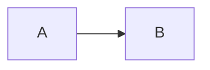

# CLAUDE.md

This file provides guidance to Claude Code (claude.ai/code) when working with code in this repository.

> Don't run `dev`/`build`/`preview` unless the user explicitly asks (memory: feedback_skip_tests).

## Commands

- `npm run dev` — http://localhost:4321
- `npm run build` — runs `astro build` then **`pagefind --site .vercel/output/static --force-language unknown`**. The Pagefind step is mandatory; skipping it leaves the search page with an empty index. `--force-language unknown` is intentional — Pagefind has no Korean tokenizer, so forcing `unknown` makes it split on whitespace only (which combines with the particle-stripping done at index time, see "Search").
- `npm run preview` — preview the Vercel adapter output
- Node ≥ 22.12.0 (`package.json` engines)

## Rendering model

`astro.config.mjs` declares `output: 'server'` with `@astrojs/vercel`, but **every content-driven page opts into `export const prerender = true`**:

- [src/pages/index.astro](src/pages/index.astro)
- [src/pages/[slug].astro](src/pages/[slug].astro)
- [src/pages/tags/[tag].astro](src/pages/tags/[tag].astro)
- [src/pages/search.astro](src/pages/search.astro)
- [src/pages/about.astro](src/pages/about.astro)
- [src/pages/404.astro](src/pages/404.astro)
- [src/pages/rss.xml.ts](src/pages/rss.xml.ts)

Only `src/pages/api/*` (two routes) actually runs as serverless functions. Treat new pages as prerendered unless they truly need request-time data — otherwise the static fallback for `[slug]` won't include them and you'll burn function invocations on every request.

## Content collection

- Posts live at `src/content/posts/<slug>/index.mdx`. **The directory name is the slug** (`post.id`) — it is reused everywhere: URLs, Redis keys (`views:<slug>`), 404 jaccard matching, OG metadata. Renaming the directory breaks the view counter.
- Schema: [src/content.config.ts](src/content.config.ts)
  - `thumbnail` / `cover` / `ogImage` use Astro's `image()` helper → must be **relative paths to files co-located in the post directory**. External URLs and `public/` paths are rejected.
  - `draft: true` is hidden by every page via `({ data }) => !data.draft`. Apply the same filter on any new page that lists posts.
- MDX uses Shiki `github-dark` for syntax highlighting ([astro.config.mjs:43](astro.config.mjs#L43)).

## MDX content features

The post body is `.mdx`, so the full MDX feature set is available. The pieces actually wired up in this project:

### Mermaid diagrams

`astro-mermaid` is registered first in `integrations` ([astro.config.mjs:33](astro.config.mjs#L33)). Any ```` ```mermaid ```` code block is rendered to SVG at runtime, client-side.

```mdx

```

- `theme: 'default'` + `autoTheme: true` — the integration watches `data-theme` on `<html>` and re-renders the diagram on theme toggle.
- Supported: `flowchart`, `sequenceDiagram`, `stateDiagram-v2`, `erDiagram`, `C4Context`, and the rest of Mermaid's core types.
- **`C4Container` and `C4Component` are experimental in Mermaid** and will sometimes fail to render. For L2/L3 diagrams, fall back to a plain `flowchart` with a `subgraph` boundary — ep-05 does this.
- To show Mermaid syntax *without* rendering it (a reference card, a source-code accordion), use the `text` language tag, not `mermaid`.

### `<details>`/`<summary>` accordion

Plain HTML works inside MDX. The project styles `<details>` *only inside `.markdown-body`* ([global.scss:609](src/styles/global.scss#L609)) — bordered card with a custom `▸` marker that rotates on open, dark-mode aware via `_variables.scss` CSS variables. Use it for collapsible content like a diagram's source code:

```mdx
<details>
<summary>Mermaid source code</summary>

```text
flowchart LR
    A --> B
```

</details>
```

Blank lines around the inner fenced block are required so the markdown parser sees them.

### Heading anchors

- `.md` files support `## Heading {#custom-id}` via the [`remarkHeadingIds`](astro.config.mjs#L11) plugin. **`.mdx` files do NOT** — MDX's JSX parser eats `{...}` as an expression and fails before any remark plugin runs.
- Astro auto-generates a slug from heading text on every page, including `.mdx`. Korean works: `### 시스템 다이어그램` → `#시스템-다이어그램`. Link in-page anchors with `[label](#섹션-제목)`.

### React component hydration

`import` a component at the top of the MDX file and render it with an Astro hydration directive — `client:load`, `client:visible`, `client:idle`. Currently used only by [CodePlayground](src/components/interactive/CodePlayground.tsx) in the `astro-vercel-implementation` post — see *Interactive components* below for the security caveat.

### Image alt convention

- The first `cover` / `thumbnail` image at the top of a post is decorative: write `` with empty alt.
- Diagrams, charts, and any image that carries information get **rich descriptive alt** (full sentence summary of what the diagram shows). See memory `feedback_cover_alt`.

### Code highlighting

Shiki `github-dark` is the only theme ([astro.config.mjs:43](astro.config.mjs#L43)). Use a language tag (`python`, `typescript`, `yaml`, `text`, etc.). `mermaid` is special — it goes to the diagram renderer, not Shiki.

## Layout hierarchy

```
BaseLayout
└── ThreeColumnLayout (sidebar / main / aside / footer)
PostLayout → wraps BaseLayout, injects post-specific behavior
```

- [BaseLayout](src/layouts/BaseLayout.astro) — owns `<head>` and the 3-column shell only. Takes `pageType` (home/post/about/search) and `sidebarOpacity` to control the initial sidebar dim.
- [ThreeColumnLayout](src/layouts/ThreeColumnLayout.astro) — sticky 3-column on desktop, fixed slide-in panels on mobile. **Single global toggle = `body.panel-active`**, cleared only when both panels are closed. It unifies three input sources: hover-reveal (desktop), explicit toggle buttons, and a 50px-threshold horizontal swipe (mobile). Swipe is suppressed if the touch target has a horizontally-scrollable ancestor (`hasHorizontalScrollableAncestor`) — this prevents code-block left/right drags from yanking the panel.
- [PostLayout](src/layouts/PostLayout.astro) responsibilities on top of BaseLayout:
  1. Wraps `<article>` in `data-pagefind-ignore="all"` and emits a separate hidden `data-pagefind-body` block carrying title/description/summary/thumbnail/date/tags filters and a precomputed Korean `searchIndex`.
  2. Inline `<script>` reads `data-theme` and loads `github-markdown-light.css` or `-dark.css` from a CDN as `#markdown-theme-css`.
  3. Builds `slug = location.pathname.replace(/^\/|\/$/g, "")` and POSTs to `/api/views` to bump the counter.
- [BaseHead](src/components/BaseHead.astro) inline `<script>` sets `data-theme` from `localStorage.theme` or `prefers-color-scheme` **before first paint** to prevent FOUC.

## Search (Pagefind + Korean particles)

The blog is Korean, so search is normalized at two stages:

1. **Index time** — [src/lib/koreanSearch.ts](src/lib/koreanSearch.ts) `stripMarkdown` strips code fences, links, and markdown syntax from the body, then `buildSearchIndex` emits each word as **both raw and particle-stripped** variants. The particle regex is `(?:에서|에게|부터|까지|으로|이라|라고|이나|든지|조차|마저|처럼|만큼|에게서|로부터|은|는|이|가|을|를|의|에|로|와|과|도|만|나|께)$` — anchored to word end. The result is dropped into PostLayout's `data-pagefind-body`.
2. **Query time** — [src/components/Search.astro](src/components/Search.astro)'s inline `<script>` normalizes user input with the **same** `PARTICLES` regex before calling `pagefind.search(normalized)`. This regex is **manually duplicated** between `koreanSearch.ts` and `Search.astro` — change one without the other and indexing/querying drift apart, breaking search. Always update both together.

Other behavior:
- ThreeColumnLayout marks every non-post page with `data-pagefind-ignore="all"`, so **only post pages are indexed** (sidebar, TOC, cards, etc. are excluded).
- `data-pagefind-meta` carries thumbnail/summary/description through to result cards, which `Search.astro` renders with the same markup as `PostCard`.
- `Search.astro` has two variants: `sidebar` submits to `/search?q=...`, `page` runs in-place and syncs the URL via `history.replaceState`.
- The Pagefind module is lazy-imported (`/pagefind/pagefind.js`) to keep initial load light. Page variant prefetches it on input focus.

## Views / visitors (Upstash Redis)

[src/lib/redis.ts](src/lib/redis.ts) is a singleton client. Requires `KV_REST_API_URL` / `KV_REST_API_TOKEN` — missing env passes the build but throws when the API route is hit.

[src/pages/api/views.ts](src/pages/api/views.ts) uses two counter strategies:

| Key | Structure | Meaning |
|---|---|---|
| `views:<slug>` | `INCR` | bumps per page load — counts loads, not unique visitors |
| `visitors:daily:<YYYY-MM-DD>` | HyperLogLog (`PFADD`/`PFCOUNT`) | daily visitors |
| `visitors:total` | HyperLogLog | total visitors |

The HLL member is `slug + ':' + Date.now()` — **every load registers as unique**. This is intentional: PFADD is being used as a counter, not as IP/session dedupe. Don't "fix" the lack of deduplication — confirm with the user before changing.

[src/pages/api/top-reads.ts](src/pages/api/top-reads.ts) `MGET`s every post's `views:` key per request and sorts in memory for top 5. Fine at the current ~30 posts; consider a sorted set if the catalog grows.

[AsideHomepage.astro](src/components/AsideHomepage.astro) fetches `/api/views` and `/api/top-reads` on mount to populate VISITORS / TOP READS.

## Sidebar / aside

- [Sidebar.astro](src/components/Sidebar.astro) — the category list is **a hardcoded set of tags** (`design`/`develop`/`frontend`/`backend`/`infra`/`devops`/`ai`/`series`). Adding a new top-level category requires editing this file directly. Counts are computed at build time via `getCollection`.
- [AsideHomepage.astro](src/components/AsideHomepage.astro) — the tag cloud maps `(count - min) / (max - min)` ratio onto 5 tiers (`tag-tier-1`..`tag-tier-5`) for graduated font sizes.
- [MobileHeader.astro](src/components/MobileHeader.astro) buttons hook into the same sidebar/aside toggles.
- Dark-mode emblem swap is done with a `[data-theme="dark"]` selector loading `manapie-emblem-small-dark.svg` (end of `global.scss`).

## TOC

[TableOfContents.astro](src/components/TableOfContents.astro) takes only depth 2–4 from `Astro.props.headings` and builds a tree by simple accumulation: depth-3 is pushed to the last depth-2's children, depth-4 to the last depth-3 of the last depth-2. **A non-sequential structure (e.g. an H3 with no preceding H2) drops headings.**

Scroll handler:
- The deepest heading whose `offsetTop - 100` is above `scrollY` becomes active
- An arrow indicator slides smoothly to the active item
- If the active link falls outside the visible region of `.aside-panel`, the panel auto-scrolls (50px margin)

## Comments (Giscus)

[Giscus.astro](src/components/Giscus.astro) hardcodes the `MANAPIE/pielog` repo ID and category ID — forking the repo means re-issuing both. Theme sync: [ThemeToggle.astro](src/components/ThemeToggle.astro) `postMessage`s `setConfig` to the iframe.

## 404 — jaccard slug matching

[src/lib/similarSlugs.ts](src/lib/similarSlugs.ts):
- Tokenizes the requested path and each `post.id` on `[-_/]+`, scores with Jaccard
- Sorts by score desc, then date desc, takes the top N
- If matches < N, fills with a Fisher-Yates shuffle of the rest

So a 404 on `/screen-spec-ep-09` naturally suggests other `screen-spec-ep-*` posts via shared tokens.

## Styles

- SCSS, with [src/styles/_variables.scss](src/styles/_variables.scss) as the single source. Every color is a CSS custom property aliased to a SCSS variable — that's why dark-mode toggling needs no SCSS rebuild.
- Component SCSS uses `@use "../styles/_variables.scss" as *;`.
- Markdown body styling is `github-markdown-css` loaded from CDN at runtime; theme toggle just swaps the `href` of `#markdown-theme-css`.
- Font: Pretendard (CDN).
- Breakpoints: 1440 (full) → 1340 (mid) → 900 (narrow) → 600 (mobile).

## Interactive components

[src/components/interactive/CodePlayground.tsx](src/components/interactive/CodePlayground.tsx) executes user code via `new Function('console', code)` with a mock `console`. It's a sandbox in name only — **the code still runs in page context** with full DOM/window access. Used inside MDX with hydration directives (`client:visible`, etc.) — see *MDX content features* above for the import pattern.

## Environment variables

| Var | Purpose |
|---|---|
| `KV_REST_API_URL` | Upstash Redis REST URL |
| `KV_REST_API_TOKEN` | Upstash Redis REST token |

`.env` is gitignored. Vercel injects production values via dashboard env. **API routes are not prerendered**, so missing env is silently OK at build time and only throws on first request.

## Adding a post

```mdx
---
title: "Post title"
description: "One-line meta/OG"
summary: "Optional summary shown on PostCard"
date: 2026-04-20
tags: ["tag1", "tag2"]
thumbnail: ./cover.jpg
draft: false
---
```

- Directory: `src/content/posts/<slug>/index.mdx`
- Pick the directory name carefully — it is the permanent URL, the Redis key, and the search meta
- Adding a new tag (e.g. `mobile`) does **not** auto-surface it in the sidebar — edit `Sidebar.astro` to add the link
