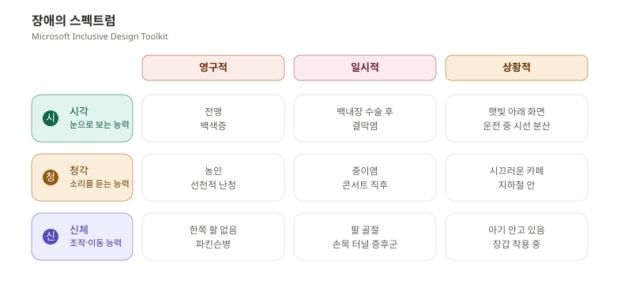
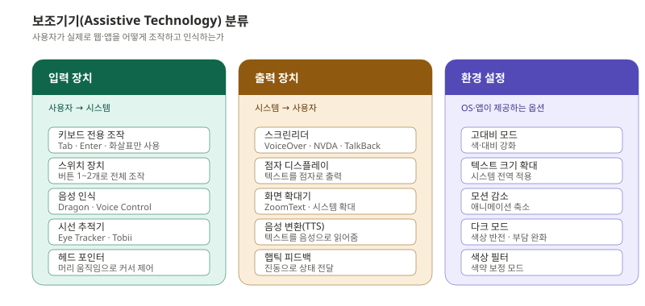
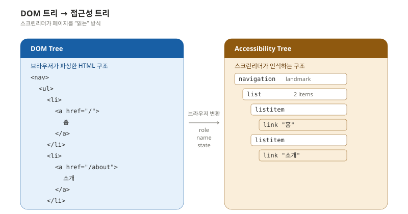
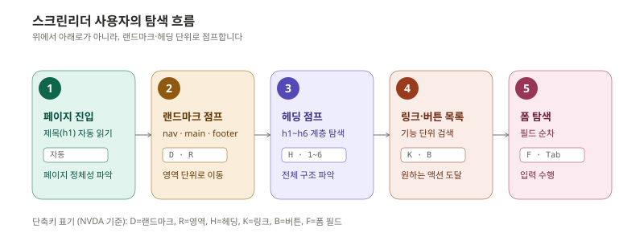
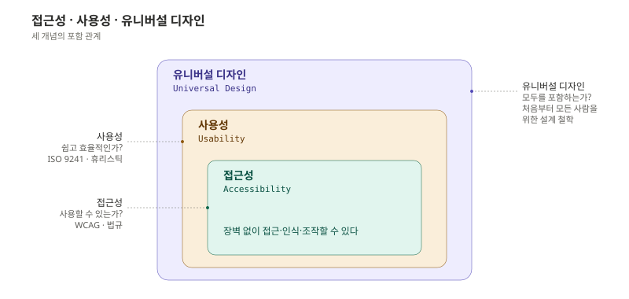
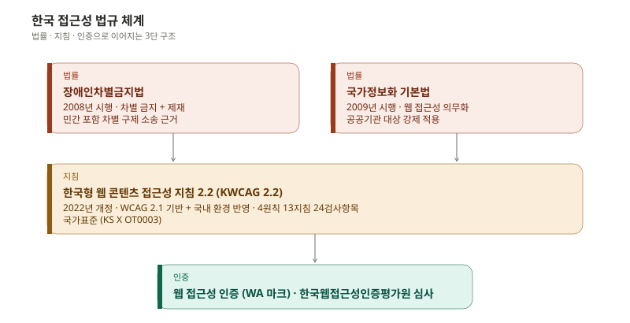
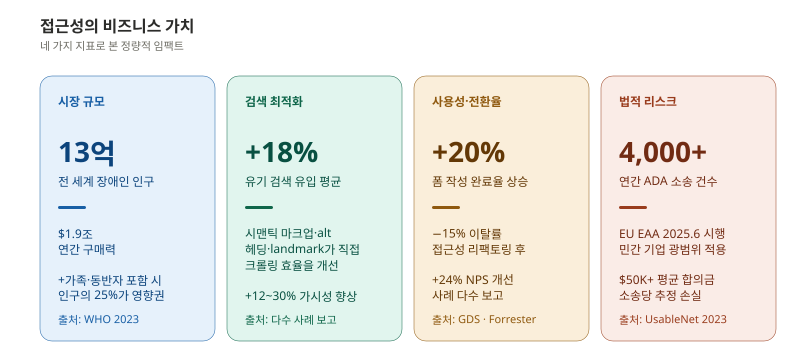
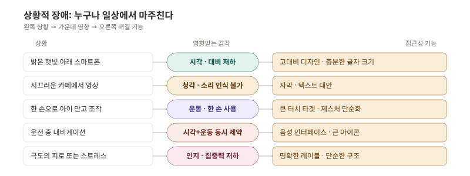

접근성은 특정 사용자를 위한 별도 기능이 아닙니다. 모든 사용자의 사용 품질을 높이는 설계 원칙입니다. 그 경계는 어디인가.

이 시리즈는 앱과 웹 접근성을 기획·디자인·개발·검증의 네 단계에서 실무 수준으로 다룹니다. ep.00에서는 본격적인 WCAG 학습에 들어가기 전, 정의와 범위·보조기기·법규·비즈니스 가치라는 공통 지반을 정리합니다.

---

## 디지털 접근성의 정의와 범위

디지털 접근성(Digital Accessibility)이란 **장애 여부, 사용 환경, 기기 종류와 관계없이 모든 사람이 디지털 콘텐츠와 서비스를 동등하게 인식·이해·조작·상호작용할 수 있는 상태**를 말합니다.

흔히 "접근성 = 시각 장애인을 위한 것"이라고 오해하지만, 실제 범위는 훨씬 넓습니다.

| 영역 | 포함 범위 |
|------|----------|
| 시각 | 전맹, 저시력, 색각 이상 |
| 청각 | 농인, 난청 |
| 운동/신체 | 상지 장애, 떨림, 마비 |
| 인지/신경 | 학습 장애, 주의력 결핍, 자폐 스펙트럼, 간질 |
| 일시적 상태 | 부상, 수술 후 회복, 임신 |
| 상황적 제약 | 밝은 햇빛 아래, 시끄러운 환경, 한 손만 사용 가능 |

접근성은 "특정 사용자를 위한 특별 기능"이 아니라 **"모든 사용자의 사용 품질을 높이는 설계 원칙"** 입니다. 이 시점부터 사고의 출발점을 바꿔야 합니다.

---

## 누구를 위한 것인가 — 장애의 스펙트럼

마이크로소프트의 **인클루시브 디자인 툴킷(Inclusive Design Toolkit)** 은 장애를 세 가지 스펙트럼으로 설명합니다.

이 스펙트럼을 이해하면 접근성이 **전체 사용자 경험의 문제**라는 사실이 명확해집니다.

영상 자막은 청각 장애인뿐 아니라 지하철에서 무음으로 영상을 보는 모든 사람에게 도움이 됩니다. 터치 영역을 키우면 운동 장애인뿐 아니라 장갑을 낀 채 조작하는 사용자에게도 유용합니다. 명확한 레이블은 인지 장애인뿐 아니라 해당 서비스를 처음 접하는 모든 사용자에게 도움이 됩니다.

영구적 장애 사용자를 위한 설계는 일시적·상황적 제약을 가진 모든 사용자에게도 작동합니다. 이를 **"커브컷 효과(curb-cut effect)"** 라고 합니다. 휠체어 이용자를 위해 만든 보도블록의 경사면이 유모차, 캐리어, 자전거 사용자 모두에게 도움이 된 것에서 유래한 표현입니다.

---

## 보조기기의 종류와 사용 방식

접근성 작업의 대상을 이해하려면 사용자가 실제로 어떤 도구로 웹·앱을 사용하는지 알아야 합니다.

이 중 가장 흔히 접하는 보조기기는 **스크린리더(Screen Reader)** 입니다. macOS와 iOS의 VoiceOver, Windows의 NVDA·JAWS, Android의 TalkBack이 대표적입니다. 화면에 보이는 시각 정보를 음성·점자로 변환해 전달합니다.

### 스크린리더가 웹 페이지를 "읽는" 방식

스크린리더는 시각적 렌더링이 아닌 **접근성 트리(Accessibility Tree)** 를 기반으로 동작합니다. 이 트리는 DOM과 별개로 브라우저가 유지하는 구조로, 각 요소의 역할(role), 이름(name), 상태(state)를 담고 있습니다.

DOM에 `<nav>` 요소가 있으면 접근성 트리에는 `navigation landmark`라는 노드가 생성되고, `<a>` 요소는 `link` 역할로 변환됩니다. 시각적 스타일은 무시되고, 의미와 역할만 추출됩니다. 즉 화면에서 아무리 멋진 버튼처럼 보여도 `
`로 만들었다면 스크린리더에는 "그냥 텍스트"로만 들립니다.

### 탐색 흐름

스크린리더 사용자는 페이지를 **위에서 아래로 순차적으로 읽지 않습니다.** 랜드마크와 헤딩으로 건너뛰며 탐색합니다.

이 흐름이 의미하는 바는 분명합니다. 시맨틱 구조가 올바르지 않으면 사용성이 극단적으로 떨어집니다. 헤딩 레벨을 건너뛰거나, `<button>` 대신 `
`을 쓰거나, `<nav>` 같은 랜드마크를 생략하면 사용자는 "지도 없이 미로를 헤매는" 상태가 됩니다.

---

## 접근성·사용성·유니버설 디자인의 관계

이 세 개념은 자주 혼동되지만 각각의 초점이 다릅니다.

| 구분 | 접근성 | 사용성 | 유니버설 디자인 |
|------|--------|--------|----------------|
| 질문 | 사용할 수 있는가? | 쉽고 효율적인가? | 모두를 포함하는가? |
| 기준 | WCAG, 법규 | ISO 9241, 휴리스틱 | 7 원칙 |
| 측정 | 적합/부적합 | 과업 성공률, 소요 시간 | 포용 범위 |
| 초점 | 장벽 제거 | 경험 최적화 | 설계 철학 |

접근성은 **사용성의 전제 조건**입니다. 접근조차 할 수 없다면 사용성을 논할 수 없습니다. 반대로 모든 사용자가 접근할 수 있게 만들었다고 해서 사용하기 쉬운 것은 아닙니다. 접근성은 최소 요건이고, 사용성은 그 위에 쌓는 품질이며, 유니버설 디자인은 둘을 처음부터 통합하는 설계 철학입니다.

---

## 왜 다시 접근성인가 — 법적 의무에서 비즈니스 가치로

### 국내 법규 현황

한국의 접근성 법규는 3단 구조로 되어 있습니다.

적용 대상이 의무인 곳은 공공기관, 지방자치단체, 공기업, 준정부기관, 특수법인입니다. 민간 기업은 법적 의무가 제한적이지만 장애인차별금지법에 의해 차별 구제 소송 대상이 될 수 있습니다. 실제로 시각장애인이 시중은행 모바일 앱의 접근성 미비를 이유로 차별 구제 소송을 제기한 사례가 다수 있습니다.

### 국제 법규 현황

| 법규/표준 | 지역 | 핵심 내용 |
|-----------|------|----------|
| ADA Title III | 미국 | 웹사이트를 "공공 편의시설"로 해석, 접근성 소송 급증 |
| Section 508 | 미국 | 연방 기관 ICT 접근성 의무 (WCAG 2.0 AA 준용) |
| EAA | EU | 2025년 6월 시행, 민간 기업 포함 광범위 적용 |
| EN 301 549 | EU | ICT 제품/서비스 접근성 표준 (WCAG 2.1 AA 포함) |
| AODA | 캐나다 온타리오 | 종업원 50인 이상 기업 의무 |

미국 ADA 기반 접근성 소송은 2023년 기준 연간 4,000건을 넘었습니다. 글로벌 서비스를 운영한다면 접근성은 선택이 아닌 법적 리스크 관리 영역입니다. 특히 2025년 6월 시행된 **유럽 접근성법(EAA, European Accessibility Act)** 은 EU 내 거의 모든 디지털 제품·서비스에 적용되어, 한국 기업이라도 유럽에 서비스를 제공한다면 직접적인 적용 대상입니다.

---

## 비즈니스 가치 — 규정 준수 비용을 넘어서

접근성을 "규정 준수 비용"으로만 보면 시야가 좁아집니다. 실제로는 여러 비즈니스 지표와 직결됩니다.

각 수치는 보수적으로 잡아도 의미가 큽니다. 시맨틱 마크업과 대체 텍스트는 검색 엔진 최적화에 직접 기여합니다. 헤딩 구조가 올바르면 구글이 페이지 구조를 더 잘 파악하고, alt 텍스트는 이미지 검색 트래픽을 끌어옵니다. 접근성과 SEO는 본질적으로 같은 작업입니다.

전환율 측면에서도 효과가 확인됩니다. 영국 정부 디지털 서비스(GDS)의 보고에 따르면 접근성 개선 후 폼 작성 완료율이 평균 12~20% 상승했습니다. 한국에서도 이커머스, 금융, 교육 분야에서 접근성 리팩토링 후 이탈률 감소 사례가 다수 보고되었습니다.

---

## 상황적 장애 — "나도 대상자"

접근성의 수혜자는 생각보다 훨씬 광범위합니다. 일상에서 누구나 한 번쯤 겪은 상황들입니다.

이 표를 다시 읽어보면 "나도 어제 한 손으로 폰을 쥐고 결제를 했고", "오늘 점심 시간 카페에서 자막 켜고 영상을 봤다"는 사실을 깨닫습니다. 접근성 작업의 직접적 수혜자가 전체 인구의 상당 부분이라는 사실이 여기서 드러납니다.

---

## 시리즈 안내

이 시리즈는 7편으로 구성됩니다.

| 편 | 제목 | 핵심 |
|---|---|---|
| [ep.00](/a11y-guide-ep-00) | 접근성, 다시 묻기 | 정의·범위·법규·비즈니스 가치 (현재) |
| [ep.01](/a11y-guide-ep-01) | WCAG 2.2 구조 완벽 정리 | POUR 4원칙, 13지침, 등급, 2.2 변경점 |
| [ep.02](/a11y-guide-ep-02) | 기획 단계 — 구조와 콘텐츠 | 헤딩, 폼, alt 텍스트, 인수조건 |
| [ep.03](/a11y-guide-ep-03) | 디자인 단계 — 색·타이포·모션 | 대비, 다크모드, 포커스, 디자인 시스템 |
| [ep.04](/a11y-guide-ep-04) | 개발 단계 — 시맨틱과 ARIA | HTML, 키보드, 스크린리더 |
| [ep.05](/a11y-guide-ep-05) | 개발 단계 — 모바일·프레임워크 | iOS/Android, React/Vue/Flutter |
| [ep.06](/a11y-guide-ep-06) | 검증과 운영 | 테스트, 인증, 조직, 치트시트 |

각 편은 독립적으로 읽을 수 있지만, 처음 접하는 분이라면 ep.01부터 순서대로 보시는 것을 권합니다.

---

## 참고 자료

- W3C. (2023). *Web Content Accessibility Guidelines (WCAG) 2.2*. https://www.w3.org/TR/WCAG22/
- Microsoft. (2016). *Inclusive Design Toolkit*. https://inclusive.microsoft.design/
- 한국지능정보사회진흥원. (2022). *한국형 웹 콘텐츠 접근성 지침 2.2 (KWCAG 2.2)*.
- World Health Organization. (2023). *Global Report on Health Equity for Persons with Disabilities*.
- UsableNet. (2023). *2023 Year-End Digital Accessibility Lawsuit Report*.
- 장애인차별금지 및 권리구제 등에 관한 법률 (장애인차별금지법). (2008).
- 국가정보화 기본법. (2009).
- European Union. (2019). *Directive (EU) 2019/882 on the accessibility requirements for products and services (European Accessibility Act)*.

---

## 다음 편 예고

> [ep.01 - WCAG 2.2 구조 완벽 정리](/a11y-guide-ep-01)

WCAG 2.2를 처음부터 끝까지 해부합니다. POUR 4원칙이 실제로 어떻게 13개 지침과 86개 성공 기준으로 펼쳐지는지, A·AA·AAA 등급 선택의 실무 기준, 2.1에서 2.2로 넘어오면서 추가된 9가지 신규 기준, 그리고 한국형 KWCAG와의 매핑까지 한 편에 정리합니다.
