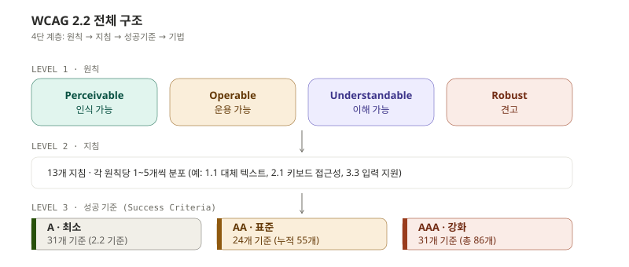
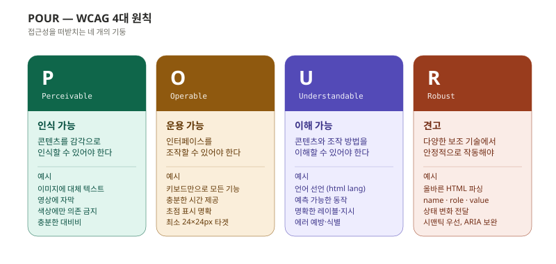
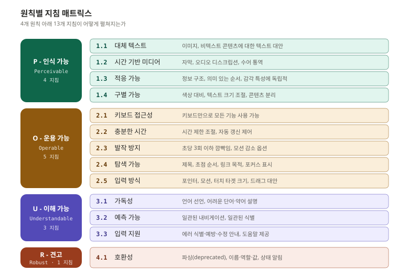
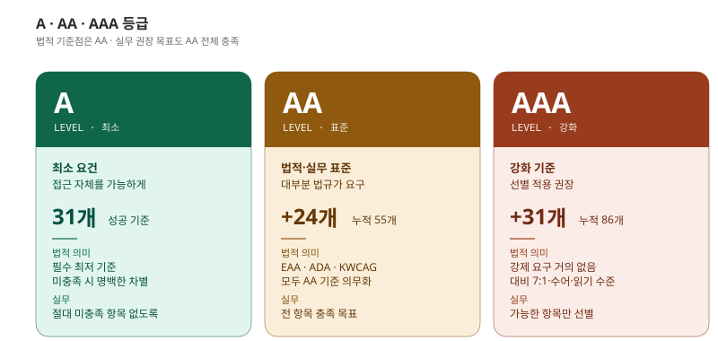
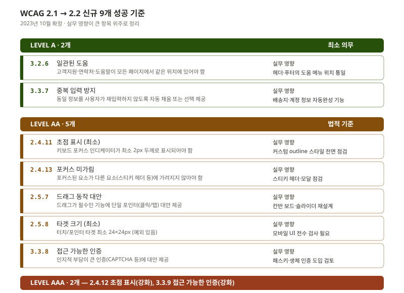
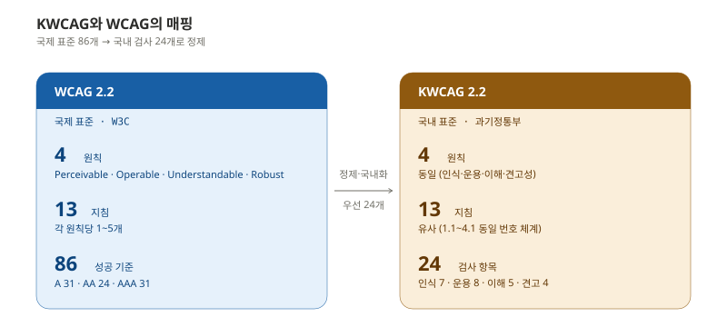

> "WCAG를 봐야 한다"는 말은 자주 들었지만, 실제로 펼쳐보면 86개 성공 기준이 빽빽한 사양 문서입니다. 그래서 대부분은 "alt 텍스트와 색상 대비" 정도만 알고 멈춥니다.

이 글은 WCAG 2.2의 전체 구조를 한 번에 머릿속에 넣기 위한 지도입니다. 원칙·지침·기준의 계층, A/AA/AAA 등급 선택의 실무 기준, 2.2에서 추가된 9개 신규 기준의 영향, 그리고 한국형 KWCAG와의 매핑까지 다룹니다.

---

## WCAG 2.2 전체 구조

**WCAG(Web Content Accessibility Guidelines)** 는 W3C 산하 WAI(Web Accessibility Initiative)에서 발행하는 웹 접근성 국제 표준입니다. 2.2 버전은 2023년 10월 최종 권고안(W3C Recommendation)으로 확정되었습니다.

문서는 4단 계층으로 구성됩니다.



각 계층의 역할이 명확히 다릅니다.

**원칙(Principles)** 은 "무엇을 위한 접근성인가"라는 철학적 출발점입니다. 4개로 고정되어 있고, 변하지 않습니다.

**지침(Guidelines)** 은 그 원칙을 충족하기 위한 일반적 목표입니다. 13개로 그룹화되어 있고, 실제로는 카테고리 역할에 가깝습니다.

**성공 기준(Success Criteria)** 은 검사 가능한 구체적 요건입니다. 각 기준은 검사 도구나 사람이 적합/부적합을 판정할 수 있는 수준으로 작성되어 있습니다.

**기법(Techniques)** 은 각 성공 기준을 만족시키는 실제 구현 방법으로, 충분 기법(Sufficient)과 권고 기법(Advisory)으로 나뉩니다.

실무에서 가장 자주 참조하는 것은 성공 기준 레벨입니다. 기법은 참고용이며, 명시되지 않은 방법으로도 기준을 충족하면 됩니다.

---

## POUR 4원칙

네 원칙의 머리글자를 따 **POUR** 라고 부릅니다. 각각이 접근성의 한 축을 담당합니다.



### P - Perceivable (인식 가능)

콘텐츠는 사용자가 **감각으로 인식할 수 있는** 형태로 제공되어야 합니다. 시각 정보는 청각·촉각으로 변환 가능해야 하고, 청각 정보는 시각으로 변환 가능해야 합니다.

- 이미지에 대체 텍스트 제공
- 영상에 자막 제공
- 색상에만 의존해 정보 전달 금지
- 충분한 명도 대비 확보

### O - Operable (운용 가능)

사용자 인터페이스의 모든 구성 요소가 **조작 가능해야** 합니다. 마우스만으로 동작하는 기능은 키보드만으로도 동작해야 합니다.

- 키보드만으로 모든 기능 사용
- 충분한 시간 제공 (자동 갱신 제어)
- 발작 유발 깜빡임 방지
- 명확한 초점 표시
- 충분한 터치 타겟 크기 (24×24px 이상)

### U - Understandable (이해 가능)

콘텐츠와 조작 방법이 **이해 가능해야** 합니다. 페이지 언어가 선언되어야 하고, 동작은 예측 가능해야 하며, 에러는 식별과 수정이 쉬워야 합니다.

- 페이지 언어 선언 (`<html lang="ko">`)
- 일관된 내비게이션·식별
- 명확한 레이블과 지시
- 에러 식별·수정 안내

### R - Robust (견고)

콘텐츠는 **다양한 보조 기술에서 안정적으로 해석되어야** 합니다. 즉 시맨틱 마크업으로 의미를 정확히 전달하고, 동적 상태 변화를 보조 기술이 감지할 수 있어야 합니다.

- 올바른 HTML 구조 (중복 ID 없음 등)
- 모든 UI 요소에 이름(name)·역할(role)·값(value) 제공
- 동적 상태 변화 알림 (ARIA live region 등)

---

## 원칙별 지침 매트릭스

네 개의 원칙 아래에 13개 지침이 분포되어 있습니다.



Operable이 5개로 가장 많습니다. 키보드 접근성, 시간, 발작 방지, 탐색, 입력 방식 등 사용자가 인터페이스를 "건드리는" 모든 방식을 포괄하기 때문입니다. 반대로 Robust는 4.1 하나뿐이지만, 그 안에 시맨틱·ARIA·상태 알림이라는 묵직한 주제들이 압축되어 있습니다.

지침 번호 체계도 이해해두면 좋습니다. `2.4.11`이라는 표기는 "2(Operable) → 4(탐색 가능) → 11번째 성공 기준"이라는 의미입니다. 이 번호 체계는 WCAG 1.0 → 2.0으로 넘어오면서 도입되었고, 이후 마이너 업데이트(2.1, 2.2)에서는 기존 번호를 절대 변경하지 않습니다. 즉 `2.5.7`은 2.0 시절부터 영원히 `2.5.7`입니다.

---

## A · AA · AAA 등급

각 성공 기준에는 등급이 매겨져 있습니다. 누적식이라 AA를 충족하려면 A도 충족해야 하고, AAA를 충족하려면 A와 AA를 모두 충족해야 합니다.



### 실무에서 어떤 등급을 목표로 할 것인가

**결론부터:** AA 전체 충족을 기본 목표로 설정합니다.

- 한국 KWCAG, 미국 Section 508, EU EAA, 영국 GDS: 모든 주요 법규가 AA 수준을 요구합니다.
- AAA 전체 충족은 거의 불가능한 경우가 많습니다. 예를 들어 1.4.6(대비 7:1 이상)을 모든 텍스트에 적용하면 디자인 자유도가 극단적으로 떨어집니다.
- AAA는 "가능한 항목만 선별 적용"이 현실적입니다. 예를 들어 1.4.9(이미지 텍스트 사용 금지)는 충분히 지킬 만하지만 1.4.6은 본문에만 부분 적용하는 식입니다.

### 등급 표기 예시

성공 기준을 인용할 때는 보통 `[ID] [제목] (등급)` 형식을 씁니다.

```
1.1.1 Non-text Content (Level A)
1.4.3 Contrast (Minimum) (Level AA)
1.4.6 Contrast (Enhanced) (Level AAA)
```

같은 주제(대비)라도 등급에 따라 별도 기준으로 분리되어 있습니다. 1.4.3(AA, 4.5:1)과 1.4.6(AAA, 7:1)은 다른 성공 기준이지 같은 기준의 다른 수치가 아닙니다.

---

## WCAG 2.1 → 2.2: 9개 신규 기준

2.2는 2.1에서 9개 성공 기준을 추가한 마이너 업데이트입니다. 기존 기준은 그대로 유지됩니다. (단 4.1.1 Parsing은 "더 이상 검사 대상 아님"으로 비활성화되었습니다.)



### 즉시 영향이 큰 3가지

**2.4.11 초점 표시 (최소) [AA]**

키보드 포커스 인디케이터가 최소 2px 두께로 표시되어야 하고, 인접 색과 대비 3:1 이상을 확보해야 합니다. 대다수 프론트엔드 프로젝트가 `outline: none`을 기본값으로 두고 있어, 이 기준 도입으로 광범위한 디자인 시스템 점검이 필요합니다.

```css
/* ❌ 흔한 코드 */
button:focus { outline: none; }

/* ✅ 권장 */
button:focus-visible {
  outline: 2px solid var(--focus-color);
  outline-offset: 2px;
}
```

`:focus-visible`을 쓰면 키보드 사용 시에만 포커스 링이 보이고 마우스 클릭에는 보이지 않아, 디자인적으로도 깔끔합니다.

**2.5.8 타겟 크기 (최소) [AA]**

모든 포인터 타겟이 최소 24×24px 이상이어야 합니다. iOS HIG는 44pt, Material은 48dp를 권장하므로 모바일 신규 작업은 보통 통과합니다. 문제는 **웹의 인라인 링크, 작은 아이콘 버튼, 닫기(×) 버튼** 같은 영역입니다.

예외가 있긴 합니다. 인라인 텍스트 링크는 예외이고, 등가의 다른 컨트롤이 있으면 예외이며, 사용자가 크기를 변경할 수 없는 표준 UA 컨트롤은 예외입니다. 그래도 디자인 시스템 전반의 점검이 필요한 항목입니다.

**3.3.8 접근 가능한 인증 [AA]**

인지적 부담이 큰 인증을 강제하지 말아야 합니다. CAPTCHA, 외워야 하는 보안 질문, 화면 회전 매칭 같은 것이 해당됩니다. 최소한 하나의 대안을 제공해야 합니다: 자동 입력 허용(`autocomplete`), 복사·붙여넣기 허용, 패스키, 생체 인증.

### 비교적 작은 변화 6가지

| ID | 제목 | 등급 | 실무 영향 |
|---|---|---|---|
| 2.4.12 | 초점 표시 (강화) | AAA | 더 두꺼운 포커스 링 (선택 적용) |
| 2.4.13 | 포커스 미가림 | AA | 스티키 헤더로 포커스 가려지지 않도록 |
| 2.5.7 | 드래그 동작 대안 | AA | 칸반·슬라이더에 클릭 대안 제공 |
| 3.2.6 | 일관된 도움 | A | 도움 메뉴 위치 통일 |
| 3.3.7 | 중복 입력 방지 | A | 자동완성·이전 값 활용 |
| 3.3.9 | 접근 가능한 인증 (강화) | AAA | 인지 테스트 없는 인증 (패스키) |

---

## KWCAG와 WCAG의 매핑

**한국형 웹 콘텐츠 접근성 지침(KWCAG, Korean Web Content Accessibility Guidelines)** 은 WCAG를 기반으로 하되 국내 검사 환경에 맞게 정제된 형태입니다.



### 핵심 차이

- **원칙 4개**: 동일
- **지침 13개**: 유사 (일부 번호와 명칭이 다름)
- **검사 항목 24개**: KWCAG는 WCAG의 일부 성공 기준만 검사 대상으로 선정

KWCAG 2.2(2022년 개정)는 WCAG 2.1을 기반으로 합니다. WCAG 2.2의 신규 기준은 아직 KWCAG에 반영되지 않았습니다. 즉 국내 공공기관 인증을 위해서는 KWCAG 2.2를 따르되, 글로벌 서비스라면 WCAG 2.2를 별도로 충족시켜야 합니다.

### 원칙별 검사 항목 수

| KWCAG 원칙 | 검사 항목 수 | WCAG 대응 |
|------------|-------------|-----------|
| 인식의 용이성 | 7개 | 지침 1.1~1.4 |
| 운용의 용이성 | 8개 | 지침 2.1~2.5 |
| 이해의 용이성 | 5개 | 지침 3.1~3.3 |
| 견고성 | 4개 | 지침 4.1 |

### 실무 권장

- **국내 공공·민간 모두 적용 대상**이라면 KWCAG 2.2 24개 검사항목을 1차 목표로
- **글로벌 서비스**라면 WCAG 2.2 AA 전체를 목표로
- 둘 다 해당된다면 WCAG 2.2 AA 충족이 KWCAG도 자연스럽게 커버합니다 (WCAG가 상위집합)

---

## 이번 편 정리

세 가지만 기억해두면 충분합니다.

1. **WCAG 2.2 = 4 원칙(POUR) × 13 지침 × 86 성공 기준**: 이 구조가 모든 접근성 논의의 기반입니다.
2. **목표 등급은 AA**: A는 최소이고, AAA는 비현실적입니다. 법규도 실무도 AA를 기준점으로 둡니다.
3. **2.2 신규 기준 중 즉시 점검: 2.4.11(포커스 두께), 2.5.8(타겟 24px), 3.3.8(인증 대안)** - 기존 디자인 시스템에 가장 큰 영향을 줍니다.

다음 편부터는 이 구조를 기반으로 기획·디자인·개발·검증의 4단계 실무를 차례로 다룹니다.

---

## 참고 자료

- W3C. (2023). *Web Content Accessibility Guidelines (WCAG) 2.2*. https://www.w3.org/TR/WCAG22/
- W3C. (2023). *What's New in WCAG 2.2*. https://www.w3.org/WAI/standards-guidelines/wcag/new-in-22/
- W3C. (2023). *Techniques for WCAG 2.2*. https://www.w3.org/WAI/WCAG22/Techniques/
- W3C. (2023). *How to Meet WCAG 2.2 (Quick Reference)*. https://www.w3.org/WAI/WCAG22/quickref/
- 한국지능정보사회진흥원. (2022). *한국형 웹 콘텐츠 접근성 지침 2.2 (KWCAG 2.2)*.
- 과학기술정보통신부. (2022). *국가표준 KS X OT0003: 웹 콘텐츠 접근성 지침 2.2*.

---

## 다음 편 예고

> [ep.02 - 기획 단계: 구조와 콘텐츠](/a11y-guide-ep-02/)

WCAG 구조를 머릿속에 넣었다면, 다음은 그것을 어떻게 기획 산출물에 녹여 넣을지입니다. 헤딩 계층 설계, 내비게이션 패턴별 접근성 트레이드오프, 폼 설계의 핵심 결정 포인트, 그리고 와이어프레임에 접근성 어노테이션을 다는 방법까지. 디자이너·개발자에게 넘기기 전에 기획자가 끝내야 할 일들입니다.
