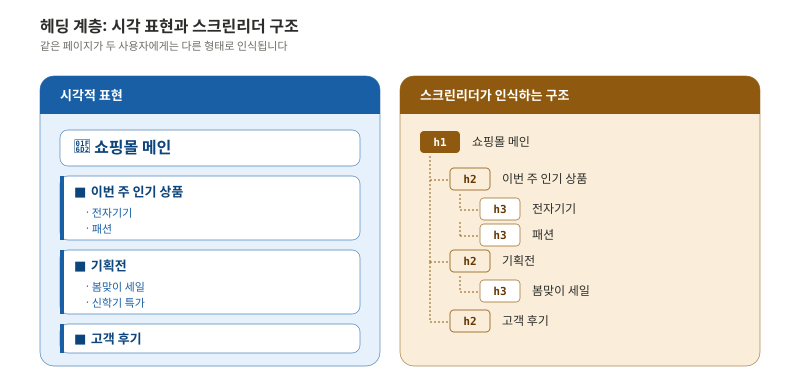
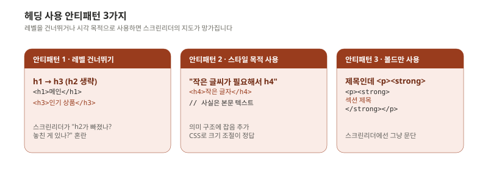
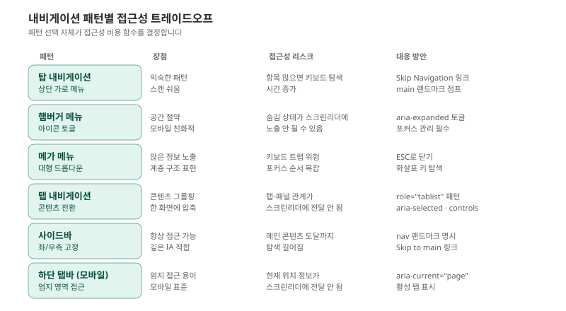
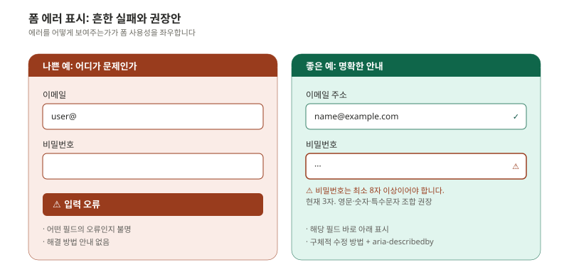
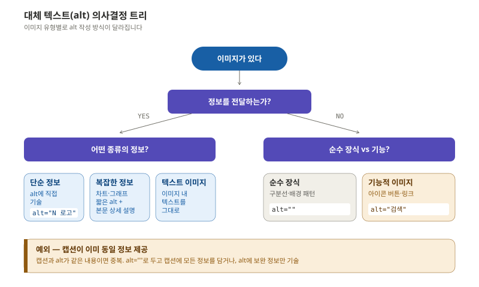
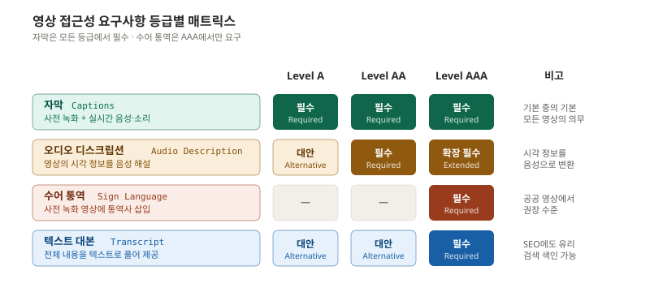
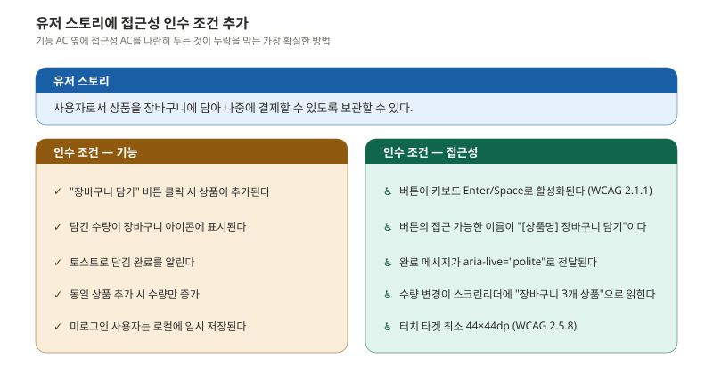

> 기획자가 와이어프레임에 "여기는 H2"라고 적어두면, 디자이너와 개발자가 매번 헤딩 레벨을 고민할 필요가 없습니다. 접근성 비용은 작업 단계가 뒤로 갈수록 기하급수적으로 늘어납니다.

이 편은 디자인·개발에 들어가기 전, 기획 단계에서 결정해야 할 것들을 정리합니다. 정보 구조(헤딩·내비게이션), 콘텐츠(폼·이미지·영상), 그리고 산출물 형식(인수 조건·체크리스트)으로 나눕니다.

---

## 페이지 구조와 헤딩 계층

올바른 헤딩 계층은 스크린리더 사용자의 **내비게이션 지도** 역할을 합니다. 사용자가 페이지 전체를 위에서 아래로 읽지 않고, 헤딩만 점프하며 원하는 섹션을 찾기 때문입니다.

같은 페이지가 두 사용자에게는 완전히 다른 모습으로 인식됩니다.



### 올바른 헤딩 구조

```html
<h1>쇼핑몰 메인</h1>
  <h2>이번 주 인기 상품</h2>
    <h3>전자기기</h3>
    <h3>패션</h3>
  <h2>기획전</h2>
    <h3>봄맞이 세일</h3>
    <h3>신학기 특가</h3>
  <h2>고객 후기</h2>
```

규칙은 세 가지입니다.

- 페이지당 `h1`은 보통 한 개 (페이지의 주제)
- 레벨을 건너뛰지 않음 (`h1` 다음에 `h3`로 점프 금지)
- 시각적 크기가 아니라 **의미 계층**으로 선택

### 흔한 안티패턴



세 가지 다 자주 발생하지만, 가장 위험한 것은 **세 번째**입니다. 시각적으로는 멋지게 보이지만 스크린리더 사용자에게는 페이지에 "구조" 자체가 없어집니다.

### 기획자 체크포인트

와이어프레임에 헤딩 레벨을 직접 명시하세요. Figma 어노테이션으로 "H2: 인기 상품" 같은 형태로 표기하면 디자이너와 개발자의 혼선을 줄일 수 있습니다. 다음 편(디자인) 에서 다룰 Figma 접근성 어노테이션 기법과 직결됩니다.

---

## 내비게이션 패턴별 트레이드오프

내비게이션 패턴을 선택하는 것 자체가 접근성 준수 비용을 결정합니다. 어떤 패턴은 별도 보강 없이도 접근성이 좋고, 어떤 패턴은 ARIA와 키보드 핸들링을 광범위하게 추가해야 합니다.



### 실무 결정 트리

- **항목 5개 이하 + 평면 구조** → 탑 내비게이션, 비용 최저
- **항목 많음 + 카테고리 구조** → 메가 메뉴, 비용 중간 (키보드 패턴 구현 필요)
- **모바일 우선** → 햄버거 + 하단 탭바, 비용 중간 (포커스 관리)
- **깊은 IA + 데스크톱 우선** → 사이드바, 비용 중간 (Skip 링크)
- **콘텐츠 전환만 필요** → 탭, 비용 중상 (tablist 패턴 전체 구현)

`<button aria-expanded>`, `aria-controls`, `aria-current` 같은 ARIA 속성은 [ep.04](/a11y-guide-ep-04/)에서 자세히 다룹니다.

### Skip Navigation 링크

모든 페이지에는 **"본문으로 바로가기"** 같은 Skip 링크가 페이지 최상단에 있어야 합니다. 키보드만 사용하는 사용자가 매 페이지마다 헤더 메뉴 항목을 일일이 Tab으로 통과하지 않아도 되게 하는 장치입니다.

```html
<a href="#main" class="skip-link">본문으로 바로가기</a>
...
<main id="main">...</main>
```

```css
/* 평소엔 화면 밖에 숨겨두고, 포커스되면 나타나게 */
.skip-link {
  position: absolute;
  left: -9999px;
}
.skip-link:focus {
  left: 0;
  top: 0;
  z-index: 9999;
  padding: 1rem;
  background: var(--surface);
}
```

---

## 폼 설계 - 접근성의 핵심 전장

폼은 접근성 이슈가 가장 집중되는 영역입니다. 사용자가 가장 좌절하는 곳이기도 합니다.

### 레이블 연결

```html
<!-- ✅ 올바른 방법 1: for/id 명시적 연결 -->
<label for="email">이메일 주소</label>
<input type="email" id="email" name="email">

<!-- ✅ 올바른 방법 2: 암시적 연결 -->
<label>
  이메일 주소
  <input type="email" name="email">
</label>

<!-- ❌ 잘못된 방법: 플레이스홀더에 의존 -->
<input type="email" placeholder="이메일 주소">
```

**플레이스홀더만 사용하면 안 되는 이유** 는 세 가지입니다.

- 사용자가 입력을 시작하면 사라져서 더 이상 "무엇을 입력 중인지" 알 수 없음
- 플레이스홀더 텍스트의 대비비가 보통 낮아 색약 사용자가 읽기 어려움
- 일부 스크린리더는 플레이스홀더를 레이블로 인식하지 않음

### 에러 메시지 패턴

같은 폼 검증 결과를 두 방식으로 보여줬을 때의 차이입니다.



좋은 에러 메시지의 네 가지 요건은 다음과 같습니다.

- **위치**: 해당 필드 바로 옆 또는 아래
- **내용**: 무엇이 잘못됐고 어떻게 고쳐야 하는지
- **연결**: `aria-describedby`로 입력 필드와 프로그램적으로 연결
- **알림**: `role="alert"` 또는 `aria-live="assertive"`로 스크린리더에 즉시 전달

```html
<label for="pw">비밀번호</label>
<input
  type="password"
  id="pw"
  aria-invalid="true"
  aria-describedby="pw-error pw-hint"
>
<p id="pw-error" role="alert">
  비밀번호는 최소 8자 이상이어야 합니다.
</p>
<p id="pw-hint" class="hint">현재 3자. 영문·숫자·특수문자 조합 8자 이상</p>
```

### 필수 입력 표시

`*`(별표)만 쓰면 색각 이상이나 스크린리더 사용자에게는 정보가 전달되지 않습니다.

```html
<label for="name">
  이름
  <span aria-hidden="true">*</span>
  <span class="sr-only">(필수)</span>
</label>
<input type="text" id="name" required aria-required="true">
```

`aria-hidden="true"`로 시각적 별표는 스크린리더가 무시하게 하고, `sr-only` 클래스로 "(필수)"라는 텍스트만 스크린리더에 전달합니다. `sr-only`는 다음 편 디자인에서 다룹니다.

---

## 콘텐츠 접근성 기획

### 대체 텍스트 정책

`alt` 텍스트는 가장 기본이면서도 가장 자주 실패하는 항목입니다. 이미지마다 alt를 "어떻게" 작성할지는 이미지의 역할에 따라 다릅니다.



#### 작성 예시

| 상황 | ❌ 나쁜 예 | ✅ 좋은 예 |
|------|----------|----------|
| 회사 로고 | `alt="logo"` | `alt="카카오 로고"` |
| 상품 사진 | `alt="image001.jpg"` | `alt="네이비 컬러 오버핏 코트, 전면"` |
| 차트 | `alt="차트"` | `alt="2024년 월별 매출: 1월 2억에서 12월 8억으로 상승"` |
| 장식 구분선 | `alt="구분선"` | `alt=""` (빈 문자열) |
| 검색 아이콘 버튼 | `alt="돋보기"` | `alt="검색"` |
| 인포그래픽 | `alt="인포그래픽"` | 짧은 alt + 본문에 전체 내용 텍스트 |

핵심은 **"이미지를 보지 못한 사용자에게 같은 정보가 전달되는가"** 입니다. 로고의 모양을 묘사할 필요는 없고("파란색 둥근 모양의 카카오 로고"), 로고가 무엇인지만 전달하면 됩니다("카카오 로고").

기능적 이미지(아이콘 버튼)는 모양이 아니라 **기능**을 기술합니다. 돋보기 아이콘은 `alt="돋보기"`가 아니라 `alt="검색"`입니다.

#### 기획자 체크포인트

CMS 또는 콘텐츠 입력 폼에 **alt 입력 필드를 필수로** 두세요. "건너뛰기" 버튼을 두면 빈 alt가 양산됩니다. 대신 "이 이미지는 장식용입니다"라는 체크박스를 두고, 체크되면 `alt=""`로 처리합니다.

---

## 멀티미디어 콘텐츠

영상과 오디오는 접근성 요구사항이 등급별로 다릅니다.



### 자막 품질 기준

자막은 단순히 음성을 받아쓴 텍스트가 아닙니다.

| 좋은 자막 | 나쁜 자막 |
|---|---|
| `[음악 - 잔잔한 피아노]` 비음성 정보 | `(음악)` 모호함 |
| `김대리: 검토 좀 부탁드릴까요?` 화자 식별 | `검토 좀 부탁드릴까요?` 화자 미상 |
| `[전화벨 울림]` 중요 소리 정보 | 누락 |
| 자연스러운 문장 단위 끊기 | 단어 단위로 끊김 |
| 음성과 동기화 정확 | 1~2초 지연 |

### 쉬운 언어와 인지 접근성

인지 접근성은 자주 간과되지만, 가장 많은 사용자에게 영향을 줍니다.

| 원칙 | ❌ 개선 전 | ✅ 개선 후 |
|------|----------|----------|
| 짧은 문장 | "본 약관의 내용에 동의하시는 경우에 한하여 서비스 이용이 가능하오니 반드시 내용을 확인하시기 바랍니다." | "서비스를 이용하려면 약관에 동의해야 합니다. 아래 내용을 확인해 주세요." |
| 전문 용어 회피 | "이중 인증을 활성화하세요" | "로그인 보안을 강화하세요(로그인 시 추가 확인 단계)" |
| 명확한 행동 유도 | "확인" | "결제하기" |
| 한 가지 주제 | 하나의 단락에 3가지 안내 | 단락 분리 + 소제목 |

이런 변화는 인지 장애 사용자뿐 아니라, **피로한 사용자, 외국인, 청소년, 그리고 모든 모바일 환경 사용자에게도 도움**이 됩니다.

---

## 접근성 요구사항 명세 작성법

### 유저 스토리에 접근성 인수 조건 추가

기능 인수 조건(Acceptance Criteria)과 나란히 접근성 인수 조건을 작성하는 패턴입니다. 일반적인 유저 스토리에 한 블록을 추가하면 됩니다.



기능 AC만 있으면 "키보드로도 동작하나?"는 QA 시점에 발견됩니다. 그때는 이미 디자인과 구현이 끝난 후라 비용이 큽니다. 기획 단계에서 접근성 AC를 함께 명시하면, 디자이너가 처음부터 키보드 포커스를 고려하고, 개발자가 처음부터 시맨틱 마크업을 작성합니다.

### 접근성 AC 템플릿

매 기능마다 다음 항목을 떠올리며 작성합니다.

```
키보드: 어떤 키로 동작하는가? (Tab, Enter, Space, Esc, 화살표)
포커스: 동작 후 포커스가 어디로 이동하는가?
이름: 스크린리더가 어떻게 읽는가?
상태: 상태 변화가 어떻게 전달되는가? (live region, aria-pressed 등)
대상: 터치 타겟이 최소 24×24px인가?
대비: 색상 대비가 충분한가? (디자인 단계 검증)
```

여섯 가지만 체크해도 대부분의 누락을 막을 수 있습니다.

---

## QA 체크리스트 설계

기능별로 접근성 QA 체크리스트를 미리 만들어두면, QA 단계의 누락이 크게 줄어듭니다. 로그인 화면 예시입니다.

| # | 검사 항목 | WCAG 기준 | 담당 |
|---|----------|----------|------|
| 1 | 모든 입력 필드에 레이블 연결 | 1.3.1 | 개발 |
| 2 | 에러 메시지가 해당 필드와 연결 | 3.3.1 | 개발 |
| 3 | 탭 순서가 시각적 순서와 일치 | 2.4.3 | 개발 |
| 4 | 비밀번호 표시 토글 키보드 접근 가능 | 2.1.1 | 개발 |
| 5 | 에러 상태에서 색상 외 추가 표시 | 1.4.1 | 디자인 |
| 6 | 명도 대비 4.5:1 이상 | 1.4.3 | 디자인 |
| 7 | 자동완성 속성(`autocomplete`) 적용 | 1.3.5 | 개발 |
| 8 | CAPTCHA 대안 제공 | 3.3.8 | 기획 |
| 9 | VoiceOver/TalkBack 실사용 테스트 | 전체 | QA |

기획 단계에서 만들어 둔 체크리스트가 디자인·개발·QA 모든 단계에서 동일한 합의를 만듭니다.

---

## 이번 편 정리

기획 단계의 접근성은 결국 **"누가, 언제, 무엇을 결정할 것인가"** 의 문제입니다.

- **헤딩 계층**은 와이어프레임에서 결정: 디자이너에게 넘기기 전에 H1·H2·H3 명시
- **내비게이션 패턴**은 IA 단계에서 결정: 패턴 선택이 접근성 비용을 좌우
- **폼 에러 메시지**는 카피라이팅 단계에서 결정: "오류" 같은 모호한 표현 금지
- **alt 텍스트 정책**은 콘텐츠 입력 워크플로에서 결정: CMS 필수 필드로 강제
- **인수 조건**은 유저 스토리 단계에서 결정: 기능 AC와 접근성 AC를 나란히

다음 편은 이 기획 산출물을 받아 디자인으로 펼치는 단계입니다. 색·타이포·모션·포커스·디자인 시스템을 다룹니다.

---

## 참고 자료

- W3C. (2023). *WCAG 2.2 — Guideline 1.3: Adaptable*. https://www.w3.org/WAI/WCAG22/Understanding/info-and-relationships
- W3C. (2023). *WCAG 2.2 — Guideline 3.3: Input Assistance*. https://www.w3.org/WAI/WCAG22/Understanding/error-identification
- WebAIM. (2024). *Creating Accessible Forms*. https://webaim.org/techniques/forms/
- W3C. (2019). *An alt Decision Tree*. https://www.w3.org/WAI/tutorials/images/decision-tree/
- Nielsen Norman Group. (2014). *Placeholders in Form Fields Are Harmful*.
- Smashing Magazine. (2022). *Accessible Heading Structure*.
- 한국지능정보사회진흥원. (2022). *KWCAG 2.2 — 운용의 용이성*.

---

## 다음 편 예고

> [ep.03 - 디자인 단계: 색·타이포·모션·시스템](/a11y-guide-ep-03/)

기획에서 정한 구조를 시각으로 옮기는 단계입니다. 대비비를 어떻게 잡고, 다크모드와 고대비 모드를 어떻게 동시에 대응할지, 포커스 인디케이터를 어떤 두께와 색으로 디자인할지, 모션을 어디까지 허용할지, 디자인 시스템 컴포넌트에 접근성 명세를 어떻게 끼워 넣을지 다룹니다.
