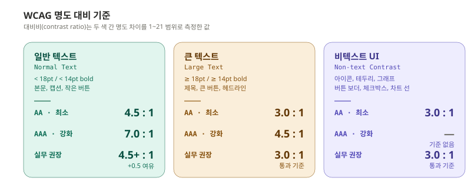
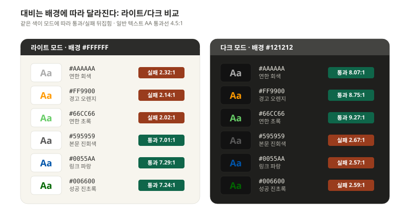
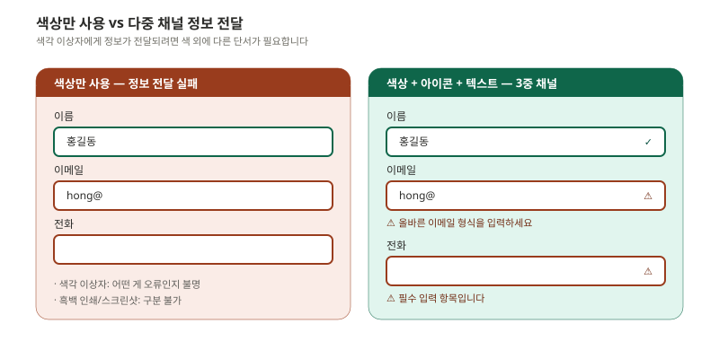
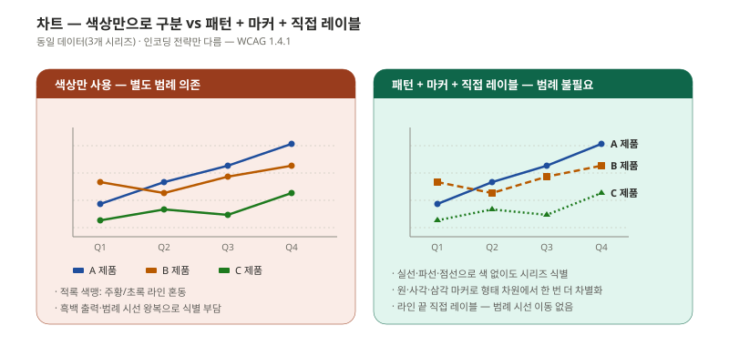
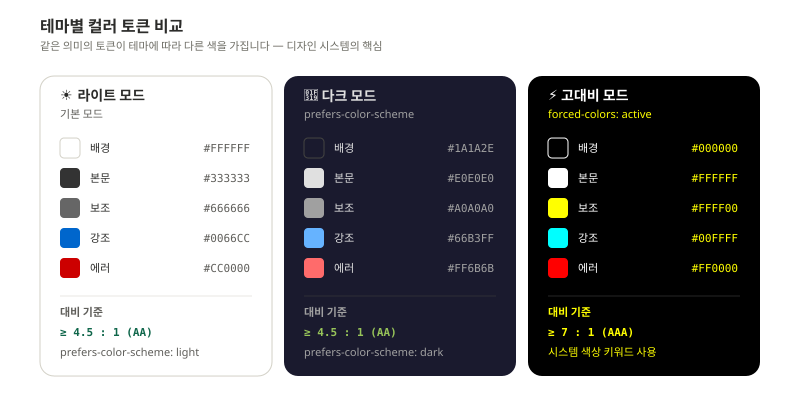
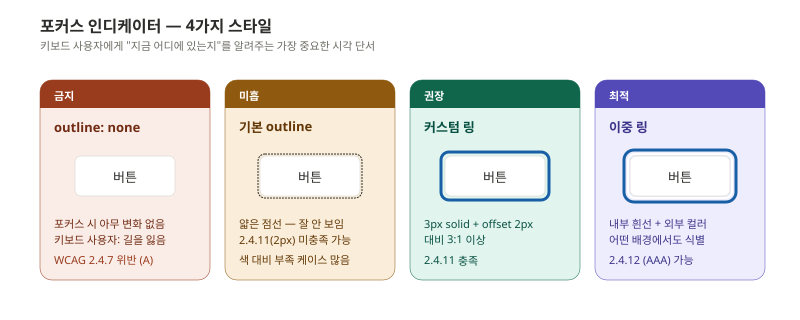
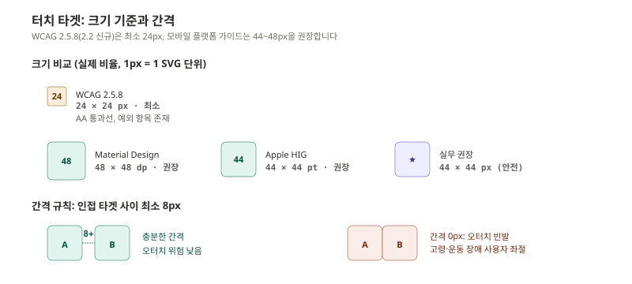
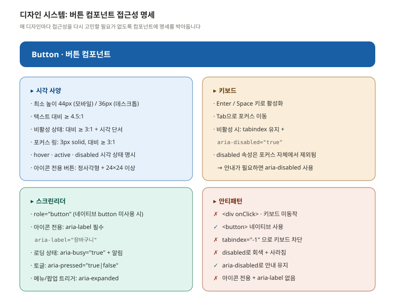

> "예쁘면서 접근성도 좋게" 가 디자인 단계의 미션입니다. 둘은 자주 충돌하는 것처럼 보이지만, 실제로는 디자인 시스템 단계에서 한 번만 잘 해두면 매번 충돌할 일이 없습니다.

이 편은 색·타이포·모션·포커스·디자인 시스템을 다룹니다. 기획에서 정의된 구조를 받아 시각 언어로 옮길 때 빠지기 쉬운 함정과 그 대응책입니다.

---

## 명도 대비 기준과 실전 적용

**명도 대비(contrast ratio)** 는 두 색상 사이의 명도 차이를 1:1(차이 없음)에서 21:1(흑백) 사이의 비율로 측정한 값입니다. WCAG는 텍스트 크기와 UI 종류에 따라 최소 대비를 다르게 규정합니다.



### "큰 텍스트"의 정의

큰 텍스트 기준이 약간 까다롭습니다.

- 18pt(24px) 이상의 일반 텍스트
- 또는 14pt(약 18.66px) 이상의 **굵게(bold)** 처리된 텍스트

이 기준 이상이면 AA 통과선이 3.0:1로 완화됩니다. 다만 한국어 폰트는 영어 폰트보다 작아 보이는 경향이 있어, 같은 px 값에서도 가독성이 낮습니다. **실무에서는 큰 텍스트 기준이라도 4.5:1을 목표로** 잡는 편이 안전합니다.

### 자주 사용되는 색상의 실제 대비비

흰 배경 기준으로 자주 마주치는 색들을 검사하면 의외로 많이 떨어집니다.



특히 **연한 회색 #AAAAAA**(2.32:1), **밝은 오렌지 #FF9900**(2.15:1), **연초록 #66CC66**(1.98:1)는 디자인적으로 매력적이지만 본문 텍스트로 사용하면 안 됩니다. 보조 텍스트나 비활성 상태 표시용으로만 제한해야 합니다.

### 대비 검사 도구

| 도구 | 유형 | 용도 |
|------|------|------|
| WebAIM Contrast Checker | 웹 | 빠른 단일 대비 확인 |
| Stark | Figma/Sketch 플러그인 | 디자인 단계 실시간 검사 |
| Colour Contrast Analyser | 데스크톱 앱 | 스포이트로 화면 직접 측정 |
| axe DevTools | 브라우저 확장 | 페이지 전체 자동 검사 |
| Polypane | 브라우저 | 다양한 색각 시뮬레이션 |

디자인 단계에서는 Stark가 가장 효율적입니다. Figma 안에서 색상을 바꾸자마자 대비비가 갱신되어 보이고, 색각 이상 시뮬레이션도 함께 제공합니다.

---

## 색상에만 의존하지 않기

색상만으로 정보를 전달하면 색각 이상 사용자, 흑백 인쇄, 강한 햇빛 아래 화면 사용자 모두에게 정보가 전달되지 않습니다.



규칙은 단순합니다. **모든 의미 있는 색상 변화는 최소 한 가지 다른 채널을 동반해야 합니다.**

- 폼 필드 오류: 빨간 테두리 + ⚠ 아이콘 + 텍스트 메시지
- 성공 상태: 초록 테두리 + ✓ 아이콘
- 차트 시리즈: 색상 + 패턴(점선·실선) + 직접 레이블
- 링크: 색상 + 밑줄 (밑줄 제거는 호버에서만)

### 차트와 그래프 대응

데이터 시각화는 색상 의존이 특히 심한 영역입니다. WCAG 1.4.1 (Use of Color, Level A)은 **색상이 정보를 전달하는 유일한 시각 수단이 되어선 안 된다**고 못박습니다. 라인·막대·파이 차트에서 시리즈를 색상으로만 구분하면 적록 색맹 사용자(전체 인구의 약 8%), 흑백 출력, 강한 햇빛 아래 화면에서 모두 동일하게 정보가 무너집니다.



대응 방법은 세 가지를 **함께** 적용합니다. 한 가지만으로는 부족합니다.

- **선·면 패턴**: 라인 차트는 실선·파선·점선, 막대·파이는 사선·점·격자 패턴 적용
- **마커 형태 차별화**: 데이터 포인트를 원·사각·삼각·다이아몬드로 다르게 표시
- **직접 레이블**: 범례를 따로 두지 말고 라인 끝·막대 위에 시리즈 이름을 직접 표기
- **색각 친화 팔레트**: ColorBrewer, Viridis 같이 색각 이상에서도 구별되는 팔레트 사용

```css
/* 색각 친화 (Color-blind safe) 팔레트 예시 */
:root {
  --chart-1: #1F77B4;  /* 파랑 */
  --chart-2: #FF7F0E;  /* 주황 */
  --chart-3: #2CA02C;  /* 초록 */
  --chart-4: #D62728;  /* 빨강 */
  --chart-5: #9467BD;  /* 보라 */
}
```

이 다섯 색은 적록 색맹·청황 색맹 사용자에게 모두 구별 가능합니다.

---

## 다크모드·고대비 모드 동시 대응 전략

다크모드는 더 이상 옵션이 아닙니다. iOS와 macOS, Windows, Android 모두 시스템 다크모드를 지원하고 사용자는 디지털 피로 감소나 시각적 선호로 활발히 사용합니다. 고대비 모드는 저시력 사용자에게 필수입니다.



세 모드를 동시에 대응하려면 **CSS 변수와 미디어 쿼리 조합** 이 가장 깔끔합니다.

```css
/* 기본 — 라이트 모드 토큰 */
:root {
  --color-bg: #FFFFFF;
  --color-text: #333333;
  --color-text-2: #666666;
  --color-accent: #0066CC;
  --color-error: #CC0000;
  --color-success: #006600;
}

/* 다크 모드 */
@media (prefers-color-scheme: dark) {
  :root {
    --color-bg: #1A1A2E;
    --color-text: #E0E0E0;
    --color-text-2: #A0A0A0;
    --color-accent: #66B3FF;
    --color-error: #FF6B6B;
    --color-success: #97C459;
  }
}

/* 고대비 모드 */
@media (prefers-contrast: more) {
  :root {
    --color-bg: #000000;
    --color-text: #FFFFFF;
    --color-text-2: #FFFF00;
    --color-accent: #00FFFF;
    --color-error: #FF0000;
  }
}

/* Windows 강제 색상 모드 */
@media (forced-colors: active) {
  .button {
    border: 2px solid ButtonText;
    background: ButtonFace;
    color: ButtonText;
  }
}
```

### 다크모드 디자인 함정

다크모드는 라이트 모드의 색을 단순히 반전시킨다고 되는 것이 아닙니다. 세 가지 함정이 있습니다.

- **흰색이 흰색 그대로 되면 안 됨**: 다크 배경(#1A1A2E)에 순백(#FFFFFF) 본문은 눈부심을 유발. #E0E0E0 정도로 톤다운
- **채도가 높은 색은 더 흐려보임**: 라이트에서 #0066CC였던 강조색은 다크에서 #66B3FF처럼 더 밝고 부드럽게
- **그림자가 안 보임**: 다크 모드에서는 그림자보다 보더와 배경 명도차로 깊이감 표현

### 한국어 폰트 색상 팁

한국어 폰트 가독성을 위해서는 라이트 모드에서 본문을 순흑(#000000)으로 두지 않는 것이 좋습니다. #2C2C2A처럼 살짝 톤다운된 진회색이 눈의 피로가 적고 한국어 자형에서 둘러보기 편합니다.

---

## 타이포그래피와 레이아웃

### 가변 텍스트 크기 대응 (WCAG 1.4.4 AA)

텍스트가 **200%까지 확대**되어도 콘텐츠나 기능의 손실이 없어야 합니다. 사용자가 브라우저 설정에서 글자 크기를 키웠을 때 레이아웃이 깨지면 안 됩니다.

```css
/* ❌ 절대 단위 — 사용자 설정 무시 */
body { font-size: 14px; }

/* ✅ 상대 단위 — 사용자 설정 존중 */
body { font-size: 100%; }   /* 또는 1rem */
h1 { font-size: 2rem; }
p  { font-size: 1rem; }
.small { font-size: 0.875rem; }

/* ✅ 컨테이너도 유연하게 */
.container {
  max-width: 70rem;
  padding: 0 1.5rem;
}
```

`rem`은 루트 요소(`<html>`) 폰트 크기 기준 상대값입니다. 사용자가 브라우저 폰트를 18px로 키우면 1rem이 18px가 되고 모든 텍스트가 비례적으로 확대됩니다.

### 텍스트 간격 (WCAG 1.4.12 AA)

사용자가 자간·줄간을 늘려도 콘텐츠가 잘려나가지 않아야 합니다.

```css
p {
  line-height: 1.5;           /* 줄 간격 */
  letter-spacing: 0.12em;     /* 자간 */
  word-spacing: 0.16em;       /* 단어 간격 */
}
/* ❌ 고정 높이 컨테이너는 overflow 발생 */
.card { height: 200px; }     /* 위험 */
/* ✅ 유연한 높이 */
.card { min-height: 200px; }  /* 안전 */
```

### 리플로우 (WCAG 1.4.10 AA)

**320px** 뷰포트에서 가로 스크롤 없이 콘텐츠를 읽을 수 있어야 합니다. 모바일 우선 디자인을 하면 자연스럽게 충족됩니다.

| 뷰포트 | 권장 컬럼 수 |
|---|---|
| 1280px+ (데스크톱) | 3~4 |
| 768~1279px (태블릿) | 2 |
| 320~767px (모바일) | 1 |

데이터 테이블이 320px에서 가로 스크롤 발생하는 것은 예외로 인정됩니다.

---

## 포커스 인디케이터 디자인

WCAG 2.4.11 (AA, 2.2 신규)는 포커스 인디케이터에 다음을 요구합니다.

- 최소 2px 두께
- 인접 색과 대비 3:1 이상
- 포커스 영역이 인접 비포커스 색과도 대비 3:1 이상



```css
/* ✅ 권장: 커스텀 단일 링 */
:focus-visible {
  outline: 3px solid #0066CC;
  outline-offset: 2px;
  border-radius: 6px;  /* 버튼 형태에 맞춰 */
}

/* ✅ 최적: 이중 링 (어떤 배경에서도 식별) */
:focus-visible {
  outline: 2px solid #FFFFFF;
  box-shadow: 0 0 0 4px #0066CC;
}

/* ❌ 절대 하지 말 것 */
*:focus {
  outline: none;  /* 포커스 인디케이터 완전 제거 */
}
```

`:focus-visible`은 키보드 사용 시에만 포커스 링이 보이고 마우스 클릭 시에는 보이지 않습니다. 디자인적으로도 깔끔하면서 접근성을 유지하는 가장 좋은 방법입니다.

### 다크모드에서의 포커스

다크 배경에서 포커스 컬러를 정할 때는 라이트 모드와 같은 컬러를 쓰면 안 보일 수 있습니다.

```css
:focus-visible {
  outline: 3px solid #0066CC;
}

@media (prefers-color-scheme: dark) {
  :focus-visible {
    outline-color: #66B3FF;  /* 더 밝은 톤 */
  }
}
```

---

## 터치 타겟 사이즈 (WCAG 2.5.8 AA)

WCAG 2.2에서 새로 추가된 기준으로, 모든 포인터 타겟이 최소 24×24px이어야 합니다.



### 실무 권장

| 플랫폼 | 권장 크기 | 비고 |
|---|---|---|
| WCAG 2.5.8 최소 | 24 × 24 px | 예외 항목 존재 (인라인 링크 등) |
| Apple HIG | 44 × 44 pt | iOS 권장 |
| Material Design | 48 × 48 dp | Android 권장 |
| 안전한 실무 표준 | 44 × 44 px | 위 셋 모두 충족 |

**시각적 크기와 터치 영역은 다를 수 있습니다.** 아이콘이 24×24일 때 보이는 크기는 작아도 패딩을 포함한 클릭 영역을 44×44로 만들면 됩니다.

```css
.icon-button {
  display: inline-flex;
  align-items: center;
  justify-content: center;
  width: 44px;
  height: 44px;
  padding: 10px;  /* 아이콘 자체는 24×24지만 영역은 44×44 */
}
```

### 인접 타겟 간격

타겟이 충분히 커도 너무 붙어 있으면 오터치가 발생합니다. **인접 인터랙티브 요소 사이 최소 8px 간격** 을 두는 것이 안전합니다.

---

## 모션 감소 설계

WCAG 2.3.3 (AAA)와 시스템 설정 `prefers-reduced-motion`은 전정기관 장애나 멀미 민감 사용자를 위한 기준입니다.

```css
/* 기본 — 부드러운 전환 */
.card {
  transition: transform 0.3s ease, opacity 0.3s ease;
}
.card:hover {
  transform: translateY(-4px);
}

/* 모션 감소 요청 시 — 즉시 전환 또는 최소화 */
@media (prefers-reduced-motion: reduce) {
  .card {
    transition: none;
  }
  .fade-in {
    animation: none;
    opacity: 1;
  }
  /* 패럴랙스 비활성화 */
  .parallax {
    transform: none !important;
  }
}
```

### 모션 판단 기준

- **사용자 트리거(hover, click)** + 300ms 이하 → 보통 안전
- **자동 재생** → 정지/숨기기 컨트롤 필수 (WCAG 2.2.2)
- **초당 3회 이상 깜빡임** → 절대 금지 (WCAG 2.3.1, 발작 유발 가능)
- **패럴랙스 스크롤** → `prefers-reduced-motion`에서 비활성화

---

## 디자인 시스템과 접근성

매 컴포넌트 디자인마다 접근성을 다시 고민할 필요는 없습니다. **디자인 시스템의 각 컴포넌트에 접근성 명세를 명문화**해 두면 그것이 그대로 가이드가 됩니다.



이런 명세서를 Storybook이나 Figma의 컴포넌트 페이지에 첨부해 두면, 새로운 디자이너·개발자가 합류해도 같은 기준을 자동으로 따르게 됩니다.

### 컴포넌트별 명세 항목 템플릿

```
컴포넌트: Button
─────────────────────────────────────

[시각]
- 최소 크기:
- 텍스트 대비:
- 비활성 시각 단서:
- 포커스 인디케이터:
- 상태 변화 (hover, active, disabled):

[키보드]
- 활성화 키:
- Tab 순서 처리:
- 비활성 시 동작:

[스크린리더]
- role:
- 이름(aria-label, 텍스트):
- 상태(aria-pressed, aria-expanded):
- 알림(aria-live, aria-busy):

[안티패턴]
- 금지 항목과 대안:
```

같은 템플릿을 Input, Modal, Tabs, Toast, Tooltip, Carousel 등 모든 컴포넌트에 적용합니다.

---

## Figma 접근성 어노테이션

디자이너가 개발자에게 넘기는 산출물에 접근성 정보를 직접 표기합니다.

```
[A11Y] landmark: main
[A11Y] h1: "로그인"
[A11Y] label: "이메일 주소"
[A11Y] autocomplete: email
[A11Y] focus 순서: 1
[A11Y] contrast: 7.2:1 ✓
[A11Y] aria-live="polite" (에러 메시지)
```

어노테이션 체크리스트는 다음과 같습니다.

| 항목 | 어노테이션 내용 |
|---|---|
| 랜드마크 | header, nav, main, footer 영역 |
| 헤딩 레벨 | H1~H6 계층 명시 |
| 탭 순서 | 포커스 이동 순서 번호 |
| 레이블 | 입력 필드의 접근 가능한 이름 |
| 대비 | 주요 요소의 대비 비율 |
| 상태 | hover, focus, active, disabled, error, selected 모든 상태 |
| 대체 텍스트 | 이미지·아이콘의 alt 또는 aria-label |
| 동적 알림 | 상태 변경 시 스크린리더 알림 방법 |

Figma에는 **A11y Annotation Kit** 같은 무료 커뮤니티 플러그인이 있어서 그대로 사용해도 좋습니다.

---

## 이번 편 정리

디자인 단계에서 접근성을 책임지려면 다음 다섯 가지가 디자인 시스템에 박혀 있어야 합니다.

- **컬러 토큰**: 라이트/다크/고대비 모두에서 AA 통과하는 한 세트
- **타이포 토큰**: 모두 `rem` 기반, 최소 본문 16px
- **포커스 토큰**: 모든 인터랙티브 요소에 자동 적용되는 `:focus-visible` 스타일
- **터치 타겟 토큰**: 최소 44×44px 컨테이너 + 8px 간격
- **모션 토큰**: `prefers-reduced-motion`에서 자동 무효화되는 전환

이 다섯 가지가 토큰 단위로 정의되면, 개별 화면 디자인 시 접근성을 따로 신경 쓰지 않아도 자동으로 통과합니다.

다음 편은 디자인을 시맨틱 HTML과 ARIA로 옮기는 개발 단계입니다.

---

## 참고 자료

- W3C. (2023). *WCAG 2.2 — Guideline 1.4: Distinguishable*. https://www.w3.org/WAI/WCAG22/Understanding/use-of-color
- W3C. (2023). *WCAG 2.2 — 2.4.11 Focus Appearance*. https://www.w3.org/WAI/WCAG22/Understanding/focus-appearance
- WebAIM. (2024). *Contrast and Color Accessibility*. https://webaim.org/articles/contrast/
- MDN. (2024). *prefers-color-scheme · prefers-reduced-motion · prefers-contrast · forced-colors*.
- Apple. (2024). *Human Interface Guidelines — Accessibility*. https://developer.apple.com/design/human-interface-guidelines/accessibility
- Google. (2024). *Material Design — Accessibility*. https://m3.material.io/foundations/accessible-design
- Microsoft. (2023). *Fluent UI — Accessibility*.

---

## 다음 편 예고

> [ep.04 - 개발 단계: 시맨틱 HTML과 ARIA](/a11y-guide-ep-04/)

디자인을 코드로 옮기는 단계입니다. 네이티브 HTML 우선 원칙, ARIA 5대 규칙과 안티패턴, 랜드마크와 라이브 리전, 그리고 키보드 접근성 구현: 포커스 트랩, 단축키, 스킵 링크까지. 가장 많은 실수가 발생하는 단계인 만큼 가장 길게 다룹니다.
