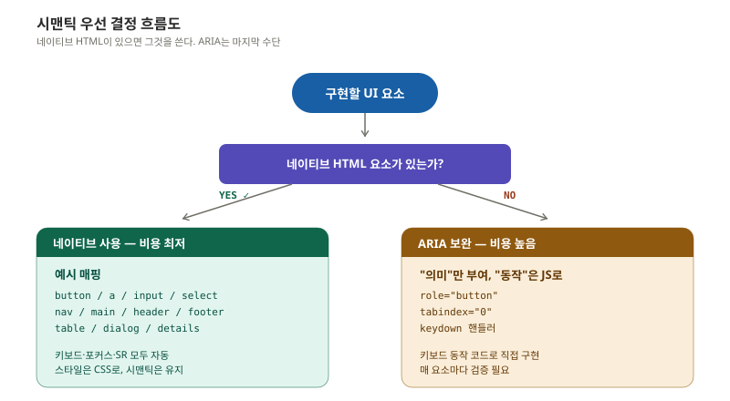
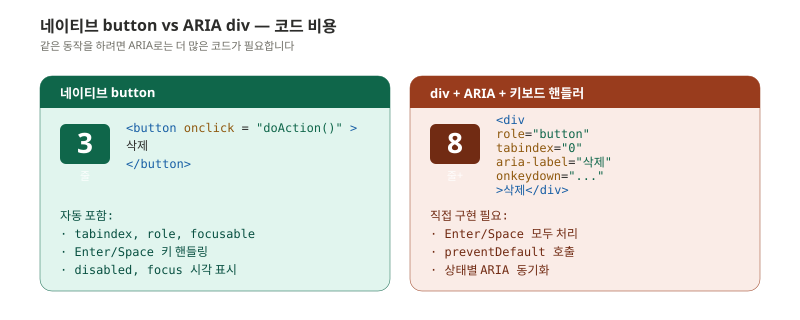
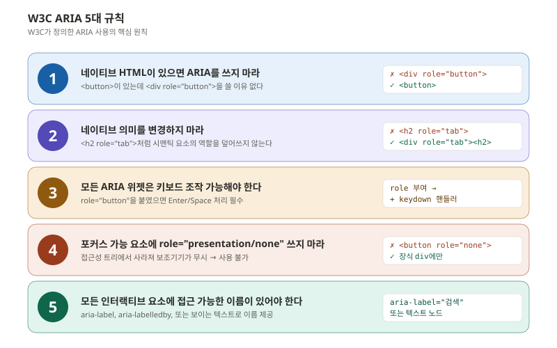
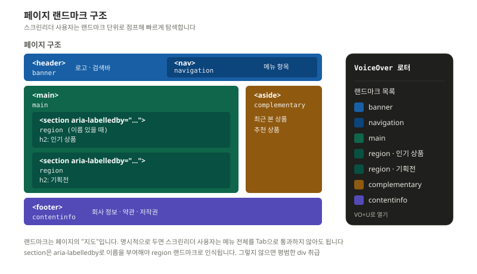
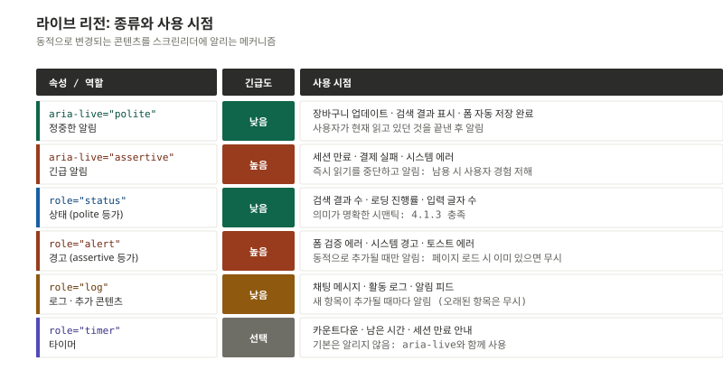
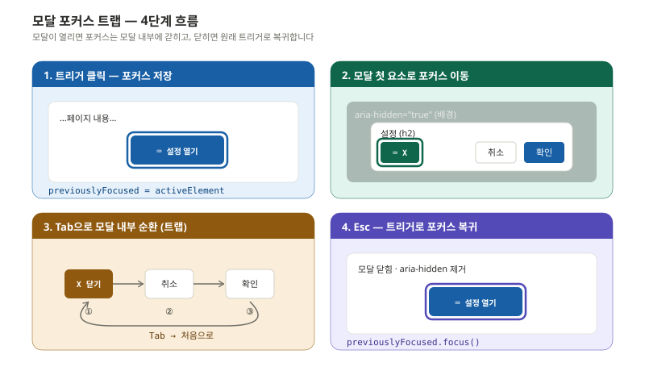
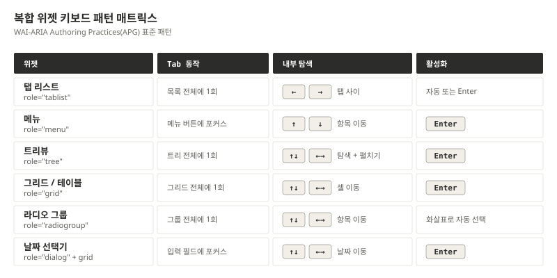

> 접근성 이슈의 대부분은 개발 단계에서 발생합니다. 다만 그 원인은 "어렵다"가 아니라 "네이티브 HTML 대신 div를 쓴 사소한 선택" 인 경우가 압도적입니다.

이 편은 디자인을 시맨틱 코드로 옮기는 단계를 다룹니다. 첫 번째 규칙은 단순합니다. **네이티브를 먼저 쓰고, ARIA는 마지막에**.

---

## 시맨틱 HTML 우선 원칙

UI 요소를 구현할 때 가장 먼저 던질 질문은 "이걸 표현할 네이티브 HTML 요소가 있는가?" 입니다.



답이 YES면 그 요소를 씁니다. CSS로 모양을 바꿔도 시맨틱은 유지하면 됩니다. 답이 NO일 때만 ARIA로 의미를 부여합니다. 다만 ARIA는 의미만 부여하지 **동작을 자동으로 만들어 주지 않습니다**. 키보드 처리는 JavaScript로 직접 해야 합니다.

### 코드 비용으로 본 차이

같은 "삭제" 버튼을 두 방식으로 구현해 보면 차이가 분명합니다.



```html
<!-- ✅ 네이티브 button: 3줄 (모든 동작 자동) -->
<button type="button" onclick="doAction()">
  삭제
</button>

<!-- ❌ ARIA로 같은 동작 구현: 8줄+ (놓치기 쉬움) -->
<div
  role="button"
  tabindex="0"
  aria-label="삭제"
  onclick="doAction()"
  onkeydown="if(event.key==='Enter'||event.key===' '){
    event.preventDefault(); doAction()
  }"
>
  삭제
</div>
```

핵심 차이는 **숨겨진 자동 동작** 입니다. 네이티브 button은 자동으로 다음 모두를 제공합니다.

- `tabindex` 없이도 포커스 가능
- Enter와 Space 키로 모두 활성화
- 포커스 인디케이터 기본 표시
- `disabled` 속성 적용 시 포커스에서 제외
- 폼 내부에 있으면 자동으로 submit 동작

div + ARIA로는 이 모두를 직접 작성해야 하며, 하나라도 빠지면 사용자가 사용 불가능한 버튼이 됩니다.

### 네이티브로 대체 가능한 ARIA 케이스

자주 마주치는 ARIA가 네이티브로 대체 가능한 경우입니다.

| ARIA 패턴 | 네이티브 대안 |
|---|---|
| `<div role="button">` | `<button>` |
| `<div role="link">` | `<a href>` |
| `<div role="checkbox">` | `<input type="checkbox">` |
| `<div role="dialog">` | `<dialog>` |
| `<div role="navigation">` | `<nav>` |
| `<div role="main">` | `<main>` |
| `<div role="list">` | `<ul>` / `<ol>` |
| `<div aria-expanded="...">` | `<details>` / `<summary>` |

`<dialog>` 요소는 모달 패턴을 거의 모두 자동 지원합니다 (포커스 트랩, ESC 닫기, backdrop). 다만 브라우저 호환성과 스타일링 자유도 때문에 여전히 div + role="dialog" 패턴을 쓰는 경우가 많습니다.

---

## W3C ARIA 5대 규칙

W3C는 ARIA를 어떻게 써야 하는지에 대한 다섯 가지 핵심 규칙을 정의합니다.



다섯 규칙을 한 줄씩 풀면 다음과 같습니다.

1. **네이티브 우선**: 같은 의미의 네이티브 요소가 있으면 ARIA를 쓰지 않는다
2. **의미 보존**: `<h2 role="tab">` 처럼 시맨틱 요소의 역할을 덮어쓰지 않는다
3. **키보드 보장**: `role="button"`을 붙였으면 Enter/Space 처리를 반드시 구현한다
4. **presentation 금지**: 포커스 가능한 요소에 `role="presentation"`이나 `role="none"`을 쓰지 않는다
5. **이름 보장**: 모든 인터랙티브 요소에 접근 가능한 이름이 있어야 한다

특히 다섯 번째는 가장 자주 위반되는 규칙입니다. 아이콘 전용 버튼이 그 대표적인 예입니다.

```html
<!-- ❌ 접근 가능한 이름 없음 -->
<button><svg>...</svg></button>

<!-- ✅ aria-label로 이름 제공 -->
<button aria-label="장바구니">
  <svg aria-hidden="true">...</svg>
</button>

<!-- ✅ 또는 visually-hidden 텍스트로 -->
<button>
  <svg aria-hidden="true">...</svg>
  <span class="sr-only">장바구니</span>
</button>
```

`aria-hidden="true"`를 SVG에 붙이는 이유는, SVG 내부에 `<title>`이나 텍스트 노드가 있으면 스크린리더가 그것도 함께 읽으면서 "장바구니, 장바구니" 같은 중복이 발생하기 때문입니다.

---

## 랜드마크 - 페이지의 지도

랜드마크는 페이지의 주요 영역을 의미적으로 묶는 단위입니다. 스크린리더 사용자는 랜드마크를 점프하며 페이지를 탐색합니다.



### 랜드마크 매핑

```html
<body>
  <header>              <!-- banner -->
    <nav>...</nav>      <!-- navigation -->
  </header>

  <main>                <!-- main -->
    <section aria-labelledby="products-heading">  <!-- region -->
      <h2 id="products-heading">인기 상품</h2>
      ...
    </section>

    <aside>             <!-- complementary -->
      ...
    </aside>
  </main>

  <footer>              <!-- contentinfo -->
    ...
  </footer>
</body>
```

규칙은 다음과 같습니다.

- 페이지당 `<main>`은 **한 개만**
- `<header>`/`<footer>`가 `<article>`이나 `<section>` 안에 있으면 banner/contentinfo가 **아님**(그저 article 헤더). 최상위에 있을 때만 랜드마크
- `<section>`은 `aria-labelledby` 또는 `aria-label`로 **이름이 부여될 때만** region 랜드마크로 인식됨
- 같은 종류의 랜드마크가 여러 개 있으면 `aria-label`로 구분 (예: `<nav aria-label="주메뉴">`, `<nav aria-label="푸터 메뉴">`)

### Skip Navigation 링크

페이지 최상단에 "본문으로 바로가기" 링크를 두면 키보드 사용자가 헤더의 메뉴를 모두 통과하지 않고 곧바로 본문에 도달할 수 있습니다.

```html
<a href="#main-content" class="skip-link">본문으로 바로가기</a>
...
<main id="main-content">...</main>
```

```css
.skip-link {
  position: absolute;
  left: -9999px;
}
.skip-link:focus {
  left: 0;
  top: 0;
  z-index: 9999;
  padding: 1rem;
  background: var(--surface);
  color: var(--text);
}
```

평소에는 화면 밖에 숨겨두었다가 키보드로 포커스되었을 때만 나타납니다.

---

## 라이브 리전 - 동적 콘텐츠 알림

페이지가 다 로드된 뒤 동적으로 변하는 콘텐츠를 스크린리더에 알리려면 라이브 리전을 써야 합니다.



### 기본 패턴

```html
<!-- 정중한 알림: 사용자가 현재 읽는 것을 끝낸 후 알림 -->
<div aria-live="polite" aria-atomic="true">
  장바구니에 상품이 추가되었습니다.
</div>

<!-- 긴급 알림: 즉시 읽기 중단하고 알림 -->
<div aria-live="assertive" role="alert">
  세션이 만료되었습니다. 다시 로그인해 주세요.
</div>

<!-- 상태 메시지: 포커스 이동 없이 알림 (WCAG 4.1.3) -->
<div role="status">
  검색 결과 42건이 표시되었습니다.
</div>
```

### aria-atomic의 차이

`aria-atomic="true"`는 영역 안 콘텐츠가 변경될 때 **전체** 를 다시 읽으라는 뜻이고, `false`(기본값)는 **변경된 부분만** 읽으라는 뜻입니다.

```html
<!-- 시계 (1초마다 업데이트) -->
<!-- atomic=false: 변경된 부분만 ("23초", "24초"... 만 읽음) -->
<div aria-live="polite">
  현재 시각: <span id="time">10:23</span>
</div>

<!-- 토스트 (한번에 새 메시지) -->
<!-- atomic=true: 전체 ("장바구니에 추가되었습니다") 읽음 -->
<div aria-live="polite" aria-atomic="true" id="toast">
  장바구니에 추가되었습니다
</div>
```

### 흔한 함정

- **페이지 로드 시 이미 있던 콘텐츠는 알림 안 됨**: 라이브 리전은 페이지 로드 후 추가된 콘텐츠만 감지
- **너무 빠른 업데이트는 무시됨**: 500ms 미만 간격은 일부 스크린리더에서 누락
- **assertive 남용**: 정말 긴급한 경우에만. 빈번하게 쓰면 사용자가 페이지를 못 읽음

---

## ARIA 안티패턴

자주 마주치는 잘못된 ARIA 사용 패턴을 모았습니다.

```html
<!-- ❌ 안티패턴 1: 중복 역할 -->
<button role="button">클릭</button>
<!-- button은 이미 role을 가지므로 불필요 -->

<!-- ❌ 안티패턴 2: 보이는 텍스트와 다른 aria-label -->
<button aria-label="제출하기">저장</button>
<!-- 시각: "저장" / 음성: "제출하기" → 음성 인식 사용자가 "저장 클릭" 안 됨 -->
<!-- ✅ aria-label 제거 또는 일치 -->

<!-- ❌ 안티패턴 3: aria-hidden 남용 -->
<button aria-hidden="true">중요 기능</button>
<!-- 스크린리더에서 완전히 사라짐 → 사용 불가 -->

<!-- ❌ 안티패턴 4: div에 role만, 키보드 미구현 -->
<div role="checkbox" aria-checked="false">동의합니다</div>
<!-- Space로 체크/해제 안 됨 -->

<!-- ❌ 안티패턴 5: 비인터랙티브 요소에 aria-label -->
<p aria-label="회사 소개 문단">
  우리 회사는...
</p>
<!-- <p>같은 비인터랙티브 요소에 aria-label은 대부분 무시됨 -->
```

### WCAG 2.5.3 - Label in Name

"보이는 레이블이 접근 가능한 이름에 포함되어야 한다" 는 규칙(WCAG 2.5.3 A)은 음성 인식으로 조작하는 사용자에게 중요합니다. "저장 버튼 클릭" 이라고 말했는데 실제 이름이 "저장"이 아니라 "제출하기"면 작동하지 않습니다.

```html
<!-- ❌ 음성 인식 사용자 사용 불가 -->
<button aria-label="제출하기">저장</button>

<!-- ✅ 보이는 텍스트로 충분 -->
<button>저장</button>

<!-- ✅ aria-label에 보이는 텍스트 포함 -->
<button aria-label="이메일 저장하기">저장</button>
```

---

## 키보드 접근성 구현

### 기본 키 동작 (WAI-ARIA APG 표준)

| 키 | 동작 |
|---|---|
| `Tab` | 다음 포커스 가능 요소로 이동 |
| `Shift + Tab` | 이전 요소로 이동 |
| `Enter` | 링크 활성화, 폼 제출, 기본 액션 |
| `Space` | 버튼 활성화, 체크박스 토글 |
| `Esc` | 모달·팝업·오버레이 닫기 |
| `↑ ↓ ← →` | 라디오 그룹·메뉴·탭·트리·그리드 내 이동 |

### tabindex 규칙

```html
<!-- ✅ tabindex="0": DOM 순서대로 포커스 가능 -->
<div tabindex="0" role="region" aria-label="중요 공지">
  공지사항 내용
</div>

<!-- ✅ tabindex="-1": 프로그래밍 포커스용 (Tab 제외) -->
<h2 tabindex="-1" id="results">검색 결과</h2>
<script>
  // 검색 완료 후 결과로 포커스 이동
  document.getElementById('results').focus();
</script>

<!-- ❌ 양수 tabindex 절대 금지 -->
<input tabindex="3" ...>  <!-- 예측 불가능한 탭 순서 -->
<input tabindex="1" ...>
<input tabindex="2" ...>
```

양수 `tabindex`는 **DOM 순서를 무시하고 강제로 탭 순서를 변경** 합니다. 페이지 어딘가에 양수 `tabindex`가 하나라도 있으면 모든 양수 `tabindex` 요소가 일반 요소보다 먼저 포커스됩니다. 유지보수가 불가능해지므로 절대 쓰면 안 됩니다.

---

## 모달 포커스 트랩

모달이 열렸을 때 포커스가 모달 외부로 빠져나가면 키보드 사용자는 자신이 어디 있는지 알 수 없게 됩니다. 포커스 트랩은 모달의 핵심 패턴입니다.



### JavaScript 구현

```javascript
class FocusTrap {
  constructor(element) {
    this.element = element;
    this.previouslyFocused = null;
  }

  activate() {
    // 1. 이전 포커스 위치 저장
    this.previouslyFocused = document.activeElement;

    // 2. 포커스 가능 요소 찾기
    const focusable = this.element.querySelectorAll(
      'a[href], button:not([disabled]), input:not([disabled]), ' +
      'select:not([disabled]), textarea:not([disabled]), ' +
      '[tabindex]:not([tabindex="-1"])'
    );

    this.firstFocusable = focusable[0];
    this.lastFocusable = focusable[focusable.length - 1];

    // 3. 첫 요소로 포커스
    this.firstFocusable.focus();

    // 4. Tab 키 가로채기
    this.element.addEventListener('keydown', this.handleKeydown);
  }

  handleKeydown = (e) => {
    if (e.key === 'Tab') {
      if (e.shiftKey && document.activeElement === this.firstFocusable) {
        e.preventDefault();
        this.lastFocusable.focus();
      } else if (!e.shiftKey && document.activeElement === this.lastFocusable) {
        e.preventDefault();
        this.firstFocusable.focus();
      }
    }
    if (e.key === 'Escape') {
      this.deactivate();
    }
  }

  deactivate() {
    this.element.removeEventListener('keydown', this.handleKeydown);
    // 5. 원래 포커스 위치로 복귀
    this.previouslyFocused?.focus();
  }
}
```

### 모달 ARIA 마크업

```html
<div role="dialog"
     aria-modal="true"
     aria-labelledby="modal-title">
  <h2 id="modal-title">설정</h2>
  <div>
    <!-- 모달 내용 -->
  </div>
  <button>취소</button>
  <button>확인</button>
</div>
```

`aria-modal="true"`는 보조기기에게 "이 안이 전부다" 를 알리는 신호로, 모달 외부 콘텐츠는 자동으로 무시됩니다.

---

## 복합 위젯 키보드 패턴

탭·메뉴·트리뷰 같은 복합 위젯은 표준 키보드 패턴이 있습니다.



### 탭 패턴 구현 예

```html
<div role="tablist" aria-label="상품 정보">
  <button role="tab"
          id="tab-1"
          aria-selected="true"
          aria-controls="panel-1"
          tabindex="0">
    상세 정보
  </button>
  <button role="tab"
          id="tab-2"
          aria-selected="false"
          aria-controls="panel-2"
          tabindex="-1">
    리뷰
  </button>
  <button role="tab"
          id="tab-3"
          aria-selected="false"
          aria-controls="panel-3"
          tabindex="-1">
    Q&A
  </button>
</div>

<div role="tabpanel" id="panel-1" aria-labelledby="tab-1">
  상세 정보 내용...
</div>
<div role="tabpanel" id="panel-2" aria-labelledby="tab-2" hidden>
  리뷰 내용...
</div>
```

핵심 포인트는 **활성 탭만 `tabindex="0"`** 으로 두고 나머지는 `tabindex="-1"` 로 둔다는 점입니다. 이러면 Tab 키 한 번으로 탭 목록 전체를 통과한 뒤 탭 패널로 이동하고, 탭 안에서는 화살표 키로 탐색합니다. 이걸 **roving tabindex** 패턴이라고 합니다.

### 탭 키 동작 요약

```
Tab         → 탭 목록 → 탭 패널 (외부 이동)
← →         → 탭 사이 이동 + 자동 활성화
Home        → 첫 번째 탭
End         → 마지막 탭
Enter/Space → 수동 활성화 모드일 때 활성화
```

---

## 스크린리더 호환 개발

### 동적 SPA 라우팅 시 알림

SPA에서 페이지 전환은 실제로 URL만 바뀌고 DOM은 일부만 갱신됩니다. 스크린리더는 페이지 전환을 인지하지 못하므로 명시적으로 알려야 합니다.

```javascript
// SPA 라우팅 시 접근성 관리

// 1. 페이지 타이틀 업데이트
document.title = `상품 목록 - 쇼핑몰`;

// 2. 포커스를 메인 콘텐츠로 이동
const main = document.querySelector('main');
main.setAttribute('tabindex', '-1');
main.focus();

// 3. 라우트 변경 알림
const announcer = document.getElementById('route-announcer');
announcer.textContent = '상품 목록 페이지로 이동했습니다.';
```

```html
<!-- 앱 루트에 한 번 배치 (라우트 변경 알림 전용 라이브 리전) -->
<div
  id="route-announcer"
  role="status"
  aria-live="polite"
  aria-atomic="true"
  class="sr-only"
></div>
```

### 무한 스크롤 대응

무한 스크롤은 접근성 측면에서 세 가지 문제가 있습니다.

- 스크린리더가 새 콘텐츠 로드를 인지 못함
- 전체 항목 수를 알 수 없음
- 푸터에 도달 불가

해결책은 **"더 보기" 버튼 패턴** 입니다.

```html
<div role="status" aria-live="polite">검색 결과 142건</div>

<ul>
  <li>상품 1</li>
  ...
  <li>상품 20</li>
</ul>

<button onclick="loadMore()">
  더 보기 (20/142)
</button>

<footer>...</footer>  <!-- 항상 도달 가능 -->
```

자동 로드 대신 명시적 버튼으로 사용자가 통제할 수 있게 하고, 새 항목 로드 후 21번째 항목으로 포커스를 옮깁니다.

### sr-only 유틸리티 클래스

화면에 보이지 않지만 스크린리더는 읽는 텍스트가 필요한 경우가 자주 있습니다.

```css
.sr-only {
  position: absolute;
  width: 1px;
  height: 1px;
  padding: 0;
  margin: -1px;
  overflow: hidden;
  clip: rect(0, 0, 0, 0);
  white-space: nowrap;
  border: 0;
}
```

```html
<button>
  <svg aria-hidden="true">...</svg>
  <span class="sr-only">메뉴 열기</span>
</button>
```

`display: none`이나 `visibility: hidden`은 스크린리더도 무시하므로 쓰면 안 됩니다.

---

## 이번 편 정리

개발 단계에서 가장 자주 마주치는 다섯 가지 결정 포인트입니다.

- **요소 선택**: 네이티브 HTML 먼저, ARIA는 최후. div + role 조합은 비용이 큽니다
- **랜드마크 설계**: 페이지 최상단에 Skip 링크, 본문 단위로 nav/main/aside/footer
- **포커스 관리**: 모달 열기 시 트랩, 닫기 시 트리거로 복귀
- **동적 알림**: aria-live polite는 일반 알림, assertive는 긴급한 경우만
- **키보드 패턴**: 탭·메뉴·트리는 WAI-ARIA APG의 roving tabindex 패턴 그대로

이 다섯이 자동으로 나오게 하려면 **React Aria, Radix UI, Headless UI** 같은 헤드리스 컴포넌트 라이브러리를 쓰는 것이 빠릅니다. 다음 편(모바일·프레임워크)에서 다룹니다.

---

## 참고 자료

- W3C. (2023). *WAI-ARIA 1.2*. https://www.w3.org/TR/wai-aria-1.2/
- W3C. (2024). *ARIA Authoring Practices Guide (APG)*. https://www.w3.org/WAI/ARIA/apg/
- W3C. (2017). *Using ARIA — The Five Rules of ARIA Use*. https://www.w3.org/TR/using-aria/
- W3C. (2023). *WCAG 2.2 — 4.1.3 Status Messages*. https://www.w3.org/WAI/WCAG22/Understanding/status-messages
- MDN. (2024). *ARIA — Accessibility*. https://developer.mozilla.org/en-US/docs/Web/Accessibility/ARIA
- WebAIM. (2024). *Keyboard Accessibility*. https://webaim.org/techniques/keyboard/
- Inclusive Components. (2017). *Heydon Pickering — Modals, Tabs, Menus*.

---

## 다음 편 예고

> [ep.05 - 모바일·프레임워크: iOS/Android, React/Vue/Flutter](/a11y-guide-ep-05/)

웹의 시맨틱과 ARIA가 모바일 네이티브에서는 어떤 형태가 되는지, SwiftUI의 `accessibilityLabel`과 Compose의 `Semantics`, Flutter의 `Semantics` 위젯은 어떻게 매핑되는지. 그리고 React/Vue/Flutter 같은 프레임워크에서 접근성을 자동화하는 도구와 헤드리스 라이브러리를 다룹니다.
