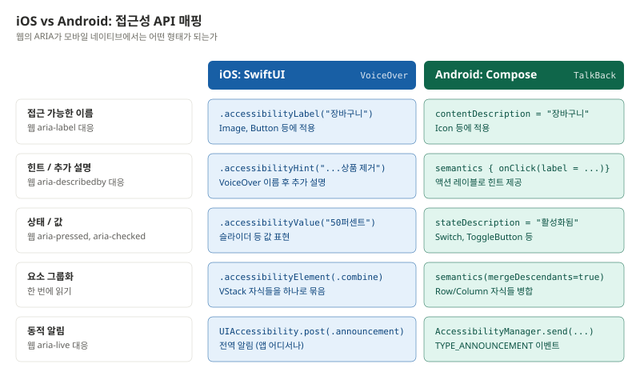
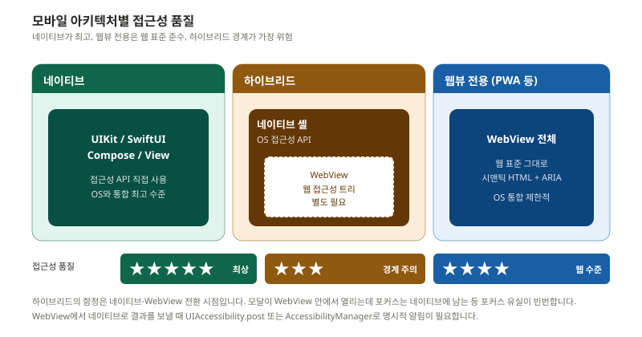
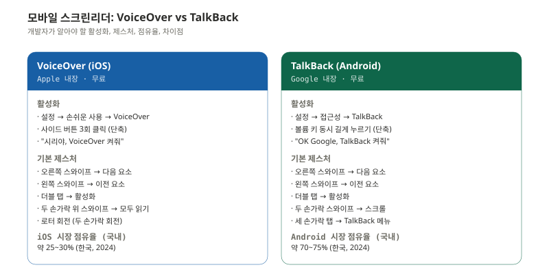
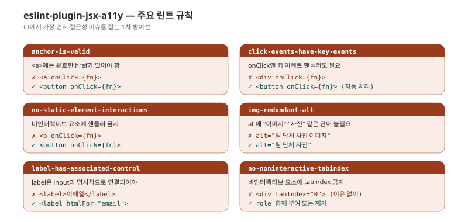
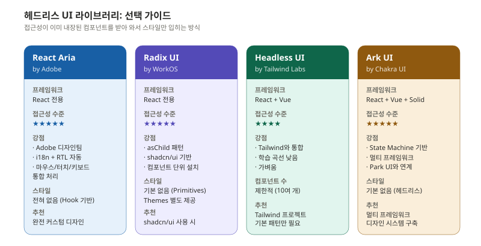
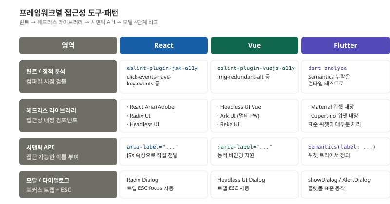

> 웹 접근성을 잘 안다고 해서 모바일 접근성을 자동으로 아는 것은 아닙니다. 같은 개념을 부르는 이름이 다르고, 같은 이름이 다른 동작을 하기도 합니다. 매핑 표가 절반의 일을 합니다.

이 편은 두 가지를 다룹니다 — 모바일 네이티브(iOS/Android)에서의 접근성과, React/Vue/Flutter 같은 프레임워크가 제공하는 접근성 도구입니다.

---

## 웹 ARIA의 모바일 매핑

iOS와 Android는 자체 접근성 API를 가지고 있습니다. 웹의 ARIA가 어떻게 매핑되는지부터 정리합니다.



### iOS — SwiftUI 접근성 수정자

SwiftUI는 접근성을 **수정자(modifier)** 로 적용합니다. 뷰에 연결합니다.

```swift
// 기본 레이블 — 웹의 aria-label 대응
Image("cart")
    .accessibilityLabel("장바구니")

// 힌트 — 추가 설명, 웹의 aria-describedby 대응
Button("삭제") { deleteItem() }
    .accessibilityHint("이 상품을 장바구니에서 제거합니다")

// 요소 그룹화 — 한 번에 읽기
VStack {
    Text("에어팟 프로")
    Text("₩329,000")
    Text("무료 배송")
}
.accessibilityElement(children: .combine)
// → "에어팟 프로, 329,000원, 무료 배송"으로 한 번에 읽힘

// 값 조절 — 슬라이더, 스테퍼
Slider(value: $volume, in: 0...100)
    .accessibilityValue("\(Int(volume))퍼센트")
    .accessibilityAdjustableAction { direction in
        switch direction {
        case .increment: volume += 10
        case .decrement: volume -= 10
        @unknown default: break
        }
    }

// 상태 변경 알림 — 웹의 aria-live 대응
@State private var itemAdded = false
// ...
.onChange(of: itemAdded) { _ in
    UIAccessibility.post(
        notification: .announcement,
        argument: "장바구니에 추가되었습니다"
    )
}
```

### Android — Jetpack Compose 접근성

Compose는 `semantics` modifier 안에서 모든 접근성 정보를 설정합니다.

```kotlin
// 기본 — contentDescription이 가장 일반적
Icon(
    Icons.Default.ShoppingCart,
    contentDescription = "장바구니"
)

// 요소 그룹화
Row(
    modifier = Modifier.semantics(mergeDescendants = true) {}
) {
    Text("에어팟 프로")
    Text("₩329,000")
    Text("무료 배송")
}
// → "에어팟 프로, 329,000원, 무료 배송"

// 상태 설명
Switch(
    checked = isEnabled,
    onCheckedChange = { isEnabled = it },
    modifier = Modifier.semantics {
        stateDescription = if (isEnabled) "활성화됨" else "비활성화됨"
    }
)

// 커스텀 액션 (TalkBack 메뉴에서 선택 가능)
Box(
    modifier = Modifier.semantics {
        customActions = listOf(
            CustomAccessibilityAction("삭제") { deleteItem(); true },
            CustomAccessibilityAction("편집") { editItem(); true }
        )
    }
)

// 라이브 알림
val context = LocalContext.current
LaunchedEffect(cartCount) {
    val manager = context.getSystemService(
        Context.ACCESSIBILITY_SERVICE
    ) as AccessibilityManager
    val event = AccessibilityEvent.obtain().apply {
        eventType = AccessibilityEvent.TYPE_ANNOUNCEMENT
        text.add("장바구니 ${cartCount}개 상품")
    }
    manager.sendAccessibilityEvent(event)
}
```

### 매핑 핵심

| 웹 ARIA | iOS SwiftUI | Android Compose |
|---|---|---|
| `aria-label` | `.accessibilityLabel` | `contentDescription` |
| `aria-describedby` | `.accessibilityHint` | `onClick(label = ...)` |
| `aria-checked` / `aria-pressed` | `.accessibilityValue` | `stateDescription` |
| `aria-live="polite"` | `UIAccessibility.post(.announcement)` | `AccessibilityManager.send(TYPE_ANNOUNCEMENT)` |
| `aria-hidden="true"` | `.accessibilityHidden(true)` | `clearAndSetSemantics {}` |

**한 가지 함정** : SwiftUI의 `.accessibilityHint`는 사용자가 VoiceOver 설정에서 비활성화할 수 있습니다. 핵심 정보는 `label`에 두고, 힌트는 부가 설명만 두는 것이 안전합니다.

---

## 네이티브 · 하이브리드 · 웹뷰 아키텍처

같은 모바일 앱이라도 어떻게 만들어졌는지에 따라 접근성 작업이 완전히 달라집니다.



### 하이브리드의 함정

가장 까다로운 것은 **하이브리드** 아키텍처(네이티브 셸 + 내부 WebView)입니다. 두 가지 접근성 트리(네이티브와 웹)가 동시에 존재합니다.

| 이슈 | 증상 | 대응 |
|---|---|---|
| 포커스 유실 | WebView로 전환 시 포커스가 사라짐 | WebView 로드 후 명시적 focus 호출 |
| 알림 누락 | 웹에서 발생한 이벤트가 네이티브 스크린리더로 전달 안 됨 | JS Bridge로 네이티브에 알림 전달 |
| 제스처 충돌 | 네이티브 제스처와 웹뷰 스크롤 충돌 | WebView 내 스크롤 영역 명시 |
| 헤더/푸터 중복 | 네이티브와 웹 모두 같은 영역 보여줌 | 한쪽 숨김 처리 |

```javascript
// WebView에서 네이티브로 접근성 알림 전달
// React Native WebView 예시
window.ReactNativeWebView.postMessage(JSON.stringify({
  type: 'a11y-announce',
  message: '장바구니에 추가되었습니다'
}));

// 네이티브 측
webView.addOnMessageReceived { message ->
  if (message.type == "a11y-announce") {
    AccessibilityManager.send(message.message)
  }
}
```

---

## 모바일 스크린리더

VoiceOver와 TalkBack은 데스크톱 NVDA·VoiceOver와는 동작 방식이 다릅니다. 키보드가 아니라 제스처가 중심입니다.



### 모바일 스크린리더 개발 시 핵심 차이

- **포커스가 아니라 "현재 항목"** : 모바일 스크린리더는 사용자가 손가락으로 선택한 요소를 읽습니다. 키보드 Tab과 다릅니다.
- **읽기 순서가 시각 순서를 따르지 않을 수 있음** : SwiftUI/Compose는 자동으로 시각 순서를 따르지만, 절대 위치(absolute) 요소가 많으면 어긋날 수 있습니다.
- **그룹화가 핵심** : 카드형 UI에서 가격·이름·배지를 따로따로 읽으면 사용자 좌절. `combine`/`mergeDescendants`로 묶어야 합니다.
- **시스템 스위치와 호환 필요** : iOS Switch Control, Android Switch Access 같은 보조 입력기를 지원해야 합니다.

### 모바일 테스트 최소 조합

```
iOS: 실기기 + VoiceOver + Safari/앱
Android: 실기기 + TalkBack + Chrome/앱
```

시뮬레이터의 VoiceOver는 실제 동작과 차이가 큽니다. 반드시 실기기 테스트가 필요합니다.

---

## Flutter 접근성

Flutter는 자체 렌더링 엔진을 쓰기 때문에 OS의 표준 위젯과 다릅니다. 모든 위젯에 `Semantics` 정보를 직접 부여해야 합니다(다만 Material/Cupertino 표준 위젯은 대부분 자동 처리).

```dart
// 기본 Semantics 위젯
Semantics(
  label: '장바구니',
  hint: '장바구니 페이지로 이동합니다',
  button: true,
  child: InkWell(
    onTap: () => navigateToCart(),
    child: Icon(Icons.shopping_cart),
  ),
)

// 요소 그룹화
MergeSemantics(
  child: Column(
    children: [
      Text('에어팟 프로'),
      Text('₩329,000'),
      Text('무료 배송'),
    ],
  ),
)
// → "에어팟 프로, 329,000원, 무료 배송"

// 접근성 테스트
testWidgets('장바구니 버튼 접근성', (tester) async {
  await tester.pumpWidget(MyApp());

  expect(
    tester.getSemantics(find.byIcon(Icons.shopping_cart)),
    matchesSemantics(label: '장바구니', isButton: true),
  );
});
```

Flutter는 접근성 트리를 별도로 노출하는 **Semantics Tree**를 가지고 있어, 위젯 트리와 접근성 트리를 따로 검사할 수 있습니다. `debugDumpSemanticsTree()`로 출력 가능합니다.

---

## React 접근성

### jsx-a11y 린트 — 1차 방어선

eslint-plugin-jsx-a11y는 컴파일 시점에 접근성 위반을 잡아내는 가장 강력한 도구입니다.

```bash
npm install eslint-plugin-jsx-a11y --save-dev
```

```json
// .eslintrc.json
{
  "plugins": ["jsx-a11y"],
  "extends": ["plugin:jsx-a11y/recommended"],
  "rules": {
    "jsx-a11y/anchor-is-valid": "error",
    "jsx-a11y/click-events-have-key-events": "error",
    "jsx-a11y/no-static-element-interactions": "error",
    "jsx-a11y/img-redundant-alt": "error",
    "jsx-a11y/label-has-associated-control": "error"
  }
}
```



### 헤드리스 라이브러리 — 가장 효율적 접근

매번 ARIA를 손으로 짜는 것보다, 접근성이 이미 내장된 헤드리스 라이브러리를 쓰는 것이 압도적으로 효율적입니다.



#### React Aria 예시

```jsx
import { useButton } from 'react-aria';
import { useRef } from 'react';

function AccessibleButton(props) {
  const ref = useRef();
  const { buttonProps } = useButton(props, ref);

  return (
    <button {...buttonProps} ref={ref}>
      {props.children}
    </button>
  );
}

// 사용
<AccessibleButton onPress={() => addToCart()}>
  장바구니 담기
</AccessibleButton>
```

`useButton` 훅 하나가 마우스·터치·키보드·포커스 관리를 모두 자동으로 처리합니다. 직접 작성했다면 50줄 이상 필요한 로직입니다.

#### Radix UI 예시

```jsx
import * as Dialog from '@radix-ui/react-dialog';

function SettingsDialog() {
  return (
    <Dialog.Root>
      <Dialog.Trigger asChild>
        <button>설정 열기</button>
      </Dialog.Trigger>

      <Dialog.Portal>
        <Dialog.Overlay className="overlay" />
        <Dialog.Content className="content">
          <Dialog.Title>설정</Dialog.Title>
          <Dialog.Description>
            앱 설정을 변경합니다
          </Dialog.Description>

          <Dialog.Close asChild>
            <button>닫기</button>
          </Dialog.Close>
        </Dialog.Content>
      </Dialog.Portal>
    </Dialog.Root>
  );
}
```

`Dialog.Root`가 자동으로 포커스 트랩, ESC 닫기, `aria-modal`, 트리거 포커스 복귀를 모두 처리합니다.

---

## Vue 접근성

Vue는 ARIA 속성을 동적으로 바인딩하기 위해 콜론(`:`)을 사용합니다.

```vue
<template>
  <div>
    <button
      @click="openModal"
      ref="triggerRef"
      :aria-expanded="isOpen"
      aria-haspopup="dialog"
    >
      설정 열기
    </button>

    <Teleport to="body">
      <div
        v-if="isOpen"
        role="dialog"
        aria-modal="true"
        aria-labelledby="modal-title"
        @keydown.esc="closeModal"
        ref="modalRef"
      >
        <h2 id="modal-title">설정</h2>

        <div ref="modalContent">
          <!-- 모달 콘텐츠 -->
        </div>

        <button @click="closeModal">닫기</button>
      </div>
    </Teleport>
  </div>
</template>

<script setup>
import { ref, nextTick } from 'vue';

const isOpen = ref(false);
const triggerRef = ref(null);
const modalContent = ref(null);

async function openModal() {
  isOpen.value = true;
  await nextTick();
  // 모달 열린 후 첫 포커스 가능 요소로
  modalContent.value
    ?.querySelector('button, input, [tabindex]')
    ?.focus();
}

function closeModal() {
  isOpen.value = false;
  // 트리거로 복귀
  triggerRef.value?.focus();
}
</script>
```

Vue 생태계의 헤드리스 라이브러리는 다음과 같습니다.

- **Headless UI Vue** — Tailwind Labs 제작, React 버전과 동일 API
- **Reka UI** — Radix UI의 Vue 포트
- **Ark UI Vue** — 멀티 프레임워크 지원

---

## 프레임워크별 접근성 패턴 비교



세 프레임워크 모두 접근성을 위한 도구는 충분히 마련되어 있습니다. 차이는 다음과 같습니다.

| 영역 | React | Vue | Flutter |
|---|---|---|---|
| 린트 도구 | jsx-a11y (성숙) | vuejs-a11y (보통) | dart analyze (간접) |
| 헤드리스 라이브러리 | 매우 풍부 | 점점 늘어남 | 표준 위젯이 처리 |
| 시맨틱 부여 | JSX 속성 | `:aria-*` 바인딩 | Semantics 위젯 |
| 모달 표준 | Radix/Headless UI | Headless UI Vue | showDialog |
| 자동화 테스트 | jest-axe, cypress-axe | vue-test-utils + axe | flutter_test의 Semantics |

---

## React Native 특이사항

React Native는 React지만 모바일 네이티브로 렌더링됩니다. 웹의 ARIA가 아닌 모바일 접근성 prop을 씁니다.

```jsx
import { View, Text, Pressable } from 'react-native';

function CartButton({ onPress }) {
  return (
    <Pressable
      onPress={onPress}
      accessible={true}
      accessibilityRole="button"
      accessibilityLabel="장바구니"
      accessibilityHint="장바구니 페이지로 이동합니다"
      accessibilityState={{ disabled: false }}
    >
      <Text>🛒</Text>
    </Pressable>
  );
}

// 그룹화
<View
  accessible={true}
  accessibilityLabel="에어팟 프로, 329,000원, 무료 배송"
>
  <Text>에어팟 프로</Text>
  <Text>₩329,000</Text>
  <Text>무료 배송</Text>
</View>
```

핵심 prop은 다음과 같습니다.

| Prop | 역할 |
|---|---|
| `accessible` | 자식들을 하나의 그룹으로 합침 (iOS의 `.combine` 대응) |
| `accessibilityRole` | `button`, `link`, `image`, `text`, `header` 등 |
| `accessibilityLabel` | 접근 가능한 이름 |
| `accessibilityHint` | 추가 설명 (iOS 전용) |
| `accessibilityState` | `{ disabled, selected, checked, expanded }` 등 |
| `accessibilityActions` | 커스텀 액션 정의 |

알림 전송은 `AccessibilityInfo.announceForAccessibility()`를 씁니다.

```jsx
import { AccessibilityInfo } from 'react-native';

AccessibilityInfo.announceForAccessibility('장바구니에 추가되었습니다');
```

---

## 이번 편 정리

모바일과 프레임워크 접근성을 한 줄 씩 정리하면 다음과 같습니다.

- **iOS** — SwiftUI 수정자 4종(label, hint, value, element) 마스터하면 80% 해결
- **Android** — Compose `semantics` 블록 안에서 contentDescription/stateDescription/customActions
- **Flutter** — Material/Cupertino 위젯만 쓰면 대부분 자동, 커스텀 위젯엔 `Semantics`
- **React** — jsx-a11y 린트 + Radix/React Aria 헤드리스 라이브러리 조합
- **Vue** — `:aria-*` 동적 바인딩 + Headless UI Vue 또는 Reka UI
- **하이브리드** — 네이티브↔WebView 경계에서 포커스와 알림을 명시적으로 다리 놓기

다음 편은 마지막 편입니다. 이렇게 만든 접근성을 어떻게 **검증하고, 인증받고, 조직 문화로 정착시킬지** 다룹니다.

---

## 참고 자료

- Apple. (2024). *SwiftUI Accessibility Modifiers*. https://developer.apple.com/documentation/swiftui/view-accessibility
- Apple. (2024). *Human Interface Guidelines — Accessibility*. https://developer.apple.com/design/human-interface-guidelines/accessibility
- Google. (2024). *Jetpack Compose — Accessibility*. https://developer.android.com/jetpack/compose/accessibility
- Google. (2024). *Material Design — Accessibility*. https://m3.material.io/foundations/accessible-design
- Flutter. (2024). *Accessibility in Flutter*. https://docs.flutter.dev/ui/accessibility-and-internationalization/accessibility
- Adobe. (2024). *React Aria*. https://react-spectrum.adobe.com/react-aria/
- WorkOS. (2024). *Radix UI Primitives*. https://www.radix-ui.com/primitives
- Tailwind Labs. (2024). *Headless UI*. https://headlessui.com/
- Meta. (2024). *React Native — Accessibility*. https://reactnative.dev/docs/accessibility

---

## 다음 편 예고

> [ep.06 - 검증과 운영: 테스트, 인증, 조직 문화](/a11y-guide-ep-06)

마지막 편입니다. 접근성을 어떻게 검증할 것인가(자동화 30%, 수동 70%의 진실), 한국 WA 마크 인증 프로세스, 발견된 이슈의 우선순위 분류, CI/CD에 접근성 게이트 통합, 그리고 조직 차원의 접근성 챔피언 모델과 성숙도 5단계까지. 검사·통과로 끝나지 않는 운영의 영역입니다.
