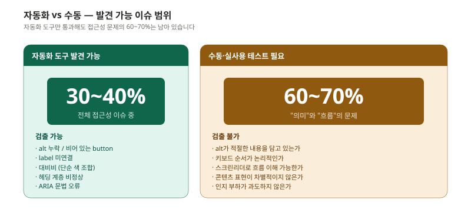
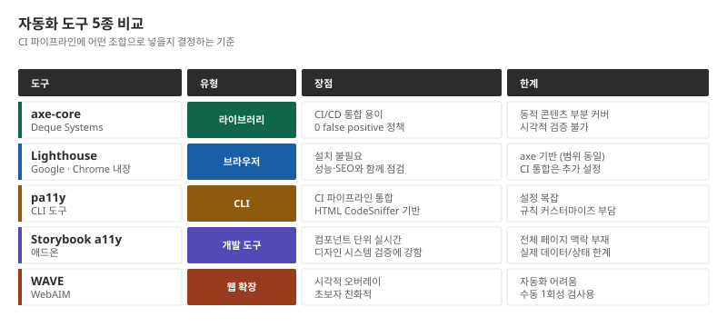
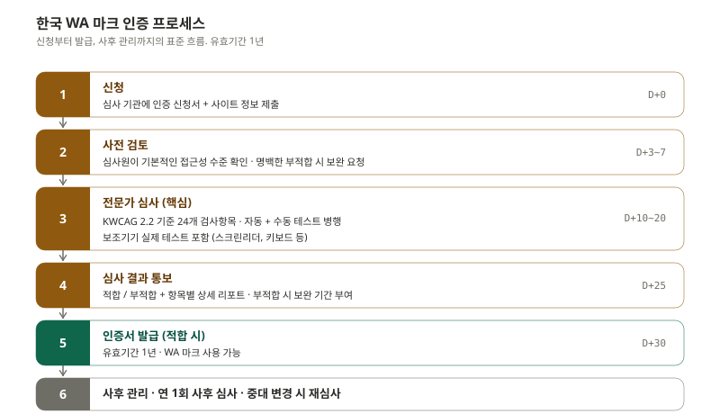
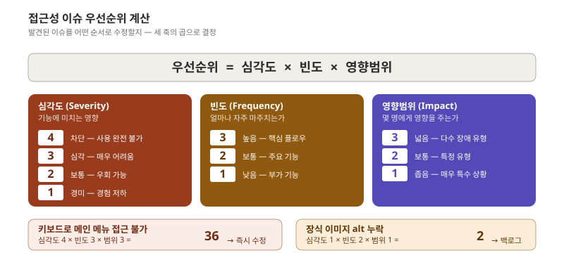
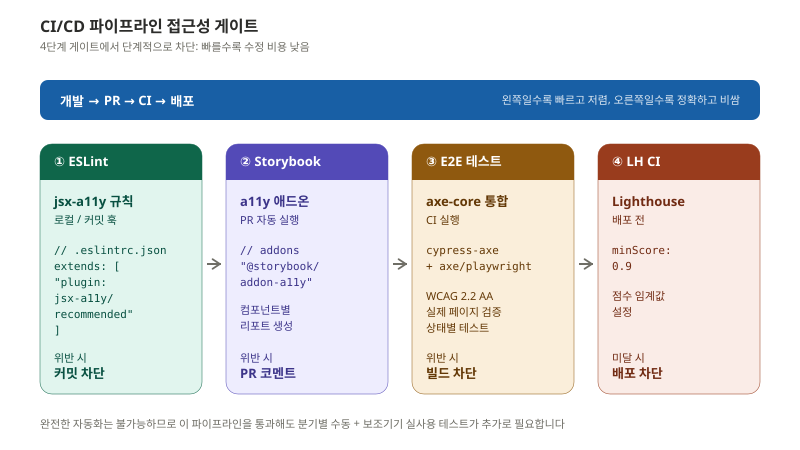
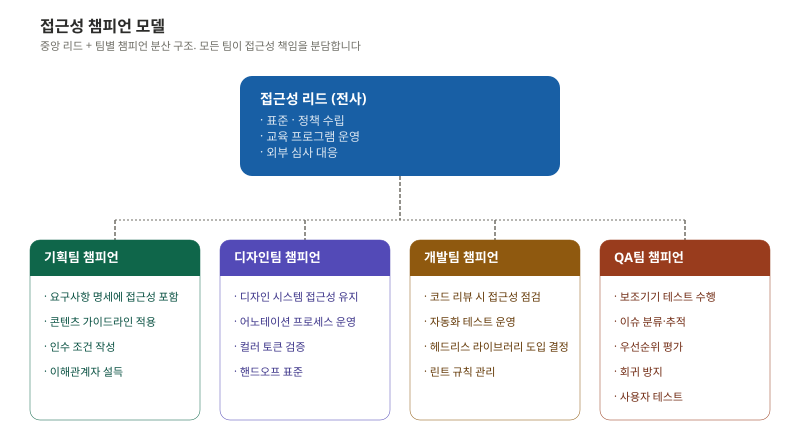
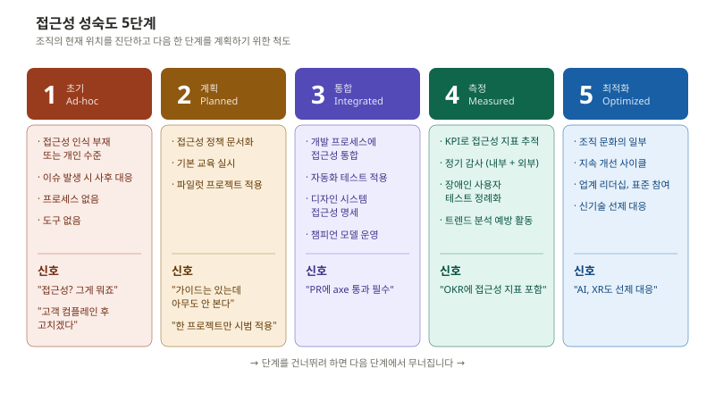
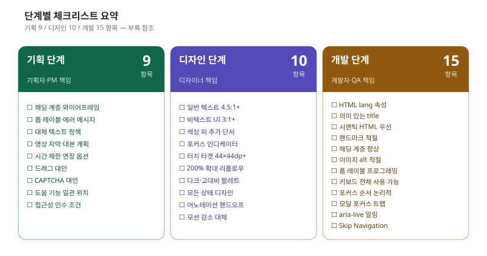

> 접근성은 도착하는 곳이 아니라 운영하는 영역입니다. 어제 통과한 페이지가 오늘 새 기능 추가로 깨질 수 있고, 인증을 받아도 1년 뒤 재심사가 옵니다. 마지막 편은 "어떻게 계속 잘 되게 할 것인가" 입니다.

이 편은 시리즈의 마지막입니다. 검증, 인증, 조직, 그리고 지속 가능한 운영을 다룹니다.

---

## 자동화 도구의 진짜 한계

먼저 받아들여야 할 사실: **자동화 도구는 전체 접근성 이슈의 30~40%만 발견합니다.**



자동화가 잘 잡는 것:

- alt 속성 누락
- label 미연결
- 단순 색상 대비 미달
- 헤딩 계층 비정상
- ARIA 문법 오류

자동화가 잡지 못하는 것:

- alt가 적절한 **내용** 을 담고 있는가 (`alt="image"` 가 통과)
- 키보드 순서가 **논리적** 인가
- 스크린리더로 흐름을 **이해** 할 수 있는가
- 콘텐츠 표현이 **차별적이지 않은가**
- 인지 부하가 과도하지 않은가

요컨대 자동화는 "문법" 을 검사하고 사람은 "의미" 를 검사합니다. 둘 다 필요합니다.

### 자동화 도구 비교

CI 파이프라인에 어떤 도구를 넣을지는 다음을 보고 결정합니다.



실무 권장 조합은 다음과 같습니다.

- **개발 중**: ESLint(jsx-a11y) + Storybook a11y 애드온
- **PR/CI 단계**: axe-core (Cypress 또는 Playwright 통합)
- **배포 전**: Lighthouse CI (점수 임계값 0.9 이상)
- **수동 spot check**: WAVE 브라우저 확장
- **분기별 정기 감사**: 외부 전문 기관 또는 내부 접근성 리드

---

## 수동 테스트 체크리스트

자동화가 못 잡는 영역을 위해 다음 세 종류의 수동 테스트가 필요합니다.

### 키보드 전용 테스트

```
1. 모든 기능에 키보드로 접근 가능 (마우스 없이 Tab으로 전체 탐색)
2. 포커스 순서가 논리적
3. 포커스 인디케이터 항상 보임
4. 키보드 트랩 없음 (Tab으로 빠져나올 수 없는 곳 확인)
5. 모달/팝업 Esc로 닫힘
6. Skip Navigation 동작
7. 드롭다운 화살표 키 탐색
```

### 스크린리더 테스트 (VoiceOver 기준)

```
1. 페이지 제목 읽힘 (로드 시)
2. 랜드마크 탐색 가능 (로터 → 랜드마크)
3. 헤딩 계층 올바름 (로터 → 헤딩 목록)
4. 이미지 대체 텍스트 적절
5. 폼 레이블 읽힘 (필드 포커스 시)
6. 에러 메시지 전달
7. 동적 콘텐츠 알림 (콘텐츠 변경 시)
8. 버튼/링크 구분 (요소 유형 읽기)
```

### 확대 · 대비 테스트

```
1. 200% 확대 시 콘텐츠 손실 없음
2. 320px 뷰포트에서 가로 스크롤 없음
3. 고대비 모드에서 정보 전달 유지
4. 텍스트 간격 확대 시 콘텐츠 겹침 없음
```

### 보조기기 실사용 테스트 - 최소 조합

```
데스크톱
├─ Windows + NVDA + Chrome    [필수]
├─ Windows + NVDA + Firefox   [권장]
└─ macOS + VoiceOver + Safari [필수]

모바일
├─ iOS + VoiceOver + Safari   [필수]
└─ Android + TalkBack + Chrome [필수]
```

NVDA + Chrome 조합이 데스크톱 스크린리더 사용자의 가장 큰 비중이므로 최소한 이 조합은 매번 확인해야 합니다.

---

## 한국 WA 마크 인증

접근성을 외부에 입증하려면 인증 절차를 거칩니다. 한국에서 통용되는 **WA 마크** 는 한국웹접근성인증평가원(KWACA) 등 인증 기관이 발급하는 표식입니다.



### 인증 준비 시점

신청 직전에 준비하면 부적합으로 떨어질 가능성이 높습니다. 일반적으로 다음 일정이 안전합니다.

| 시점 | 활동 |
|---|---|
| D-90 | 자체 진단 (axe, Lighthouse, 수동 키보드 테스트) |
| D-60 | 발견 이슈 수정 + 보조기기 실사용 테스트 |
| D-30 | 외부 컨설팅(선택) 또는 모의 심사 |
| D-0 | 정식 신청 |
| D+30 | 결과 통보 → 적합 시 인증서 발급 |

### 부적합 사유 빈도

WA 심사에서 자주 떨어지는 항목입니다.

- **alt 텍스트 부적절**: `alt="image"`, `alt="사진"` 같은 의미 없는 텍스트
- **레이블 누락**: 폼 필드에 명시적 label 없음
- **키보드 접근 불가**: div 클릭으로 만든 버튼
- **포커스 표시 부재**: `outline: none` 후 대체 표시 없음
- **명도 대비 미달**: 보조 텍스트, placeholder, 비활성 상태 색상
- **드롭다운/팝업 키보드 미지원**: 마우스에만 동작

이 여섯 가지는 자동화 도구로도 90% 잡힙니다. 자동 검사부터 통과시켜 두는 것이 첫 단계입니다.

---

## 이슈 우선순위 산정

심사 후 발견된 이슈를 어떤 순서로 수정할지가 다음 과제입니다. 막연히 "중요한 것부터" 가 아니라 정량적 공식을 씁니다.



```
우선순위 점수 = 심각도(1-4) × 빈도(1-3) × 영향범위(1-3)

최저: 1 × 1 × 1 = 1   (백로그)
최고: 4 × 3 × 3 = 36  (즉시 수정)
```

### 점수 구간별 대응

| 점수 | 분류 | SLA |
|---|---|---|
| 24~36 | 즉시 수정 | 24시간 이내 핫픽스 |
| 12~23 | 다음 스프린트 | 1~2주 이내 |
| 6~11 | 분기 내 수정 | 3개월 이내 |
| 1~5 | 백로그 | 우선순위에 따라 |

### 예시 점수

- "키보드로 결제 버튼 접근 불가" → 4 × 3 × 3 = 36 (즉시)
- "토스트 메시지가 SR에 전달되지 않음" → 3 × 2 × 3 = 18 (다음 스프린트)
- "푸터 링크 호버 시 대비 부족" → 2 × 1 × 2 = 4 (백로그)
- "장식 이미지에 빈 alt 누락" → 1 × 2 × 1 = 2 (백로그)

---

## CI/CD에 접근성 게이트 통합

수동 테스트는 강력하지만 매번 할 수 없습니다. **자동 게이트** 가 1차 방어선입니다.



### GitHub Actions 예시

```yaml
# .github/workflows/accessibility.yml
name: Accessibility Check

on: [pull_request]

jobs:
  a11y-test:
    runs-on: ubuntu-latest
    steps:
      - uses: actions/checkout@v4

      - name: Install dependencies
        run: npm ci

      - name: ESLint (jsx-a11y)
        run: npx eslint --plugin jsx-a11y src/

      - name: Build
        run: npm run build

      - name: Start server
        run: npm start &

      - name: Run axe tests
        run: npx cypress run --spec "cypress/e2e/accessibility.cy.js"

      - name: Lighthouse CI
        uses: treosh/lighthouse-ci-action@v12
        with:
          configPath: .lighthouserc.json
```

```json
// .lighthouserc.json
{
  "ci": {
    "assert": {
      "assertions": {
        "categories:accessibility": ["error", { "minScore": 0.9 }]
      }
    }
  }
}
```

### Cypress + axe 통합 예시

```javascript
// cypress/e2e/accessibility.cy.js
describe('접근성 자동 테스트', () => {
  beforeEach(() => {
    cy.injectAxe();
  });

  it('메인 페이지 접근성 검사', () => {
    cy.visit('/');
    cy.checkA11y(null, {
      runOnly: {
        type: 'tag',
        values: ['wcag2a', 'wcag2aa', 'wcag22aa']
      }
    });
  });

  it('에러 상태 접근성 검사', () => {
    cy.visit('/login');
    cy.get('#email').type('invalid');
    cy.get('button[type="submit"]').click();
    cy.checkA11y();
  });
});
```

핵심은 **상태별 검사** 입니다. 빈 페이지만 검사하면 에러 상태, 모달 열린 상태, 폼 검증 후 상태의 접근성을 놓칩니다.

---

## 조직 - 챔피언 모델

기술만으로는 부족합니다. 조직 차원의 구조가 없으면 한 사람이 퇴사하는 순간 접근성도 함께 사라집니다.

**챔피언 모델** 은 중앙 리드 + 팀별 챔피언의 분산 구조입니다.



### 챔피언의 역할

| 팀 | 챔피언의 일 |
|---|---|
| 기획팀 | 요구사항 명세에 접근성 인수 조건 포함, 콘텐츠 가이드라인 준수 검토 |
| 디자인팀 | 디자인 시스템에 접근성 명세 유지, 핸드오프 시 어노테이션 첨부 |
| 개발팀 | 코드 리뷰 시 접근성 점검, 자동화 테스트 운영, 헤드리스 라이브러리 도입 결정 |
| QA팀 | 보조기기 테스트, 이슈 분류·추적, 우선순위 평가 |

### 챔피언이 효과적이려면

- **전체 업무의 10~20%** 를 접근성에 할애할 시간 보장
- **분기별 챔피언 싱크 미팅**: 각 팀의 접근성 이슈와 학습 공유
- **OKR/KPI에 접근성 지표 포함**: 가시화되지 않으면 우선순위에서 밀림
- **외부 교육 예산**: Deque University, A11y Camp 등 정기 학습 지원

---

## 접근성 성숙도 5단계

조직의 현재 위치를 진단하고 다음 한 단계를 계획하기 위한 척도입니다.



### 단계별 자가 진단

각 단계의 전형적인 신호로 자신의 조직을 진단해 봅니다.

**Level 1: 초기 (Ad-hoc)**
- "접근성? 그게 뭐죠"
- "고객이 컴플레인하면 그때 고치겠다"
- 한 명의 열정적인 개인이 가끔 챙김

**Level 2: 계획 (Planned)**
- "가이드라인 문서는 있는데 아무도 안 본다"
- "올해 한 프로젝트만 시범 적용"
- 정책은 있지만 실행 메커니즘 부재

**Level 3: 통합 (Integrated)**
- "PR 머지에 axe 통과 필수"
- 디자인 시스템에 접근성 명세
- 챔피언 모델 운영 중

**Level 4: 측정 (Measured)**
- "OKR에 접근성 지표 포함"
- 분기별 감사 + 장애인 사용자 테스트
- 이슈 트렌드를 추적하고 예방 활동을 함

**Level 5: 최적화 (Optimized)**
- "AI, XR도 선제 대응"
- 표준 위원회 참여, 커뮤니티 기여
- 접근성이 조직의 정체성이 됨

### 단계를 건너뛸 수 없는 이유

조직이 Level 1에서 갑자기 Level 4로 가려고 하면 다음 한 단계에서 무너집니다. 자동화 게이트(Level 3)가 없는데 KPI(Level 4)부터 추적하면 측정만 되고 개선이 없습니다. 디자인 시스템(Level 3)이 없는데 외부 인증(Level 4)을 받으면 1년 뒤 재심사에서 떨어집니다.

한 단계씩 단단히 다지고 올라가는 것이 빠릅니다.

---

## 단계별 체크리스트 (총 정리)

기획·디자인·개발 단계별 핵심 체크리스트를 한 번 더 모았습니다.



각 단계의 챔피언이 해당 체크리스트를 자신의 작업 도구(Notion, Linear, Jira)에 템플릿으로 박아두고, 매 작업마다 자동으로 따라오게 하는 것이 가장 효율적입니다.

---

## ARIA · 도구 · 학습 리소스

마지막으로 시리즈 전체에서 다룬 도구·리소스를 한 곳에 모았습니다.

### 검사 도구

| 도구 | 유형 |
|---|---|
| axe DevTools | 브라우저 확장 |
| WAVE | 브라우저 확장 |
| Lighthouse | Chrome 내장 |
| Colour Contrast Analyser | 데스크톱 앱 |
| Stark | Figma 플러그인 |
| Accessibility Insights | 브라우저 확장 + 데스크톱 |

### 개발 라이브러리

| 라이브러리 | 프레임워크 |
|---|---|
| React Aria | React |
| Radix UI | React |
| Headless UI | React / Vue |
| Ark UI | React / Vue / Solid |
| eslint-plugin-jsx-a11y | React |
| axe-core | 프레임워크 무관 |
| cypress-axe | Cypress |
| @axe-core/playwright | Playwright |

### 학습 리소스

| 리소스 | 유형 |
|---|---|
| W3C WCAG 2.2 원문 | 표준 문서 |
| WAI-ARIA Authoring Practices | 구현 가이드 |
| WebAIM | 교육 + 도구 |
| MDN Accessibility | 개발 문서 |
| A11y Project | 커뮤니티 가이드 |
| Deque University | 온라인 교육 |
| 한국웹접근성인증평가원 | 인증 + 가이드 |
| 네이버 널리 | 국내 접근성 가이드 |

---

## 시리즈 마무리

여섯 편으로 다룬 내용을 한 페이지로 줄이면 다음과 같습니다.

- **ep.00 - 개요**: 접근성은 1.7억 명을 위한 설계이자, 모든 사용자가 언젠가 마주칠 일시적·상황적 장애에 대한 보험
- **ep.01 - WCAG 2.2**: 인식·운용·이해·견고 네 원칙과 A/AA/AAA 등급, 그리고 KWCAG 매핑
- **ep.02 - 기획**: 헤딩 계층, 폼 에러 패턴, alt 정책, 유저 스토리에 접근성 인수 조건
- **ep.03 - 디자인**: 컬러 토큰(라이트·다크·고대비), 포커스 인디케이터, 터치 타겟, 디자인 시스템 명세
- **ep.04 - 개발**: 시맨틱 HTML 우선, ARIA 5대 규칙, 랜드마크, 라이브 리전, 키보드 패턴, 모달 트랩
- **ep.05 - 모바일·프레임워크**: SwiftUI/Compose/Flutter 매핑, jsx-a11y, 헤드리스 라이브러리
- **ep.06 - 운영**: 자동화 30%/수동 70%, WA 인증, 우선순위 공식, CI 게이트, 챔피언 모델, 성숙도 5단계

### 가장 중요한 한 가지

여섯 편에서 어느 하나만 가져가야 한다면, 그것은 **"네이티브 HTML을 먼저 쓰라"** 입니다. 시맨틱 HTML 한 줄이 ARIA + JavaScript 20줄을 대체하고, 접근성 이슈의 60%를 자동으로 해결합니다. 나머지는 그 다음입니다.

### 다음 발걸음

이 시리즈를 다 읽었다면 다음 중 하나를 시작하면 됩니다.

- **자가 진단**: 우리 제품의 성숙도가 몇 단계인지 평가
- **자동화 게이트**: ESLint jsx-a11y 도입 (가장 빠른 첫걸음)
- **디자인 시스템**: 컬러 토큰부터 라이트·다크·고대비로 분리
- **챔피언 모집**: 각 팀에서 한 명씩 접근성 챔피언 지명
- **첫 자가 심사**: axe DevTools로 핵심 페이지 5개 검사 → 발견 이슈를 우선순위 공식으로 정렬

접근성은 도착하는 곳이 아니라 운영하는 영역입니다. 작게 시작하고 계속 개선하는 것이 가장 빠른 길입니다.

---

## 참고 자료

- W3C. (2023). *WCAG 2.2 — Quick Reference*. https://www.w3.org/WAI/WCAG22/quickref/
- W3C. (2024). *WAI Resources — Testing*. https://www.w3.org/WAI/test-evaluate/
- Deque Systems. (2024). *axe-core Documentation*. https://github.com/dequelabs/axe-core
- Google. (2024). *Lighthouse CI Documentation*. https://github.com/GoogleChrome/lighthouse-ci
- WebAIM. (2024). *WAVE Web Accessibility Evaluation Tool*. https://wave.webaim.org/
- 한국웹접근성인증평가원. (2024). *웹 접근성 인증 안내*. https://www.wa.or.kr/
- 한국지능정보사회진흥원. (2022). *KWCAG 2.2*.
- 보건복지부. (2024). *2023 장애인 실태조사*.
- 행정안전부. (2024). *디지털 정부 접근성 백서*.

---

## 시리즈 마무리

여기까지 읽어주셔서 감사합니다. 이 가이드는 WCAG 2.2를 기준으로 작성되었으며, 표준과 법규의 변경에 따라 지속적으로 업데이트되어야 합니다. 표준이 바뀌거나 실무 패턴이 진화하면 별도 편으로 다시 정리하겠습니다.

> 접근성은 누군가에게는 사용성의 향상이고, 다른 누군가에게는 사용 가능성 자체입니다.
