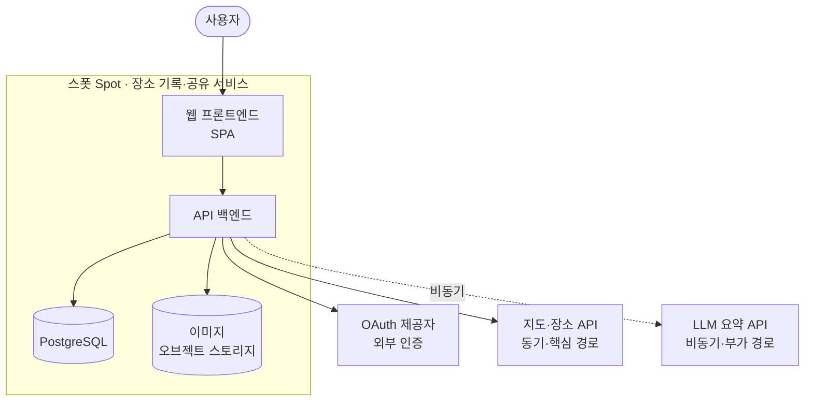

아키텍처 정의서는 두 가지 방식으로 죽는다. 하나는 화석이 되어서, 하나는 거짓말이 되어서.

대부분의 **아키텍처 정의서(Architecture Definition Document)** 는 둘 중 하나의 운명을 맞습니다. 어느 쪽이든, 처음 의도했던 "시스템을 설명하는 문서"라는 자리에서는 이미 내려와 있습니다. 이 시리즈는 그 두 죽음에 대해 다룹니다.

---

## 첫 번째 죽음: 화석

SI 납품 산출물로 쓰인 정의서를 떠올려 봅니다. 이 문서는 제출되는 순간 시점이 고정됩니다. 검수가 끝나고 나면 열어보는 사람이 없습니다. 시스템은 그 뒤로도 계속 바뀌지만, 문서는 제출된 날짜에 그대로 멈춰 있습니다.

이것이 **화석(fossil)** 입니다. 한때 살아있던 것이 특정 시점의 형태로 굳어버린 상태입니다. 화석은 틀리지 않았습니다. 제출 시점에는 분명히 사실이었습니다. 다만 그 시점에 갇혀 있을 뿐입니다.

## 두 번째 죽음: 거짓말

이번엔 팀 내부에서 공유하는 정의서를 떠올려 봅니다. 처음 작성할 때는 정확했습니다. 그런데 코드는 매주 바뀝니다. 컴포넌트가 쪼개지고, 외부 의존성이 추가되고, 데이터 모델이 달라집니다. 문서는 그 속도를 따라가지 못합니다.

어느 순간부터 문서는 시스템을 설명하지 않습니다. 신규 입사자가 그 문서를 믿고 코드를 열면, 문서와 코드가 다릅니다. 이것이 **거짓말(lie)** 입니다. 화석과 달리, 거짓말은 적극적으로 사람을 잘못된 방향으로 이끕니다.


---

## 문제를 다시 정의한다: 독자와 수명

화석과 거짓말은 증상입니다. 원인은 따로 있습니다.

정의서가 실패하는 이유는 보통 "어떤 항목을 빠뜨렸다"가 아닙니다. 애초에 **누가 읽는가** 와 **얼마나 오래 사는가** 를 정하지 않은 채 작성하기 때문입니다. 이 두 가지, 독자(reader)와 수명(lifespan)이 정의서의 성격을 결정합니다.

내부 공유용 문서의 독자는 동료 개발자와 미래의 나입니다. 수명은 짧고, 자주 갱신되어야 의미가 있습니다. 갱신을 멈추는 순간 거짓말이 됩니다.

SI 납품용 문서의 독자는 감리, PMO, 고객 담당자입니다. 수명은 단일 시점입니다. 계약상 갱신될 수 없고, 갱신될 필요도 없습니다. 그래서 화석이 되는 것은 실패가 아니라 예정된 결말입니다.

여기서 핵심이 하나 나옵니다. 두 문서는 같은 시스템을 설명하는데도 정반대의 성질을 가져야 합니다. 살아있어야 하는 문서와, 굳어도 되는 문서는 애초에 다르게 설계되어야 합니다.


---

## 한 시스템, 두 개의 문서

이 시리즈는 한 가지 실험으로 진행됩니다. 같은 시스템 하나를 두 독자에게 설명할 때, 정의서가 어떻게 달라지는지를 끝까지 나란히 따라가는 것입니다.

내부 공유용과 SI 납품용. 두 문서를 처음부터 끝까지 같은 시스템 위에서 작성합니다. 같은 다이어그램이 두 문서에서 어떻게 다르게 다뤄지는지, 같은 설계 결정이 한쪽에서는 트레이드오프 서술로 다른 쪽에서는 요구사항 ID로 어떻게 갈라지는지를 실물로 보여드립니다.

그러려면 두 문서가 함께 설명할 샘플 시스템이 필요합니다.

### 샘플 시스템: 스폿(Spot)

사용자가 다녀온 장소를 사진과 함께 기록하고, 다른 사람과 공유하는 서비스를 가정합니다. 이름은 **스폿(Spot)** 이라 부르겠습니다. 구성은 다음과 같습니다.

- **웹 프론트엔드**: 단일 페이지 애플리케이션(SPA)
- **API 백엔드**: 클라이언트 요청을 받아 비즈니스 로직을 처리. 모듈러 모놀리스로 시작
- **데이터 저장소**: PostgreSQL(구조화 데이터) + 오브젝트 스토리지(이미지)
- **지도·장소 API**: 동기 호출이고 핵심 경로(critical path)에 있습니다. 죽으면 장소 검색이 마비됩니다
- **LLM 요약 API**: 비동기로 호출되는 부가 기능입니다. 죽어도 본 기능은 살아 있습니다
- **외부 인증**: OAuth 제공자를 통한 로그인



<details>
<summary>Mermaid 소스 코드</summary>

```text
flowchart TB
    user([사용자])
    subgraph system[스폿 Spot · 장소 기록·공유 서비스]
        fe[웹 프론트엔드<br/>SPA]
        be[API 백엔드]
        db[(PostgreSQL)]
        obj[(이미지<br/>오브젝트 스토리지)]
    end
    oauth[OAuth 제공자<br/>외부 인증]
    maps[지도·장소 API<br/>동기·핵심 경로]
    llm[LLM 요약 API<br/>비동기·부가 경로]

    user --> fe
    fe --> be
    be --> db
    be --> obj
    be --> oauth
    be --> maps
    be -. 비동기 .-> llm
```

</details>

이렇게 성격이 다른 의존성을 일부러 섞어 둔 것은, 뒤에서 ADR과 횡단 관심사를 설명할 때 쓸 재료를 시스템 안에 미리 심어둔 것입니다. 동기·핵심 경로인 지도 API는 서킷 브레이커와 캐싱을, 비동기·부가 경로인 LLM API는 큐와 재시도를 부릅니다. 외부 인증을 OAuth로 둔 것도 인증·인가를 설명할 거리를 마련하기 위해서입니다.

---

## 이 시리즈의 지도

여덟 편에 걸쳐 두 문서를 함께 완성합니다. 가운데 여섯 편은 같은 리듬을 반복합니다. 이론을 깔고, 샘플 시스템에 적용하고, 두 문서가 그것을 어떻게 다르게 담는지 대조합니다.


이 시리즈가 끝나면 두 가지 결과물이 남습니다. 다운로드 가능한 완성본 두 종(내부용 정의서, 납품용 정의서)과, 자신만의 정의서를 설계할 기준틀입니다. 각 편은 완성본의 발췌를 보여주는 방식으로 진행됩니다.

### 이 시리즈에서 다룰 것들

- **[ep.01](/arch-doc-ep-01) 표준 지형도** — 하나의 그림으로는 왜 부족한지. ISO/IEC/IEEE 42010, arc42, C4, ADR을 한자리에 펼칩니다.
- **[ep.02](/arch-doc-ep-02) 품질 속성과 드라이버** — 구조를 결정하는 것은 기능이 아니라 품질 속성과 제약입니다. 스폿에서 드라이버를 도출합니다.
- **[ep.03](/arch-doc-ep-03) 뷰와 C4** — 논리·프로세스·데이터·배포 뷰, 그리고 C4 네 단계. 같은 시스템을 관점별로 나눠 그립니다.
- **[ep.04](/arch-doc-ep-04) ADR** — 맥락, 결정, 대안, 트레이드오프. 내부용 문서의 심장이자 납품용에서 가장 다르게 다뤄지는 부분입니다.
- **[ep.05](/arch-doc-ep-05) 횡단 관심사** — 보안, 인증·인가, 관측성, 에러 처리처럼 여러 컴포넌트에 걸치는 정책을 모읍니다.
- **[ep.06](/arch-doc-ep-06) 내부용 완성** — 첫 번째 죽음, 거짓말 문제를 닫습니다. 거짓말할 수 없는 구조로 문서를 설계합니다.
- **[ep.07](/arch-doc-ep-07) 납품용 변환** — 두 번째 죽음, 화석 문제를 닫습니다. 살릴 수 없는 문서를 쓸모 있게 두는 법입니다.

두 문제는 정반대 방향으로 풀립니다. 거짓말은 문서를 살려서 풀고, 화석은 죽음을 인정해서 풉니다. 마지막 편에서 이 대칭으로 시리즈를 닫습니다.

### 시리즈 전체 목차

- [ep.00 - 아키텍처 정의서는 왜 화석이 되거나 거짓말이 되는가](/arch-doc-ep-00)
- [ep.01 - 아키텍처 문서의 표준 지형도](/arch-doc-ep-01)
- [ep.02 - 요구사항에서 시작하기, 품질 속성과 드라이버](/arch-doc-ep-02)
- [ep.03 - 뷰를 그리다, C4와 4+1](/arch-doc-ep-03)
- [ep.04 - 결정을 남기다, ADR](/arch-doc-ep-04)
- [ep.05 - 흩어진 정책을 모으다, 횡단 관심사](/arch-doc-ep-05)
- [ep.06 - 내부 공유용 정의서, 거짓말하지 않는 문서 만들기](/arch-doc-ep-06)
- [ep.07 - SI 납품용으로 변환하기, 화석을 인정하는 문서 만들기](/arch-doc-ep-07)

---

## 참고 자료

- ISO/IEC/IEEE 42010. *Systems and software engineering — Architecture description.*
- arc42. *arc42 Documentation Template.* https://arc42.org
- Simon Brown. *The C4 model for visualising software architecture.* https://c4model.com
- Michael Nygard. (2011). *Documenting Architecture Decisions.*

---

## 다음 편 예고

> [ep.01 - 아키텍처 문서의 표준 지형도](/arch-doc-ep-01)

하나의 그림으로는 왜 시스템을 다 설명할 수 없을까요. 42010이 말하는 관점과 이해관계자, arc42의 12개 섹션, C4 모델, 그리고 ADR까지. 다음 편에서는 이 시리즈가 계속 꺼내 쓸 도구 상자를 먼저 펼쳐 놓습니다.
