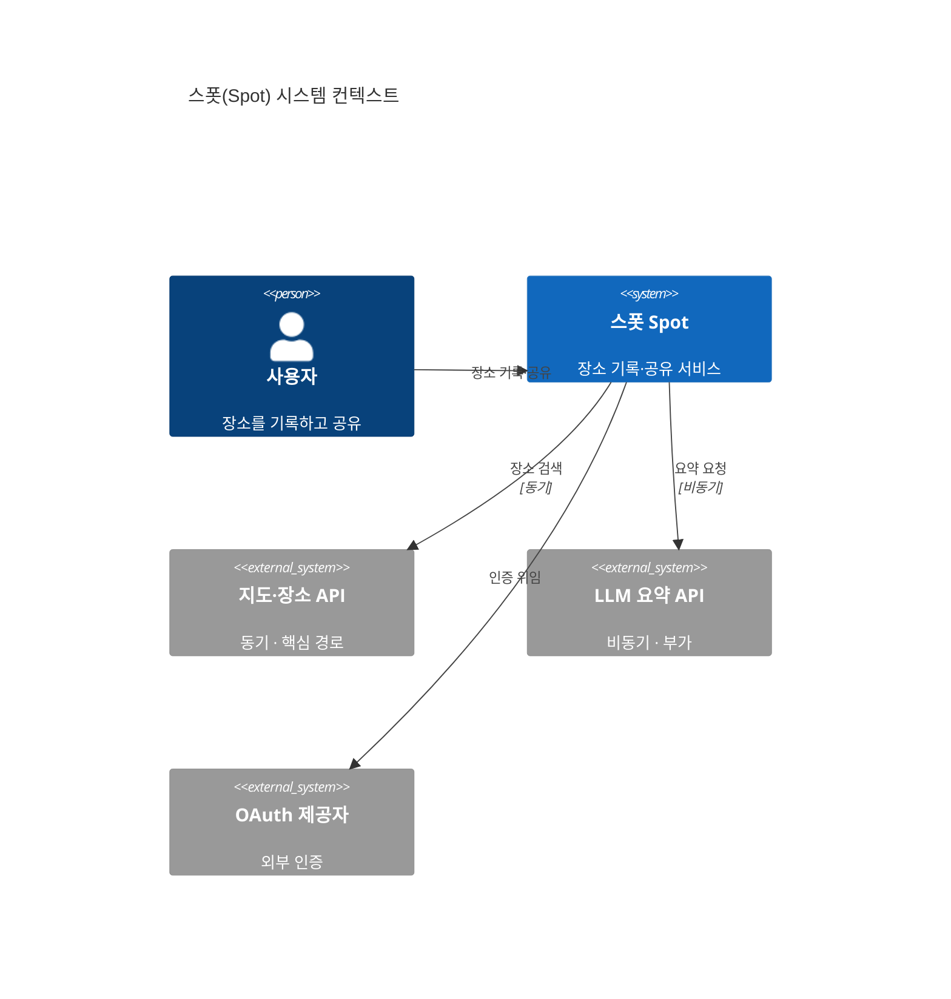

좋은 아키텍처 문서는 한 장의 그림이 아니다. 서로 다른 질문에 답하는 여러 장의 묶음이다.

지난 편에서 정의서는 화석이 되거나 거짓말이 된다고 했습니다. 이번 편은 그 문서를 실제로 짜는 데 쓰는 도구들을 살펴봅니다. 어떤 도구가 어떤 역할을 맡는지 보고, 손에 잡고 써봅시다.

---

## 하나의 그림으로는 부족하다

아키텍처를 한 장에 다 담으려는 시도는 대부분 실패합니다. 이유는 단순합니다. 같은 시스템을 보는 사람이 여럿이고, 각자 보고 싶은 것이 다르기 때문입니다.


기획자는 시스템이 무엇과 연결되는지를 봅니다. 운영자는 어디에 배포되는지를 봅니다. 개발자는 모듈이 어떻게 나뉘는지를 봅니다. 보안 담당자는 데이터가 어디로 흐르는지를 봅니다.

여기서 **관점(viewpoint)** 과 **뷰(view)** 라는 개념이 나옵니다. 관점은 "어떤 관심사를 어떤 규칙으로 그릴 것인가"라는 틀이고, 뷰는 그 틀로 실제 시스템을 그린 결과물입니다. 하나의 시스템은 여러 뷰로 그려지고, 정의서는 그 뷰들의 묶음입니다.

---

## 네 개의 도구, 네 개의 역할

아키텍처 문서를 다루는 표준과 관행은 많지만, 실무에서 반복해 쓰는 것은 네 가지입니다. 서로 경쟁하는 것이 아니라 층위가 다릅니다.

| 도구 | 무엇을 정하나 | 정의서에서의 역할 |
|---|---|---|
| **ISO/IEC/IEEE 42010** | 관점·이해관계자·관심사의 관계 | 문서가 답해야 할 질문의 틀 |
| **arc42** | 문서의 12개 섹션 골격 | 목차 템플릿 |
| **C4 모델** | 추상화 줌 레벨과 표기법 | 다이어그램을 그리는 법 |
| **ADR** | 개별 결정의 기록 형식 | 결정의 로그 |

42010이 "무엇을 답해야 하는가"라면, arc42는 "어디에 적는가", C4는 "그림을 어떻게 그리는가", ADR은 "결정을 어떻게 남기는가"입니다. 네 가지를 겹쳐 쓰면 빈틈이 줄어듭니다.

---

## 42010: 질문의 틀

**ISO/IEC/IEEE 42010** 은 아키텍처를 어떻게 기술할 것인가를 다루는 국제 표준입니다. 구체적인 다이어그램 양식을 주지는 않습니다. 대신 관계를 정의합니다.

핵심 골격은 이렇습니다. 시스템에는 여러 **이해관계자(stakeholder)** 가 있고, 각자 **관심사(concern)** 를 가집니다. 관심사는 **관점(viewpoint)** 으로 정리되고, 관점은 실제 **뷰(view)** 로 그려집니다. 그리고 결정의 근거는 따로 기록됩니다.

이 표준을 외울 필요는 없습니다. 다만 한 문장은 가져갈 만합니다. 모든 뷰는 누군가의 관심사에 답하기 위해 존재합니다. 답할 이해관계자가 없는 다이어그램은 장식입니다. 이 기준이 다음 편부터 "이 그림을 왜 그리는가"를 묻는 잣대가 됩니다.

---

## arc42: 문서의 골격

**arc42** 는 아키텍처 문서를 12개 섹션으로 나눈 템플릿입니다. 빈 종이 앞에서 막막할 때, 채워야 할 칸을 미리 정해 줍니다.


12개를 다 채워야 하는 것은 아닙니다. 그러나 어느 칸을 비울지는 의식적으로 정해야 합니다. 위 지도에서 색 막대가 붙은 칸이 이 시리즈가 본격적으로 다루는 섹션입니다. 품질 요구사항([ep.02](/arch-doc-ep-02)), 뷰([ep.03](/arch-doc-ep-03)), 결정([ep.04](/arch-doc-ep-04)), 횡단 개념([ep.05](/arch-doc-ep-05))이 정의서의 본체를 이룹니다.

---

## C4: 줌 레벨로 그린다

**C4 모델** 은 Simon Brown이 정리한, 소프트웨어 구조를 네 단계 줌으로 그리는 방법입니다. 지도를 확대하듯 추상화 수준을 한 단계씩 낮춥니다.


네 단계는 각각 답하는 질문이 다릅니다. **컨텍스트(Context)** 는 시스템이 바깥 세계와 어떻게 닿는지, **컨테이너(Container)** 는 어떤 실행 단위로 나뉘는지, **컴포넌트(Component)** 는 한 컨테이너 안이 어떻게 짜였는지, **코드(Code)** 는 실제 구현이 어떤지를 답합니다.

아래는 스폿(Spot)의 컨텍스트 다이어그램을 C4Context 표기로 그린 예시입니다.



<details>
<summary>Mermaid 소스 코드</summary>

```text
C4Context
    title 스폿(Spot) 시스템 컨텍스트
    Person(user, "사용자", "장소를 기록하고 공유")
    System(spot, "스폿 Spot", "장소 기록·공유 서비스")
    System_Ext(maps, "지도·장소 API", "동기 · 핵심 경로")
    System_Ext(llm, "LLM 요약 API", "비동기 · 부가")
    System_Ext(oauth, "OAuth 제공자", "외부 인증")
    Rel(user, spot, "장소 기록·공유")
    Rel(spot, maps, "장소 검색", "동기")
    Rel(spot, llm, "요약 요청", "비동기")
    Rel(spot, oauth, "인증 위임")
```

</details>

정의서는 보통 L1과 L2까지를 본문에 둡니다. L3는 복잡한 컨테이너에만, L4는 거의 그리지 않습니다. 코드는 코드 자신이 가장 정확한 문서이기 때문입니다. 참고로 C4의 컨테이너·컴포넌트 다이어그램은 Mermaid에서 렌더가 불안정할 때가 있어, 이 시리즈의 L2·L3 그림은 `flowchart`와 `subgraph`로 대체합니다. 자세한 그림은 [ep.03](/arch-doc-ep-03)에서 그립니다.

---

## ADR: 결정의 로그

**ADR(Architecture Decision Record)** 은 Michael Nygard이 제안한, 하나의 결정을 한 장으로 남기는 형식입니다. 맥락, 결정, 대안, 결과를 짧게 적습니다.

ADR이 중요한 이유는 다이어그램이 답하지 못하는 질문에 답하기 때문입니다. 다이어그램은 "무엇이 어떻게 연결되는가"를 보여주지만, "왜 이렇게 했는가"는 보여주지 못합니다. 스폿이 지도 API를 어댑터로 감싼 이유, LLM 요약을 비동기로 돌린 이유는 그림이 아니라 ADR에 적힙니다. ADR은 [ep.04](/arch-doc-ep-04)에서 본격적으로 다룹니다.

---

## 같은 도구, 다른 사용법

여기서 이 시리즈의 축이 처음 드러납니다. 네 도구는 같지만, 내부 공유용과 SI 납품용은 그것을 다르게 씁니다.

| 도구 | 내부 공유용에서 | SI 납품용에서 |
|---|---|---|
| 42010 관점 | 개발자 관심사 위주로 가볍게 | 모든 이해관계자 관점을 빠짐없이 명시 |
| arc42 섹션 | 결정·횡단 개념을 두껍게, 일부 생략 | 전 섹션을 채움. 누락은 감리 지적 대상 |
| C4 뷰 | L1과 L2를 자주 갱신 | L1부터 L3까지 시점 고정 스냅샷 |
| ADR | 계속 추가되는 살아있는 로그 | 결정 목록 + 근거를 요구사항에 매핑 |

같은 C4 다이어그램이라도 내부용에서는 자주 고쳐 그리는 살아있는 그림이고, 납품용에서는 특정 시점에 박제된 스냅샷입니다. 같은 ADR이라도 내부용에서는 계속 쌓이는 일지이고, 납품용에서는 요구사항 번호에 묶인 목록입니다. 이 차이를 다음 편부터 항목마다 따라가며 보여드립니다.

---

## 참고 자료

- ISO/IEC/IEEE 42010. *Systems and software engineering — Architecture description.*
- arc42. *arc42 Documentation Template.* https://arc42.org
- Simon Brown. *The C4 model for visualising software architecture.* https://c4model.com
- Michael Nygard. (2011). *Documenting Architecture Decisions.*

---

## 다음 편 예고

> [ep.02 - 요구사항에서 시작하기, 품질 속성과 드라이버](/arch-doc-ep-02)

구조를 결정하는 것은 기능 목록이 아닙니다. 가용성, 성능, 보안 같은 품질 속성과 제약입니다. 다음 편에서는 스폿의 요구사항에서 아키텍처 드라이버를 뽑아내고, 그것이 어떻게 구조를 끌고 가는지 봅니다.
