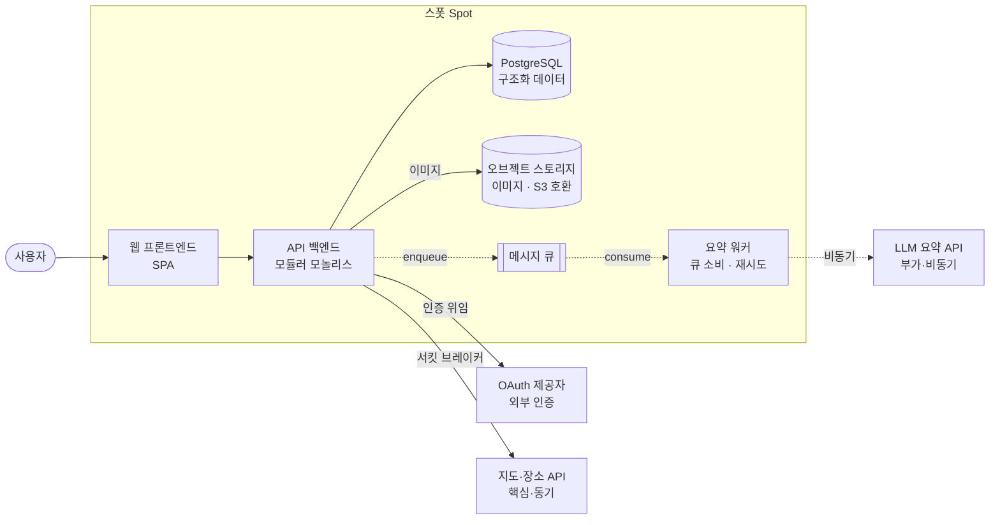
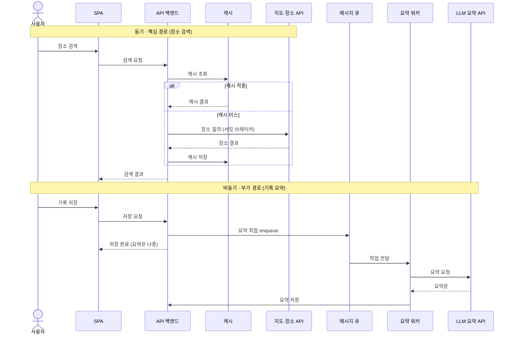
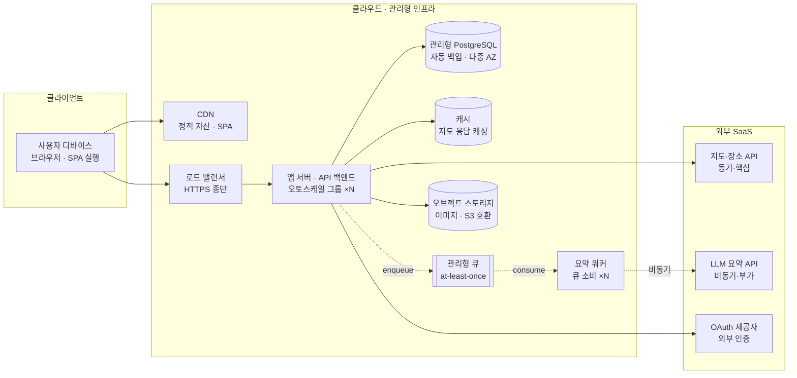

뷰는 시스템을 자르는 칼이다. 어느 방향으로 자르느냐에 따라 전혀 다른 단면이 보인다.

지난 편에서 드라이버를 뽑았습니다. 이제 시스템을 그릴 차례입니다. 그런데 한 장에 다 담으려 하면 누구의 관심사도 제대로 답하지 못합니다. 이번 편은 시스템을 여러 뷰로 나눠 그리는 법을 다룹니다.

---

## 하나의 시스템, 여러 뷰

여러 뷰로 나누는 고전적인 틀이 Philippe Kruchten의 **4+1 뷰 모델** 입니다. 시스템을 네 관점에서 그리고, 가운데에 시나리오를 두어 네 뷰를 묶습니다.


4+1은 무엇을 그릴지를 정해주고, **C4 모델** 은 그중 구조 부분을 어떤 줌 레벨로 그릴지를 정해줍니다. 둘은 경쟁하지 않습니다. 4+1의 논리·개발 뷰를 C4의 컨테이너·컴포넌트 다이어그램으로 그리고, 프로세스 뷰는 런타임 다이어그램으로, 물리 뷰는 배포 다이어그램으로 그리면 자연스럽게 맞물립니다.

---

## 컨테이너 다이어그램: 스폿을 펼치다

가장 자주 쓰는 그림은 C4의 L2 컨테이너 뷰입니다. 시스템 경계 안에 어떤 실행 단위가 있고, 그것이 외부와 어떻게 닿는지를 보여줍니다.




<details>
<summary>Mermaid 소스 코드</summary>

```text
flowchart LR
    user([사용자])
    oauth[OAuth 제공자<br/>외부 인증]
    maps[지도·장소 API<br/>핵심·동기]
    llm[LLM 요약 API<br/>부가·비동기]

    subgraph spot[스폿 Spot]
        fe[웹 프론트엔드<br/>SPA]
        be[API 백엔드<br/>모듈러 모놀리스]
        db[(PostgreSQL<br/>구조화 데이터)]
        obj[(오브젝트 스토리지<br/>이미지 · S3 호환)]
        q[[메시지 큐]]
        worker[요약 워커<br/>큐 소비 · 재시도]
    end

    user --> fe
    fe --> be
    be --> db
    be -->|이미지| obj
    be -->|서킷 브레이커| maps
    be -->|인증 위임| oauth
    be -. enqueue .-> q
    q -. consume .-> worker
    worker -. 비동기 .-> llm
```

</details>

실선은 동기 호출(핵심 경로), 점선은 비동기 처리(부가 경로)입니다.

이 한 장에 지난 편의 드라이버가 모두 흔적으로 남아 있습니다. 지도 API로 가는 동기 화살표에는 서킷 브레이커가 붙어 있고, LLM API는 큐와 워커를 거쳐 점선으로만 닿습니다. 같은 외부 API인데 연결 방식이 다른 이유가 그림에 그대로 보입니다.

---

## 런타임 다이어그램: 두 경로가 갈라지는 순간

컨테이너 뷰가 정적인 구조라면, 런타임 뷰는 시간 위에서 무슨 일이 벌어지는지를 보여줍니다. 스폿에서 가장 중요한 두 흐름, 동기 검색과 비동기 요약을 한 시퀀스로 그립니다.



<details>
<summary>Mermaid 소스 코드</summary>

```text
sequenceDiagram
    actor U as 사용자
    participant FE as SPA
    participant API as API 백엔드
    participant Cache as 캐시
    participant Maps as 지도·장소 API
    participant Q as 메시지 큐
    participant W as 요약 워커
    participant LLM as LLM 요약 API

    Note over U,Maps: 동기 · 핵심 경로 (장소 검색)
    U->>FE: 장소 검색
    FE->>API: 검색 요청
    API->>Cache: 캐시 조회
    alt 캐시 적중
        Cache-->>API: 캐시 결과
    else 캐시 미스
        API->>Maps: 장소 질의 (서킷 브레이커)
        Maps-->>API: 장소 결과
        API->>Cache: 캐시 저장
    end
    API-->>FE: 검색 결과

    Note over U,LLM: 비동기 · 부가 경로 (기록 요약)
    U->>FE: 기록 저장
    FE->>API: 저장 요청
    API->>Q: 요약 작업 enqueue
    API-->>FE: 저장 완료 (요약은 나중)
    Q->>W: 작업 전달
    W->>LLM: 요약 요청
    LLM-->>W: 요약문
    W->>API: 요약 저장
```

</details>

위쪽 흐름에서 사용자는 응답을 기다립니다. 그래서 캐시로 빠르게 답하고, 외부 API 호출은 서킷 브레이커로 감쌉니다. 아래쪽 흐름에서 사용자는 저장 완료만 받고 떠납니다. 요약은 큐에 들어가 워커가 나중에 처리합니다. LLM API가 느리거나 죽어도 사용자는 그것을 느끼지 못합니다. 같은 시스템 안에서 사용자의 대기 여부가 두 경로의 설계를 갈라놓습니다.

---

## 배포 다이어그램: 코드가 어디서 도는가

마지막은 물리 뷰입니다. 위의 컨테이너들이 실제로 어떤 인프라 위에 올라가는지를 보여줍니다.

![스폿의 배포 뷰 다이어그램. 세 영역으로 나뉜다. 왼쪽 클라이언트 영역에는 사용자 디바이스 안에 브라우저(SPA 실행)가 있다. 가운데 클라우드·관리형 인프라 영역에는 CDN(정적 자산), 로드 밸런서(HTTPS 종단), 앱 서버·API 백엔드(오토스케일 그룹, x N), 요약 워커(큐 소비, x N), 관리형 PostgreSQL(자동 백업·다중 AZ), 관리형 큐(at-least-once), 오브젝트 스토리지(이미지 S3 호환), 캐시(지도 응답 캐싱)가 있다. 오른쪽 외부 SaaS 영역에는 지도·장소 API(동기·핵심), LLM 요약 API(비동기·부가), OAuth 제공자(외부 인증)가 있다. 디바이스는 CDN과 로드 밸런서로 연결되고, 로드 밸런서는 앱 서버로, 앱 서버는 PostgreSQL·캐시·오브젝트 스토리지·지도 API·OAuth로, 큐를 통해 워커로 이어지며 워커는 LLM API로 연결된다. 하단 설명은 확장 단위 x N과 관리형 표시가 확장성과 운영 부담 위임이라는 드라이버가 물리 배치에 남긴 흔적이라고 말한다.](adoc-03-03-deployment-view.svg)



<details>
<summary>Mermaid 소스 코드</summary>

```text
flowchart LR
    subgraph client[클라이언트]
        device[사용자 디바이스<br/>브라우저 · SPA 실행]
    end

    subgraph cloud[클라우드 · 관리형 인프라]
        cdn[CDN<br/>정적 자산 · SPA]
        lb[로드 밸런서<br/>HTTPS 종단]
        app[앱 서버 · API 백엔드<br/>오토스케일 그룹 ×N]
        worker[요약 워커<br/>큐 소비 ×N]
        db[(관리형 PostgreSQL<br/>자동 백업 · 다중 AZ)]
        cache[(캐시<br/>지도 응답 캐싱)]
        q[[관리형 큐<br/>at-least-once]]
        obj[(오브젝트 스토리지<br/>이미지 · S3 호환)]
    end

    subgraph saas[외부 SaaS]
        maps[지도·장소 API<br/>동기·핵심]
        llm[LLM 요약 API<br/>비동기·부가]
        oauth[OAuth 제공자<br/>외부 인증]
    end

    device --> cdn
    device --> lb
    lb --> app
    app --> db
    app --> cache
    app --> obj
    app --> maps
    app --> oauth
    app -. enqueue .-> q
    q -. consume .-> worker
    worker -. 비동기 .-> llm
```

</details>

배포 뷰에는 드라이버가 또 다른 모습으로 나타납니다. 앱 서버와 워커에 붙은 x N은 확장성 드라이버의 결과이고, 데이터 저장소에 붙은 관리형이라는 표시는 운영 부담을 벤더에 위임한 결정의 흔적입니다.

---

## 두 문서에서의 뷰

같은 뷰를 그려도 두 문서는 다르게 싣습니다.

| | 내부 공유용 | SI 납품용 |
|---|---|---|
| 포함 레벨 | L1 컨텍스트 + L2 컨테이너 중심 | L1 + L2 + L3 컴포넌트까지 |
| 갱신 | 구조가 바뀌면 그때그때 다시 그림 | 특정 시점 스냅샷으로 고정 |
| 다이어그램 출처 | 가능하면 코드·IaC에서 생성 | 제출용으로 정돈해 손으로 고정 |
| 4+1 범위 | 논리·프로세스 위주 | 논리·프로세스·개발·물리 전부 |

내부용에서 다이어그램은 살아 있어야 합니다. 그래서 가능하면 코드나 인프라 정의에서 자동 생성해, 손으로 그린 그림과 실제가 어긋나는 일을 줄입니다. 납품용에서 다이어그램은 제출 시점의 스냅샷입니다. 깔끔하게 정돈하는 것이 미덕이고, 그 시점 이후로는 고정됩니다. 같은 컨테이너 뷰가 한쪽에서는 갱신 대상이고 다른 쪽에서는 박제 대상입니다.

---

## 참고 자료

- Philippe Kruchten. (1995). *Architectural Blueprints — The "4+1" View Model of Software Architecture.*
- Simon Brown. *The C4 model for visualising software architecture.* https://c4model.com
- arc42. *arc42 Documentation Template.* https://arc42.org

---

## 다음 편 예고

> [ep.04 - 결정을 남기다: ADR](/arch-doc-ep-04/)

다이어그램은 무엇이 어떻게 연결되는지는 보여주지만, 왜 그렇게 했는지는 보여주지 못합니다. 그 빈자리를 채우는 것이 ADR입니다. 다음 편에서는 스폿의 결정들을 ADR로 남기고, 그것이 내부용의 심장이자 납품용에서 가장 다르게 다뤄지는 부분임을 봅니다.
