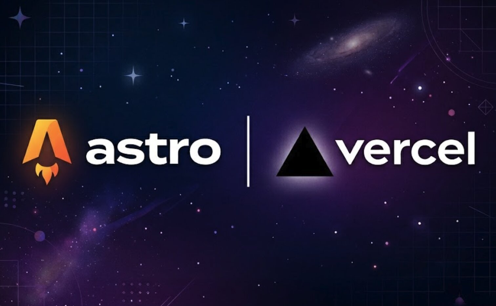

플랫폼에 종속되지 않고, 내 도메인에서 글을 온전히 소유할 수 있는 기술 블로그를 구축하려고 합니다.

주로 기술이나 디자인에 관한 실무적·교육적 콘텐츠를 다룰 예정이며, 특히 코드 블록과 인터랙티브 데모를 자유롭게 삽입할 수 있는 환경이 필요합니다.
결과적으로 **Astro + Vercel** 조합의 기술 스택을 선정하였습니다.

이 글에서는 기술 스택을 선정하기까지의 과정과 최초 구현 방법을 정리했습니다.

---

## 요구사항 정리

### 콘텐츠

- 마크다운 기반 글 작성 (위지윅 에디터 불필요)
- 이미지를 글과 함께 관리
- 코드 하이라이팅 기본 지원

### 기능

- 댓글 기능 (별도 서버 없이)
- 방문자 수 확인
- React/Vue 등 프론트엔드 컴포넌트를 글 안에 삽입 가능

### 운영

- 정적 페이지 빌드 (서버 사이드 로직 없음)
- GitHub 버전 관리 + push 시 자동 배포
- 장애 포인트와 부하 최소화
- 커스텀 도메인 + SSL 자동 적용

### SEO (최우선)

- 검색 엔진 크롤러가 JS 없이 콘텐츠를 읽을 수 있을 것
- sitemap.xml, RSS 피드, Open Graph 메타태그 자동 생성
- 페이지별 canonical URL, description, OG 이미지 개별 제어

---

## 기술 스택 후보 비교

정적 사이트 생성기(SSG)를 기준으로 세 가지 조합을 검토했습니다.

### Hugo + Cloudflare Pages

Go 기반 SSG로 빌드 속도가 압도적입니다. 수백 개의 글도 1초 안에 빌드되며, Cloudflare Pages에 올리면 글로벌 CDN과 무료 SSL이 한 번에 해결됩니다.

다만 인터랙티브 컴포넌트를 넣으려면 별도의 JS 빌드 파이프라인을 구성하고 shortcode로 연결해야 합니다. React 컴포넌트를 글 안에 자연스럽게 끼워 넣기에는 구조가 어색합니다. Cloudflare Analytics를 사용하려면 별도 가입과 DNS 이전도 필요하여 관리 포인트가 늘어납니다.

### Eleventy(11ty) + GitHub Pages

설정이 극도로 단순하고 프레임워크 종속이 거의 없습니다. GitHub Pages에 서빙하면 관리 포인트가 GitHub 하나로 통일됩니다.

하지만 Hugo와 비슷한 문제가 있습니다. 인터랙티브 컴포넌트를 위해 별도 번들러가 필요하고, 이미지 최적화도 플러그인을 직접 구성해야 합니다. GitHub Pages는 CDN 성능이 Cloudflare나 Vercel 대비 약간 떨어지며, 커스텀 도메인 HTTPS 설정도 번거롭습니다.

### Astro + Vercel

기본 출력이 제로 JS 정적 HTML이면서, 필요한 곳에만 React나 Vue 컴포넌트를 섬(island)처럼 끼워 넣을 수 있습니다. Vercel에 서빙하면 GitHub push 시 자동 빌드, Edge CDN, SSL 자동 발급이 한 번에 됩니다.


---

## 최종 기술 스택

### [결론] Astro + Vercel로 결정했습니다.

결정적인 차이는 **인터랙티브 컴포넌트와 SEO를 동시에 만족하는 구조**입니다.

Hugo나 Eleventy에서 React 컴포넌트를 쓰려면 별도의 빌드 파이프라인을 구성하고 글과 컴포넌트의 연결 방식을 직접 설계해야 합니다. Astro는 이것이 프레임워크 레벨에서 해결되어 있습니다. `.mdx` 파일 안에서 `import`하고 쓰면 끝이며, 해당 컴포넌트 외의 영역은 정적 HTML로 나가니 SEO에 영향을 주지 않습니다.

호스팅도 마찬가지입니다. Vercel 하나로 빌드, CDN, SSL, 분석까지 해결되므로 관리 포인트가 **GitHub + Vercel** 두 개로 끝납니다.

| 영역 | 기술 | 선정 이유 |
|------|------|-----------|
| 정적 사이트 생성 | Astro | 제로 JS 정적 HTML 기본 출력. Islands Architecture로 필요한 곳만 JS hydrate하여 성능과 SEO 동시 확보 |
| 인터랙티브 컴포넌트 | React (Astro Islands) | `client:visible` 디렉티브로 선택적 hydrate. 페이지 전체가 SPA가 되지 않아 SEO 무영향 |
| 콘텐츠 포맷 | Markdown / MDX | 마크다운 기본, 인터랙티브 요소 필요 시 MDX 전환. Content Collections로 frontmatter 타입 체크 및 이미지 경로 검증을 빌드 타임에 처리 |
| 코드 하이라이팅 | Shiki (Astro 내장) | 빌드 타임 HTML 변환으로 클라이언트 JS 제로. 코드 블록이 많아도 성능 부담 없음 |
| SEO | @astrojs/sitemap + @astrojs/rss | sitemap.xml, RSS 피드 자동 생성. 페이지별 canonical URL, OG 메타, Twitter Card 일괄 관리 |
| 이미지 최적화 | astro:assets (내장) | 빌드 시 자동 리사이즈, WebP 변환, lazy loading. 별도 플러그인이나 CDN 없이 동작 |
| 댓글 | giscus | GitHub Discussions 기반으로 별도 DB/서버 불필요. GitHub 계정 인증으로 스팸이 적음 |
| 방문자 분석 | Vercel Analytics | Vercel 대시보드 내에서 활성화. 별도 가입 없이 페이지뷰, Core Web Vitals 확인 |
| 호스팅 / CDN / SSL | Vercel | GitHub push 시 자동 빌드·배포. Edge CDN, 커스텀 도메인 SSL 자동 발급·갱신 |
| 버전 관리 | GitHub (public repo) | 글·코드·설정을 하나의 레포에서 관리. giscus가 public repo를 요구하므로 공개 |
| 스타일링 | SCSS | 네스팅과 변수로 CSS를 구조적으로 관리. `sass` 패키지 설치만으로 별도 설정 없이 동작 |

---

## Astro 소개

### Astro란

Astro는 콘텐츠 중심 웹사이트를 위한 정적 사이트 생성 프레임워크입니다. 2022년 정식 출시 이후 빠르게 성장했으며, 블로그·문서 사이트·마케팅 페이지 등 콘텐츠가 핵심인 사이트에서 강세를 보이고 있습니다.

가장 큰 특징은 **기본 출력이 순수 HTML**이라는 점입니다. React, Vue, Svelte 같은 프레임워크의 컴포넌트를 사용할 수 있지만, 빌드 결과물에는 해당 프레임워크의 런타임 JS가 포함되지 않습니다. 필요한 곳에만 명시적으로 JS를 로드하는 방식입니다.

### Islands Architecture

페이지 전체를 하나의 JS 애플리케이션으로 만드는 SPA 방식과 정반대의 접근입니다. 페이지 대부분은 정적 HTML로 렌더링하고, 인터랙션이 필요한 영역만 독립된 "섬(island)"으로 분리하여 해당 부분만 hydrate합니다.

```astro
---
import InteractiveChart from '../components/InteractiveChart.tsx';
---
<h1>성능 분석 보고서</h1>
<p>이 섹션은 정적 HTML입니다. JS가 없습니다.</p>

<!-- 이 컴포넌트만 브라우저에서 hydrate됩니다 -->
<InteractiveChart client:visible />

<p>이 아래도 역시 정적 HTML입니다.</p>
```

`client:visible`은 컴포넌트가 뷰포트에 들어올 때 JS를 로드하겠다는 의미입니다. 주요 디렉티브는 다음과 같습니다.

| 디렉티브 | 동작 |
|----------|------|
| `client:load` | 페이지 로드 즉시 hydrate |
| `client:idle` | 브라우저가 idle 상태일 때 hydrate |
| `client:visible` | 뷰포트에 들어올 때 hydrate |
| `client:media` | 미디어 쿼리 조건 충족 시 hydrate |
| `client:only` | 서버 렌더링 없이 클라이언트에서만 렌더링 |

기술 블로그에서는 `client:visible`이 가장 적합합니다. 글 하단의 인터랙티브 데모나 코드 플레이그라운드는 사용자가 스크롤하여 도달할 때 로드하면 충분하기 때문입니다.

### Content Collections

Astro의 콘텐츠 관리 시스템입니다. `src/content/` 아래에 마크다운(또는 MDX) 파일을 모아두면 타입 안전한 컬렉션으로 관리됩니다. Astro 5에서는 `glob` 로더를 사용하며, 설정 파일은 `src/content.config.ts`에 위치합니다.

주요 기능은 다음과 같습니다.

- **타입 체크**: frontmatter에 필수 필드가 빠지거나 타입이 맞지 않으면 빌드가 실패합니다. 글이 수십 개가 넘어가도 메타데이터 일관성이 보장됩니다.
- **이미지 경로 검증**: `image()` 스키마로 선언한 필드는 빌드 타임에 파일 존재 여부를 확인합니다. 경로 오타나 누락을 배포 전에 잡을 수 있습니다.
- **쿼리 API**: `getCollection('posts')`로 전체 글 목록을 가져와 정렬, 필터, 페이지네이션을 타입 안전하게 처리할 수 있습니다.

### 이미지 최적화

`astro:assets` 모듈을 통해 빌드 타임 이미지 최적화를 기본 지원합니다. 별도 플러그인이나 외부 CDN 없이 동작합니다.

마크다운에서 상대경로로 이미지를 삽입하면 자동으로 리사이즈, WebP 변환, lazy loading이 적용됩니다.

```md

```

더 세밀한 제어가 필요하면 MDX에서 `<Image>` 컴포넌트를 사용합니다.

```mdx
import { Image } from 'astro:assets';
import diagram from './diagram.png';

<Image src={diagram} alt="아키텍처 다이어그램" width={720} />
```

### SEO 기본 지원

SEO에 필요한 핵심 요소를 공식 인테그레이션으로 제공합니다.

- `@astrojs/sitemap`: 빌드 시 `sitemap.xml` 자동 생성
- `@astrojs/rss`: RSS 피드 생성 함수 제공
- 페이지별 `<head>` 제어: `.astro` 컴포넌트에서 메타태그를 자유롭게 설정

출력이 순수 HTML이므로 검색 엔진 크롤러가 JavaScript를 실행하지 않아도 모든 콘텐츠를 읽을 수 있습니다. SPA 기반 블로그에서 흔히 겪는 "크롤러가 빈 페이지를 인덱싱하는" 문제가 구조적으로 발생하지 않습니다.

---

## Vercel 소개

Vercel은 프론트엔드 배포에 특화된 클라우드 플랫폼입니다. Next.js를 만든 회사이기도 하지만, Astro를 포함한 대부분의 프레임워크를 지원합니다.

개인 블로그 운영 관점에서 Vercel이 해결해주는 영역은 다음과 같습니다.

- **자동 빌드·배포**: GitHub 레포 연결 후 `main` 브랜치에 push하면 자동으로 빌드·배포됩니다. PR 단위의 프리뷰 배포도 생성됩니다.
- **Edge CDN**: 전 세계에 분산된 엣지 노드에서 정적 파일을 서빙하여 글로벌 응답 속도가 빠릅니다.
- **커스텀 도메인 + SSL 자동화**: 대시보드에서 도메인을 입력하고 DNS 레코드를 설정하면 SSL 인증서가 자동 발급·갱신됩니다.
- **Vercel Analytics**: 별도 가입 없이 페이지뷰, 방문자 수, Core Web Vitals를 확인할 수 있습니다. 무료 플랜으로 충분합니다.

---

## 구현

### 프로젝트 구조

```
blog/
├── src/
│   ├── content/
│   │   └── posts/                    ← 마크다운 글 저장
│   │       └── my-first-post/
│   │           ├── index.md          ← 글 본문
│   │           └── cover.jpg         ← 이미지
│   ├── components/
│   │   ├── BaseHead.astro            ← SEO 메타태그
│   │   ├── Header.astro
│   │   ├── Footer.astro
│   │   ├── PostCard.astro            ← 글 목록 카드
│   │   ├── Giscus.astro              ← 댓글
│   │   └── interactive/
│   │       └── CodePlayground.tsx    ← React 인터랙티브 컴포넌트 예시
│   ├── layouts/
│   │   ├── BaseLayout.astro          ← 공통 (head + header + footer)
│   │   └── PostLayout.astro          ← 글 상세 (날짜, 댓글 포함)
│   ├── pages/
│   │   ├── index.astro               ← 홈 (글 목록)
│   │   ├── about.astro
│   │   ├── rss.xml.ts                ← RSS 피드
│   │   └── [slug].astro              ← 동적 글 라우팅
│   └── styles/
│       └── global.scss
├── public/
│   ├── favicon.svg
│   ├── og-default.png                ← 기본 OG 이미지
│   └── robots.txt
├── src/content.config.ts
├── astro.config.mjs
├── tsconfig.json
└── package.json
```

글 하나가 폴더 하나에 대응됩니다. 이미지가 글 바로 옆에 있으므로 상대경로로 참조할 수 있고, 글을 삭제하면 이미지도 함께 삭제됩니다. `[slug].astro`를 `pages/` 바로 아래에 배치하여 `yourdomain.com/my-first-post` 형태의 깔끔한 URL을 사용합니다.

---

### 프로젝트 초기화

```bash
npm create astro@latest blog -- --template minimal
```
설치 마법사로 구동됩니다.
디자인은 추후 직접 입히기 위해 minimal(empty)로 설정했습니다.

인테그레이션 및 의존성 설치:

```bash
cd blog
npx astro add react            # 인터랙티브 컴포넌트
npx astro add sitemap          # sitemap.xml 자동 생성
npx astro add mdx              # MDX 지원
npx astro add vercel           # Vercel 어댑터
npm install @astrojs/rss       # RSS 피드
npm install @vercel/analytics  # Vercel Analytics
npm install -D sass            # SCSS 지원
```

설치 후 타입 정의를 생성합니다. `astro:content` 같은 가상 모듈은 이 과정을 거쳐야 IDE에서 인식됩니다.

```bash
npx astro sync
```

---

### 설정 파일

#### tsconfig.json

```json
{
  "extends": "astro/tsconfigs/strict",
  "include": [
    ".astro/types.d.ts",
    "**/*"
  ],
  "exclude": [
    "dist"
  ],
  "compilerOptions": {
    "jsx": "react-jsx",
    "jsxImportSource": "react"
  }
}
```

#### astro.config.mjs

```js
// @ts-check
import { defineConfig } from 'astro/config';
import react from '@astrojs/react';
import sitemap from '@astrojs/sitemap';
import mdx from '@astrojs/mdx';
import vercel from '@astrojs/vercel';

// https://astro.build/config
export default defineConfig({
  site: 'https://yourdomain.com',
  output: 'static',
  integrations: [react(), sitemap(), mdx()],
  adapter: vercel({
    webAnalytics: { enabled: true },
  }),
  markdown: {
    shikiConfig: { theme: 'github-dark' },
  },
});
```

- `site`: 커스텀 도메인을 입력합니다. sitemap.xml과 RSS 피드의 URL 생성에 사용됩니다.
- `output: 'static'`: 모든 페이지를 빌드 타임에 HTML로 생성합니다.

#### src/content.config.ts

Astro 5에서는 `type: 'content'` 대신 `glob` 로더를 사용합니다. 설정 파일 위치는 `src/content/config.ts`가 아닌 `src/content.config.ts`입니다.

```ts
import { defineCollection, z } from 'astro:content';
import { glob } from 'astro/loaders';

const posts = defineCollection({
  loader: glob({ pattern: '**/*.{md,mdx}', base: './src/content/posts' }),
  schema: ({ image }) => z.object({
    title: z.string(),
    description: z.string(),
    date: z.date(),
    tags: z.array(z.string()).optional(),
    cover: image().optional(),
    ogImage: image().optional(),
    draft: z.boolean().default(false),
  }),
});

export const collections = { posts };
```

---

### 정적 파일 (public/)

#### public/robots.txt

```txt
User-agent: *
Allow: /

Sitemap: https://yourdomain.com/sitemap-index.xml
```

`favicon.svg`와 `og-default.png`는 직접 준비합니다. OG 이미지 권장 크기는 1200×630px입니다.

---

### 스타일링

```scss
/* ========================
   Variables
   ======================== */
$color-bg: #ffffff;
$color-text: #1a1a1a;
$color-text-muted: #666666;
$color-primary: #2563eb;
$color-border: #e5e5e5;
$color-code-bg: #f5f5f5;
$content-width: 720px;
$header-height: 60px;

/* ========================
   Reset & Base
   ======================== */
*,
*::before,
*::after {
  margin: 0;
  padding: 0;
  box-sizing: border-box;
}

html {
  font-size: 16px;
  scroll-behavior: smooth;
  -webkit-font-smoothing: antialiased;
}

body {
  font-family: -apple-system, BlinkMacSystemFont, 'Segoe UI', Roboto,
    'Helvetica Neue', Arial, sans-serif;
  color: $color-text;
  background-color: $color-bg;
  line-height: 1.8;
}

a {
  color: $color-primary;
  text-decoration: none;

  &:hover {
    text-decoration: underline;
  }
}

img {
  max-width: 100%;
  height: auto;
  display: block;
}

/* ========================
   Layout
   ======================== */
main {
  max-width: $content-width;
  margin: 0 auto;
  padding: 2rem 1.5rem;
}

/* ========================
   Site Header
   ======================== */
.site-header {
  height: $header-height;
  border-bottom: 1px solid $color-border;

  nav {
    max-width: $content-width;
    margin: 0 auto;
    padding: 0 1.5rem;
    height: 100%;
    display: flex;
    align-items: center;
    justify-content: space-between;
  }

  .site-title {
    font-size: 1.125rem;
    font-weight: 700;
    color: $color-text;

    &:hover {
      text-decoration: none;
    }
  }

  .nav-links {
    display: flex;
    gap: 1.5rem;

    a {
      color: $color-text-muted;
      font-size: 0.875rem;

      &:hover {
        color: $color-text;
        text-decoration: none;
      }
    }
  }
}

/* ========================
   Site Footer
   ======================== */
.site-footer {
  max-width: $content-width;
  margin: 0 auto;
  padding: 2rem 1.5rem;
  border-top: 1px solid $color-border;
  color: $color-text-muted;
  font-size: 0.8125rem;
  text-align: center;
}

/* ========================
   Post Card (글 목록)
   ======================== */
.post-list {
  display: flex;
  flex-direction: column;
  gap: 2rem;
}

.post-card {
  a {
    color: inherit;

    &:hover {
      text-decoration: none;
    }
  }

  .post-card-title {
    font-size: 1.25rem;
    font-weight: 600;
    margin-bottom: 0.25rem;
  }

  .post-card-date {
    font-size: 0.8125rem;
    color: $color-text-muted;
    margin-bottom: 0.5rem;
  }

  .post-card-description {
    font-size: 0.9375rem;
    color: $color-text-muted;
    line-height: 1.6;
  }

  &:hover .post-card-title {
    color: $color-primary;
  }
}

/* ========================
   Post Detail (글 상세)
   ======================== */
.post-header {
  margin-bottom: 2.5rem;

  h1 {
    font-size: 2rem;
    font-weight: 700;
    line-height: 1.3;
    margin-bottom: 0.5rem;
  }

  time {
    font-size: 0.875rem;
    color: $color-text-muted;
  }
}

.post-content {
  h2 {
    font-size: 1.5rem;
    font-weight: 600;
    margin-top: 3rem;
    margin-bottom: 1rem;
    padding-bottom: 0.25rem;
    border-bottom: 1px solid $color-border;
  }

  h3 {
    font-size: 1.25rem;
    font-weight: 600;
    margin-top: 2rem;
    margin-bottom: 0.75rem;
  }

  p {
    margin-bottom: 1.25rem;
  }

  ul, ol {
    margin-bottom: 1.25rem;
    padding-left: 1.5rem;
  }

  li {
    margin-bottom: 0.375rem;
  }

  blockquote {
    border-left: 3px solid $color-primary;
    padding-left: 1rem;
    margin: 1.5rem 0;
    color: $color-text-muted;
    font-style: italic;
  }

  code {
    font-family: 'SF Mono', 'Fira Code', 'Fira Mono', Menlo, monospace;
    font-size: 0.875em;
    background: $color-code-bg;
    padding: 0.15em 0.35em;
    border-radius: 3px;
  }

  pre {
    margin: 1.5rem 0;
    padding: 1.25rem;
    border-radius: 8px;
    overflow-x: auto;
    font-size: 0.875rem;
    line-height: 1.6;

    code {
      background: none;
      padding: 0;
      border-radius: 0;
    }
  }

  img {
    margin: 1.5rem 0;
    border-radius: 8px;
  }

  table {
    width: 100%;
    border-collapse: collapse;
    margin: 1.5rem 0;
    font-size: 0.9375rem;

    th, td {
      padding: 0.625rem 0.75rem;
      border: 1px solid $color-border;
      text-align: left;
    }

    th {
      background: $color-code-bg;
      font-weight: 600;
    }
  }
}

/* ========================
   Giscus (댓글)
   ======================== */
.giscus-wrapper {
  margin-top: 4rem;
  padding-top: 2rem;
  border-top: 1px solid $color-border;
}

/* ========================
   About Page
   ======================== */
.about-content {
  h1 {
    font-size: 2rem;
    font-weight: 700;
    margin-bottom: 1.5rem;
  }

  p {
    margin-bottom: 1.25rem;
    line-height: 1.8;
  }
}

/* ========================
   Interactive Component
   ======================== */
.code-playground {
  border: 1px solid $color-border;
  border-radius: 8px;
  padding: 1.5rem;
  margin: 1.5rem 0;

  h3 {
    font-size: 0.875rem;
    font-weight: 600;
    margin-bottom: 1rem;
    color: $color-text-muted;
    text-transform: uppercase;
    letter-spacing: 0.05em;
  }

  textarea {
    width: 100%;
    min-height: 120px;
    padding: 0.75rem;
    font-family: 'SF Mono', 'Fira Code', monospace;
    font-size: 0.875rem;
    border: 1px solid $color-border;
    border-radius: 4px;
    resize: vertical;
    line-height: 1.6;

    &:focus {
      outline: none;
      border-color: $color-primary;
    }
  }

  button {
    margin-top: 0.75rem;
    padding: 0.5rem 1.25rem;
    background: $color-primary;
    color: #fff;
    border: none;
    border-radius: 4px;
    font-size: 0.875rem;
    cursor: pointer;

    &:hover {
      opacity: 0.9;
    }
  }

  .output {
    margin-top: 1rem;
    padding: 0.75rem;
    background: $color-code-bg;
    border-radius: 4px;
    font-family: 'SF Mono', 'Fira Code', monospace;
    font-size: 0.875rem;
    white-space: pre-wrap;
  }
}
```

---

### 컴포넌트

#### src/components/BaseHead.astro

```astro
---
interface Props {
  title: string;
  description: string;
  ogImage?: string;
}
const { title, description, ogImage = '/og-default.png' } = Astro.props;
const canonicalURL = new URL(Astro.url.pathname, Astro.site);
---
<meta charset="utf-8" />
<meta name="viewport" content="width=device-width, initial-scale=1" />
<link rel="icon" type="image/svg+xml" href="/favicon.svg" />
<link rel="canonical" href={canonicalURL} />
<title>{title}</title>
<meta name="description" content={description} />

<!-- Open Graph -->
<meta property="og:type" content="article" />
<meta property="og:title" content={title} />
<meta property="og:description" content={description} />
<meta property="og:image" content={new URL(ogImage, Astro.site)} />
<meta property="og:url" content={canonicalURL} />

<!-- Twitter Card -->
<meta name="twitter:card" content="summary_large_image" />
<meta name="twitter:title" content={title} />
<meta name="twitter:description" content={description} />
<meta name="twitter:image" content={new URL(ogImage, Astro.site)} />
```

모든 페이지가 이 컴포넌트를 통해 메타태그를 생성합니다. canonical URL로 중복 콘텐츠 문제를 방지하고, OG 태그로 SNS 공유 시 미리보기 카드를 제어합니다.

#### src/components/Header.astro

```astro
---
---
<header class="site-header">
  <nav>
    <a href="/" class="site-title">블로그 이름</a>
    <div class="nav-links">
      <a href="/about">About</a>
      <a href="/rss.xml">RSS</a>
    </div>
  </nav>
</header>
```

#### src/components/Footer.astro

```astro
---
---
<footer class="site-footer">
  <p>&copy; {new Date().getFullYear()} 블로그 이름. All rights reserved.</p>
</footer>
```

#### src/components/PostCard.astro

```astro
---
interface Props {
  title: string;
  description: string;
  date: Date;
  slug: string;
}
const { title, description, date, slug } = Astro.props;
---
<article class="post-card">
  <a href={`/${slug}/`}>
    <h2 class="post-card-title">{title}</h2>
    <time class="post-card-date" datetime={date.toISOString()}>
      {date.toLocaleDateString('ko-KR', { year: 'numeric', month: 'long', day: 'numeric' })}
    </time>
    <p class="post-card-description">{description}</p>
  </a>
</article>
```

홈 페이지에서 각 글을 카드 형태로 렌더링하는 컴포넌트입니다.

#### src/components/Giscus.astro

```astro
---
---
<section class="giscus-wrapper">
  <script
    src="https://giscus.app/client.js"
    data-repo="your-username/blog"
    data-repo-id="YOUR_REPO_ID"
    data-category="Announcements"
    data-category-id="YOUR_CATEGORY_ID"
    data-mapping="pathname"
    data-strict="0"
    data-reactions-enabled="1"
    data-emit-metadata="0"
    data-input-position="top"
    data-theme="preferred_color_scheme"
    data-lang="ko"
    crossorigin="anonymous"
    async
  ></script>
</section>
```

사용 전 GitHub 레포의 Settings에서 Discussions를 활성화하고, [giscus.app](https://giscus.app)에서 설정값을 생성해야 합니다. `data-mapping="pathname"`으로 각 글의 URL 경로 기준으로 Discussion 스레드가 매핑됩니다. giscus는 public repo를 요구하며, 이것이 레포를 public으로 유지해야 하는 이유이기도 합니다.

이 과정에서 repo에 Giscus 앱을 설치합니다.

Discussions에서 Category를 댓글 전용으로 새로 만들 때에는, 다른 사용자가 마음대로 항목을 만들지 않게끔 Announcements 유형의 카테고리를 권장합니다.

#### src/components/interactive/CodePlayground.tsx

```tsx
import { useState } from 'react';

export default function CodePlayground() {
  const [code, setCode] = useState('console.log("Hello, World!");');
  const [output, setOutput] = useState('');

  const handleRun = () => {
    try {
      const logs: string[] = [];
      const mockConsole = {
        log: (...args: unknown[]) => logs.push(args.join(' ')),
      };
      new Function('console', code)(mockConsole);
      setOutput(logs.join('\n'));
    } catch (e) {
      setOutput(`Error: ${(e as Error).message}`);
    }
  };

  return (
    <div className="code-playground">
      <h3>Code Playground</h3>
      <textarea
        value={code}
        onChange={(e) => setCode(e.target.value)}
        spellCheck={false}
      />
      <button onClick={handleRun}>실행</button>
      {output && <div className="output">{output}</div>}
    </div>
  );
}
```

Islands Architecture의 실제 사용 예시입니다. MDX 글에서 `<CodePlayground client:visible />`로 삽입하면 해당 영역만 React로 hydrate됩니다.

---

### 레이아웃

#### src/layouts/BaseLayout.astro

```astro
---
import BaseHead from '../components/BaseHead.astro';
import Header from '../components/Header.astro';
import Footer from '../components/Footer.astro';
import '../styles/global.scss';

interface Props {
  title: string;
  description: string;
  ogImage?: string;
}

const { title, description, ogImage } = Astro.props;
---
<!doctype html>
<html lang="ko">
  <head>
    <BaseHead title={title} description={description} ogImage={ogImage} />
  </head>
  <body>
    <Header />
    <main>
      <slot />
    </main>
    <Footer />
  </body>
</html>
```

모든 페이지의 공통 레이아웃입니다. `<slot />`에 각 페이지의 실제 콘텐츠가 삽입됩니다.

#### src/layouts/PostLayout.astro

```astro
---
import BaseLayout from './BaseLayout.astro';
import Giscus from '../components/Giscus.astro';

interface Props {
  title: string;
  description: string;
  date: Date;
  ogImage?: string;
}

const { title, description, date, ogImage } = Astro.props;
---
<BaseLayout title={title} description={description} ogImage={ogImage}>
  <article>
    <header class="post-header">
      <h1>{title}</h1>
      <time datetime={date.toISOString()}>
        {date.toLocaleDateString('ko-KR', { year: 'numeric', month: 'long', day: 'numeric' })}
      </time>
    </header>
    <div class="post-content">
      <slot />
    </div>
  </article>
  <Giscus />
</BaseLayout>
```

BaseLayout을 확장하여 글 제목, 날짜, 댓글 등 글 전용 요소를 추가합니다.

---

### 페이지

#### src/pages/index.astro

```astro
---
import { getCollection } from 'astro:content';
import BaseLayout from '../layouts/BaseLayout.astro';
import PostCard from '../components/PostCard.astro';

const posts = await getCollection('posts', ({ data }) => !data.draft);
const sortedPosts = posts.sort(
  (a, b) => b.data.date.getTime() - a.data.date.getTime()
);
---
<BaseLayout title="블로그 이름" description="기술과 디자인에 관한 이야기">
  <section class="post-list">
    {sortedPosts.map((post) => (
      <PostCard
        title={post.data.title}
        description={post.data.description}
        date={post.data.date}
        slug={post.id}
      />
    ))}
  </section>
</BaseLayout>
```

전체 글을 날짜 역순으로 정렬하여 카드 형태로 렌더링합니다. `draft: true`인 글은 제외됩니다.

#### src/pages/about.astro

```astro
---
import BaseLayout from '../layouts/BaseLayout.astro';
---
<BaseLayout title="About — 블로그 이름" description="블로그 소개">
  <div class="about-content">
    <h1>About</h1>
    <p>
      기술과 디자인에 관한 실무 경험을 공유하는 블로그입니다.
    </p>
    <p>
      주로 프론트엔드 개발, UX 설계, 그리고 개발 워크플로우에 대해 다룹니다.
    </p>
  </div>
</BaseLayout>
```

#### src/pages/[slug].astro

```astro
---
import { getCollection, render } from 'astro:content';
import PostLayout from '../layouts/PostLayout.astro';

export async function getStaticPaths() {
  const posts = await getCollection('posts', ({ data }) => !data.draft);
  return posts.map((post) => ({
    params: { slug: post.id },
    props: post,
  }));
}

const post = Astro.props;
const { Content } = await render(post);
---
<PostLayout
  title={post.data.title}
  description={post.data.description}
  date={post.data.date}
>
  <Content />
</PostLayout>
```

`getStaticPaths`가 빌드 타임에 모든 글의 경로를 생성합니다. `[slug].astro`가 `pages/` 바로 아래에 있으므로 URL은 `yourdomain.com/my-first-post` 형태가 됩니다.

> **주의**: Astro 5에서는 `post.render()` 메서드 대신 `astro:content`에서 `render` 함수를 import하여 사용합니다. 기존 문서나 예제의 `post.render()` 코드는 Astro 5에서 동작하지 않습니다.

#### src/pages/rss.xml.ts

```ts
import rss from '@astrojs/rss';
import { getCollection } from 'astro:content';

export async function GET(context: { site: string }) {
  const posts = await getCollection('posts', ({ data }) => !data.draft);
  return rss({
    title: '블로그 이름',
    description: '기술과 디자인에 관한 이야기',
    site: context.site,
    items: posts.map((post) => ({
      title: post.data.title,
      description: post.data.description,
      pubDate: post.data.date,
      link: `/${post.id}/`,
    })),
  });
}
```

Google Search Console에서 sitemap과 함께 RSS 피드를 등록하면 새 글의 인덱싱이 빨라질 수 있습니다.

---

### 콘텐츠 예시

#### 기본 마크다운 글 - src/content/posts/my-first-post/index.md

```md
---
title: "첫 번째 글"
description: "블로그를 시작합니다"
date: 2026-04-13
tags: ["intro"]
draft: false
---

## 블로그를 시작하며

이 블로그는 Astro와 Vercel로 구축되었습니다.

마크다운으로 글을 쓰고, GitHub에 push하면 자동으로 배포됩니다.

### 코드 예시

\`\`\`js
const greeting = 'Hello, Blog!';
console.log(greeting);
\`\`\`

### 이미지

같은 폴더에 있는 이미지를 상대경로로 삽입할 수 있습니다.


```

#### 인터랙티브 컴포넌트가 포함된 글 - .mdx 사용

확장자를 `.mdx`로 바꾸면 React 컴포넌트를 글 안에 삽입할 수 있습니다.

```mdx
---
title: "인터랙티브 데모가 포함된 글"
description: "코드 플레이그라운드 예시"
date: 2026-04-13
tags: ["interactive"]
---

import CodePlayground from '../../../components/interactive/CodePlayground';

이 부분은 일반 마크다운입니다. 정적 HTML로 렌더링됩니다.

## 라이브 데모

아래 컴포넌트만 React로 hydrate됩니다.

<CodePlayground client:visible />

다시 마크다운으로 돌아옵니다. 여기는 JS가 없습니다.
```

`client:visible` 덕분에 사용자가 해당 영역에 도달하기 전까지는 JS가 로드되지 않습니다. 글 상단의 정적 콘텐츠는 즉시 렌더링되므로 체감 성능과 SEO 모두 영향을 받지 않습니다.

---

### GitHub + Vercel 연결

```bash
git init
git add .
git commit -m "initial setup"
git remote add origin https://github.com/your-username/blog.git
git push -u origin main
```

Vercel 설정 순서:

1. [vercel.com](https://vercel.com)에서 GitHub으로 로그인
2. "Add New..." → "Project" → GitHub 레포 선택 (이 과정에서 repo에 Vercel 앱을 설치합니다.)
3. Framework Preset이 Astro로 자동 감지되는 것을 확인
4. "Deploy" 클릭

이후 `main` 브랜치에 push하면 자동으로 빌드·배포됩니다.

### 커스텀 도메인 + SSL

Vercel 대시보드에서 설정합니다.

1. Project → Domains
2. "Add Existing" → 커스텀 도메인 입력 (예: `yourdomain.com`)
3. 목록에 Invalid Configuration이라고 나타나는데 "Learn more"을 눌러 Vercel이 안내하는 DNS 레코드를 도메인 등록 업체에서 설정
4. DNS 전파 완료 후 SSL 인증서 자동 발급

SSL 갱신은 Vercel이 자동 처리합니다.
시간이 소요될 수 있습니다.

---

## 글 작성 워크플로우

최종적인 글 작성 과정은 다음과 같습니다.

```bash
# 1. 새 글 폴더 생성
mkdir src/content/posts/new-post-slug

# 2. 이미지 파일 복사
cp ~/screenshots/demo.png src/content/posts/new-post-slug/

# 3. index.md (또는 index.mdx) 작성

# 4. 로컬 프리뷰 확인
npm run dev

# 5. 커밋 & 푸시 → Vercel 자동 배포
git add .
git commit -m "post: 새 글 제목"
git push
```

폴더를 만들고, 마크다운을 쓰고, push하면 끝입니다.

---

### Branch Protection 설정

main 브랜치에 push하면 바로 배포가 시작됩니다. main 브랜치에 대한 직접 push를 차단하고, PR을 통해서만 머지할 수 있도록 설정하는 것이 좋습니다.

GitHub 레포 → Settings → Rules → Rulesets → New ruleset에서 다음과 같이 설정합니다.

- **Ruleset Name**: `main-protection`
- **Enforcement status**: `Active`
- **Bypass list**: 비워둡니다
- **Target branches**: `Default` (main)

Rules에서 활성화할 항목:

- **Require a pull request before merging**: main 직접 push를 차단합니다. `Required approvals`는 0으로 설정합니다.
- **Block force pushes**: force push로 히스토리가 꼬이는 것을 방지합니다.
- **Restrict deletions**: main 브랜치가 실수로 삭제되는 것을 방지합니다.

`Required approvals`를 0으로 두는 이유는, 혼자 운영하는 레포에서 1 이상으로 설정하면 본인이 올린 PR을 본인이 승인할 수 없어 머지가 막히기 때문입니다. 협업자가 생기는 시점에 올리면 됩니다.

이 설정으로 글 작성 워크플로우가 다음과 같이 바뀝니다.

```bash
# 1. 작업 브랜치 생성
git checkout -b post/new-article

# 2. 글 작성 후 커밋 & 푸시
git add .
git commit -m "post: 새 글 제목"
git push origin post/new-article

# 3. GitHub에서 PR 생성 → Vercel 프리뷰 배포로 확인 → 머지
```

외부 기여자가 PR을 올리는 것은 가능하지만, merge 권한은 repo 소유자에게만 있으므로 승인 없이 반영되는 일은 없습니다.

---

## 마무리

**GitHub 레포 하나**와 **Vercel 대시보드 하나**만으로 운영이 가능하게 했습니다. 외부 서버, 데이터베이스, 별도 SaaS 계정이 없습니다. 글은 마크다운 파일이고, 배포는 git push입니다.

글이 수백 개로 늘어나면 빌드 시간이 길어질 수 있고, 검색 기능(아 맞다..)을 붙이려면 추가 작업이 필요합니다. 하지만 시작 시점에서 복잡한 구조를 갖추는 것보다 최소한으로 시작하고 필요할 때 확장하는 쪽이 블로그를 지속하는 데 유리하다고 판단했습니다.

앞으로 디자인을 반영하고 가벼운 다양한 기능을 추가해보고자 합니다.

그리고 예전부터 알고 있던 것들, 해왔던 것들부터 앞으로 하고 싶은 것까지 조금씩 이곳에 정리해보고자 합니다.
