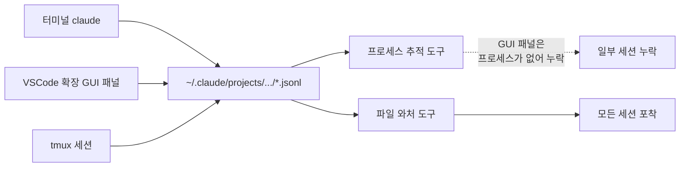

Claude Code 세션을 서너 개씩 띄워놓고 일하는 날이 늘었습니다. 백엔드 리팩터링 하나, 테스트 보강 하나, 또 다른 저장소에서 마이그레이션 하나. 그러다 보면 어느 터미널에서 뭐가 돌고 있는지 금세 잃어버립니다. 입력을 기다리며 멈춰 있는 세션을 한참 뒤에 발견하는 일도 잦습니다. 한눈에 보는 도구를 찾다가, 결국 직접 만들었습니다.

이 글은 그 과정에서 밟은 함정들을 정리한 기록입니다. 결과물인 `ccwhere`는 [MANAPIE/ccwhere](https://github.com/MANAPIE/ccwhere)에 올려두었습니다.

---

## 기성 도구는 왜 내 세션을 못 봤나

먼저 만들 이유가 없길 바랐습니다. 이미 도구가 많으니까요.

Anthropic 공식 기능인 `claude agents`를 먼저 켜봤습니다. 그리고 커뮤니티에서 자주 보이는 모니터도 하나 붙여봤습니다. 둘 다 잘 만들어진 도구입니다. 그런데 제 환경에서는 **VSCode 확장(VSCode extension)** 으로 띄운 세션이 목록에 뜨지 않았습니다. 터미널에서 `claude`로 띄운 세션은 잡히는데, 정작 제가 가장 많이 쓰는 에디터 안의 세션이 통째로 비어 있었습니다.

처음에는 설정 문제인 줄 알았습니다. 한참을 뒤지고 나서야, 도구의 잘못이 아니라 **세션을 발견하는 방식(discovery)** 의 차이라는 걸 알았습니다.

---

## 원인은 "프로세스가 없다"였다

VSCode의 Claude Code 확장은 동작 모드가 둘입니다.

기본은 그래픽 채팅 패널입니다. 이 모드에서는 별도의 `claude` 터미널 프로세스가 뜨지 않습니다. 확장 안에서 동작하기 때문입니다. 반면 `Use Terminal` 설정을 켜면 통합 터미널 안에서 `claude`가 실제 프로세스로 뜹니다.

여기서 갈렸습니다. 제가 시도한 도구들은 세션을 찾을 때 **프로세스 목록을 뒤지거나 hook을 등록**합니다. 그런데 GUI 패널 모드에는 추적할 프로세스도, 발화점이 될 터미널도 없습니다. 그러니 못 잡는 게 당연했습니다.

다행히 데이터 자체는 한 곳에 남습니다. Claude Code는 어디서 띄우든 세션 로그를 `~/.claude/projects/<인코딩된-경로>/<session-uuid>.jsonl` 로 기록합니다. 터미널이든, GUI 패널이든, tmux든 모두 같은 경로입니다.



정리하면 이렇습니다. **파일은 있는데 프로세스가 없다.** 그래서 프로세스 기반 도구는 GUI 패널 세션을 놓치고, 파일을 직접 읽는 도구는 빠짐없이 잡습니다.

| 발견 방식 | 터미널 세션 | VSCode GUI 패널 세션 |
| --- | --- | --- |
| 프로세스 목록 추적 | 잡음 | 못 잡음 |
| hook 등록 | 잡음 | 못 잡음 |
| 세션 파일(JSONL) 와처 | 잡음 | 잡음 |

결론은 분명했습니다. 프로세스가 아니라 파일을 봐야 합니다.

---

## 셸 한 줄에서 시작하기

방향이 정해지자 시작은 단순했습니다. 최근에 수정된 `.jsonl` 파일을 찾으면, 그게 곧 활성 세션입니다.

```bash
# 최근 1분 안에 활동이 있었던 세션의 프로젝트들
find ~/.claude/projects -name '*.jsonl' -mmin -1 \
  | sed 's|.*/projects/||;s|/[^/]*$||' | sort -u
```

이 한 줄로 "지금 어디서 도는가"는 이미 해결됩니다. 의존성도, 권한 부여도, 새 프로세스도 없습니다. 여기에 상태(active/recent/idle), 모델명, 마지막 메시지, 5초 갱신, 색을 붙여나가는 게 나머지 작업이었습니다.

그런데 살을 붙이는 과정에서 작은 함정 세 개에 차례로 걸렸습니다. 셸 스크립트 한 편에 이렇게 많은 지뢰가 묻혀 있을 줄은 몰랐습니다.

---

## 함정 1 - jq는 16진수를 모른다

마지막 사용자 메시지를 컬럼에 넣고 싶었습니다. 한글이 섞이면 글자폭 계산이 어긋나니, 글자별 표시폭(display width)을 재서 잘라내는 함수를 jq로 짰습니다. ASCII는 1칸, 그 외는 2칸으로요.

```jq
def cw: if . > 0x7F then 2 else 1 end;
```

그런데 메시지 컬럼이 계속 비어 있었습니다. 한참을 들여다봐도 표현식 자체엔 문제가 없어 보였습니다. 에러를 화면에 흘려보내는 디버그 스위치를 만들어 켜고서야 원인이 나왔습니다.

```text
jq: error: syntax error, unexpected IDENT at <top-level>, line 2:
def cw: if . > 0x7F then 2 else 1 end;
```

**jq는 16진수 리터럴(`0x7F`)을 지원하지 않습니다.** 숫자는 JSON 표준을 따르기 때문에 십진수만 받습니다. `0x7F` 한 줄 때문에 `cw` 정의가 컴파일되지 않았고, 이걸 호출하는 잘라내기 함수도 같이 죽었습니다. 결과는 매번 빈 문자열이었습니다.

```jq
# 0x7F(127)를 십진수로. 256 이상이면 한/중/일·이모지로 보고 2칸 처리
def cw: if . > 255 then 2 else 1 end;
```

교훈은 두 가지입니다. 하나, jq 숫자는 십진수만 받는다. 둘, **에러를 `2>/dev/null`로 묵음 처리해두면 진짜 원인을 한참 못 본다.** 디버그 스위치를 처음부터 달아둘 걸 그랬습니다.

---

## 함정 2 - command substitution 안에서 죽는 tput

세션이 화면 높이를 넘으면 위로 밀려 올라가 머리글이 잘렸습니다. 그래서 터미널 높이만큼만 행을 보여주려고 `tput lines`로 줄 수를 받았습니다. 그런데 실제 창은 큰데 자꾸 작게 잡혔습니다.

원인은 호출 위치였습니다. 깜빡임을 줄이려고 프레임 전체를 명령 치환(command substitution)으로 한 번에 빌드하고 있었는데, 그 안에서는 표준 출력이 파이프로 묶입니다. 이 상황에서 `tput`은 터미널 크기 대신 기본값을 돌려주는 경우가 있습니다.

표준 입력을 터미널로 명시해서 읽는 `stty`로 바꾸자 해결됐습니다.

```bash
# tput 대신 stty. /dev/tty를 직접 읽어 캡쳐 환경에서도 실제 크기를 얻음
get_term_size() {
  _sz=$(stty size < /dev/tty 2>/dev/null) || _sz="30 120"
  rows=${_sz% *}   # "rows cols"에서 앞쪽
  cols=${_sz#* }   # 뒤쪽
}
```

화면을 캡쳐해서 다루는 코드에서는, 화면 크기를 묻는 명령도 같은 캡쳐에 휘말립니다. 크기는 캡쳐 밖의 진짜 터미널에 직접 물어야 합니다.

---

## 함정 3 - 셸 변수 확장이 삼킨 jq 변수

가장 오래 헤맨 함정입니다. jq 표현식이 길어지자 변수에 담아 재사용하려 했습니다.

```bash
JQ_HELPERS='
def trunc_w($max):
  . as $orig
  | ...
'
# ...
last_msg=$(tail -n 100 "$f" | jq -rs "$JQ_HELPERS"' ... ')
```

`JQ_HELPERS`는 작은따옴표로 저장했으니 그 안의 `$orig`나 `$max`는 안전할 거라 믿었습니다. 함정은 쓰는 쪽에 있었습니다. `"$JQ_HELPERS"`처럼 큰따옴표로 펼치는 순간, 셸이 그 안의 `$orig`·`$max`·`$tw`를 **jq 변수가 아니라 셸 변수로 보고 빈 문자열로 치환**해버립니다. jq에게 도착한 함수는 인자도 변수도 사라진 껍데기였습니다.

해법은 jq 표현식을 셸 문자열로 다루지 않는 것이었습니다. 임시 파일에 적어두고 `-f`로 읽혔습니다.

```bash
# 시작 시 한 번만 jq 스크립트를 파일로 기록 → 셸 확장 자체가 일어나지 않음
JQ_LAST_MSG=$(mktemp -t ccwhere-jq.XXXXXX)
cat > "$JQ_LAST_MSG" <<'JQEOF'
def cw: if . > 255 then 2 else 1 end;
def trunc_w($max):
  . as $orig
  | ...
JQEOF

# 호출
last_msg=$(tail -n 300 "$f" | jq -rs --argjson max "$msg_max" -f "$JQ_LAST_MSG")
```

`<<'JQEOF'`처럼 구분자를 따옴표로 감싼 here-document는 본문을 확장 없이 그대로 기록합니다. 인자는 `--argjson`으로 jq에 직접 넘깁니다. 이러면 셸과 jq 사이에서 `$`를 두고 벌어지던 줄다리기가 사라집니다.

긴 jq나 awk를 셸 변수에 담아 큰따옴표로 펼치는 패턴은 편해 보이지만, `$`가 양쪽 언어에서 모두 의미를 갖는 순간 조용히 깨집니다. 길어지면 파일로 빼는 편이 안전합니다.

---

## 그 외 다듬기

세 함정 외에 화면을 매끄럽게 하는 손질이 남았습니다.

깜빡임은 그리는 순서 문제였습니다. 화면을 지우고 데이터를 모으는 동안 빈 화면이 보였습니다. 새 프레임을 먼저 변수에 다 만든 다음, 커서를 좌상단으로 옮겨 한 번에 덮어쓰는 **더블 버퍼링(double buffering)** 으로 바꾸자 깜빡임이 사라졌습니다.

```bash
while true; do
  frame=$(build_frame)         # 다 모을 때까지 화면엔 이전 프레임이 그대로
  printf '\033[H%s\033[J' "$frame"  # 좌상단으로 → 덮어쓰기 → 남은 영역 지움
  sleep "$REFRESH_SEC"
done
```

프로젝트 경로도 손봤습니다. Claude Code의 디렉토리 인코딩은 원본 경로의 슬래시(`/`)와 하이픈(`-`)을 모두 `-`로 바꿉니다. 그래서 완벽한 복원은 불가능합니다. 마지막 경로 조각만 보여주는 것으로 타협했습니다. 어차피 "어느 프로젝트인가"를 가리는 데는 그걸로 충분합니다.

---

## 결과

완성된 화면은 이렇습니다.

```text
  Claude Code Sessions  ·  14:32  ·  last 24h

  PROJECT          STATUS      LAST     MODEL      MSGS   LAST_MSG
  api-server       ● active    3s ago   opus-4     142    Refactor auth middleware to verify session server-side
  web-client       ◐ recent    4m ago   sonnet-4   87     Add pagination to /api/v1/comments endpoint
  billing-service  ○ idle      3h ago   opus-4     23     Fix race condition in WebSocket reconnect logic

  30x120 · Ctrl+C to quit · 5s refresh
```

`jq` 하나만 있으면 됩니다. 설치는 저장소를 받아 실행 권한을 주는 게 전부입니다.

```bash
git clone https://github.com/MANAPIE/ccwhere.git
cd ccwhere && chmod +x ccwhere.sh
./ccwhere.sh
```

처음 목표는 소박했습니다. "지금 어디서 도는지"만 알면 됐습니다. 그 한 줄짜리 목표가 jq의 숫자 표기, 캡쳐 환경의 터미널 크기, 두 언어가 공유하는 `$` 기호까지 들춰내는 여정이 될 줄은 몰랐습니다. 작은 도구일수록 경계에 함정이 많다는 걸 다시 배웠습니다.

코드는 [MANAPIE/ccwhere](https://github.com/MANAPIE/ccwhere)에 있습니다. macOS 기준으로 짰고, Linux 대응은 `stat` 플래그만 바꾸면 되니 관심 있으시면 기여 환영입니다.

---

## 참고 자료

- Anthropic. Claude Code VS Code extension 설정 문서. [https://docs.claude.com](https://docs.claude.com)
- jq manual. Types and Values (숫자 리터럴 표기). [https://jqlang.org/manual/](https://jqlang.org/manual/)
- MANAPIE/ccwhere. [https://github.com/MANAPIE/ccwhere](https://github.com/MANAPIE/ccwhere)
