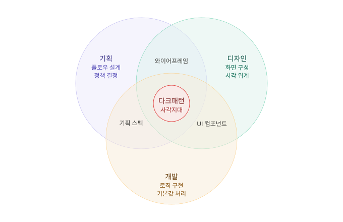
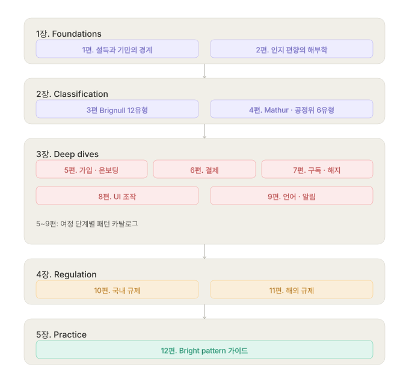
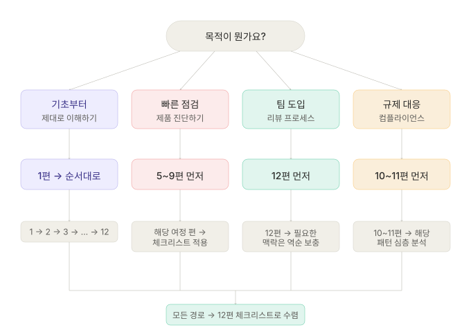

사용자를 속이는 UI는 어떻게 생겼고, 왜 작동하며, 어떻게 피할 수 있는가.

---

## 이 시리즈를 쓰는 이유

2010년, UX 전문가 Harry Brignull이 **다크패턴(Dark Pattern)** 이라는 용어를 처음 만들었습니다.
"사용자가 의도하지 않은 행동을 하도록 유도하는 UI 설계"를 가리키는 말이었는데요,
15년이 지난 지금, 이 용어는 **기만적 패턴(Deceptive Pattern)** 이라는 이름으로, 더 이상 UX 커뮤니티 안에서만의 논의에 머물지 않고 있습니다.

EU의 디지털 서비스법(DSA)은 다크패턴을 명시적으로 금지하고 있습니다. 
미국 FTC는 Amazon을 상대로 구독 해지 방해를 이유로 소송을 제기했습니다.
한국 공정거래위원회는 온라인 다크패턴 가이드라인을 발표하고 6대 유형을 정의했습니다.

다크패턴은 더 이상 "나쁜 UX"가 아니라 **법적 리스크**입니다.

그럼에도 현장에서 다크패턴은 여전히 잘 안 보입니다.

그 이유는 세 가지입니다:

**첫째, 경계가 모호하다.**

"우리 서비스의 기본값 설정"은 넛지인가 기만인가? 무료 체험 후 자동 결제 전환은 합법적인 비즈니스 모델인가 구독 함정인가? 명확한 판단 기준 없이는 이 질문에 답할 수 없습니다.

**둘째, 의도 없이 만들어진다.**

대부분의 다크패턴은 "속이려는 의도"가 아니라 "전환율을 높이려는 최적화"의 결과물입니다. A/B 테스트에서 전환율이 높은 쪽을 선택하다 보면, 사용자의 인지 편향을 이용하는 패턴이 자연스럽게 살아남습니다.
기획자, 디자이너, 개발자 누구도 "기만적인 UI를 만들자"고 기획하지 않았지만, 결과물은 기만적이 됩니다.

**셋째, 직무 간 사각지대에 있다.**

기획자는 플로우를 설계하고, 디자이너는 화면을 구성하고, 개발자는 로직을 구현합니다.
다크패턴은 이 세 영역이 만나는 접점에서 발생하지만, 각자의 관점에서는 자기 영역의 문제로 보이지 않습니다.

이 시리즈는 그 사각지대를 다룹니다.
기획·디자인·개발 구분 없이, 다크패턴을 **식별하고, 분류하고, 대안을 설계**할 수 있는 실무 가이드를 12편에 걸쳐 제공하려고 합니다.

## 이 시리즈의 대상

이 시리즈는 다음과 같은 사람을 위해 작성되었습니다.

- 디지털 제품을 만드는 **기획자, 디자이너, 개발자** (중급 이상)
- "이건 다크패턴 아닌가?"라는 질문을 받았거나, 스스로 한 적이 있는 사람
- 팀 내에서 다크패턴 리뷰 프로세스를 도입하고 싶은 사람
- 규제 변화에 대응해야 하는 제품 조직

특정 도구나 프레임워크에 의존하지는 않습니다만, 먼저 "디지털 제품을 만들어 본 경험"이 필요합니다.

---

## 시리즈 구조

시리즈는 5개 장, 12편으로 구성했습니다.
각 편은 독립적으로 읽을 수 있지만, 순서대로 읽으면 인식 → 분류 → 분석 → 규제 이해 → 실천의 흐름으로 이어지게 했습니다.

### 1장. Foundations — 왜 다크패턴인가 (인식, 1~2편)

다크패턴의 정의와 판단 기준을 세웁니다.
"이건 설득인가 기만인가?"를 구분하는 프레임워크를 제공하고, 다크패턴이 작동하는 인지적 메커니즘을 해부합니다.

| 편 | 제목 | 핵심 질문 |
|---|---|---|
| 1편 | 다크패턴이란 무엇인가 — 설득과 기만의 경계 | 이건 넛지인가 기만인가? |
| 2편 | 다크패턴은 왜 작동하는가 — 인지 편향의 해부학 | 왜 사용자는 이걸 알면서도 당하는가? |

### 2장. Classification — 패턴을 읽는 언어 (분류, 3~4편)

다크패턴을 체계적으로 분류합니다.
Brignull의 원형 12유형, 학술 연구의 실증 분류, 한국 공정위의 규제 분류를 비교하고 통합 매핑을 제공합니다.

| 편 | 제목 | 핵심 질문 |
|---|---|---|
| 3편 | 분류 지도 ① — Brignull의 12가지 원형 | 어떤 유형들이 있는가? |
| 4편 | 분류 지도 ② — Mathur의 실증 분류와 공정위 6유형 | 분류 체계마다 왜 다른가? |

### 3장. Deep Dives — 패턴별 심층 분석 (분석, 5~9편)

사용자 여정 단계별로 다크패턴을 심층 분석합니다.
각 편에는 해당 단계에서 발견되는 패턴의 실제 모습, 작동 원리, 공개된 사례, 자가 점검 체크리스트가 있습니다.

| 편 | 제목 | 여정 단계 |
|---|---|---|
| 5편 | 가입·온보딩의 함정 | 진입 |
| 6편 | 결제의 함정 | 전환 |
| 7편 | 구독과 해지의 함정 | 유지·이탈 |
| 8편 | UI 조작 패턴 | 인터랙션 전반 |
| 9편 | 언어와 알림의 패턴 | 커뮤니케이션 |

### 4장. Regulation — 법적 경계선 (규제 이해, 10~11편)

"만들면 안 되는 것"의 법적 기준을 정리합니다.
국내 공정위 가이드라인과 전자상거래법, 해외 EU DSA·GDPR·FTC 규제, 실제 제재 사례를 다룹니다.

| 편 | 제목 | 관할권 |
|---|---|---|
| 10편 | 국내 규제 — 공정위 가이드라인과 전자상거래법 | 한국 |
| 11편 | 해외 규제 — EU DSA, GDPR, FTC | EU, 미국 |

### 5장. Practice — 만들지 않기 위한 실천 (실천, 12편)

시리즈의 결론에 다달아, 다크패턴의 윤리적 대안(Bright Pattern)을 제시하고, 팀 차원에서 다크패턴을 방지하는 프로세스를 설계합니다.
직무별 체크리스트와 리뷰 템플릿을 제공합니다.

| 편 | 제목 | 핵심 산출물 |
|---|---|---|
| 12편 | 다크패턴 없이 만들기 — Bright Pattern 가이드 | 체크리스트, 리뷰 템플릿 |

## 각 편의 구조

모든 편은 동일한 구조를 따르도록 했스니다.

1. **도입** — 이 편에서 다루는 문제와 핵심 질문
2. **본론** — 개념 설명, 패턴 분석, 사례, 모의 UI 예시
3. **자가 점검** — 독자가 자기 제품에 적용할 수 있는 체크리스트
4. **참고 자료** — 인용한 논문, 규제 문서, 공식 자료 링크

UI 예시는 실제 서비스를 그대로 캡처하지 않고, 패턴의 본질에 집중하고 법적 리스크를 피하기 위해 구조를 추상화한 모의 화면을 사용했습니다.
공개된 사례(판결문, 공정위 시정명령, FTC 소송 기록 등)는 출처를 명시하고 인용했습니다.

---

## 용어 정리

이 시리즈에서 반복적으로 사용하는 용어를 정리합니다.

**다크패턴 (Dark Pattern) / 기만적 패턴 (Deceptive Pattern)**
사용자가 의도하지 않은 행동을 하도록 설계된 UI 패턴. Harry Brignull이 2010년 명명.
2021년부터 커뮤니티에서는 "기만적 패턴"이라는 용어를 선호하는 추세이나, 검색 가능성과 인지도를 고려해 이 시리즈에서는 "다크패턴"을 주 용어로 사용합니다.

**브라이트패턴 (Bright Pattern)**
다크패턴의 반대 개념. 사용자의 이익을 존중하면서도 비즈니스 목표를 달성하는 윤리적 설계 패턴. 공식 학술 용어는 아니지만, 대안을 논의할 때 널리 사용됩니다.

**넛지 (Nudge)**
사용자의 선택 자유를 유지하면서 특정 방향으로 유도하는 설계. Richard Thaler와 Cass Sunstein이 정의. 넛지와 다크패턴의 경계는 1편에서 상세히 다룹니다.

**컴펌쉐이밍 (Confirmshaming)**
사용자가 제안을 거절할 때 죄책감이나 수치심을 느끼도록 유도하여, 원치 않는 행동(뉴스레터 구독, 회원가입 등)을 하도록 강요하는 기만적인 UX 디자인 패턴.
예: "아니요, 돈을 절약하고 싶지 않습니다."

**로치 모텔 (Roach Motel)**
들어갈 땐 쉽지만 나오는 건 어렵게 만들어진 미국의 바퀴벌레 덫 상품명입니다. 가입·구독은 쉽지만 해지·탈퇴가 의도적으로 어렵게 설계된 패턴.

나머지 패턴 용어는 3~4편에서 분류 체계와 함께 정의합니다.

---

## 시리즈를 읽는 순서

전체를 순서대로 읽는 것이 가장 좋지만, 목적에 따라 다른 진입점을 선택할 수 있습니다.

**"우리 제품에 다크패턴이 있는지 빨리 확인하고 싶다"**
→ 5~9편(패턴별 심층 분석)부터 시작. 해당 여정의 체크리스트로 즉시 점검.

**"팀에 다크패턴 리뷰를 도입하고 싶다"**
→ 12편(Bright Pattern 가이드)을 먼저 읽고, 필요한 맥락은 역순으로 보충.

**"규제 대응이 급하다"**
→ 10~11편(규제)을 먼저, 이후 해당 규제가 다루는 패턴 유형의 심층 분석으로 이동.

**"다크패턴이 뭔지부터 제대로 이해하고 싶다"**
→ 1편부터 순서대로.

## 시리즈의 범위와 한계

이 시리즈가 **다루는 것**:
- 웹·앱 UI에서 발생하는 다크패턴
- B2C 디지털 서비스 중심의 사례
- 2024~2026년 기준 규제 동향
- 기획·디자인·개발 실무자 관점의 판단 기준

이 시리즈가 **다루지 않는 것**:
- 오프라인·물리적 환경의 기만적 설계 (슈퍼마켓 동선, 카지노 등)
- 게임의 과금 패턴 (가챠, 루트박스 등 — 여기서 다루기엔 또 다른 주제입니다)
- 광고·마케팅 커뮤니케이션의 기만 (과대광고, 허위 후기 등)
- 법률 자문 (규제 정보는 참고 목적이며, 법적 판단은 전문가에게 의뢰 권장)

---

## 전체 목차

### 1장. Foundations — 왜 다크패턴인가

- [ep.01 - 다크패턴이란 무엇인가 — 설득과 기만의 경계](/dark-pattern-anatomy-ep-01)
- [ep.02 - 다크패턴은 왜 작동하는가 — 인지 편향의 해부학](/dark-pattern-anatomy-ep-02)

### 2장. Classification — 패턴을 읽는 언어

- [ep.03 - 분류 지도 ① — Brignull의 12가지 원형](/dark-pattern-anatomy-ep-03)
- [ep.04 - 분류 지도 ② — Mathur의 실증 분류와 공정위 6유형](/dark-pattern-anatomy-ep-04)

### 3장. Deep Dives — 패턴별 심층 분석

- [ep.05 - 가입·온보딩의 함정](/dark-pattern-anatomy-ep-05)
- [ep.06 - 결제의 함정 — 설득과 기만의 경계](/dark-pattern-anatomy-ep-06)
- [ep.07 - 구독과 해지의 함정](/dark-pattern-anatomy-ep-07)
- [ep.08 - UI 조작 패턴](/dark-pattern-anatomy-ep-08)
- [ep.09 - 언어와 알림의 패턴](/dark-pattern-anatomy-ep-09)

### 4장. Regulation — 법적 경계선

- [ep.10 - 국내 규제 — 공정위 가이드라인과 전자상거래법 — 설득과 기만의 경계](/dark-pattern-anatomy-ep-10)
- [ep.11 - 해외 규제 — EU DSA, GDPR, FTC](/dark-pattern-anatomy-ep-11)

### 5장. Practice — 만들지 않기 위한 실천

- [ep.12 - 다크패턴 없이 만들기 — Bright Pattern 가이드](/dark-pattern-anatomy-ep-12)

---

## 다음 편 예고

> [ep.01 - 다크패턴이란 무엇인가 — 설득과 기만의 경계](/dark-pattern-anatomy-ep-01)

같은 "기본값 설정"이 어떤 맥락에서는 사용자를 돕는 넛지가 되고, 어떤 맥락에서는 동의를 가장한 기만이 되는지를 분석합니다. 설득·넛지·다크패턴을 구분하는 세 가지 기준(투명성, 이익 귀속, 동의 가능성)을 제시하고, 즉시 사용할 수 있는 판별 플로우차트를 제공합니다.
