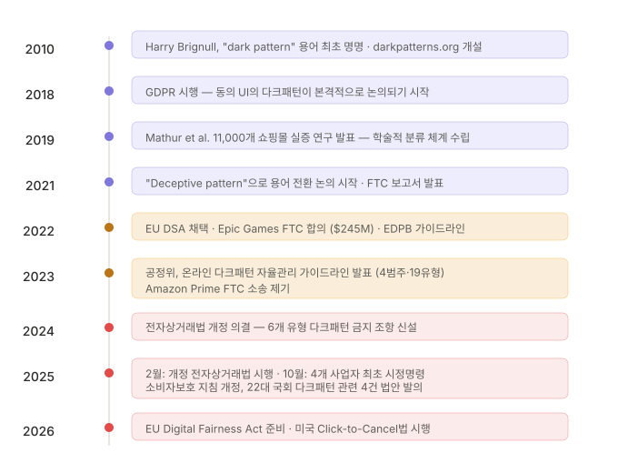
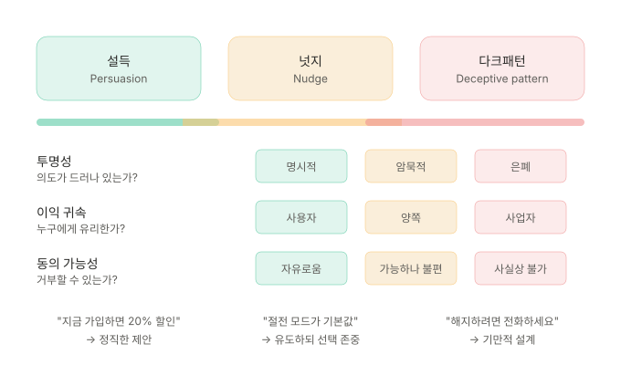
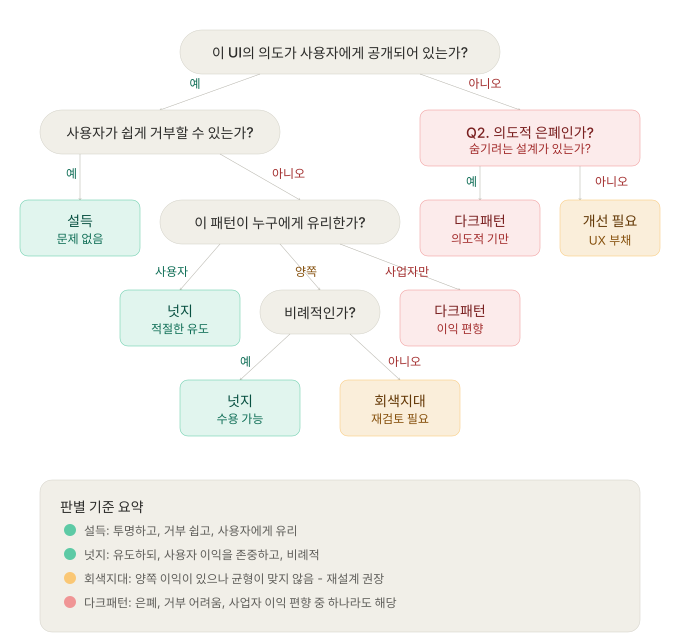
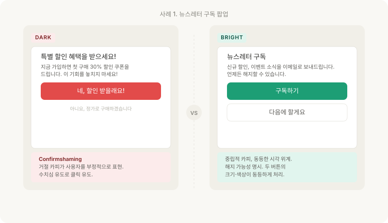
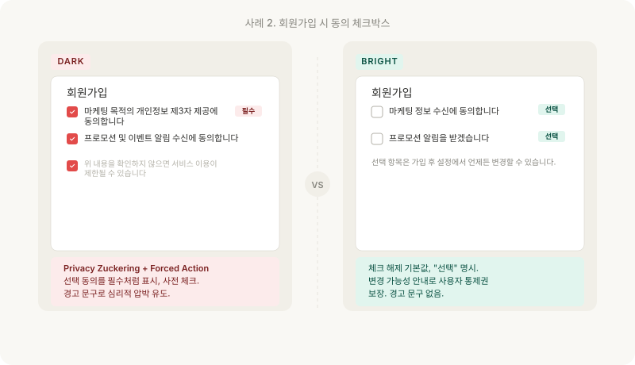
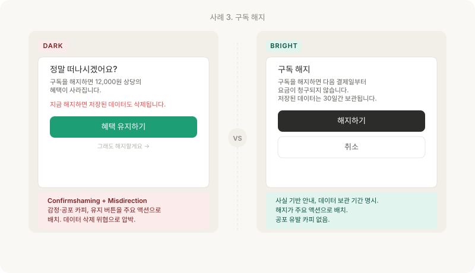

같은 팝업이 어떤 맥락에서는 사용자를 돕는 넛지가 되고, 어떤 맥락에서는 동의를 가장한 기만이 된다. 그 경계는 어디인가.

---

## 용어의 탄생

2010년, UX 디자이너 Harry Brignull은 darkpatterns.org라는 웹사이트를 열었습니다. 그는 사용자가 의도하지 않은 행동을 하도록 설계된 UI 패턴을 수집하고, 여기에 **다크패턴(Dark Pattern)** 이라는 이름을 붙였습니다. "버그가 아니라 의도적인 설계(not a bug, but a feature)"라는 것이 핵심 주장이었습니다.

이 용어는 이후 10년 이상 UX 커뮤니티, 학계, 규제 기관에서 널리 사용되었습니다. 2021년을 전후로 커뮤니티 내에서는 **기만적 패턴(Deceptive Pattern)** 이라는 표현으로 전환하는 움직임이 나타났습니다. "다크"라는 단어가 부정적 의미를 특정 색상에 연결한다는 비판, 그리고 "기만"이라는 표현이 문제의 본질을 더 정확히 전달한다는 논의가 있었기 때문입니다. Brignull도 자신의 웹사이트를 deceptive.design으로 변경했습니다.

이 시리즈에서는 검색 가능성과 국내 인지도를 고려해 **"다크패턴"** 을 주 용어로 사용하되, 공식 문서나 규제 맥락에서는 "기만적 패턴"을 병기합니다.

---

## 설득, 넛지, 다크패턴은 무엇이 다른가

디지털 제품은 본질적으로 사용자의 행동을 유도합니다. 버튼의 위치, 색상, 카피, 기본값 등 모든 설계 결정은 사용자의 선택에 영향을 미칩니다. 문제는 그 영향력이 사용자를 돕는지, 속이는지를 어떻게 구분하느냐입니다.

이 개념을 구분하는 데 유용한 세 가지 기준은 다음과 같습니다:

### 기준 1: 투명성 — 의도가 드러나 있는가

**설득**은 의도를 숨기지 않습니다. "지금 가입하면 20% 할인"은 명시적인 제안입니다. 사용자는 이것이 마케팅임을 알고, 그 위에서 판단합니다.

**넛지**는 의도가 암묵적입니다. 카페에서 샐러드를 눈높이에 놓는 것은 건강한 선택을 유도하지만, "샐러드를 먹어라"고 말하지는 않습니다. 사용자가 원하면 다른 음식을 고를 수 있습니다.

**다크패턴**은 의도를 은폐합니다. 사전 체크된 마케팅 동의 체크박스는 "사용자가 능동적으로 동의했다"는 외양을 만들지만, 실제로는 사용자의 부주의를 이용합니다. 의도(마케팅 데이터 수집)가 UI의 구조 뒤에 숨어 있습니다.

### 기준 2: 이익 귀속 — 누구에게 유리한가

**설득**은 사용자에게 유리한 제안을 포함합니다. 할인 쿠폰은 사업자의 매출과 사용자의 비용 절감 양쪽에 기여합니다.

**넛지**는 사용자의 이익을 우선합니다. 절전 모드 기본 설정은 전기 요금 절감이라는 사용자 이익이 주 목적이다. 제조사의 이익(에너지 규제 준수)은 부수적입니다.

**다크패턴**은 사업자의 이익을 위해 사용자의 이익을 희생합니다. 해지 버튼을 5단계 뒤에 숨기는 것은 구독 유지(사업자 이익)를 위해 사용자의 시간과 의사결정 비용을 강제로 부과합니다.

### 기준 3: 동의 가능성 — 거부할 수 있는가

**설득**은 거부가 자유롭습니다. "가입하기" 옆에 "다음에"가 동등한 크기로 있습니다.

**넛지**는 거부가 가능하지만 약간 불편합니다. 기본값을 바꾸려면 설정에 들어가야 합니다. 하지만 그 경로는 합리적이고 찾기 어렵지 않습니다.

**다크패턴**은 거부가 사실상 불가능하거나 비합리적으로 어렵습니다. 해지하려면 전화해야 하고, 전화는 업무 시간에만 연결되며, 대기 시간이 20분씩이고 그럽니다.

---

## 경계가 모호한 이유

세 기준을 세워도 현실은 깔끔하지 않습니다. 같은 UI 요소가 맥락에 따라 넛지가 되기도 하고 다크패턴이 되기도 합니다.

### 사례: 기본값 설정

개인정보 설정 화면에서 "위치 정보 공유"가 기본 비활성화(opt-in)로 설정되어 있다면, 이것은 사용자의 프라이버시를 보호하는 넛지입니다.

반대로, 마케팅 이메일 수신이 기본 활성화(opt-out)로 설정되어 있다면? 사용자 대부분은 기본값을 바꾸지 않는다는 사실(기본값 효과)을 이용해 동의를 획득하는 구조입니다.

같은 "기본값 설정"이라는 기법이, 이익이 누구에게 귀속되느냐에 따라 성격이 바뀝니다.

### 사례: 진행 표시 (Progress Indicator)

"프로필을 80% 완성했습니다! 나머지 20%를 채워보세요." — LinkedIn에서 흔히 볼 수 있는 패턴입니다.
사용자가 프로필을 완성하면 더 나은 매칭을 받을 수 있으니 넛지일까요? 아니면 사용자의 완료 욕구(Zeigarnik effect)를 이용해 더 많은 개인정보를 수집하려는 다크패턴일까요?

이 질문에 답하려면 세 기준을 순서대로 적용해야 합니다.

1. **투명성**: "프로필 완성도"라는 개념 자체는 공개되어 있습니다. ✓
2. **이익 귀속**: 완성된 프로필은 사용자에게도 이익(더 나은 추천)이 있지만, 플랫폼의 이익(데이터 축적, 광고 타겟팅)이 더 큽니다. △
3. **동의 가능성**: 무시할 수 있습니다. 강제는 아닙니다. ✓

결론: 이 패턴은 **회색지대**에 있습니다. 명백한 다크패턴은 아니지만, 사용자 이익과 사업자 이익의 비례성이 의심스럽습니다. 개선이 권장되는 영역입니다.

이처럼 많은 패턴이 흑백이 아닌 그라데이션 위에 놓입니다. 이 시리즈에서 반복적으로 사용할 **판별 플로우차트**는 이 그라데이션을 실무적으로 구분하기 위한 도구가 될 것입니다.

---

## 같은 기능, 다른 설계 — Before/After로 보기

추상적인 기준을 실무에 적용하는 가장 빠른 방법은 같은 기능을 두 가지 방식(Before(다크패턴)/After(브라이트패턴))으로 설계한 모의 화면을 비교하는 것입니다.

### 뉴스레터 구독 팝업

**다크패턴 버전**: "네, 할인 받을래요!" / "아니요, 정가로 구매하겠습니다" — 이 카피 구조는 컨펌쉐이밍(Confirmshaming)입니다. 거절 옵션이 사용자를 부정적으로 프레이밍합니다. "정가로 구매"는 "손해를 자처한다"는 뉘앙스를 담고 있습니다.

**브라이트패턴 버전**: "구독하기" / "다음에 할게요" — 두 버튼의 시각적 위계를 동등하게 유지하고, 거절 카피를 중립적으로 작성합니다. 해지 가능성을 사전에 명시합니다.

비즈니스 효과가 다를까요? 단기적으로 컨펌쉐이밍(Confirmshaming)은 전환율이 높을 수 있습니다. 그러나 이렇게 획득한 구독자의 이메일 열람률은 낮고, 스팸 신고율은 높습니다. 장기적으로는 브랜드 신뢰를 갉아먹습니다.

### 회원가입 동의 체크박스

**다크패턴 버전**: 마케팅 동의가 사전 체크되어 있고 "(필수)"로 표시됩니다. 하단에 "확인하지 않으면 서비스 이용이 제한될 수 있습니다"라는 위협 문구가 있습니다. 이것은 프라이버시 저커링(Privacy Zuckering)과 강제 행동 요구(Forced Action)의 결합입니다.

**브라이트패턴 버전**: 체크박스는 해제 상태가 기본이고, "(선택)"이 명시되며, "설정에서 언제든 변경 가능"이라는 안내가 있습니다.

### 구독 해지

**다크패턴 버전**: "정말 떠나시겠어요?"라는 감정적 카피를 내세우며, 혜택 유지를 강조색으로 표시했습니다. 해지를 10px 회색 텍스트로 최소화한 데다 데이터 삭제 위협까지 추가되어 있습니다.

**브라이트패턴 버전**: "구독 해지"라는 정직한 카피와 함께 사실 기반 안내(다음 결제일, 데이터 보관 기간)를 제공하고 있으며, 사용자에 의도와 화면의 성격에 맞는 해지 버튼이 주요 액션으로 배치되어 있습니다.

---

## 왜 지금 중요한가

다크패턴이 처음 명명된 2010년부터 15년 이상이 지났습니다. 그런데 왜 하필 지금 이 주제가 실무적으로 중요해졌을까요? 세 가지 변화가 동시에 일어나고 있기 때문입니다.

### 1. 규제가 "가이드라인"에서 "법"이 되었다

한국에서의 변화는 특히 빠릅니다.

- **2023년 7월**: 공정거래위원회가 '온라인 다크패턴 자율관리 가이드라인'을 발표했습니다. 4개 범주, 19개 세부 유형을 정의했지만, 법적 구속력은 없었습니다.
- **2024년 2월**: 전자상거래법 개정이 국회를 통과했습니다. 6개 유형의 다크패턴이 법적으로 금지되었습니다: 숨은 갱신, 순차공개 가격책정, 특정 옵션의 사전 선택, 잘못된 계층구조, 취소·탈퇴 방해, 반복 간섭.
- **2025년 2월**: 개정 전자상거래법이 시행되었습니다.
- **2025년 10월**: 공정위가 OTT·음원·커머스 분야 4개 사업자에 대해 최초의 시정명령과 과태료를 부과했습니다. "순차공개 가격책정" 계도기간이 종료되고 본격 단속이 시작되었습니다.

해외도 마찬가지입니다. EU DSA는 다크패턴을 명시적으로 금지했고, 미국에서는 FTC가 Epic Games에 2억 4,500만 달러 합의를 이끌어냈습니다. 미국의 Click-to-Cancel법은 2025년 7월 시행을 앞두고 있으며, "구독 해지가 가입만큼 쉬워야 한다"는 원칙을 법제화했습니다.

### 2. 사용자 신뢰가 측정 가능한 비용이 되었다

다크패턴으로 단기 전환율을 올리는 것은 가능합니다. 그러나 그 대가는 점점 가시적으로 드러나고 있습니다. 앱 스토어 리뷰에서 "해지가 어렵다"는 1점 리뷰가 쌓이고, SNS에서 해지 과정 스크린샷이 공유되고, 소비자 포럼에서 집단 민원이 형성됩니다. 이 모든 것이 검색 결과에 반영되고, 신규 사용자 획득 비용(CAC)을 올립니다.

"전환율은 올랐지만 LTV가 떨어졌다"는 상황은 다크패턴의 전형적인 결과입니다.

### 3. 기획·디자인·개발 모두의 문제가 되었다

과거에 다크패턴은 "UX 디자이너의 윤리" 문제로 여겨졌으나 지금은 다릅니다.

- **기획자**는 해지 플로우를 설계하고, 가격 표시 정책을 결정합니다. 전자상거래법의 6개 금지 유형 중 상당수는 기획 단계에서 결정됩니다.
- **디자이너**는 버튼의 크기, 색상, 위치를 결정합니다. "잘못된 계층구조"는 디자인 결정의 직접적 결과입니다.
- **개발자**는 기본값을 코드로 구현하고, 체크박스의 초기 상태를 설정합니다. "특정 옵션의 사전 선택"은 코드 한 줄의 문제입니다.

다크패턴은 어느 한 직무의 문제가 아니라, 세 직무가 만나는 접점에서 발생합니다. 이 시리즈가 직무 구분 없이 모든 제품 조직 구성원을 대상으로 하는 이유입니다.

---

## 자가 점검: 3가지 질문

이 편의 내용을 자기 제품에 적용하고 싶다면, 다음 세 가지 질문을 던져보세요.

**1. 우리 제품에서 "사용자가 의도하지 않은 행동을 하게 만드는" UI가 있는가?**

가입 과정, 결제 화면, 해지 플로우, 알림 설정을 하나씩 열어보세요. 사용자가 "아, 이건 내가 원한 게 아닌데"라고 말할 수 있는 지점이 있나요?

**2. 그 UI의 기본값은 누구에게 유리한가?**

사전 체크된 체크박스, 기본 선택된 옵션, 자동 갱신 설정이 있다면, 그것이 사용자의 이익인지 사업자의 이익인지 구분해보세요.

**3. 거부 경로가 수락 경로만큼 쉬운가?**

예를 들어 뉴스레터 구독 팝업에서 "구독하기"와 "닫기"의 시각적 위계를 비교해보세요. 구독 해지에 걸리는 단계 수와 가입에 걸리는 단계 수를 비교해보세요.

세 질문 중 하나라도 "아니오"가 나오면, 그 지점은 재검토가 필요합니다. 반드시 다크패턴이라는 뜻은 아니지만, 앞서 소개한 판별 플로우차트로 더 정밀하게 판단해볼 수 있을 것입니다.

---

## 참고 자료

- Brignull, H. (2010). Dark Patterns: Deception vs. Honesty in UI Design. darkpatterns.org (현 deceptive.design)
- Thaler, R. & Sunstein, C. (2008). *Nudge: Improving Decisions About Health, Wealth, and Happiness.* Yale University Press.
- 공정거래위원회. (2023). 온라인 다크패턴 자율관리 가이드라인.
- 공정거래위원회. (2025). 6개 유형 온라인 다크패턴 규제문답서.
- 전자상거래 등에서의 소비자보호에 관한 법률 (2024년 개정, 2025년 2월 시행).
- Gray, C. M. et al. (2018). The Dark (Patterns) Side of UX Design. *CHI 2018.*

---

## 다음 편 예고

> [ep.02 - 다크패턴은 왜 작동하는가 — 인지 편향의 해부학](/dark-pattern-anatomy-ep-02)

다크패턴이 효과적인 이유는 사용자가 "멍청해서"가 아닙니다. 인간의 의사결정 시스템에 구조적인 취약점이 있고, 다크패턴은 그 취약점을 정확히 겨냥합니다. 손실 회피, 기본값 효과, 사회적 증거, 매몰비용, 앵커링 — 5가지 인지 편향이 어떤 다크패턴과 매핑되는지 분석합니다.
