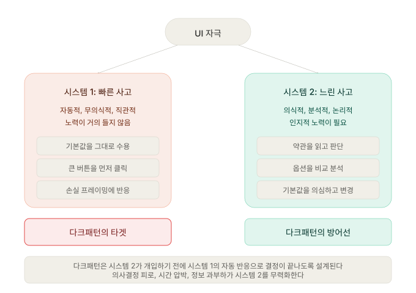
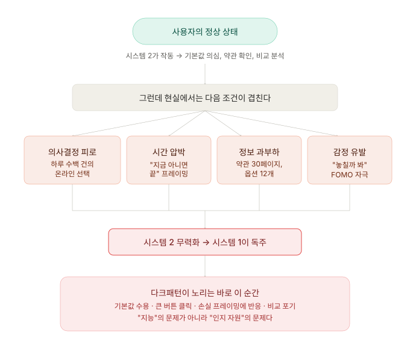
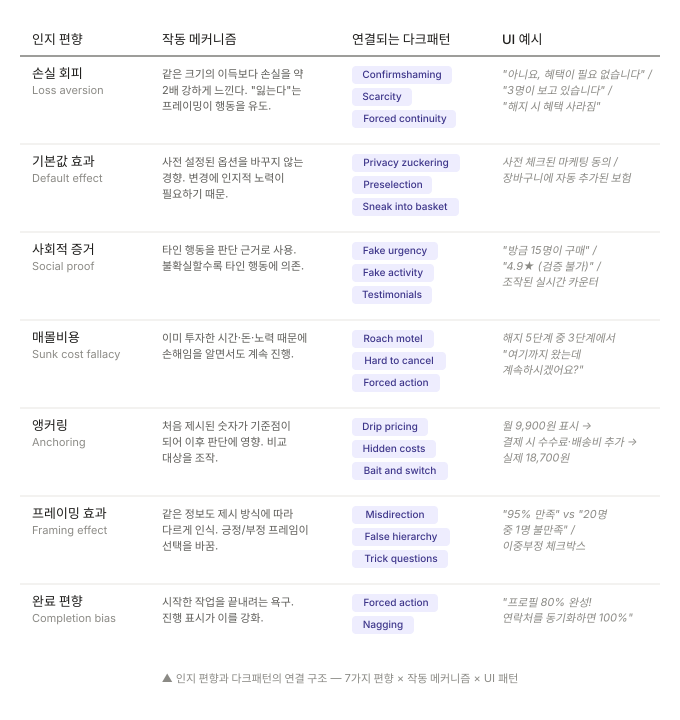
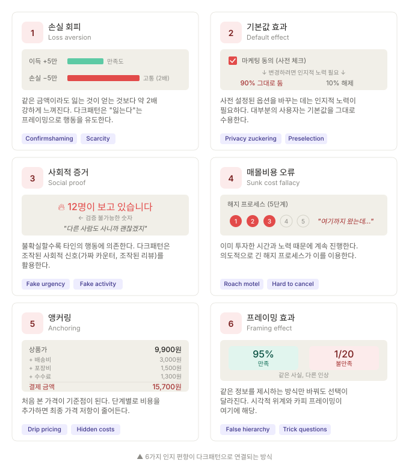

다크패턴에 당하는 것은 사용자가 멍청해서가 아니다. 인간의 의사결정 시스템에 구조적인 취약점이 있고, 다크패턴은 그 취약점을 정확히 겨냥한다.

---

## 두 개의 사고 시스템

2002년 노벨 경제학상을 수상한 Daniel Kahneman은 인간의 의사결정을 두 개의 시스템으로 설명했습니다.

**시스템 1**은 빠르고, 자동적이며, 무의식적입니다. 거의 노력이 들지 않습니다.

얼굴을 보고 감정을 읽는 것, 2+2의 답을 떠올리는 것, 익숙한 길을 운전하는 것이 시스템 1의 작업입니다.
UI 맥락에서는 "큰 버튼을 클릭하는 것", "기본값을 그대로 두는 것", "위험 신호에 즉각 반응하는 것"이 시스템 1의 영역입니다.

**시스템 2**는 느리고, 의식적이며, 분석적입니다. 인지적 노력이 필요합니다.

17×24를 계산하는 것, 복잡한 계약서를 읽는 것, 두 상품의 가성비를 비교하는 것이 시스템 2의 작업입니다.
UI 맥락에서는 "약관을 읽고 판단하는 것", "사전 체크된 체크박스를 의심하고 해제하는 것", "해지 조건을 확인하는 것"이 시스템 2의 영역입니다.

다크패턴의 핵심 전략은 간단합니다.

**시스템 2가 개입하기 전에, 시스템 1의 자동 반응으로 의사결정이 끝나도록 만드는 것입니다.** 혹은 시스템 2가 개입하더라도 올바른 판단을 내리지 못하도록 정보를 조작합니다.

---

## 시스템 2는 왜 무력화되는가

"약관을 읽으면 되지 않느냐", "체크박스를 확인하면 되지 않느냐"는 반론은 이론적으로는 맞습니다.

시스템 2가 완벽하게 작동하는 이상적인 상황에서, 다크패턴은 통하지 않습니다.

문제는 현실의 사용자가 이상적인 상황에 있는 경우가 거의 없다는 것입니다. 네 가지 조건이 시스템 2를 무력화합니다.

### 의사결정 피로 (Decision Fatigue)

인간의 인지 자원은 유한합니다. 하루에 내릴 수 있는 의식적 결정의 수에는 한계가 있고, 디지털 환경은 그 한계를 빠르게 소진시킵니다.

스마트폰을 열면 알림이 20개 쌓여 있습니다. 이메일을 처리하고, 슬랙 메시지에 답하고, 캘린더를 확인하고, 앱 업데이트 권한을 승인합니다.
이 과정에서 수십 개의 "동의/거부" 결정을 내립니다. 쿠키 배너를 닫고, 푸시 알림 허용을 거절하고, 위치 권한을 판단합니다.

이 모든 결정이 인지 자원을 조금씩 소모합니다. 저녁 시간에 쇼핑몰에서 결제 버튼을 누를 때, 사용자의 시스템 2는 이미 하루치 인지 자원을 상당 부분 소진한 상태입니다.
사전 체크된 "보험 추가" 옵션을 눈치채고 해제할 여력이 없을 수 있습니다.

### 시간 압박 (Time Pressure)

"이 가격은 오늘만 유효합니다." "남은 수량: 2개." "10분 후 장바구니가 초기화됩니다."

시간 압박은 시스템 2를 효과적으로 차단합니다. 분석하고 비교할 시간이 없다고 느끼면, 사용자는 시스템 1의 직관에 의존합니다. 직관은 "지금 사지 않으면 손해다"라고 말합니다. 손실 회피 편향이 발동합니다.

흥미로운 점은 이 시간 압박 자체가 조작될 수 있다는 것입니다. "남은 수량: 2개"는 실제 재고를 반영하지 않을 수 있고, "10분 후 초기화"는 페이지를 새로고침하면 다시 10분이 시작될 수 있습니다.

### 정보 과부하 (Information Overload)

약관을 읽으면 된다고요? 2012년 카네기 멜론 대학의 연구에 따르면, 미국 사용자가 일상적으로 방문하는 웹사이트의 개인정보 처리방침을 모두 읽으려면 **연간 약 76일**이 필요합니다. 아무도 읽지 않는 것이 합리적인 선택입니다.

다크패턴은 이 현실을 이용합니다. 중요한 정보를 긴 약관 안에 묻거나, 선택지를 불필요하게 많이 제시하거나, 이중 부정을 사용해 읽어도 이해하기 어렵게 만듭니다.

### 감정 유발 (Emotional Trigger)

"정말 떠나시겠어요?" — 이 문장은 논리적 판단이 아니라 감정적 반응을 유발합니다. 죄책감, 불안, FOMO(놓칠 것 같은 두려움)가 시스템 2를 우회합니다.

감정이 개입하면 인간은 논리적 분석 대신 즉각적 감정 해소를 선택하는 경향이 있습니다. "혜택 유지하기" 버튼을 누르는 것은 "불안을 해소하는" 즉각적 보상입니다.

---

## 7가지 인지 편향과 다크패턴의 매핑

다크패턴은 추상적인 악의가 아닙니다. 각각의 패턴은 특정 인지 편향을 겨냥합니다. 이번에는 7가지 핵심 인지 편향이 어떤 다크패턴과 연결되는지, 그리고 그 메커니즘이 UI에서 어떻게 구현되는지를 분석합니다.

### 1. 손실 회피 (Loss Aversion)

**원리**: Kahneman과 Tversky의 전망 이론(Prospect Theory)에 따르면, 같은 크기의 이득과 손실에서 인간은 손실을 약 2배 강하게 느낍니다. 5만 원을 얻는 기쁨보다 5만 원을 잃는 고통이 2배 큽니다.

**다크패턴 적용**: 이 편향은 "잃는다"는 프레이밍을 활용합니다.

- **컨펌쉐이밍 (Confirmshaming)**: "아니요, 돈을 절약하고 싶지 않습니다" — 거절을 "절약 기회의 손실"로 프레이밍합니다. 논리적으로는 "마케팅 이메일을 받지 않겠다"는 선택인데, 카피가 그것을 "이익의 포기"로 바꿔놓습니다.
- **가짜 희소성 (Scarcity)**: "남은 3개!" — 구매하지 않으면 기회를 잃는다는 손실 프레이밍은 실제 재고와 무관하게 작동합니다.
- **숨은 갱신 (Forced Continuity)**: "해지하면 12,000원 상당의 혜택이 사라집니다" — 실제로는 월 9,900원을 절약하는 것인데, "혜택 손실"로 프레이밍합니다.

**왜 효과적인가**: 사용자가 냉정하게 계산하면 "월 9,900원 절약 > 혜택 12,000원"일 수 있습니다. 하지만 손실 회피가 작동하면, "12,000원을 잃는다"는 감정이 "9,900원을 아낀다"는 논리를 압도합니다. 시스템 1이 시스템 2를 이기는 전형적인 사례입니다.

### 2. 기본값 효과 (Default Effect)

**원리**: 사전 설정된 옵션을 변경하는 데는 인지적 노력이 필요합니다. 그리고 인간은 인지적 노력을 최소화하려는 경향이 있습니다. 결과적으로 대부분의 사용자는 기본값을 그대로 수용합니다.

**수치**: 유럽의 장기 기증 동의율 연구는 이 효과의 위력을 보여줍니다. Opt-in(능동적 동의) 국가의 기증 동의율은 평균 15%인 반면, Opt-out(거부하지 않으면 동의) 국가의 동의율은 평균 90% 이상입니다. 같은 선택지인데, 기본값만 바꿨을 뿐입니다.

**다크패턴 적용**:

- **동의 조작 (Privacy Zuckering)**: 마케팅 동의, 데이터 공유, 제3자 제공이 사전 체크되어 있습니다. 사용자가 능동적으로 해제하지 않으면 동의한 것이 됩니다.
- **특정옵션 사전선택 (Preselection)**: 결제 화면에서 "프리미엄 배송"이 기본 선택되어 있습니다. 기본값을 바꾸려면 더 싼 옵션을 찾아서 클릭해야 합니다.
- **몰래 장바구니 추가 (Sneak into Basket)**: 장바구니에 사용자가 선택하지 않은 상품(보험, 액세서리 등)이 자동 추가되어 있습니다.

**왜 효과적인가**: 기본값을 바꾸려면 (1) 기본값이 있다는 것을 인지하고, (2) 그것이 자신에게 불리하다는 것을 판단하고, (3) 대안을 찾아 선택해야 합니다. 세 단계 모두 시스템 2의 작업입니다. 의사결정 피로 상태에서는 아무것도 수행되지 않을 수 있습니다.

### 3. 사회적 증거 (Social Proof)

**원리**: Robert Cialdini가 정의한 설득의 6원칙 중 하나로, 불확실한 상황에서 인간은 타인의 행동을 판단 근거로 사용합니다. "다른 사람들이 이것을 선택했다"는 정보는 강력한 설득 도구입니다.

**다크패턴 적용**:

- **가짜 실시간 카운터 (Fake Activity)**: "방금 15명이 이 상품을 구매했습니다" — 검증 불가능한 실시간 카운터. 실제 구매 데이터를 반영하지 않을 수 있습니다.
- **거짓 긴박함 (Fake Urgency)**: "3명이 이 상품을 보고 있습니다" — 경쟁을 암시하는 메시지. 사용자가 "빨리 결정해야 한다"고 느끼게 만듭니다.
- **조작된 리뷰/평점**: 실제 사용자 리뷰가 아닌, 생성되거나 선별된 리뷰만 노출합니다.

**넛지와의 경계**: 실제 데이터에 기반한 "이 상품을 구매한 사람은 이것도 구매했습니다"는 합법적인 사회적 증거(그리고 유용한 추천)입니다. 문제는 **데이터가 조작되었거나 검증 불가능한 경우**에 발생합니다. 여기서는 투명성이 핵심 기준입니다.

### 4. 매몰비용 오류 (Sunk Cost Fallacy)

**원리**: 인간에게는 이미 투자한 시간, 돈, 노력 때문에 손해임을 알면서도 계속 진행하는 경향이 있습니다. 합리적으로는 과거 투자와 무관하게 현재 시점의 이익을 기준으로 판단해야 하지만, 인간은 "여기까지 왔는데"라는 생각에 쉽게 사로잡힙니다.

**다크패턴 적용**:

- **바퀴벌레 덫 (Roach Motel) / 어려운 취소 절차 (Hard to Cancel)**: Roach Motel은 들어갈 땐 쉽지만 나오는 건 어렵게 만들어진 미국의 바퀴벌레 덫 상품명입니다. 가입·구독은 쉽지만 해지·탈퇴가 의도적으로 어렵게 설계된 패턴으로, 해지 프로세스를 의도적으로 길게 만듭니다. 해지를 어렵게 만들어 한 번 들어가면 빠져나오기 힘든 심리적 수렁을 만듭니다.
- **행동 강요 (Forced Action)**: "프로필을 80% 완성했습니다! 연락처를 동기화하면 100%." 이미 80%를 채웠다는 사실이 나머지 20%를 채우도록 압박합니다. 그 20%가 불필요한 개인정보 제공이더라도, 사용자는 "여기까지 왔는데 포기하긴 아깝다"고 느낍니다. 처음부터 다시 시작해야 할 것 같은 두려움이 완료를 유도합니다.

**왜 효과적인가**: 매몰비용 오류는 시스템 2로도 극복하기 어렵습니다. 논리적으로 "과거 투자는 회수 불가"임을 알아도, 감정적으로는 "버리기 아깝다"는 느낌이 강합니다. 다크패턴은 이 감정을 의도적으로 증폭시킵니다.

### 5. 앵커링 (Anchoring)

**원리**: 처음 제시된 숫자나 정보가 기준점(앵커)이 되어 이후의 판단에 비합리적으로 큰 영향을 미칩니다. 부동산 중개인이 비싼 매물을 먼저 보여주는 이유입니다.

**다크패턴 적용**:

- **숨겨진 추가 비용 (Drip Pricing)**: 검색 결과에서 9,900원으로 표시된 상품이, 결제 단계에서 배송비, 포장비, 수수료가 추가되어 15,700원이 됩니다. 사용자의 앵커는 이미 "9,900원"에 설정되어 있어, 추가 비용에 대한 저항이 줄어듭니다.
- **숨겨진 비용 (Hidden Costs)**: 최종 단계에서야 드러나는 비용은 앵커링된 초기 가격과의 차이가 "조금 더 비싸네" 수준으로 느껴지도록 설계합니다.
- **유인 판매 (Bait and Switch)**: 광고된 상품(앵커)이 "품절"이고, "비슷하지만 더 비싼" 대안이 제시됩니다. 원래 가격이 앵커가 되어 대안의 가격이 합리적으로 느껴집니다.

**왜 효과적인가**: 앵커링은 시스템 2가 작동해도 영향을 미칩니다. "이 가격이 합리적인가?"를 판단할 때, 기준점 자체가 이미 조작되어 있으므로 분석 결과도 왜곡됩니다.

### 6. 프레이밍 효과 (Framing Effect)

**원리**: 같은 정보도 제시 방식에 따라 다르게 인식됩니다. "95% 만족"과 "20명 중 1명 불만족"은 동일한 사실이지만, 전자는 긍정적으로, 후자는 부정적으로 느껴집니다.

**다크패턴 적용**:

- **잘못된 계층구조 (False Hierarchy)**: 사업자에게 유리한 옵션을 크고 밝은 색으로, 사용자에게 유리한 옵션을 작고 흐린 색으로 표시합니다. 정보의 내용은 같지만, 시각적 프레이밍이 선택을 유도합니다.
- **속임수 질문 (Trick Questions)**: "다음 항목에 해당하지 않는 경우 체크하지 마십시오"와 같은 이중 부정으로 같은 선택인데 문장 구조가 혼란을 만듭니다.
- **주의 분산 (Misdirection)**: 중요한 정보(추가 비용, 자동 갱신 조건)를 시각적으로 덜 눈에 띄게 배치합니다.

### 7. 완료 편향 (Completion Bias / Zeigarnik Effect)

**원리**: 인간은 시작한 작업을 끝내려는 강한 욕구가 있습니다. 미완료 작업은 완료된 작업보다 더 오래, 더 강하게 기억됩니다(Zeigarnik 효과). 진행 표시기(progress bar)는 이 욕구를 시각적으로 자극합니다.

**다크패턴 적용**:

- **행동 강요 (Forced Action)**: "프로필 완성도 80%"는 사용자에게 "미완"의 불편함을 줍니다. 나머지 20%를 채우기 위해 불필요한 정보(연락처, 위치, 직장 등)를 제공하게 됩니다.
- **반복 간섭 (Nagging)**: 반복적인 알림("아직 프로필을 완성하지 않았습니다")이 미완의 긴장감을 지속시킵니다.

### 요약

---

## 편향은 버그가 아니라 기능이다

한 가지 중요한 관점을 짚고 넘어가야 합니다. 인지 편향은 인간의 "결함"이 아닙니다.

손실 회피는 생존에 유리합니다. 먹을 것을 잃는 것이 먹을 것을 얻지 못하는 것보다 치명적이었기 때문입니다. 사회적 증거는 집단 생활에서 효율적인 의사결정 도구였습니다. 기본값 수용은 인지 자원을 절약하는 합리적 전략이었습니다.

문제는 이 편향들이 진화한 환경(소규모 수렵-채집 집단)과 현재 적용되는 환경(매일 수백 개의 디지털 결정)이 근본적으로 다르다는 것입니다. 다크패턴은 이 불일치를 체계적으로 이용합니다.

이 관점이 중요한 이유는, **"사용자를 교육하면 된다"는 접근이 한계가 있음**을 의미하기 때문입니다. 편향은 교육으로 제거되지 않습니다. 시스템 2가 아무리 강력해도, 시스템 1은 여전히 자동으로 반응합니다.

따라서 해결책은 사용자 교육이 아니라 **UI 설계 자체의 변경**이어야 합니다.

---

## 자가 점검: 우리 제품의 편향 의존도

이 편의 내용을 자기 제품에 적용해봅시다:

**1. 우리 제품에서 "손실" 프레이밍을 사용하는 곳이 있는가?**

해지 화면, 다운그레이드 화면, 쿠폰 만료 알림을 확인하세요. "잃는다", "사라진다", "놓친다"는 표현이 사용되나요? 그것이 사실을 전달하나요, 아니면 감정을 조작하나요?

**2. 사전 체크된 체크박스나 사전 선택된 옵션이 있는가?**

모든 체크박스와 라디오 버튼의 기본 상태를 확인하세요. 기본값이 사용자에게 유리하나요, 사업자에게 유리하나요?

**3. 검증 불가능한 사회적 증거를 사용하고 있는가?**

"N명이 보고 있습니다", "방금 N명이 구매"와 같은 표시가 있다면, 그 숫자가 실제 데이터를 반영하나요? 사용자가 이를 검증할 수 있나요?

**4. 프로세스의 단계 수가 의도적으로 많은 곳이 있는가?**

가입 단계 수와 해지 단계 수를 비교하세요. 해지가 가입보다 많은 단계를 요구한다면, 매몰비용 오류를 이용하는 것일 수 있습니다.

**5. 가격이 단계별로 공개되는 곳이 있는가?**

검색 결과의 가격과 최종 결제 가격을 비교하세요. 차이가 있다면, 어느 단계에서 어떤 비용이 추가되는지 확인하세요.

---

## 참고 자료

- Kahneman, D. (2011). *Thinking, Fast and Slow.* Farrar, Straus and Giroux.
- Tversky, A. & Kahneman, D. (1979). Prospect Theory: An Analysis of Decision under Risk. *Econometrica*, 47(2), 263-292.
- Cialdini, R. B. (2006). *Influence: The Psychology of Persuasion.* Harper Business. (Revised Edition)
- Johnson, E. J. & Goldstein, D. (2003). Do Defaults Save Lives? *Science*, 302(5649), 1338-1339.
- McDonald, A. M. & Cranor, L. F. (2008). The Cost of Reading Privacy Policies. *I/S: A Journal of Law and Policy for the Information Society*, 4(3), 543-568.
- Thaler, R. & Sunstein, C. (2008). *Nudge: Improving Decisions About Health, Wealth, and Happiness.* Yale University Press.
- Mathur, A. et al. (2019). Dark Patterns at Scale: Findings from a Crawl of 11K Shopping Websites. *Proceedings of the ACM on Human-Computer Interaction*, 3(CSCW), 1-32.

---

## 다음 편 예고

> [ep.03 - 분류 지도 ① — Brignull의 12가지 원형](/dark-pattern-anatomy-ep-03)

인지 편향이 "왜"를 설명했다면, 분류 체계는 "무엇이 있는가"를 정리합니다. Harry Brignull이 정의한 12가지 원형 다크패턴을 각각의 정의, 발생 지점, 모의 UI 예시와 함께 카탈로그화합니다. 이 12유형 카드는 시리즈 전체에서 반복적으로 참조되는 레퍼런스 자산이 됩니다.
