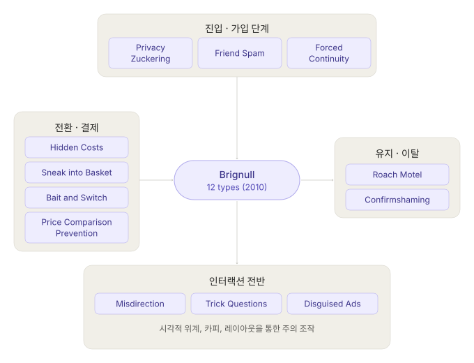
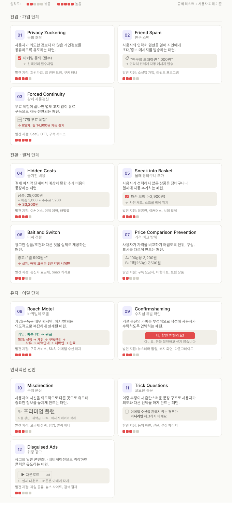
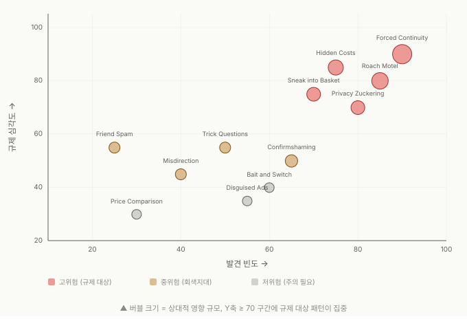

문제를 해결하려면 먼저 이름을 붙여야 한다. 이 편은 다크패턴에 공통 언어를 부여한다.

---

## 왜 분류가 필요한가

[ep.01](/dark-pattern-anatomy-ep-01)에서는 다크패턴의 정의와 판단 기준을, [ep.02](/dark-pattern-anatomy-ep-02)에서 작동 원리를 다뤘습니다. 이제 "구체적으로 어떤 유형이 있는가"를 정리할 차례입니다.

실무적으로 분류는 중요합니다.

"이 UI가 뭔가 이상하다"는 직감은 좋은 출발점이지만, 팀 내에서 문제를 논의하려면 공유된 언어가 필요합니다. "이건 Confirmshaming이다"라고 말할 수 있으면, 문제 정의 → 사례 검색 → 대안 설계의 속도가 달라집니다. 코드 리뷰에서 "이건 버그다"와 "뭔가 좀 이상하다"의 차이와 같습니다.

현재 널리 사용되는 분류 체계는 세 가지입니다.

1. **Brignull의 12유형** (2010) — 이 편에서 다룹니다.
2. **Mathur et al.의 실증 분류** (2019) — 다음 편에서 다룹니다.
3. **공정거래위원회 6대 유형** (2023~2025) — 다음 편에서 다룹니다.

이 편에서는 Brignull의 원형 분류를 심층적으로 다뤄봅니다.

---

## Brignull 분류의 맥락

Harry Brignull이 2010년에 정의한 12가지 유형은 다크패턴 연구의 출발점입니다. 학술 연구, 규제 문서, 실무 논의에서 가장 많이 인용되는 분류이며, 이후 등장한 모든 분류 체계의 기반이 되었습니다.

이 분류의 강점은 **직관적인 명명**에 있습니다. (영미권 사람들 기준으로요.) "Roach Motel(바퀴벌레 덫)"이라는 이름만 들어도 "들어가긴 쉽고 나오긴 어렵다"는 구조가 이해됩니다.
"Confirmshaming(컨펌쉐이밍)"이라는 이름은 패턴의 메커니즘(수치심(shaming)을 통한 확인 유도)을 정확히 전달합니다.

한계도 있는데요, 12가지 유형이 상호 배타적이지 않아서 하나의 UI가 여러 유형에 동시에 해당할 수 있습니다. 또한 2010년 이후 등장한 새로운 패턴(가짜 희소성, 가짜 실시간 카운터 등)이 포함되어 있지 않다. 그리고 전자상거래에 편중되어 있어, 소셜 미디어나 게임의 다크패턴을 충분히 포괄하지 못합니다.

이런 한계에도 불구하고, Brignull 분류는 "다크패턴을 처음 배우는 사람에게 가장 좋은 출발점"이라는 위치를 유지하고 있습니다. 이 편에서는 12유형을 사용자 여정의 단계별로 재배치해보았습니다.

---

## 12가지 유형 카탈로그

### 진입·가입 단계

이 단계의 다크패턴은 사용자가 서비스에 진입하는 과정에서 의도하지 않은 동의나 정보 제공을 유도합니다.

#### 01. Privacy Zuckering (동의 조작)

- **정의**: 사용자가 의도한 것보다 더 많은 개인정보를 공유하도록 유도하는 패턴
 이름은 Facebook(현 Meta)의 마크 저커버그(Mark 'Zucker'berg)에서 유래했습니다. Facebook이 반복적으로 개인정보 설정을 복잡하게 만들고, 기본값을 "공개"로 설정하여 사용자의 데이터를 최대한 수집한 관행을 지칭합니다.

- **어디서 발생하는가**: 회원가입 시 마케팅 동의 체크박스가 사전 체크되어 있거나, 앱 설치 시 불필요한 권한(연락처, 위치, 카메라)을 요구하거나, 쿠키 배너에서 "모두 동의"만 눈에 띄게 배치하는 경우

- **왜 작동하는가**: 기본값 효과로, 대부분의 사용자는 기본 설정을 변경하지 않습니다. "필수"와 "선택"의 시각적 구분이 불명확하면, 사용자는 모든 항목이 필수라고 오해합니다.

- **규제 상태**: 한국 전자상거래법의 "특정옵션 사전선택" 금지 조항, EU GDPR의 "명시적 동의(explicit consent)" 요건에 직접 해당합니다.

#### 02. Friend Spam (친구 스팸)

- **정의**: 사용자의 연락처 접근 권한을 획득한 후, 사용자의 이름으로 지인에게 초대·홍보 메시지를 보내는 패턴

- **대표 사례**: LinkedIn은 2015년 사용자 연락처를 이용한 대량 초대 메일 발송 사건으로 1,300만 달러의 합의를 한 바 있습니다. 사용자가 "연락처 동기화"를 누르면, LinkedIn이 연락처의 모든 이메일 주소로 반복적인 초대 메일을 보냈습니다.

- **어디서 발생하는가**: 소셜 앱 가입 과정에서 "친구 찾기"를 핵심 단계로 배치하고 연락처 권한을 요청하는 경우, 리워드 프로그램에서 "친구 초대"가 사실상 연락처 전체에 대한 메시지 발송인 경우

#### 03. Forced Continuity (숨은 갱신)

- **정의**: 무료 체험 기간이 종료되면 별도의 안내나 확인 없이 유료 구독으로 자동 전환되는 패턴

- **왜 작동하는가**: 손실 회피 + 기본값 효과의 결합으로 작동합니다. 무료 체험에 가입할 때 결제 정보를 입력하게 하고, 체험 종료 시 눈에 띄지 않는 이메일 한 통으로 고지한 후 자동 결제가 시작됩니다. 사용자가 해지하지 않으면 동의한 것으로 간주하는 구조입니다.

- **규제 상태**: 한국 전자상거래법의 "숨은 갱신" 금지 조항에 해당합니다. 미국의 Click-to-Cancel법(2025년 7월 시행)은 이 패턴을 정면으로 겨냥합니다.

---

### 전환·결제 단계

결제 과정에서 가격을 조작하거나, 의도하지 않은 추가 상품을 끼워넣는 패턴입니다. 금전적 피해가 직접적이어서 규제 강도가 가장 높습니다.

#### 04. Hidden Costs (숨겨진 비용)

- **정의**: 결제 프로세스의 마지막 단계에서 예상치 못한 추가 비용(수수료, 세금, 배송비 등)이 등장하는 패턴

- **왜 작동하는가**: 앵커링입니다. 검색 결과나 상품 목록에서 본 가격이 기준점이 됩니다. 결제 직전에 추가 비용이 붙어도, 이미 상품 선택·장바구니 추가·배송지 입력까지 완료한 사용자는 매몰비용 오류로 인해 이탈하지 않는 경우가 많습니다.

- **규제 상태**: 한국 전자상거래법의 "순차공개 가격책정" 금지 조항에 해당합니다. 2025년 8월 계도기간 종료 후 본격적으로 단속이 시작됐습니다.

#### 05. Sneak into Basket (몰래 장바구니 추가)

- **정의**: 사용자가 명시적으로 선택하지 않은 상품이나 서비스를 장바구니 또는 결제 금액에 자동으로 추가하는 패턴

- **어디서 발생하는가**: 항공권 예약 시 사전 체크된 "여행자 보험", 이커머스에서 자동 추가되는 "파손 보장 서비스", 결제 화면에서 스크롤 아래에 숨어 있는 추가 옵션

#### 06. Bait and Switch (유인 판매)

- **정의**: 광고하거나 약속한 것과 다른 상품, 가격, 조건을 실제로 제공하는 패턴

- **어디서 발생하는가**: 가장 고전적인 기만 기법 중 하나로, 오프라인 시대부터 존재했습니다. 디지털 환경에서는 "월 990원~"으로 광고하고 실제로는 3년 약정 시에만 해당하는 가격을 작게 표시하거나, 광고 상품이 "품절"이고 더 비싼 대안을 추천하는 형태로 나타납니다.

#### 07. Price Comparison Prevention (가격비교 방해)

- **정의**: 사용자가 상품이나 서비스의 가격을 쉽게 비교하지 못하도록 단위, 구성, 표시 방식을 의도적으로 다르게 만드는 패턴

- **대표 예시**: 같은 카테고리의 구독 요금제를 월 단위, 연 단위, 일 단위로 혼합 표시하거나, 묶음 상품과 개별 상품의 단위를 다르게 표시하여 즉각적인 비교를 어렵게 만듭니다.

---

### 유지·이탈 단계

사용자가 서비스를 떠나려 할 때 작동하는 패턴입니다. 규제 기관이 가장 주목하는 영역이기도 합니다.

#### 08. Roach Motel (바퀴벌레 덫)

- **정의**: 가입, 구독, 동의는 매우 쉽게 설계하되, 해지, 탈퇴, 취소는 의도적으로 복잡하게 만드는 패턴
 이름의 유래는 바퀴벌레 트랩으로, 들어가긴 쉽지만 나올 수 없는 구조를 말합니다. 다크패턴 중 가장 널리 알려져 있고, 가장 많은 규제 제재를 받은 유형입니다.

- **대표 사례**: FTC는 Amazon Prime의 해지 프로세스를 핵심 정점으로 소송 제기한 적이 있습니다. Amazon이 해지 과정을 의도적으로 "Iliad(일리아드)"라는 이름의 프로젝트로 관리하며 복잡하게 설계했다고 주장했습니다. 2025년 10월 한국 공정위의 시정명령에서도 "취소·탈퇴 등의 방해"가 가장 많은 15건으로 집계되었습니다.

- **왜 작동하는가**: 매몰비용 오류를 기반으로 작동합니다. 해지 프로세스가 5단계라면, 3단계까지 진행한 사용자는 "여기까지 왔는데"라는 이유로 완료하지 않고 지쳐 포기하는 경우가 있습니다. 각 단계마다 혜택 안내, 할인 제안, 감정적 카피가 추가되면 해지 중 이탈률은 더 높아집니다.

#### 09. Confirmshaming (컨펌쉐이밍)

- **정의**: 거절 옵션의 카피를 부정적으로 작성하여, 사용자가 수치심 등의 심리적 저항 때문에 수락을 선택하도록 만드는 패턴

- **대표 예시**: "아니요, 할인이 필요 없습니다", "아니요, 정가로 구매하겠습니다", "괜찮아요, 혜택 없이 진행할게요", "나중에 후회해도 괜찮습니다"

- **왜 작동하는가**: 손실 회피 + 프레이밍 효과로 작동합니다. 거절을 "손해를 자처하는 행위"로 프레이밍합니다. 논리적으로는 "마케팅 이메일을 거부한다"는 중립적 선택인데, 카피가 그것을 "이익의 포기"로 바꿔놓습니다.

- **심각도 논쟁**: 다른 유형에 비해 금전적 피해가 직접적이지 않아 규제 대상으로 분류되지 않는 경우가 많습니다. 그러나 반복적인 컨펌쉐이밍은 사용자의 자율적 의사결정을 침해하며, 특히 취약 계층(디지털 리터러시가 낮은 사용자)에게 더 큰 영향을 미칩니다.

---

### 인터랙션 전반

특정 단계에 국한되지 않고, UI의 시각적 요소와 카피를 통해 사용자의 주의를 조작하는 패턴입니다.

#### 10. Misdirection (주의 분산)

- **정의**: 사용자의 시선이나 주의를 의도적으로 한 곳으로 유도하여, 다른 곳에 있는 중요한 정보를 놓치게 만드는 패턴

- **대표 예시**: 큰 글씨로 혜택을 강조하고 작은 글씨로 조건을 표시, 밝은 색으로 사업자에게 유리한 옵션을 강조하고 어두운 색으로 사용자에게 유리한 옵션을 표시, 핵심 정보를 스크롤이 필요한 위치에 배치

#### 11. Trick Questions (속임수 질문)

- **정의**: 이중 부정이나 혼란스러운 문장 구조를 사용하여, 사용자가 의도와 다른 선택을 하게 만드는 패턴

- **대표 예시**: "이메일 수신을 원하지 않는 경우가 아니라면 체크하지 마세요" — 이 문장을 빠르게 읽으면 체크해야 하는지 해제해야 하는지 즉각 판단하기 어렵습니다. 시스템 1은 "체크하지 마세요"라는 부분만 잡아내고, 이중 부정의 실제 의미를 해석하지 못합니다.

#### 12. Disguised Ads (위장 광고)

- **정의**: 광고를 일반 콘텐츠, 네비게이션 요소, 또는 시스템 UI로 위장하여 클릭을 유도하는 패턴

- **대표 예시**: 파일 다운로드 사이트에서 실제 다운로드 버튼보다 눈에 띄게 배치된 "다운로드" 광고 버튼, 뉴스 기사 사이에 삽입된 "추천 콘텐츠"로 위장된 광고, 검색 결과에서 광고 표시가 극도로 작거나 색상이 배경과 유사한 경우

---

## 빈도와 심각도의 분포

12가지 유형은 모두 같은 무게를 가지지 않습니다. 어떤 패턴은 거의 모든 서비스에서 발견되지만 규제 심각도가 낮고, 어떤 패턴은 드물게 발견되지만 한 번 적발되면 제재가 큽니다.

| # | 패턴 | 빈도 | 심각도 | 영향 규모 | 위험 구간 |
|---|---|---:|---:|---:|---|
| 1 | Forced Continuity | 90 | 90 | 14 | 고위험 |
| 2 | Hidden Costs | 75 | 85 | 11 | 고위험 |
| 3 | Roach Motel | 85 | 80 | 12 | 고위험 |
| 4 | Sneak into Basket | 70 | 75 | 10 | 고위험 |
| 5 | Privacy Zuckering | 80 | 70 | 10 | 고위험 |
| 6 | Trick Questions | 50 | 55 | 8 | 중위험 |
| 7 | Friend Spam | 25 | 55 | 8 | 중위험 |
| 8 | Confirmshaming | 65 | 50 | 9 | 중위험 |
| 9 | Misdirection | 40 | 45 | 8 | 중위험 |
| 10 | Bait and Switch | 60 | 40 | 7 | 저위험 |
| 11 | Disguised Ads | 55 | 35 | 7 | 저위험 |
| 12 | Price Comparison | 30 | 30 | 7 | 저위험 |

**고위험·고빈도 영역**

숨은 갱신 (Forced Continuity), 바퀴벌레 덫(Roach Motel), 숨겨진 비용(Hidden Costs)이 여기에 속합니다. 가장 자주 발견되고, 규제 제재도 가장 큽니다. 전자상거래법의 6개 금지 유형 중 대부분이 이 영역에 해당합니다. **우선 점검 대상**입니다.

**중위험 영역**

컨펌쉐이밍(Confirmshaming), 속임수 질문 (Trick Questions), 동의 조작 (Privacy Zuckering) 등 빈도는 높지만 금전적 피해가 간접적이거나, 규제 기준이 아직 명확하지 않은 회색지대입니다. **개선 권장 대상**입니다.

**저위험 영역**

가격비교 방해(Price Comparison Prevention), 위장 광고(Disguised Ads) 등 비교적 발견 빈도가 낮거나, 규제 대상에서 명시적으로 다뤄지지 않는 유형입니다. **인지하되 우선순위를 낮춰도 되는 대상**입니다.

*주의: 이 분류는 2025~2026년 기준입니다. 규제 환경은 빠르게 변하고 있으며, 현재 저위험인 유형이 내년에는 고위험이 될 수 있습니다. 예를 들어 컨펌쉐이밍(Confirmshaming)은 현재는 명시적 규제 대상이 아니지만, 소비자 민원과 학술 연구가 축적되면서 규제 논의가 시작되고 있습니다.

---

## 12유형의 한계와 확장

Brignull의 분류는 출발점이지 완결판이 아닙니다. 알아야 할 한계가 세 가지 있습니다:

**1. 상호 배타적이지 않습니다.**

하나의 UI가 여러 유형에 동시에 해당할 수 있습니다. 해지 화면에서 Roach Motel(복잡한 단계) + Confirmshaming("정말 떠나시겠어요?") + Misdirection(유지 버튼 강조)이 동시에 보여질 수 있습니다.

**2. 2010년 이후의 패턴이 누락되어 있습니다.**

가짜 실시간 카운터(Fake Activity), 가짜 희소성(Fake Scarcity), 반복 간섭(Nagging), 감정적 언어사용(Emotional Manipulation) 등 모바일·소셜 시대의 패턴은 포함되어 있지 않습니다.

**3. 규제 기준과 1:1로 대응하지 않습니다.**

한국 공정위의 6대 유형은 Brignull의 12유형과 겹치지만 일치하지 않습니다. 실무에서는 여러 분류를 함께 사용해야 합니다.

이런 한계를 보완하기 위해, 다음 편에서 Mathur et al.의 실증 분류와 공정위 6대 유형을 다루고, 세 분류 체계를 하나의 통합 매핑으로 정리하겠습니다.

---

## 자가 점검: 12유형 빠른 스캔

자기 제품을 12유형 기준으로 빠르게 스캔하려면, 다음 체크리스트를 사용하면 좋습니다.

**가입 단계**
- 사전 체크된 동의 항목이 있는가? → Privacy Zuckering (동의 조작)
- 연락처 접근을 핵심 단계에서 요구하는가? → Friend Spam (친구 스팸)
- 무료 체험에 결제 정보를 요구하는가? → Forced Continuity (숨은 갱신)

**결제 단계**
- 검색 결과 가격과 최종 결제 가격이 다른가? → Hidden Costs (숨겨진 비용)
- 사용자가 선택하지 않은 항목이 결제에 포함되는가? → Sneak into Basket (몰래 장바구니 추가)
- 광고 가격과 실제 조건이 다른가? → Bait and Switch (유인 판매)
- 가격 비교가 의도적으로 어렵게 되어 있는가? → Price Comparison Prevention (가격비교 방해)

**해지 단계**
- 해지 단계가 가입 단계보다 많은가? → Roach Motel (바퀴벌레 덫)
- 거절 카피가 부정적으로 작성되어 있는가? → Confirmshaming (컨펌쉐이밍)

**UI 전반**
- 중요한 정보가 시각적으로 덜 눈에 띄는가? → Misdirection (주의 분산)
- 혼란스러운 이중 부정 문장이 있는가? → Trick Questions (속임수 질문)
- 광고가 콘텐츠나 UI로 위장되어 있는가? → Disguised Ads (위장 광고)

하나라도 "예"가 나오면, 해당 유형의 상세 분석([ep.05](/dark-pattern-anatomy-ep-05)~[ep.09](/dark-pattern-anatomy-ep-09))과 대안 설계([ep.12](/dark-pattern-anatomy-ep-12))를 참고하면 좋습니다.

---

## 참고 자료

- Brignull, H. (2010). Dark Patterns: Deception vs. Honesty in UI Design. darkpatterns.org (현 deceptive.design)
- Brignull, H. (2023). *Deceptive Patterns: Exposing the Tricks Tech Companies Use to Control You.* Testimonium.
- Gray, C. M. et al. (2018). The Dark (Patterns) Side of UX Design. *CHI 2018.*
- Mathur, A. et al. (2019). Dark Patterns at Scale: Findings from a Crawl of 11K Shopping Websites. *Proceedings of the ACM on Human-Computer Interaction*, 3(CSCW), 1-32.
- 공정거래위원회. (2023). 온라인 다크패턴 자율관리 가이드라인.
- 공정거래위원회. (2025). 6개 유형 온라인 다크패턴 규제문답서.
- FTC. (2023). *FTC Takes Action Against Amazon for Enrolling Consumers in Amazon Prime Without Consent and Sabotaging Their Attempts to Cancel.* Press Release.

---

## 다음 편 예고

> [ep.04 - 분류 지도 ② — Mathur의 실증 분류와 공정위 6유형](/dark-pattern-anatomy-ep-04)

Brignull 분류가 "전문가의 관찰"에 기반했다면, Mathur et al.의 분류는 11,000개 쇼핑몰을 크롤링한 실증 데이터에 기반합니다. 그리고 한국 공정위의 6대 유형은 "법적으로 금지된 것"의 기준입니다. 세 분류를 겹쳐놓으면 무엇이 보이는지 통합 매핑 테이블과 "어떤 분류를 언제 쓸 것인가" 의사결정 트리를 제공합니다.
