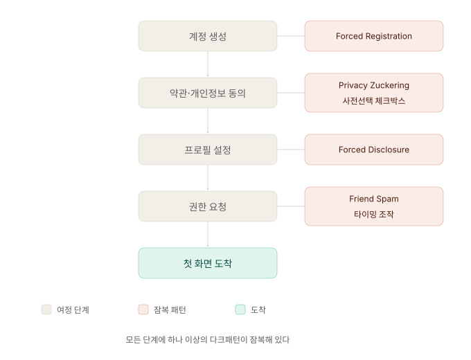

사용자가 서비스에 처음 진입하는 순간, 가장 많은 개인정보를 넘기고 가장 많은 약관에 동의한다. 이 "첫 만남"에서 어떤 패턴들이 사용자의 판단을 흐리는가? 그리고 정직한 온보딩은 어떻게 설계할 수 있는가?

---

## 가입 여정의 구조

모든 서비스의 가입 여정은 비슷한 단계를 거칩니다. 계정 생성 → 약관·개인정보 동의 → 프로필 설정 → 권한 요청 → 첫 화면 도착.

다크패턴은 이 각 단계에 하나씩 잠복해 있습니다. 단계별로 어떤 패턴이 어디에 숨는지 분석해봅시다.

---

## 패턴 1. 동의 조작 - Privacy Zuckering

### 정의

사용자가 의도한 것보다 더 많은 개인정보를 공유하도록 인터페이스를 설계하는 패턴입니다. 이름은 Facebook의 Mark Zeckerburg에서 유래했으며, 개인정보 보호 설정을 의도적으로 복잡하거나 불리하게 기본 설정하는 행위 전반을 가리킵니다.

### 작동 메커니즘

이 패턴은 [ep.02](/dark-pattern-anatomy-ep-02)에서 다룬 **기본값 효과(Default Effect)** 를 정확히 활용합니다.

대부분의 사용자는 기본 설정을 바꾸지 않습니다. 연구에 따르면 약관 동의 화면에서 기본값이 "동의"로 설정되어 있을 때 옵트아웃 비율은 5\~15%에 불과합니다. 반대로 옵트인 방식으로 설계하면 동의 비율은 40\~60%로 떨어집니다. 이 차이가 곧 기업의 데이터 수집량 차이가 됩니다.

### 구체적 양상

**① 사전 선택된 체크박스 (Pre-checked Checkbox)**

약관 동의 화면에서 마케팅 수신 동의, 제3자 정보 제공 동의가 미리 체크되어 있습니다. 필수 동의와 선택 동의가 시각적으로 구분되지 않거나, 필수 동의 체크박스 사이에 선택 동의가 끼워져 있어 사용자가 무심코 모두 동의하게 만듭니다. 공정위 6유형 중 "특정옵션 사전선택"에 해당하며, 2025년 2월부터 전자상거래법으로 금지되었습니다.

**② 묶음 동의 (Bundled Consent)**

"이용약관 및 개인정보 처리방침에 동의합니다"처럼 여러 문서를 하나의 동의로 묶습니다. 사용자는 약관 전문을 읽지 않고 동의 버튼을 누르게 됩니다. 개인정보보호법에서는 필수·선택 동의의 분리를 요구하지만, UI 설계에서 "전체 동의" 버튼을 가장 눈에 띄게 배치하여 사실상 묶음 동의를 유도하는 경우가 여전히 흔합니다.

**③ 개인정보 설정의 깊은 매장 (Buried Settings)**

프라이버시 설정이 메뉴 3~4단계 아래에 위치하거나, 설정 화면의 레이블이 모호해서 사용자가 찾기 어렵게 만듭니다. 초기 설정은 최대 공개로 되어 있고, 이를 변경하려면 설정 > 계정 > 개인정보 > 데이터 관리 > 제3자 공유 같은 경로를 탐색해야 합니다.

### 법적 위험도

공정위 6유형 중 **"특정옵션 사전선택"** 에 정확히 해당하며, 2025년 2월부터 전자상거래법으로 금지되었습니다. 또한 개인정보보호법 제22조(동의를 받는 방법)는 "필수 동의와 선택 동의의 분리", "개인정보 수집·이용 목적, 항목, 보유 기간의 명확한 고지"를 요구합니다.

EU GDPR Article 7도 "freely given, specific, informed and unambiguous" 동의를 요구하며, 사전 체크된 체크박스를 무효 처리합니다(Planet49 판결, CJEU C-673/17).

### Before/After

**Before (다크패턴)**: "전체 동의" 버튼을 화면 상단에 크고 진하게 배치, 개별 동의 항목을 접힌 아코디언 안에 숨김, 필수와 선택이 같은 색상·크기의 체크박스로 나열됨

**After (정직한 설계)**: 필수 동의와 선택 동의가 시각적으로 명확히 분리, 선택 동의는 기본값이 체크 해제, 각 약관 옆에 "요약 보기" 링크로 핵심 내용을 3줄로 요약 제공

---

## 패턴 2. 진입을 위한 강제 - Forced Action

### 정의

사용자가 원래 목적을 달성하기 위해 원하지 않는 추가 행동을 강제당하는 패턴입니다. "이 기능을 사용하려면 먼저 ___을 해야 합니다"라는 구조가 전형적입니다.

### 작동 메커니즘

이 패턴은 매몰비용 편향과 게이트키핑(Gatekeeping)을 결합합니다.

사용자가 상품 탐색·콘텐츠 열람 등 1차 의도에 시간을 투자한 뒤에 강제 단계가 등장하기 때문에, "여기까지 왔는데"라는 심리로 추가 요구를 수용하게 됩니다. 또한 "필수"라는 시각적 표시(빨간 별표, 비활성화된 다음 버튼)는 시스템 레벨의 강제처럼 인식되어 거부 임계치가 더욱 낮아집니다.

### 구체적 양상

**① 게스트 옵션 없는 가입 강제 (Forced Registration)**

상품을 구매하거나 콘텐츠를 열람하기 위해 계정을 만들어야 하는 경우, 게스트 결제 옵션을 제공하지 않거나, 제공하더라도 매우 작은 링크로 숨겨두는 것이 대표적입니다. Baymard Institute의 연구에 따르면 계정 생성을 강제하는 것은 전자상거래 장바구니에서의 이탈 상위 원인 중 하나입니다.

**② 불필요한 정보 요구 (Forced Disclosure)**

서비스 이용에 꼭 필요하지 않은 정보(생년월일, 성별, 관심사 등)를 필수 입력으로 요구합니다. 폼 필드에 빨간색 별표(\*)가 붙어있고, 이를 입력하지 않으면 다음 단계로 진행이 불가능합니다.

**③ 소셜 미디어 연동 강제 (Social Pyramid)**

"친구 5명을 초대하면 잠금이 해제됩니다"처럼, 핵심 기능의 이용을 소셜 활동에 연결짓는 패턴입니다. 사용자의 사회적 관계망을 마케팅 채널로 강제 동원합니다.

### 법적 위험도

직접적으로 "Forced Action"이라는 조항이 있지는 않지만, 개인정보보호법 제16조(개인정보의 수집 제한)는 "필요 최소한의 정보 수집"을 원칙으로 규정합니다. 서비스 이용에 비례하지 않는 정보를 필수로 요구하는 것은 동 조항 위반 소지가 있습니다. Forced Registration은 공정위 소비자보호 지침의 "선택권 침해" 항목과 결합 해석이 가능합니다.

### Before/After

**Before (다크패턴)**: 결제 페이지에 "계속하려면 로그인 또는 회원가입"만 표시, 게스트 결제 링크 없음. 회원가입 폼에 생년월일·성별·직업이 모두 필수.

**After (정직한 설계)**: "게스트로 결제하기" 버튼을 회원가입 버튼과 동등한 크기·위치에 배치. 결제 완료 후 선택적으로 계정 생성을 제안. 회원가입 폼은 이메일·비밀번호만 필수, 나머지는 "선택" 라벨로 명시.

---

## 패턴 3. 연락처 권한의 오남용 - Friend Spam

### 정의

사용자의 연락처 접근 권한을 얻은 후, 사용자가 명시적으로 의도하지 않은 방식으로 연락처에 있는 사람들에게 초대 메시지나 알림을 보내는 패턴입니다. 권한의 "범위 일탈"이 핵심입니다.

### 작동 메커니즘

권한 요청 화면의 카피가 "친구를 찾기 위해 연락처를 사용합니다"처럼 좁게 표현되더라도, 실제로는 그 연락처가 마케팅 발송 대상으로 확장됩니다. 사용자는 권한을 1회성 검색 용도로 동의했다고 인식하지만, 시스템은 그것을 지속적·반복적 발송 권한으로 해석합니다. 권한 동의의 범위와 실제 사용의 범위 사이에 의도적 갭(Permission Gap)이 발생합니다.

이 패턴은 또한 사회적 신뢰를 자원으로 활용합니다. 초대 메시지가 실제 친구의 이름으로 발송되기 때문에 수신자는 신뢰도 높은 메시지로 인식하게 되고, 발신자는 자신의 이름이 마케팅 도구로 사용되었다는 사실을 사후에야 알게 됩니다.

### 구체적 양상

**① 무단 초대 메시지 발송**

연락처 접근 동의 후 사용자 동의 없이 친구에게 가입 권유 메시지를 발송합니다. 발신자 이름이 사용자 본인의 이름으로 표시됩니다.

**② 자동 리마인더 발송**

최초 초대 메시지가 무시되면 며칠 간격으로 후속 리마인더가 자동 발송됩니다. 사용자는 한 번만 발송될 것으로 기대하지만, 시스템은 응답이 올 때까지 반복 발송합니다.

**③ "아는 사람일 수도 있어요" 추천 데이터 활용**

업로드된 연락처를 추천 알고리즘의 학습 데이터로 사용하여, 연락처를 공유한 적 없는 다른 사용자에게도 "아는 사람일 수도 있다"라는 형태로 노출합니다.

### 법적 위험도

이 패턴으로 가장 큰 제재를 받은 사례는 LinkedIn입니다. 2015년 미국에서 1,300만 달러 합의로 소송이 종결됐습니다. 사용자가 "연락처에서 아는 사람 찾기" 기능을 사용하면 LinkedIn이 사용자의 연락처에 두 차례의 추가 리마인더 이메일을 자동 발송했고, 이것이 동의 범위를 초과한 것으로 인정되었습니다.

국내에서는 개인정보보호법 제17조(개인정보의 제공)와 제18조(개인정보의 목적 외 이용·제공의 제한)에 직접 저촉됩니다. 연락처 데이터는 정보주체(친구)의 개인정보이며, 사용자의 동의만으로는 제3자에게 마케팅 메시지를 발송할 근거가 되지 않습니다.

### Before/After

**Before (다크패턴)**: "친구를 찾기 위해 연락처를 사용합니다"로 권한 요청 → 동의 시 모든 연락처에 사용자 명의로 가입 권유 SMS·이메일 자동 발송 → 응답 없으면 3일·7일 후 리마인더 추가 발송.

**After (정직한 설계)**: 권한 요청 시 "연락처에서 이미 가입한 친구를 찾기 위해 사용합니다. 메시지 발송에는 별도 동의가 필요합니다"로 범위 명시 → 친구 발견 시 "초대 메시지 보내기" 버튼을 사용자가 명시적으로 누를 때만 발송 → 리마인더는 발송하지 않음.

---

## 패턴 4. 권한 요청의 타이밍 조작 - Permission Bombardment

### 정의

앱의 초기 실행 직후, 맥락 없이 여러 개의 시스템 권한(위치, 카메라, 마이크, 연락처, 알림 등)을 연속으로 요청하는 패턴입니다. 권한과 기능의 연결고리를 끊고 일괄 수락을 유도합니다.

### 작동 메커니즘

iOS와 Android의 권한 다이얼로그는 시스템 레벨 UI이므로, 사용자는 이를 "반드시 수락해야 하는 절차"로 인식하기 쉽습니다. 특히 앱을 처음 실행한 직후에는 사용자가 서비스에 대한 기대감이 높아 거절 임계치가 낮아집니다.

여기에 인지 과부하가 결합됩니다. 권한이 4~5개 연속 등장하면 사용자는 각 권한의 의미를 평가하지 못한 채 "수락"을 반복 누르게 됩니다. 또한 "거절"을 4번 누르는 것이 "수락"을 4번 누르는 것보다 심리적으로 더 무겁게 느껴지는 마찰 비대칭(Friction Asymmetry)을 활용합니다.

### 구체적 양상

**① 최초 실행 시 일괄 요청**

앱 최초 실행 직후 위치 → 카메라 → 마이크 → 연락처 → 알림 권한이 연속 다이얼로그로 등장합니다. 어떤 기능에 어떤 권한이 필요한지에 대한 설명이 없습니다.

**② 권한 거절 후 재요청 우회**

OS의 표준 다이얼로그를 거절한 사용자에게, 자체 디자인된 모달로 "알림을 켜야 더 좋은 경험을 할 수 있습니다"라며 OS 설정 화면으로 이동시켜 재시도를 유도합니다. [ep.09](/dark-pattern-anatomy-ep-09)의 Nagging과 결합됩니다.

**③ "전체 허용" 단일 버튼**

여러 권한을 묶어 "모두 허용" 버튼 하나로 일괄 수락하도록 만들고, 개별 거절 옵션은 작은 텍스트 링크로 처리합니다.

### 법적 위험도

iOS는 14 버전부터 권한 요청 시 사유(Purpose String) 명시를 의무화했고, Android 13부터는 알림 권한도 명시적 요청 대상이 되었습니다. 플랫폼 정책 위반 시 앱 심사에서 거부될 수 있으며, 국내에서는 개인정보보호법 제15조의 "수집 목적의 명확한 고지" 의무에 저촉될 수 있습니다.

### Before/After

**Before (다크패턴)**: 앱 최초 실행 → 위치 권한 → 카메라 권한 → 연락처 권한 → 알림 권한 연속 요청. 사용자는 "아니오"를 4번 눌러야 모두 거절 가능.

**After (정직한 설계)**: 최초 실행 시에는 필수 권한만 요청하고, 나머지 권한은 해당 기능을 처음 사용하는 시점에, 왜 이 권한이 필요한지 설명과 함께 요청. 예: 사진 업로드 버튼 클릭 → "사진을 업로드하려면 카메라 접근이 필요합니다" → 권한 요청.

---

## 다크패턴 vs 합법적 데이터 수집의 경계

가입·온보딩 단계의 다크패턴은 "데이터 수집 자체"가 문제가 아닙니다. 문제는 수집의 방식입니다. 아래 세 가지 기준으로 판별할 수 있습니다.

**투명성**: 사용자가 어떤 데이터가 어떤 목적으로 수집되는지 이해할 수 있는가?
**비례성**: 요청하는 데이터가 제공하는 기능에 비례하는가? (날씨 앱이 연락처를 요구하는 것은 비례하지 않습니다)
**기본값**: 데이터 공유의 기본값이 사용자의 이익에 부합하는가? (기본값이 "최소 공개"인가, "최대 공개"인가?)

---

## 자가 점검 체크리스트

내 서비스의 가입·온보딩 여정에서 아래 항목을 점검해보세요.

1. 선택 동의 항목의 체크박스가 사전 선택(pre-checked)되어 있지 않은가?
2. 필수 동의와 선택 동의가 시각적으로 명확히 구분되어 있는가?
3. "전체 동의" 버튼이 개별 동의보다 과도하게 강조되어 있지 않은가?
4. 게스트 이용이나 게스트 결제 옵션이 존재하는가?
5. 가입 시 요구하는 정보가 서비스 제공에 실제로 필요한 것인가?
6. 연락처 권한을 받은 후, 사용자가 명시적으로 의도한 범위 내에서만 활용하는가?
7. 시스템 권한 요청이 해당 기능의 사용 시점에 맞춰 이루어지는가?
8. 개인정보 설정 화면이 2단계 이내에서 접근 가능한가?

---

## 참고 자료

- Brignull, H. (2010). Dark Patterns: Deception vs. Honesty in UI Design. deceptive.design
- Mathur, A. et al. (2019). Dark Patterns at Scale: Findings from a Crawl of 11K Shopping Websites. *Proceedings of the ACM on Human-Computer Interaction*
- 공정거래위원회 (2025). 6개 유형 온라인 다크패턴 규제문답서
- 개인정보보호위원회. 개인정보보호법 제22조(동의를 받는 방법)
- Baymard Institute. Cart Abandonment Rate Statistics

---

## 다음 편 예고

> [ep.06 - 결제의 함정 — Hidden Cost, Sneak into Basket, Drip Pricing](/dark-pattern-anatomy-ep-06)

결제 여정에서 잠복하는 다섯 가지 다크패턴(Hidden Cost, Sneak into Basket, Drip Pricing, Bait and Switch, Price Comparison Prevention)을 분석합니다. 앵커링과 매몰비용이 어떻게 가격 조작 패턴을 작동시키는지, 공정위 "순차공개 가격책정" 금지 조항이 실무에서 어떤 의미를 가지는지를 다룹니다.

