결제 버튼을 누르기 직전, 처음 봤던 가격과 최종 결제 금액이 다르다면? 장바구니에 넣지 않은 상품이 들어 있다면? 사용자의 지갑에 직접 영향을 미치는 패턴은 규제 기관이 가장 먼저, 가장 강하게 제재합니다.

---

## 결제 여정의 구조와 함정 위치

전형적인 결제 여정은 이렇게 흘러갑니다. 상품 탐색 → 상세 페이지 → 장바구니 → 주문 정보 입력 → 결제 확인 → 완료.

다크패턴은 이 여정의 거의 모든 단계에 잠복할 수 있습니다. 특히 **장바구니에서 결제 확인 사이의 구간**에 집중되는데요, 이 구간에서 사용자는 이미 구매 의사를 결정한 상태이므로 추가 비용이나 추가 상품이 나타나도 이탈 임계치가 높아져 있기 때문입니다.

2편에서 다룬 매몰비용 편향이 정확히 이 지점에서 작동합니다.

---

## 패턴 1. 마지막에 등장하는 비용 - Hidden Cost

### 정의

상품 탐색과 장바구니 단계에서는 보이지 않다가, 결제 직전 마지막 단계에서 추가 비용(배송비, 서비스 수수료, 세금, 처리 수수료 등)이 등장하는 패턴입니다.

### 작동 메커니즘

**앵커링(Anchoring) 효과**가 핵심입니다. 사용자는 상세 페이지에서 본 가격을 기준점(앵커)으로 삼습니다. 결제 마지막 단계에서 수수료가 추가되더라도, 이미 형성된 앵커 가격에 비해 "약간 더 비싼 정도"로 인식하게 됩니다.

여기에 매몰비용이 결합됩니다. 상품을 탐색하고, 장바구니에 담고, 배송지를 입력하는 데 들인 시간은 이미 회수 불가능한 비용입니다. 합리적으로는 무관해야 하지만, 사용자는 "여기까지 왔는데"라는 이유로 이탈하지 않고 결제를 진행합니다.

### 구체적 양상

**① 배송비의 지연 공개**

상품 상세 페이지에서 "무료배송"을 강조하지만, 실제로는 특정 금액 이상 구매 시에만 해당됩니다. 이 조건은 장바구니 단계에서야 작은 글씨로 표시됩니다.

**② 서비스 수수료·처리 수수료**

음식 배달, 공연 티켓, 숙박 예약 서비스에서 흔합니다. 상품 가격 9,900원으로 표시하고, 결제 단계에서 배달료 3,000원 + 서비스 수수료 500원 + 일회용 용기비 200원이 추가되어 실제 결제 금액이 13,600원이 되는 식입니다.

**③ 의무 가입비·관리비**

헬스클럽, 통신 서비스 등에서 월 이용료만 광고하고, 가입비·유심비·설치비 등은 계약 단계에서야 고지하는 경우입니다.

### 법적 위험도

공정위 6유형 중 **"순차공개 가격책정(Drip Pricing)"** 에 해당하며, 2025년 2월부터 전자상거래법으로 금지되었습니다. 공정위 소비자보호 지침(2025년 10월 시행)은 "첫 화면에 대표 상품 가격 표시"와 "상세화면에 구체적 할인 조건 고지"를 명시적으로 권고하고 있습니다.

### Before/After

**Before (다크패턴)**: 상품 상세 페이지에 "9,900원" 표시. 결제 페이지에서 배송비 3,000원, 서비스 수수료 500원 추가. 최종 금액 13,400원.

**After (정직한 설계)**: 상품 상세 페이지에 "예상 결제금액 13,400원 (상품 9,900원 + 배송비 3,000원 + 수수료 500원)" 표시. 가격 구성 요소를 처음부터 투명하게 공개.

---

## 패턴 2. 장바구니에 몰래 넣기 - Sneak into Basket

### 정의

사용자가 명시적으로 선택하지 않은 상품이나 서비스가 장바구니에 자동으로 추가되어 있는 패턴입니다.

### 구체적 양상

**① 추가 보험·보증 자동 선택**

항공권, 전자제품 구매 시 "여행자 보험", "연장 보증" 등이 기본으로 체크되어 장바구니에 포함됩니다. 사용자가 이를 해제하려면 체크박스를 찾아 클릭해야 합니다.

**② 기부금·팁 자동 포함**

결제 시 "환경보호 기부금 100원"이 기본으로 포함되어 있고, 제거하려면 작은 "x" 버튼을 찾아야 합니다.

**③ 관련 상품 자동 추가**

"이 상품을 구매한 고객이 함께 산 상품"이 장바구니에 자동으로 담기는 경우입니다. 정상적인 추천과 달리, 사용자의 명시적 선택 없이 장바구니에 추가된 상태로 나타납니다.

### Before/After

**Before (다크패턴)**: 항공권 예약 중 "수하물 보험 5,000원"이 사전 선택됨. 체크 해제 링크는 화면 하단 작은 글씨.

**After (정직한 설계)**: 추가 옵션은 기본값이 "선택 안 함"이며, 사용자가 원하면 명시적으로 "추가하기" 버튼을 눌러 선택. 공정위 기준 "특정옵션 사전선택" 금지 조항에 직접 해당하는 영역입니다.

---

## 패턴 3. 방울방울 떨어지는 가격 - Drip Pricing

### 정의

상품의 총 가격을 한 번에 공개하지 않고, 구매 과정의 각 단계에서 조금씩 추가 비용을 노출하는 패턴입니다. Hidden Cost와 유사하지만, Drip Pricing은 비용이 여러 단계에 걸쳐 **점진적으로** 늘어난다는 점이 다릅니다.

### 작동 메커니즘

각 단계에서 추가되는 금액이 소액이므로, 사용자는 개별 추가 비용을 대수롭지 않게 여깁니다. 하지만 누적되면 초기 표시 가격 대비 20~40% 이상 높아지는 경우도 있습니다. 이 패턴은 앵커링과 점진적 몰입(Escalation of Commitment)이 결합된 형태입니다.

### 구체적 양상

호텔 예약 사이트가 대표적입니다.

| 단계 | 항목 | 누적 금액 |
|---|---|---:|
| 1 | 1박 요금 | 80,000원 |
| 2 | + 리조트 수수료 | 95,000원 |
| 3 | + 청소비 | 105,000원 |
| 4 | + 시설 이용료 | 110,000원 |
| 5 | + 세금·봉사료 | 121,000원 |

초기 표시 가격 대비 51% 상승입니다.

공연 티켓 예매도 마찬가지입니다. 티켓 가격 55,000원 → 예매 수수료 3,300원 → 배송료 3,000원 → 시설이용료 1,000원. 최종 62,300원.

### 법적 위험도

공정위 6유형 중 "순차공개 가격책정"에 정확히 해당합니다. 2025년 10월 시행 소비자보호 지침에서 가장 구체적인 해석 기준이 제시된 유형 중 하나로, "소비자의 선택·조건 등에 따른 가격 변동을 명확하게 표시"할 것을 권고하고 있습니다.

---

## 패턴 4. 미끼 상품 - Bait and Switch

### 정의

특정 가격·조건으로 사용자를 유인한 후, 실제로는 다른(보통 더 비싼) 상품이나 서비스로 전환시키는 패턴입니다.

### 구체적 양상

"월 9,900원부터"라고 광고하지만, 해당 요금제는 거의 기능이 없고 실질적으로 사용하려면 29,900원 이상의 요금제를 선택해야 하는 경우가 전형적입니다. 또는 특가 상품을 클릭하면 "품절" 표시와 함께 더 비싼 대체 상품이 추천되는 경우가 있습니다.

### 핵심 판단 기준

"~부터"라는 가격 표시 자체는 합법적인 마케팅 기법입니다. 문제는 **광고된 가격으로 실제 구매가 가능한지 여부**입니다. 광고 가격이 도달 불가능하거나, 도달 조건이 비합리적으로 까다롭다면 미끼 전환에 해당합니다.

---

## 패턴 5. 비교를 막는 UI - Price Comparison Prevention

### 정의

사용자가 여러 상품이나 요금제의 가격을 직접 비교하기 어렵게 정보를 설계하는 패턴입니다.

### 구체적 양상

통신사 요금제 비교 페이지에서 각 요금제의 단위를 다르게 표시하거나(A 요금제는 월 단위, B 요금제는 연 단위), 포함 항목을 다르게 묶어 직접 비교가 불가능하게 만드는 것이 대표적입니다. 또는 가격 정렬 기능을 제공하지 않거나, 할인 전 가격과 할인 후 가격을 혼재하여 표시하는 것도 이 패턴에 해당합니다.

---

## 결제 다크패턴과 인지 편향의 매핑

| 패턴 | 핵심 편향 | 작동 원리 |
|---|---|---|
| Hidden Cost | 앵커링, 매몰비용 | 초기 가격에 고정 + 이미 투입한 시간 |
| Sneak into Basket | 기본값 효과, 부주의 | 해제하지 않으면 유지 |
| Drip Pricing | 앵커링, 점진적 몰입 | 소액 추가의 반복 |
| Bait and Switch | 앵커링, 대비 효과 | 미끼 가격과 실제 가격의 대비 |
| Price Comparison Prevention | 인지 과부하 | 비교 자체를 어렵게 |

---

## 자가 점검 체크리스트

내 서비스의 결제 여정에서 아래 항목을 확인해보세요.

1. 상품 상세 페이지에 표시된 가격과 최종 결제 금액 사이에 차이가 있는가? 있다면 그 차이가 어느 단계에서 공개되는가?
2. 배송비, 수수료, 세금 등 추가 비용이 결제 마지막 단계에서야 처음 등장하는가?
3. 장바구니에 사용자가 직접 선택하지 않은 상품·서비스가 기본으로 포함되어 있는가?
4. 추가 옵션(보험, 보증, 기부 등)의 기본값이 "선택됨"인가?
5. 요금제나 상품 비교 시, 단위·기간·포함 항목이 통일되어 있는가?
6. "~부터" 가격 표시가 사용되는 경우, 해당 가격의 조건이 명확히 표시되어 있는가?
7. 총 결제 금액이 결제 과정의 모든 단계에서 실시간으로 갱신되어 표시되는가?
8. 가격 변동 사유가 사용자가 이해할 수 있는 언어로 설명되어 있는가?
9. 할인 쿠폰·적립금 적용 시, 할인 전 원가와 할인 금액이 모두 표시되는가?
10. 결제 취소·환불 조건이 결제 확인 화면에 명시되어 있는가?

---

## 참고 자료

- Mathur, A. et al. (2019). Dark Patterns at Scale: Findings from a Crawl of 11K Shopping Websites. *Proceedings of the ACM on Human-Computer Interaction*, 3(CSCW), 1-32.
- 공정거래위원회. (2025). 전자상거래 등에서의 소비자보호 지침 (2025.10.24 시행).
- 공정거래위원회. (2025). 6개 유형 온라인 다크패턴 규제문답서.
- Baymard Institute. *Checkout UX Research*.
- OECD. (2022). Dark Commercial Patterns. *OECD Digital Economy Papers*, No. 336.

---

## 다음 편 예고

> [ep.07 - 구독과 해지의 함정 — Roach Motel, Subscription Trap](/dark-pattern-anatomy-ep-07)

구독 비즈니스에서 "이탈 방지"의 압력이 다크패턴으로 전환되는 지점을 해부합니다. Roach Motel, Subscription Trap, Forced Continuity, Hard to Cancel을 분석하고, Amazon Prime 25억 달러 합의(2025) 사례를 통해 "가입과 해지의 대칭성"이 어떻게 글로벌 규제 표준이 되었는지를 추적합니다.