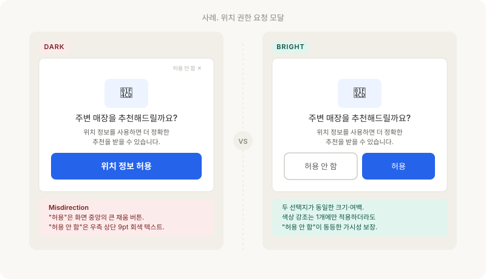
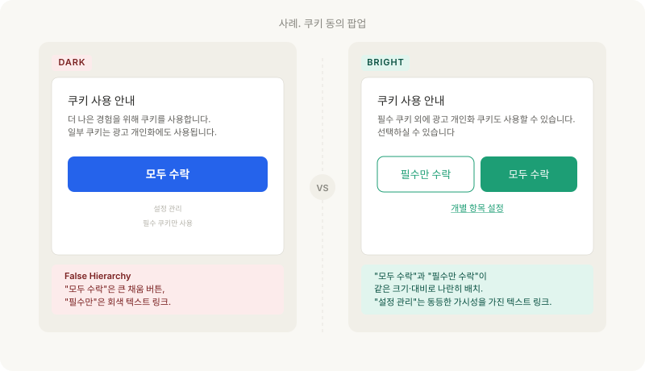
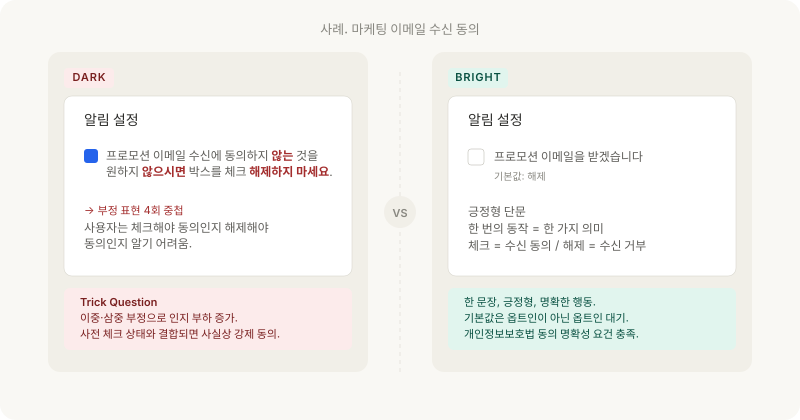
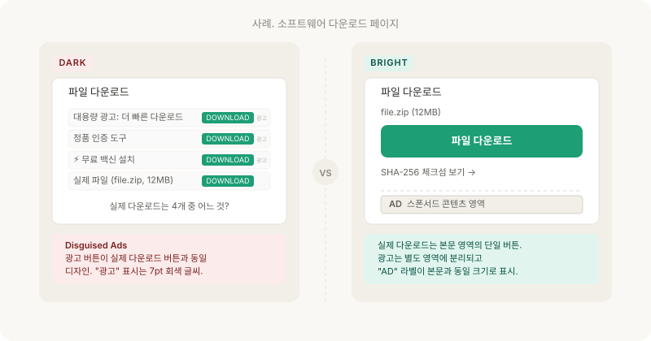

같은 기능이라도 버튼 색상, 크기, 위치를 바꾸면 사용자의 선택이 달라진다. 이것은 좋은 UX 설계인가, 조작인가.

---

## 시각적 위계와 주의 조작

인간의 시선은 예측 가능한 패턴을 따릅니다. 크고 밝은 요소를 먼저 보고, 대비가 높은 색상에 주의를 기울이며, 위에서 아래로, 왼쪽에서 오른쪽으로 시선이 이동합니다.

이러한 시각적 위계(Visual Hierarchy)는 사용자가 정보를 효율적으로 처리하도록 돕는 UX 도구입니다. 문제는 이 위계를 사용자의 이익이 아닌 기업의 이익을 위해 의도적으로 왜곡할 때 발생합니다.

---

## 패턴 1. 시선을 다른 곳으로 - Misdirection

### 정의

사용자의 주의를 의도적으로 특정 방향으로 유도하여, 중요한 정보나 선택지를 인지하지 못하게 만드는 패턴입니다.

### 작동 메커니즘

**선택적 주의(Selective Attention)** 의 한계를 활용합니다.

인간의 시각 처리는 화면의 모든 요소를 동시에 평가할 수 없습니다. 가장 밝고, 크고, 움직이는 요소가 우선적으로 처리되며, 나머지는 주변 시야로 밀려나거나 무시됩니다. 사업자는 이 우선순위를 의도적으로 조작해 자신에게 유리한 선택지를 시야의 중심에, 사용자에게 유리한 선택지를 주변으로 배치합니다.

또한 **습관 행동(Procedural Memory)** 도 활용됩니다.

사용자는 동일 흐름의 다음 단계 버튼이 같은 위치에 있다고 가정하고 클릭합니다. 이 가정을 한 번만 깨뜨리면 의도하지 않은 액션이 발생합니다.

### 구체적 양상

**① 시각적 강조의 비대칭**

팝업에서 "동의합니다" 버튼은 크고 밝은 파란색이고, "동의하지 않습니다" 링크는 회색 작은 글씨로 표시됩니다. 두 선택지의 시각적 가중치가 극단적으로 다릅니다.

**② 시선 유도용 이미지**

중요한 고지 사항(자동 결제 조건, 환불 불가 안내 등) 옆에 눈길을 끄는 이미지나 애니메이션을 배치하여 고지 사항에서 시선을 빼앗습니다.

**③ 레이아웃 조작**

"계속하기" 버튼의 위치가 페이지마다 달라서, 사용자가 습관적으로 같은 위치를 클릭하면 의도하지 않은 행동을 하게 됩니다. 예를 들어 이전 단계에서 "다음"이 오른쪽 하단에 있었는데, 약관 동의 페이지에서만 "동의하고 계속하기"가 오른쪽 하단, "건너뛰기"가 좌측 상단에 배치되는 식입니다.

### 핵심 판단 기준

시각적 위계가 "사용자가 가장 많이 원하는 선택지"를 강조하는 것인지, "기업이 가장 원하는 선택지"를 강조하는 것인지를 구분해야 합니다. 전자는 좋은 UX이고 후자는 다크패턴입니다.

### 법적 위험도

공정위 소비자보호 지침의 "잘못된 계층구조"와 결합 해석되는 패턴이며, 표시광고법상 "기만적 표시·광고" 조항과도 연결됩니다. 단독으로는 입증이 어렵지만, A/B 테스트 결과와 같은 내부 자료가 공개될 경우 "사업자가 알면서 설계했다"는 책임 입증의 근거가 됩니다.

### Before/After

**Before (다크패턴)**: 위치 권한 요청 모달에서 "허용" 버튼은 화면 중앙 진한 파란색, "허용 안 함"은 우측 상단 회색 작은 텍스트.

**After (정직한 설계)**: 두 선택지가 동일한 크기·대비로 나란히 배치. 둘 다 사용자가 의식적으로 선택할 수 있도록 충분한 여백과 명확한 라벨 제공.

---

## 패턴 2. 잘못된 계층구조 - False Hierarchy

### 정의

선택지 간의 시각적 위계를 의도적으로 왜곡하여, 특정 선택지가 "기본" 또는 "추천"인 것처럼 보이게 만드는 패턴입니다. 공정위 6유형 중 **"잘못된 계층구조"** 에 해당합니다.

### 작동 메커니즘

**시각적 디폴트(Visual Default)** 효과가 핵심입니다.

사용자는 가장 강조된 선택지를 "기본 선택"으로 인식하고, 별다른 평가 없이 수용하는 경향이 있습니다. 색상·크기·테두리·여백 같은 디자인 요소들은 명시적인 라벨 없이도 "이것이 권장 옵션"이라는 메시지를 전달합니다. Misdirection이 주의 분산을 통한 회피라면, False Hierarchy는 능동적 유도입니다.

또한 **사회적 증명(Social Proof)** 의 시각적 차용도 활용됩니다.

"추천", "BEST", "인기" 같은 배지는 다른 사용자의 선택을 함의하여 사용자의 의사결정 부담을 줄여주는 동시에 특정 옵션으로 수렴시킵니다.

### 구체적 양상

**① 버튼 비대칭**

쿠키 동의 팝업에서 "모두 수락" 버튼은 밝은 색상의 큰 버튼, "설정 관리"는 윤곽선만 있는 작은 버튼으로 배치합니다. 두 선택은 동등한 가치를 가져야 하지만, 시각적으로 하나가 압도적으로 강조됩니다.

**② 색상 코드의 조작**

"구독 유지" 버튼에 초록색(긍정), "해지" 버튼에 빨간색(경고)을 사용합니다. 색상의 심리적 연상을 활용하여 해지를 "위험한 행동"으로 프레이밍합니다.

**③ "추천" 배지의 남용**

요금제 비교에서 가장 비싼 요금제에 "추천", "인기", "BEST" 배지를 붙여, 그 요금제가 객관적으로 최선인 것처럼 보이게 만듭니다.

### 법적 위험도

공정위 소비자보호 지침(2025년 10월 시행)에서 "잘못된 계층구조"는 **"소비자의 합리적 선택을 돕는 것이 아니라 사업자에게 유리한 특정 선택지로 유도하는 것"** 으로 해석됩니다.

### Before/After

**Before (다크패턴)**: 쿠키 동의 팝업에서 "모두 수락"은 파란색 채움 버튼을 크게 배치, "설정 관리"는 회색 텍스트 링크로 작게 배치

**After (정직한 설계)**: "모두 수락"과 "필수만 수락" 두 버튼이 같은 크기·색상 대비로 나란히 배치되어 있으며, "설정 관리"는 두 버튼 아래에 텍스트 링크로 추가

---

## 패턴 3. 속임수 질문 - Trick Question

### 정의

이중 부정이나 혼란스러운 문장 구조를 사용하여 사용자가 의도와 다른 선택을 하게 만드는 패턴입니다.

### 작동 메커니즘

**언어 처리 부하**가 핵심입니다. 이중 부정은 인지 처리 시간을 평균 1.5~2배 늘리며, 문장이 복잡할수록 사용자는 의미를 끝까지 파싱하지 않고 "체크되어 있으니 동의겠지"라는 휴리스틱으로 결정합니다. 또한 라벨과 행동의 매핑이 어긋날 때(질문은 "끄시겠습니까?"인데 버튼은 "예/아니오"), 사용자는 일관된 멘탈 모델을 형성하지 못해 임의의 클릭을 하게 됩니다.

표시 길이가 짧은 모바일 환경에서는 이 부담이 더 커집니다. 한 줄로 압축된 동의 문구는 의미보다 시각적 위치(체크 박스의 좌·우)에 의해 결정됩니다.

### 구체적 양상

**① 이중 부정**

"마케팅 이메일을 받지 않으려면 체크를 해제하세요" - 이 문장에서 사용자는 체크를 해야 수신 거부인지, 해제해야 수신 거부인지 혼란을 겪습니다.

**② 질문과 행동의 불일치**

"알림을 끄시겠습니까?" 팝업에서 "예"를 누르면 알림이 꺼지지 않고, "아니오"를 누르면 꺼지는 경우입니다. 또는 "이 변경사항을 저장하지 않고 나가시겠습니까?" 같은 질문에서 "확인"과 "취소"의 의미가 모호해지는 경우.

**③ 범위가 불명확한 동의**

"관련 서비스의 정보를 받으시겠습니까?"에서 "관련 서비스"가 자사 서비스인지, 제휴사 서비스인지, 광고성 정보인지 명확하지 않은 경우입니다.

### 법적 위험도

개인정보보호법 제15조와 제22조는 "동의를 받을 때 그 내용을 명확히 표시"할 것을 요구합니다. 이중 부정·모호한 범위 표현은 동의의 유효성 자체를 다툴 수 있는 사유가 됩니다. 공정위 소비자보호 지침은 "소비자가 합리적으로 의미를 파악할 수 있도록 표시"를 명시하고 있습니다.

### Before/After

**Before (다크패턴)**: "프로모션 이메일 수신에 동의하지 않는 것을 원하지 않으시면 아래 박스를 체크 해제하지 마세요." (극단적 예시이지만, 실제로 유사한 구조의 문장이 사용됩니다.)

**After (정직한 설계)**: "프로모션 이메일을 받겠습니다.", 체크박스(기본값: 해제) - 한 문장, 긍정형, 명확한 행동

---

## 패턴 4. 콘텐츠로 위장한 광고 - Disguised Ads

### 정의

광고를 일반 콘텐츠, 내비게이션, 시스템 메시지처럼 보이게 위장하는 패턴입니다.

### 작동 메커니즘

**광고 회피 행동(Banner Blindness)** 의 역이용입니다.

사용자는 광고로 인식되는 영역을 자동으로 무시하는 학습된 회피 패턴을 갖습니다. 사업자는 이 회피를 우회하기 위해 광고를 광고처럼 보이지 않게 디자인합니다. 결과적으로 사용자는 광고를 콘텐츠나 시스템 알림으로 오인하고 클릭하게 됩니다.

또한 **권위 신호(Authority Cue)** 의 도용도 활용됩니다.

시스템 폰트·OS UI 컴포넌트·브라우저 알림 스타일을 모방하면, 사용자는 그 메시지를 사업자의 광고가 아닌 운영체제·브라우저의 메시지로 인식합니다.

### 구체적 양상

**① 다운로드 버튼 위장**

소프트웨어 다운로드 페이지에서 실제 다운로드 버튼 주변에 광고의 "다운로드" 버튼이 배치되어, 사용자가 광고를 클릭하게 만듭니다.

**② 네이티브 광고의 불충분한 표시**

뉴스 피드에서 "광고" 또는 "Sponsored" 표시가 너무 작거나 배경색과 구분이 안 되어, 일반 콘텐츠와 구별이 어렵습니다.

**③ 시스템 알림 위장**

"시스템 업데이트가 필요합니다" 같은 메시지가 실제로는 특정 앱의 설치를 유도하는 광고인 경우입니다.

### 법적 위험도

표시광고법 제3조의 "기만적 표시·광고" 및 "광고임을 명확히 표시할 의무"에 직접 저촉됩니다. 방송통신심의위원회의 인터넷 광고 심의 기준과 공정위의 추천·보증 등에 관한 표시·광고 심사지침은 광고 표시의 위치·크기·색상까지 구체적으로 규정합니다. SNS 인플루언서의 "협찬받은 콘텐츠" 미고지 사례가 대표적인 제재 영역입니다.

### Before/After

**Before (다크패턴)**: 다운로드 페이지에 "DOWNLOAD" 라고 적힌 큰 초록색 버튼이 4개인데, 그중 1개만 실제 파일 링크이고 나머지는 광고입니다. "광고" 표시는 8pt 회색 글씨로 우측 상단에 거의 안 보이게 표시합니다.

**After (정직한 설계)**: 실제 다운로드 버튼 1개만 본문 영역에 큼직하게 배치합니다. 광고 영역은 본문 영역과 분리되어 있고 "AD" 또는 "광고" 라벨이 본문 텍스트와 동일 크기로 표시힙니다.

---

## 패턴 5. 읽기 어렵게 만들기 - Visual Interference

### 정의

중요한 정보의 가독성을 의도적으로 낮추는 패턴입니다. 정보를 "표시는 했지만, 사실상 읽을 수 없게" 만드는 위장된 고지가 핵심입니다.

### 작동 메커니즘

**대비 인지의 역치**가 활용됩니다. 텍스트의 명도 대비가 4.5:1(WCAG AA 기준) 미만으로 떨어지면 일반 사용자도 읽기 어렵고, 노안·저시력 사용자에게는 사실상 비가시 상태가 됩니다. 사업자는 이 임계 부근에서 텍스트를 작성해 "표시했음"이라는 형식적 요건만 충족합니다.

폰트 크기·줄 간격·문서 위치도 동일한 메커니즘으로 동원됩니다. 8pt 이하의 글씨, 50줄짜리 약관 중간에 끼워 넣은 핵심 조건, 스크롤 끝에 배치한 환불 정책 등은 모두 가독성을 형식적으로만 충족시키는 설계입니다.

### 구체적 양상

**① 저대비 텍스트**

자동 갱신 조건이 옅은 회색 글씨(#CCCCCC on white)로, 배경과 거의 구분되지 않게 표시됩니다.

**② 극소 폰트**

해지 관련 안내가 8pt 이하의 극소 글씨로 작성됩니다. 모바일 화면에서는 사실상 판독 불가능한 크기입니다.

**③ 정보 매장 (Information Burying)**

긴 약관 텍스트 중간에 핵심 조건(자동 결제·환불 불가)이 묻혀 있어 스크롤 없이는 발견할 수 없습니다.

### 법적 위험도

전자상거래법 시행령은 "소비자가 쉽게 인식할 수 있는 방법"으로 표시할 것을 요구하며, 약관규제법은 "중요한 내용을 명확하게 표시·설명"할 의무를 부여합니다. WCAG 2.1 AA 기준(명도 대비 4.5:1)은 국가 표준 KS X 1003 등을 통해 공공·금융 분야에서 의무화되어 있습니다.

### Before/After

**Before (다크패턴)**: "1개월 무료 체험 후 자동 결제됩니다" 문구가 8pt, #CCCCCC 회색으로 결제 버튼 아래 위치합니다. 본문 색상(#1A1A1A) 대비는 1.6:1

**After (정직한 설계)**: 동일 문구를 14pt, 본문과 동일한 명도(#1A1A1A)로 결제 버튼 위에 배치합니다. 핵심 조건은 별도의 박스로 강조합니다.

---

## 시각 디자인의 윤리적 책임

디자이너의 역할은 사용자가 정보를 효율적으로 처리하도록 돕는 것입니다. 시각적 위계, 색상 코드, 타이포그래피는 모두 이를 위한 도구입니다. 이 도구가 사용자의 판단을 돕는 방향으로 사용되면 좋은 디자인이고, 사용자의 판단을 흐리는 방향으로 사용되면 다크패턴이 됩니다.

[ep.01](/dark-pattern-anatomy-ep-01)에서 제시한 판별 기준을 여기에 적용해보면:

- **투명성**: 시각적 강조가 사용자에게 필요한 정보를 강조하는가?
- **이익 귀속**: 버튼의 크기·색상 차이가 사용자의 이익에 부합하는가?
- **동의 가능성**: 사용자가 모든 선택지를 동등하게 인지한 상태에서 선택하는가?

세 질문에 모두 "예"라고 답할 수 있어야 합니다.

---

## 자가 점검 체크리스트

내 서비스에서 아래 항목을 점검해보세요.

1. 동등한 선택지(예: 수락/거절)의 버튼이 같은 크기·대비로 표시되는가?
2. 색상 코드가 특정 선택지를 "위험"하거나 "부정적"으로 프레이밍하지 않는가?
3. 동의 관련 문장이 긍정형, 단문으로 작성되어 있는가? 이중 부정이 없는가?
4. 광고가 "광고" 또는 "Sponsored"로 일반 콘텐츠와 명확히 구분되는가?
5. 중요한 고지 사항이 충분한 크기·명도 대비로 가독성이 확보되어 있는가?
6. "추천" 또는 "인기" 배지의 기준이 명시되어 있는가?
7. CTA 버튼의 위치가 페이지 간에 일관적인가?
8. 쿠키 동의 팝업에서 "거절" 옵션이 "수락"과 동등한 접근성을 가지는가?

---

## 참고 자료

- Gray, C. M. et al. (2018). The Dark (Patterns) Side of UX Design. *CHI 2018.*
- Brignull, H. *Deceptive Patterns — Types of Deceptive Pattern.* deceptive.design.
- 공정거래위원회. (2025). 전자상거래 등에서의 소비자보호 지침 — "잘못된 계층구조" 해석 기준.
- Mathur, A. et al. (2019). Dark Patterns at Scale. *Proceedings of the ACM on Human-Computer Interaction*, 3(CSCW).

---

## 다음 편 예고

> [ep.09 - 언어와 알림의 패턴 — Confirmshaming, Nagging, Loaded Language](/dark-pattern-anatomy-ep-09)

카피와 알림의 다크패턴을 해부합니다. 컨펌쉐이밍, 반복 간섭, 가치 판단을 심은 언어, 알림 설정의 비대칭까지.
한국어 서비스의 존댓말 구조와 "혜택" 프레이밍이 어떻게 거절을 더 어렵게 만드는지, 공정위 "반복 간섭" 금지 조항이 실무에서 어디까지 적용되는지를 다룹니다.
