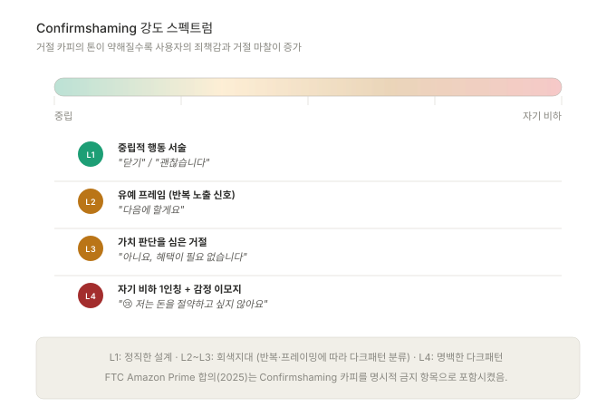
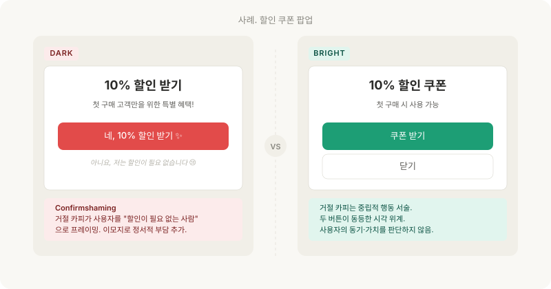
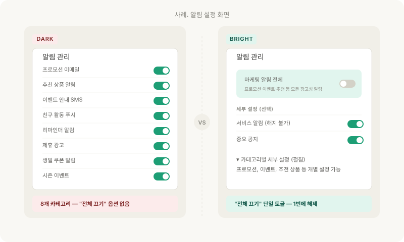

버튼의 색상과 크기가 아닌, 그 버튼 위에 쓰인 "문장"이 사용자의 선택을 조종할 수 있는가.

---

## 카피와 톤의 다크패턴

이전 편([ep.08](/dark-pattern-anatomy-ep-08))이 시각적 조작을 다뤘다면, 이 편은 언어적 조작을 다룹니다. 같은 버튼, 같은 크기, 같은 색상이라도 위에 쓰인 카피 한 줄이 사용자의 선택을 바꿀 수 있습니다.

카피는 UI에서 가장 저비용으로 변경 가능한 요소이면서, 동시에 가장 강력한 영향력을 가진 요소입니다.

---

## 패턴 1. 거절을 부끄럽게 만드는 카피 - Confirmshaming

### 정의

거절 옵션의 카피를 부정적·자학적으로 작성하여, 사용자가 심리적 불편함 때문에 수락하도록 유도하는 패턴입니다.

### 작동 메커니즘

[ep.02](/dark-pattern-anatomy-ep-02)에서 다룬 **손실 회피(Loss Aversion)** 가 핵심입니다. 거절 카피가 "혜택을 포기합니다"가 아니라 "저는 돈을 절약하고 싶지 않습니다"로 작성되면, 사용자는 거절 행위를 "손실"로 프레이밍하게 됩니다.

또한 자기 비하적 1인칭 카피("저는 ~하고 싶지 않습니다")는 사용자에게 거절 행위에 대한 죄책감을 심어줍니다.

### 구체적 양상

**① 자기 비하적 1인칭 카피**

거절 옵션을 사용자 자신의 입장에서 부정적으로 진술하게 만듭니다. 영문 대표 예시는 "No, I don't want to save money", "I don't care about my health" 등이며, 한국어 예시로는 "아니요, 혜택이 필요 없습니다", "저는 정가에 구매하겠습니다" 등이 있습니다.

**② 가치 판단을 심은 거절 문구**

"다음에 할게요" 같은 카피는 거절이 아닌 유예로 포장합니다. 부드러워 보이지만 "나중에"라는 프레이밍은 사용자를 반복 노출 대상으로 분류합니다. "괜찮아요, 정가에 구매할게요"는 할인을 모르는 사람처럼 프레이밍합니다.

**③ 감정 이모지 부착**

"관심 없어요 😢", "🥺 다음에" 같은 이모지를 거절 버튼에 추가하여 정서적 부담을 가중합니다. 한국어 서비스에서 특히 빈번합니다.

### 법적 위험도

표시광고법상 "소비자의 합리적 선택을 방해하는 부당한 표시·광고"의 해석 영역에 들어갑니다. 단독 위반 사례는 드물지만, 다른 다크패턴(예: Subscription Trap, Hard to Cancel)과 결합되면 가중 사유로 평가됩니다.

무엇보다 FTC의 Amazon Prime 합의(2025)는 Confirmshaming 카피("No, I don't want free shipping")를 명시적으로 금지하는 조항을 포함했습니다. 글로벌 규제 표준이 Confirmshaming을 직접 규제 대상으로 삼기 시작한 신호입니다.

### Before/After

**Before (다크패턴)**:
- 수락: "네, 10% 할인 받기"
- 거절: "아니요, 할인이 필요 없습니다 😢"

**After (정직한 설계)**:
- 수락: "할인 쿠폰 받기"
- 거절: "닫기" 또는 "괜찮습니다"

핵심 원칙은 이것입니다. 거절 카피는 **중립적 행동 서술**이어야 합니다. 사용자의 동기나 가치관을 판단하는 문장이 되어서는 안 됩니다.

---

## 패턴 2. 반복적 요청 - Nagging

### 정의

사용자가 이미 거절한 요청을 반복적으로 표시하여, 피로감으로 인해 최종적으로 수락하게 만드는 패턴입니다. 공정위 6유형 중 **"반복 간섭"** 에 해당합니다.

### 작동 메커니즘

**의지 고갈(Decision Fatigue)** 이 핵심입니다.

사용자는 한 번 거절을 클릭하는 데 인지 자원을 소모하며, 동일 요청이 반복될수록 거절을 위한 자원이 줄어듭니다. 결국 어느 시점에는 평가 없이 "예"를 누르게 됩니다.

또한 거절의 영구성이 보장되지 않으면 사용자는 "어차피 또 뜰 텐데 한 번 수락하고 끝내자"는 합리화에 이릅니다. "다시 보지 않기" 옵션을 제공하지 않는 것은 이 합리화를 의도적으로 유도하는 설계입니다.

### 구체적 양상

**① 앱 평가 요청**

앱을 열 때마다, 또는 특정 행동 후마다 "앱을 평가해주세요" 팝업이 등장합니다. 사용자가 "나중에"를 누르면 3일 후 다시 등장. "평가하지 않겠습니다"라는 영구 거절 옵션이 없습니다.

**② 알림 권한 재요청**

알림 권한을 거절한 후, 앱 실행 시마다 "알림을 켜면 더 좋은 경험을 할 수 있습니다" 배너가 반복 표시됩니다.

**③ 프리미엄 업그레이드 푸시**

무료 사용자에게 앱 실행 시마다 프리미엄 광고가 전면 팝업으로 표시됩니다. "X" 버튼이 2~3초 후에야 나타나는 경우도 흔합니다.

### 법적 위험도

공정위 소비자보호 지침에서 "반복 간섭"은 **"소비자가 원하지 않는 거래의 의사표시를 반복하여 하는 행위"** 로 해석됩니다. 2025년 2월부터 전자상거래법으로 금지되었습니다.

### Before/After

**Before (다크패턴)**: 앱 평가 요청이 세션마다 등장gkqslek. 선택지: "평가하기" / "나중에", 영구 거절은 없습니다.

**After (정직한 설계)**: 앱 평가 요청은 수차례 사용 후(예: 10번째 이용 완료 후) 한 번만 표시합니다. 선택지: "평가하기" / "나중에" / "다시 보지 않기", "다시 보지 않기" 선택 시 영구적으로 표시하지 않습니다.

---

## 패턴 3. 가치 판단을 심은 언어 - Loaded Language

### 정의

사실을 전달하는 대신, 감정적 가치 판단이 포함된 언어를 사용하여 사용자의 의사결정을 특정 방향으로 유도하는 패턴입니다.

### 작동 메커니즘

**감정 휴리스틱(Affect Heuristic)** 이 핵심입니다.

인간의 의사결정은 정보의 객관적 평가보다 그 정보가 유발한 감정에 의해 더 빠르게 결정됩니다. 공포·긴급성·희소성을 자극하는 카피는 사용자의 분석적 사고를 우회하여 직관적 반응을 유도합니다. 특히 시간 압박 상황에서는 분석적 사고를 위한 인지 자원이 부족해, 감정 휴리스틱의 영향력이 더 커집니다.

희소성 카피는 **상실 회피**와도 결합됩니다.

"3개 남음"이라는 표시는 "이걸 놓치면 손해"라는 손실 프레임을 만들어 즉각적 행동을 강제합니다.

### 구체적 양상

**① 공포 유발 카피**

"지금 보호하지 않으면 위험합니다" (보안 소프트웨어), "내 데이터가 노출되고 있습니다" (VPN 광고). 실제 위험 수준과 무관하게 긴급성과 공포를 주입합니다.

**② 가짜 희소성 카피**

"단 3개 남았습니다!", "247명이 보고 있습니다" - 실제 재고나 조회 수와 무관하게 희소성을 연출합니다. 이 카피가 허위라면 다크패턴을 넘어 부당 광고에 해당합니다.

**③ 해지 시의 감정적 압박**

"정말 떠나시는 건가요?", "저희가 그립지 않으실까요?", "다시 돌아오셔도 이 혜택은 없을 수 있어요." - 해지 결정에 감정적 부담을 추가합니다. 이는 [ep.07](/dark-pattern-anatomy-ep-07)에서 다룬 Hard to Cancel 패턴과 결합되면 효과가 배가됩니다.

### 법적 위험도

희소성 카피의 수치가 실제 데이터와 다른 경우(허위 재고 표시, 가짜 실시간 조회수)는 표시광고법 제3조의 "거짓·과장 광고"에 직접 해당하며, 부당 광고로 형사 처벌까지 가능합니다. 공포 유발 카피의 경우, 보안·금융 등 규제 산업에서는 광고 심의 위반의 사유가 됩니다.

EU의 DSA는 "가짜 긴급성·가짜 희소성"을 다크패턴 금지 항목에 명시적으로 포함합니다.

### Before/After

**Before (다크패턴)**: 상품 페이지에 "🔥 단 2개 남음! 247명이 지금 보는 중"이 빨간색으로 깜빡입니다. 카운트다운 타이머가 함께 표시됩니다.

**After (정직한 설계)**: 실제 데이터를 기반으로 재고가 적을 때만 "재고 5개 미만" 표시합니다. 조회수는 표시하지 않거나, "최근 24시간 조회 N회"처럼 검증 가능한 단위로 명시합니다. 카운트다운은 실제 할인 종료 시간으로만 사용합니다.

---

## 패턴 4. 알림 설정의 함정 - Roach Motel in Notifications

### 정의

알림 수신 동의는 간단하게 받지만, 알림 해제 경로는 복잡하게 설계하는 패턴입니다. Roach Motel의 변종으로, 마찰 비대칭이 알림이라는 영역에서 재연됩니다.

### 작동 메커니즘

[ep.07](/dark-pattern-anatomy-ep-07)에서 분석한 가입·해지 비대칭의 메커니즘이 그대로 적용됩니다. 마케팅 동의는 가입 화면의 1개 체크박스로 단순화되어 있지만, 해제는 이메일 종류별·SMS 종류별·앱 푸시 종류별로 분리된 토글을 일일이 꺼야 하는 구조입니다.

또한 **선택지 분할(Choice Splitting)** 이 활용됩니다.

단일 "마케팅 알림" 토글 대신 "프로모션", "추천 상품", "이벤트", "친구 활동", "리마인더" 등 7~10개 카테고리로 분할하여, 사용자가 모두 끄려면 다수의 행동을 반복해야 합니다.

### 구체적 양상

**① 카테고리별 분할 토글**

알림 설정 화면에서 마케팅 관련 알림이 7~10개 카테고리로 분할되어 있고, "전체 끄기" 옵션이 없습니다.

**② 이메일 수신 거부 링크의 매장**

마케팅 이메일 본문 최하단에 8pt 회색 글씨로 "수신 거부" 링크가 배치됩니다. 클릭하면 또 다른 동의 페이지로 이동하여 추가 단계를 요구합니다.

**③ 앱 알림 동의의 우회 재요청**

OS 알림 권한을 거절한 사용자에게, 앱 자체 모달로 "알림을 켜야 더 좋은 경험을 할 수 있습니다"라며 OS 설정 화면으로 이동시킵니다.

### 법적 위험도

정보통신망법 제50조는 영리 목적의 광고성 정보 전송 시 "수신 거부의 의사표시를 쉽게 할 수 있는 조치"를 의무화합니다. 이메일 수신 거부 링크가 본문에서 식별 가능한 위치·크기에 있어야 하며, 1단계로 거부가 완료되어야 합니다. 위반 시 과태료가 부과되며, KISA가 정기 모니터링을 수행합니다.

### Before/After

**Before (다크패턴)**: 알림 설정 화면에 마케팅 카테고리 8개 토글이 모두 켜진 상태로 나열되어있고 "전체 끄기" 옵션이 없습니다. 이메일 수신 거부는 본문 최하단 8pt 회색 텍스트로 잘 안 보이게 표시됩니다.

**After (정직한 설계)**: "마케팅 알림 전체 끄기" 단일 토글이 화면 상단에 배치됩니다. 카테고리별 세부 토글은 펼침 메뉴에 위치합니다. 이메일 수신 거부 링크는 본문과 동일 크기·색상으로 헤더 영역에 표시됩니다.

---

## 한국어 서비스의 특수성

한국어 서비스에서 카피 다크패턴이 특히 교묘한 이유가 있습니다.

**존댓말의 이중성**: "~하시겠습니까?"라는 존댓말 구조가 거절에 심리적 부담을 더합니다. "할인을 받지 않으시겠습니까?"는 영문의 "Don't you want a discount?"보다 거절하기 어렵습니다.

**"~혜택"이라는 프레이밍**: 한국 서비스에서 거의 모든 마케팅 수신을 "혜택"으로 포장합니다. "혜택 알림을 받지 않으시겠습니까?"에서 사용자는 "혜택"을 거절하는 것이 비합리적으로 느껴집니다.

**감정 이모지의 남용**: 거절 버튼에 😢, 🥺 같은 이모지를 추가하여 정서적 압박을 가하는 것은 국내 서비스에서 특히 빈번합니다.

이 세 가지 특수성은 글로벌 분류 체계(Brignull, Mathur)에서는 잘 포착되지 않습니다. 공정위가 "반복 간섭"을 6대 유형에 독자적으로 추가한 것도, 한국 시장의 이런 특성을 반영한 것입니다.

---

## 자가 점검 체크리스트

내 서비스에서 아래 항목을 점검해보세요.

1. 거절 옵션의 카피가 사용자의 동기를 판단하는 문장인가? ("저는 ~하고 싶지 않습니다" 구조)
2. 거절 카피에 부정적 감정을 유발하는 단어나 이모지가 포함되어 있는가?
3. 사용자가 거절한 요청이 동일 세션 또는 다음 세션에서 반복 표시되는가?
4. 반복 표시되는 요청에 "다시 보지 않기" 옵션이 있는가?
5. 알림 수신 동의와 해제의 경로 복잡도가 대칭적인가?
6. 전체 알림 해제 옵션이 존재하는가?
7. 희소성 카피("N개 남음", "N명이 보는 중")의 수치가 실제 데이터에 기반하는가?
8. 해지·탈퇴 과정의 카피가 감정적 압박("정말 떠나시나요?")을 포함하고 있는가?
9. 이메일 수신 거부 링크가 쉽게 발견 가능한 위치와 크기로 배치되어 있는가?

---

## 참고 자료

- confirmshaming.tumblr.com — Confirmshaming 사례 아카이브.
- 공정거래위원회. (2025). 전자상거래 등에서의 소비자보호 지침 — "반복 간섭" 해석 기준.
- Luguri, J. & Strahilevitz, L. (2021). Shining a Light on Dark Patterns. *Journal of Legal Analysis*, 13(1), 43-109.
- Mathur, A. et al. (2019). Dark Patterns at Scale. *Proceedings of the ACM on Human-Computer Interaction*, 3(CSCW).

---

## 다음 편 예고

> [ep.10 - 국내 규제 — 공정위 가이드라인과 전자상거래법](/dark-pattern-anatomy-ep-10)

한국의 다크패턴 규제 타임라인(2023 가이드라인 → 2025 전자상거래법 시행 → 2025.10 첫 실질적 제재)을 정리하고, 공정위 6대 금지 유형의 구체적 해석 기준을 다룹니다.
기획·디자인·개발 직무별 법적 책임 영역과 Amazon Prime 사례에서 도출된 "개인 책임"의 함의를 분석합니다.
