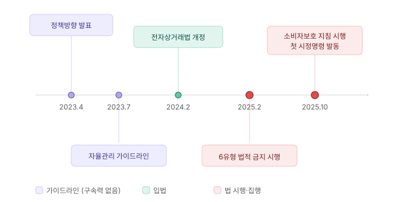

한국에서 다크패턴은 법적으로 금지되어 있는가? 어떤 유형이, 어느 수준부터 위법인가.

---

## 국내 규제 타임라인

한국의 다크패턴 규제는 단계적으로 강화되어왔습니다.

| 시점 | 사건 | 의미 |
|---|---|---|
| 2023.04 | 공정위, "온라인 다크패턴으로부터 소비자 피해 방지를 위한 정책방향" 발표 | 다크패턴의 첫 공식 의제화 |
| 2023.07 | 공정위, "온라인 다크패턴 자율관리 가이드라인" 제정 (4범주·19유형) | 법적 구속력 없는 권고 |
| 2024.02 | 전자상거래법 개정안 국회 의결 (6개 유형 금지) | 법률화 |
| 2025.02.14 | 개정 전자상거래법 시행 | 6개 유형 법적 금지 시작 |
| 2025.10.24 | 공정위 「전자상거래 등에서의 소비자보호 지침」 개정 시행 | 구체적 해석 기준 제시 |
| 2025.10 | OTT·음원·커머스 4개 사업자 시정명령 및 과태료 부과 | 첫 실질적 제재 |
| 2025.12 | 금융위·금감원, "온라인 금융상품 판매 관련 다크패턴 가이드라인" 발표 | 금융 분야로 확대 |

"가이드라인 → 법률 → 집행"의 3단계가 약 2년 반 만에 완성되었습니다. 이 속도는 EU나 미국과 비교해도 빠른 편입니다.

---

## 가이드라인의 전체 분류 체계

전자상거래법이 금지하는 6개 유형은 더 큰 분류 체계의 일부입니다. 한국에는 두 개의 다크패턴 가이드라인이 있고, 각각 다른 분류 체계를 사용합니다.

### 공정위 자율관리 가이드라인 (2023.7) - 4범주 19유형

법적 구속력은 없지만 이후 전자상거래법 개정과 행정 해석의 기준이 되었습니다.

**편취형 (3)**: 인터페이스의 작은 조작으로 비합리적이거나 예상치 못한 지출을 유도

- 숨은 갱신

- 순차공개 가격책정

- 몰래 장바구니 추가

**오도형 (7)**: 거짓 정보나 비대칭적 화면 구성으로 착각·실수를 유도

- 거짓 할인

- 거짓 추천

- 유인 판매

- 위장 광고

- 속임수 질문

- 잘못된 계층구조

- 특정옵션 사전선택

**방해형 (4)**: 정보 수집·분석에 과도한 시간·노력·비용이 들게 만들어 합리적 선택을 포기하도록 유도

- 취소·탈퇴 등의 방해

- 숨겨진 정보

- 가격비교 방해

- 클릭 피로감 유발

**압박형 (5)**: 심리적 압박으로 특정 행위를 하도록 유도

- 반복 간섭

- 감정적 언어사용

- 시간제한 알림

- 낮은 재고 알림

- 다른 소비자의 활동 알림

### 금융위·금감원 가이드라인 (2025.12) - 4범주 15유형

비대면 금융상품 거래의 정보 비대칭성을 반영해 분류 체계를 재구성한 것입니다.

공정위 분류와의 차이는 세 가지입니다. 첫째, 거짓 할인·거짓 추천·유인 판매·위장 광고를 "허위 광고 및 기만적 유인행위" 하나로 묶었습니다. 둘째, 금융 특화 유형 세 개(설명절차의 과도한 축약, 계약과정 중 기습적 광고, 감각조작)를 추가했습니다. 셋째, 금융상품에 해당하지 않는 유형(몰래 장바구니 추가, 시간제한 알림, 낮은 재고 알림, 숨은 갱신)은 제외하거나 다른 법령(금융소비자보호법)으로 규율을 위임했습니다.

**오도형 (5)**:

- 설명절차의 과도한 축약

- 속임수 질문

- 잘못된 계층구조

- 특정옵션 사전선택

- 허위 광고 및 기만적 유인행위

**방해형 (4)**:

- 취소·탈퇴 등의 방해

- 숨겨진 정보

- 가격비교 방해

- 클릭 피로감 유발

**압박형 (5)**:

- 계약과정 중 기습적 광고

- 반복 간섭

- 감정적 언어사용

- 감각조작

- 다른 소비자의 활동 알림

**편취유도형 (1)**: 

- 순차공개 가격책정

### 통합 비교표

공정위 19유형, 금융위 15유형, 전자상거래법 금지 6유형, 본 시리즈 편을 한눈에 매핑한 표입니다.

| # | 유형 | 공정위(2023) | 금융위(2025) | 전상법 금지 | 시리즈 |
|---|---|---|---|---|---|
| 1 | 숨은 갱신 | 편취형 | - (금소법) | ✓ | [ep.04](/dark-pattern-anatomy-ep-04/), [ep.07](/dark-pattern-anatomy-ep-07/) |
| 2 | 순차공개 가격책정 | 편취형 | 편취유도형 | ✓ | [ep.04](/dark-pattern-anatomy-ep-04/), [ep.06](/dark-pattern-anatomy-ep-06/) |
| 3 | 몰래 장바구니 추가 | 편취형 | - | - | [ep.06](/dark-pattern-anatomy-ep-06/) |
| 4 | 거짓 할인 | 오도형 | 오도형\* | - | (간접) |
| 5 | 거짓 추천 | 오도형 | 오도형\* | - | [ep.04](/dark-pattern-anatomy-ep-04/) |
| 6 | 유인 판매 | 오도형 | 오도형\* | - | [ep.06](/dark-pattern-anatomy-ep-06/) |
| 7 | 위장 광고 | 오도형 | 오도형\* | - | (간접) |
| 8 | 속임수 질문 | 오도형 | 오도형 | - | [ep.08](/dark-pattern-anatomy-ep-08/) |
| 9 | 잘못된 계층구조 | 오도형 | 오도형 | ✓ | [ep.04](/dark-pattern-anatomy-ep-04/), [ep.08](/dark-pattern-anatomy-ep-08/) |
| 10 | 특정옵션 사전선택 | 오도형 | 오도형 | ✓ | [ep.04](/dark-pattern-anatomy-ep-04/), [ep.05](/dark-pattern-anatomy-ep-05/) |
| 11 | 취소·탈퇴 등의 방해 | 방해형 | 방해형 | ✓ | [ep.04](/dark-pattern-anatomy-ep-04/), [ep.07](/dark-pattern-anatomy-ep-07/) |
| 12 | 숨겨진 정보 | 방해형 | 방해형 | - | [ep.06](/dark-pattern-anatomy-ep-06/), [ep.08](/dark-pattern-anatomy-ep-08/) |
| 13 | 가격비교 방해 | 방해형 | 방해형 | - | (간접) |
| 14 | 클릭 피로감 유발 | 방해형 | 방해형 | - | [ep.07](/dark-pattern-anatomy-ep-07/) |
| 15 | 반복 간섭 | 압박형 | 압박형 | ✓ | [ep.04](/dark-pattern-anatomy-ep-04/), [ep.09](/dark-pattern-anatomy-ep-09/) |
| 16 | 감정적 언어사용 | 압박형 | 압박형 | - | [ep.09](/dark-pattern-anatomy-ep-09/) |
| 17 | 시간제한 알림 | 압박형 | - | - | [ep.04](/dark-pattern-anatomy-ep-04/) |
| 18 | 낮은 재고 알림 | 압박형 | - | - | [ep.04](/dark-pattern-anatomy-ep-04/) |
| 19 | 다른 소비자의 활동 알림 | 압박형 | 압박형 | - | [ep.04](/dark-pattern-anatomy-ep-04/) |
| 20 | 설명절차의 과도한 축약 | - | 오도형 | - | (금융 특화) |
| 21 | 계약과정 중 기습적 광고 | - | 압박형 | - | (금융 특화) |
| 22 | 감각조작 | - | 압박형 | - | [ep.08](/dark-pattern-anatomy-ep-08/) |

\* 금융위 가이드라인에서 거짓 할인·거짓 추천·유인 판매·위장 광고는 "허위 광고 및 기만적 유인행위"로 통합되었습니다.

전자상거래법 금지 6개 유형은 모두 공정위 19유형 안에 포함됩니다. 상대적으로 피해 정도가 크고 입증이 쉬운 항목들이 먼저 법제화된 것입니다. 나머지 13개는 가이드라인 권고 수준으로 남아 있지만, 표시광고법·금융소비자보호법 등 다른 법령으로 규율되는 경우가 많습니다.

---

## 전자상거래법이 금지하는 6개 유형

### 1. 숨은 갱신 (Hidden Subscription / Auto-Renewal)

정기결제·자동갱신의 내용을 알리지 않거나, 갱신 전 별도 동의를 받지 않는 행위입니다. 전자상거래법 제13조 6항에 근거합니다.

**금지 행위 예시**: 무료 체험 종료 후 사전 고지 없이 자동 결제, 가격 인상 시 소비자의 명시적 동의 없이 인상된 가격으로 자동 갱신

**준수 방법**: 갱신 전 합리적 시점에 이메일·문자·앱 알림으로 고지, 가격 변경 시 별도 동의 절차 마련

### 2. 순차공개 가격책정 (Drip Pricing)

거래에 필요한 총비용을 처음부터 공개하지 않고, 구매 과정에서 단계적으로 추가 비용을 노출하는 행위입니다.

**금지 행위 예시**: 상품 가격만 표시하고 배송비·수수료는 결제 직전에 추가, 첫 화면에 할인가만 표시하고 할인 조건은 상세 페이지에서야 공개

**준수 방법**: 첫 화면에 총 예상 결제금액 표시, 가격 구성 요소를 명확히 분해하여 제시, 할인 조건은 할인가 옆에 함께 표시

### 3. 특정옵션 사전선택 (Pre-selection)

소비자가 구매·이용하지 않으려는 상품·서비스를 기본으로 선택해두는 행위입니다.

**금지 행위 예시**: 추가 보험·보증이 장바구니에 자동 포함, 마케팅 수신 동의 체크박스가 사전 선택

**준수 방법**: 추가 옵션의 기본값은 "선택 안 함", 사용자가 명시적으로 선택한 항목만 장바구니에 포함

### 4. 잘못된 계층구조 (False Hierarchy)

사업자에게 유리한 선택지를 부당하게 강조하여 소비자를 특정 선택으로 유도하는 행위입니다.

**금지 행위 예시**: 쿠키 "모두 수락"만 큰 버튼, "설정 관리"는 숨겨진 링크, 해지 버튼은 회색·작게, 유지 버튼은 색상·크게 배치

**준수 방법**: 동등한 선택지는 동등한 시각적 가중치로 배치, "추천" 배지 사용 시 근거 명시

### 5. 취소·탈퇴 등의 방해 (Obstruction)

소비자의 계약 해지, 서비스 탈퇴, 환불 요청 등을 방해하는 행위입니다. 공정위 6유형 중 가장 광범위한 유형이며, 2025년 10월 시정명령에서도 가장 많은 15건이 집계되었습니다.

**금지 행위 예시**: 온라인 가입 → 전화로만 해지, 해지 과정에 불필요한 단계(재고 페이지 3개 이상) 추가, 해지 메뉴를 설정 깊숙이 매장

**준수 방법**: 가입과 동일한 채널·방법으로 해지 가능, 해지 경로를 설정의 1~2단계 이내에 배치, 재고 절차는 1회로 제한하되 진정한 대안 제시

### 6. 반복 간섭 (Nagging)

소비자가 거절한 거래·행위 요청을 반복하여 하는 행위입니다.

**금지 행위 예시**: 앱 평가·프리미엄 업그레이드·알림 권한 요청의 반복 표시, "나중에" 옵션만 제공하고 영구 거절 옵션 없음

**준수 방법**: 동일 요청의 반복 표시 횟수 제한, "다시 보지 않기" 옵션 제공

---

## 직무별 법적 리스크

다크패턴은 특정 직무 한 사람의 책임이 아닙니다. 기획, 디자인, 개발이 각각 다른 지점에서 관여합니다.

### 기획자의 책임 영역

비즈니스 요구사항에 다크패턴이 포함되어 있을 때, 이를 그대로 설계 문서에 반영하면 기획자가 1차적 책임을 집니다. "전환율을 높이기 위해 해지 단계를 5단계로 설계한다"는 기획 자체가 다크패턴의 설계이기 때문입니다.

기획자는 비즈니스 요구사항을 법적·윤리적 기준에 비추어 검토하는 역할을 해야 합니다.

### 디자이너의 책임 영역

False Hierarchy(잘못된 계층구조), Misdirection(주의 분산) 등 시각 디자인으로 구현되는 패턴은 디자이너의 책임 영역입니다. "수락 버튼을 크고 밝게, 거절 버튼을 작고 어둡게"라는 디자인 결정은 디자이너가 내립니다.

기획서에 명시적으로 지시하지 않더라도, 디자이너가 자발적으로 이러한 비대칭을 구현했다면 디자이너의 책임입니다.

### 개발자의 책임 영역

Pre-selection(사전 선택)의 기본값 설정, 알림 반복 로직의 구현, 해지 플로의 단계 구현 등은 개발 단계에서 결정되기도 합니다. 기획서에 "체크박스 기본값: 체크됨"이라고 적혀 있을 때, 이것이 법적으로 문제가 될 수 있음을 인지하고 이의를 제기하는 것도 개발자의 전문가적 책임에 포함됩니다.

### Amazon Prime 사례의 교훈

FTC가 Amazon 개별 임원(Neil Lindsay, Jamil Ghani)을 피고로 지명한 선례는, 다크패턴에 대한 책임이 조직이 아닌 개인에게까지 미칠 수 있음을 보여줍니다. **"위에서 시킨 대로 했다"는 것이 면책 사유가 되지 않을 수 있다**는 의미입니다.

한국에서는 아직 임원 개인에 대한 직접 제재 사례는 없지만, 글로벌 규제 흐름이 개인 책임 강화 방향으로 가고 있다는 점은 주의 깊게 봐야 합니다.

---

## 제재 수단과 사례

현행 전자상거래법에 따른 제재 수단은 시정명령, 과태료 부과, 공표 명령이 있습니다. 

2025년 10월 OTT·커머스 사업자 제재 사례가 국내 첫 번째 실질적 집행입니다. 이 사례에서 위반 행위별 분포는 취소·탈퇴 등의 방해 15건, 숨은 갱신 8건, 특정옵션 사전선택 4건 순으로 집계되었습니다.

22대 국회에서는 과징금 상향 등 규제 강화 의안 4건이 추가 발의된 상태입니다. 향후 1~2년 내에 제재 수위가 한 단계 올라갈 가능성이 높습니다.

---

## 자가 점검 요약

| 유형 | 핵심 질문 | 시리즈 |
|---|---|---|
| 숨은 갱신 | 자동 갱신 전 고지하는가? | [ep.07](/dark-pattern-anatomy-ep-07/) |
| 순차공개 가격 | 총 비용을 처음부터 보여주는가? | [ep.06](/dark-pattern-anatomy-ep-06/) |
| 특정옵션 사전선택 | 추가 옵션이 기본 체크인가? | [ep.05](/dark-pattern-anatomy-ep-05/), [ep.06](/dark-pattern-anatomy-ep-06/) |
| 잘못된 계층구조 | 선택지 버튼이 동등한가? | [ep.08](/dark-pattern-anatomy-ep-08/) |
| 취소·탈퇴 등의 방해 | 가입과 해지의 단계 수가 대칭인가? | [ep.07](/dark-pattern-anatomy-ep-07/) |
| 반복 간섭 | 영구 거절 옵션이 있는가? | [ep.09](/dark-pattern-anatomy-ep-09/) |

이 6개 항목 중 하나라도 "아니오"가 나오면, 해당 영역의 법적 위반 가능성을 검토해야 합니다.

---

## 참고 자료

- 전자상거래 등에서의 소비자보호에 관한 법률 (2025.2.14 시행).
- 공정거래위원회. (2025). 전자상거래 등에서의 소비자보호 지침 (2025.10.24 시행).
- 공정거래위원회. (2025). 6개 유형 온라인 다크패턴 규제문답서.
- 공정거래위원회. (2023). 온라인 다크패턴 자율관리 가이드라인.
- 자본시장연구원. (2025). 국내외 다크패턴 규제 동향과 금융상품 분야 가이드라인의 필요성.

**주의**: 이 편의 법률 정보는 2026년 4월 기준으로 작성되었으며, 참고 목적으로 제공됩니다. 구체적인 법적 판단은 법률 전문가에게 의뢰하는 것을 권장합니다.

---

## 다음 편 예고

> [ep.11 - 해외 규제 - EU DSA, GDPR, FTC, 주요 제재 사례](/dark-pattern-anatomy-ep-11/)

EU DSA, GDPR, 미국 FTC의 규제 체계와 역대 주요 제재 사례를 분석합니다. 글로벌 서비스를 만들 때 어떤 기준을 따라야 하는지, 그리고 "가장 엄격한 기준"이 왜 결과적으로 가장 효율적인지를 다룹니다.
