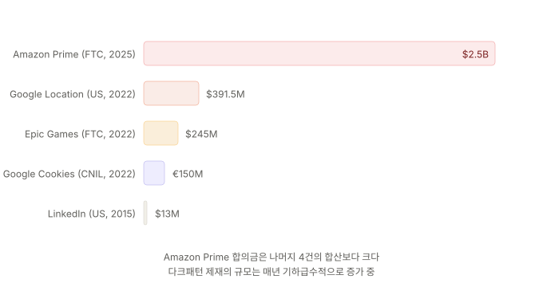

글로벌 서비스를 만들거나, 해외 규제 사례에서 교훈을 얻고자 할 때 알아야 할 규제 체계는 무엇인가.

---

## EU: 가장 체계적인 규제

### Digital Services Act (DSA)

2024년 2월부터 전면 시행된 EU 디지털 서비스법은 온라인 플랫폼의 다크패턴을 명시적으로 금지하는 **세계 최초의 포괄적 법률**입니다.

**제25조**에서 온라인 플랫폼이 "서비스 이용자의 자유로운 선택이나 의사결정을 왜곡·저해하는 방식으로 온라인 인터페이스를 설계·조직·운영"하는 것을 금지합니다. 구체적으로 금지되는 행위는 다음과 같습니다.

- 특정 선택에 더 큰 시각적 주의를 부여하는 것 (False Hierarchy)
- 동의 철회를 동의보다 어렵게 만드는 것
- 서비스 종료나 구독 취소를 가입보다 어렵게 만드는 것 (Roach Motel)

### GDPR과 동의 다크패턴

GDPR(일반 데이터 보호 규정)은 개인정보 처리에 대한 **"자유롭고, 구체적이며, 정보에 기반한, 모호하지 않은 동의"** 를 요구합니다. 이 기준 하에서 쿠키 동의 배너의 다크패턴이 집중 규제 대상이 되었습니다.

**금지되는 쿠키 동의 패턴**:
- "모두 수락"만 강조하고 "거절" 옵션을 숨기는 것
- 거절 시 추가 단계(설정 페이지)를 요구하는 것
- "모두 수락"은 1클릭이지만 "거절"은 10개 카테고리를 개별 해제해야 하는 것

**프랑스 CNIL의 쿠키 제재**: Google과 Facebook에 각각 1억 5천만 유로, 6천만 유로의 과징금을 부과한 바 있습니다(2022년). 쿠키 수락은 1클릭이지만 거절은 여러 단계를 거쳐야 하는 비대칭이 문제였습니다.

---

## 미국: FTC 주도의 집행

### FTC Act Section 5

미국에는 다크패턴만을 대상으로 하는 단일 연방법은 없지만, FTC법 제5조("불공정하거나 기만적인 행위 또는 관행"의 금지)를 근거로 다크패턴을 규제합니다.

### ROSCA (Restore Online Shoppers' Confidence Act)

2010년 제정된 이 법은 온라인 구독·자동갱신에서 소비자의 명시적 동의를 요구합니다. Amazon Prime 사건의 법적 근거가 된 법률입니다.

여기에 더해 FTC의 **Negative Option Rule(통칭 Click-to-Cancel)** 이 2025년 7월 시행되었습니다. "구독 해지가 가입만큼 쉬워야 한다"는 원칙을 연방 규칙으로 격상시킨 조치입니다.

### 캘리포니아 CPRA

캘리포니아 소비자 프라이버시법(CCPA/CPRA)은 **"다크패턴을 통해 획득한 동의는 동의로 간주하지 않는다"** 고 명시한 미국 최초의 주법입니다. 이 규정에 따르면, 동의를 유도하기 위해 사용된 기만적 UI는 법적 효력이 없습니다.

---

## 역대 주요 제재 사례

### Amazon Prime — $2.5B (FTC, 2025)

[ep.07](/dark-pattern-anatomy-ep-07)에서 상세히 다뤘지만, 규제 관점에서 추가로 짚을 점이 있습니다.

**제재 내용**: 민사 과징금 10억 달러(역대 최대) + 소비자 환불 15억 달러(약 3,500만 명), 개인 임원 2명 공동 피고 지명

**규제적 의의**: ROSCA 기반 소송이 배심원 재판까지 간 최초 사례입니다. 합의 조건에 "가입과 동일한 방법으로 해지" 의무, 컨펌쉐이밍(Confirmshaming) 카피 금지가 포함되었습니다. 제3자 감독관(compliance monitor) 선임 의무도 부과되었습니다.

### Epic Games / Fortnite — $245M (FTC, 2022)

FTC가 Epic Games에 총 5.2억 달러를 부과했습니다. 이 중 2.45억 달러가 다크패턴 관련입니다.

**문제된 행위**: 아이들이 실수로 게임 내 아이템을 구매하도록 만든 UI 설계, 구매 확인 없이 원클릭 결제, 실수로 구매한 사용자가 환불을 요청하면 계정을 잠그는 보복 조치

**규제적 의의**: 미성년 사용자를 대상으로 한 다크패턴에 대한 최초의 대규모 제재입니다. "아이들도 이해할 수 있는 명확한 동의 절차"의 기준을 제시했습니다.

### Google Location Tracking — $391.5M (미국 40개 주, 2022)

Google이 사용자가 위치 추적을 꺼도 다른 경로로 위치 데이터를 수집한 것에 대한 합의입니다. "위치 기록"을 끄더라도 "웹 및 앱 활동"이 켜져 있으면 위치가 계속 수집되는 구조가 동의 조작(Privacy Zuckering)으로 판단되었습니다.

### LinkedIn — $13M (미국, 2015)

[ep.05](/dark-pattern-anatomy-ep-05)에서 다룬 친구 스팸(Friend Spam) 사례입니다. 사용자의 연락처에 반복 초대 이메일을 발송한 행위에 대한 합의로, 다크패턴 관련 초기 대규모 제재 중 하나입니다.

---

## 주요 국가/지역 규제 비교

| 항목 | EU (DSA/GDPR) | 미국 (FTC/ROSCA) | 한국 (전자상거래법) |
|---|---|---|---|
| 다크패턴 명시적 금지 | DSA 제25조 — 명시 | 단일 법률 없음, 기존 법 활용 | 2025.2 전자상거래법 — 명시 |
| 규제 범위 | 온라인 플랫폼 전체 | 주로 전자상거래·구독 | 전자상거래·통신판매 |
| 동의 요건 | GDPR — 매우 엄격 | ROSCA — 구독 중심 | 개인정보보호법 분리 |
| 주요 제재 방식 | 과징금 (글로벌 매출 %) | 민사 소송·합의 | 시정명령, 과태료 |
| 개인 책임 | 제한적 | FTC 소송에서 가능 | 제한적 |

---

## 글로벌 서비스를 만든다면

글로벌 서비스를 운영한다면, **가장 엄격한 기준에 맞추는 것이 실무적으로 합리적**입니다. 지역별로 다른 UI를 운영하는 것보다 단일 기준을 적용하는 것이 개발·유지보수 비용 면에서 효율적이기 때문입니다.

**현시점에서 가장 엄격한 기준**: EU DSA + GDPR의 동의 요건

**실무 원칙 5가지**:

1. 동의와 거절은 동등한 노력으로 가능해야 한다 (1클릭 수락 → 1클릭 거절)
2. 가입과 해지는 동일한 채널·방법으로 가능해야 한다
3. 모든 비용은 최초 노출 시점에 공개해야 한다
4. 추가 옵션의 기본값은 "해제"여야 한다
5. 반복 요청에는 영구 거절 옵션이 있어야 한다

이 원칙을 따르면, 현재 시행 중인 모든 주요 규제(EU DSA, GDPR, FTC, 한국 전자상거래법)를 동시에 충족할 수 있습니다.

---

## 참고 자료

- EU Digital Services Act (2024.2 전면 시행), Article 25.
- General Data Protection Regulation (GDPR), Article 7 (Conditions for consent).
- FTC. (2025). *FTC Secures Historic $2.5 Billion Settlement Against Amazon*.
- FTC. (2022). *Fortnite Video Game Maker Epic Games to Pay More Than Half a Billion Dollars*.
- CNIL. (2022). Google/Facebook 쿠키 동의 과징금 결정.
- California Privacy Rights Act, §1798.140(l) — 다크패턴을 통한 동의의 무효.
- FTC. (2024). *Negative Option Rule (Click-to-Cancel)*, 16 CFR Part 425.

**주의**: 해외 법률 정보는 2026년 4월 기준으로 작성되었으며, 각국의 법률은 수시로 개정됩니다. 구체적인 컴플라이언스 판단은 해당 관할권의 법률 전문가에게 의뢰하는 것을 권장합니다.

---

## 다음 편 예고

> [ep.12 - 다크패턴 없이 만들기 — Bright Pattern과 팀 프로세스](/dark-pattern-anatomy-ep-12)

시리즈의 마지막 편입니다. Bright Pattern의 5가지 설계 원칙(투명성·대칭성·기본값·비례성·명료성)을 정리하고, 같은 KPI를 정직한 경로로 달성하는 5가지 패턴 전환 사례를 제시합니다.
직무별 자가 점검 체크리스트, 다크패턴 리뷰 템플릿, 그리고 "전환율만 보지 않는" 보완 지표 설계까지 팀에 바로 적용할 수 있는 도구를 제공합니다.
