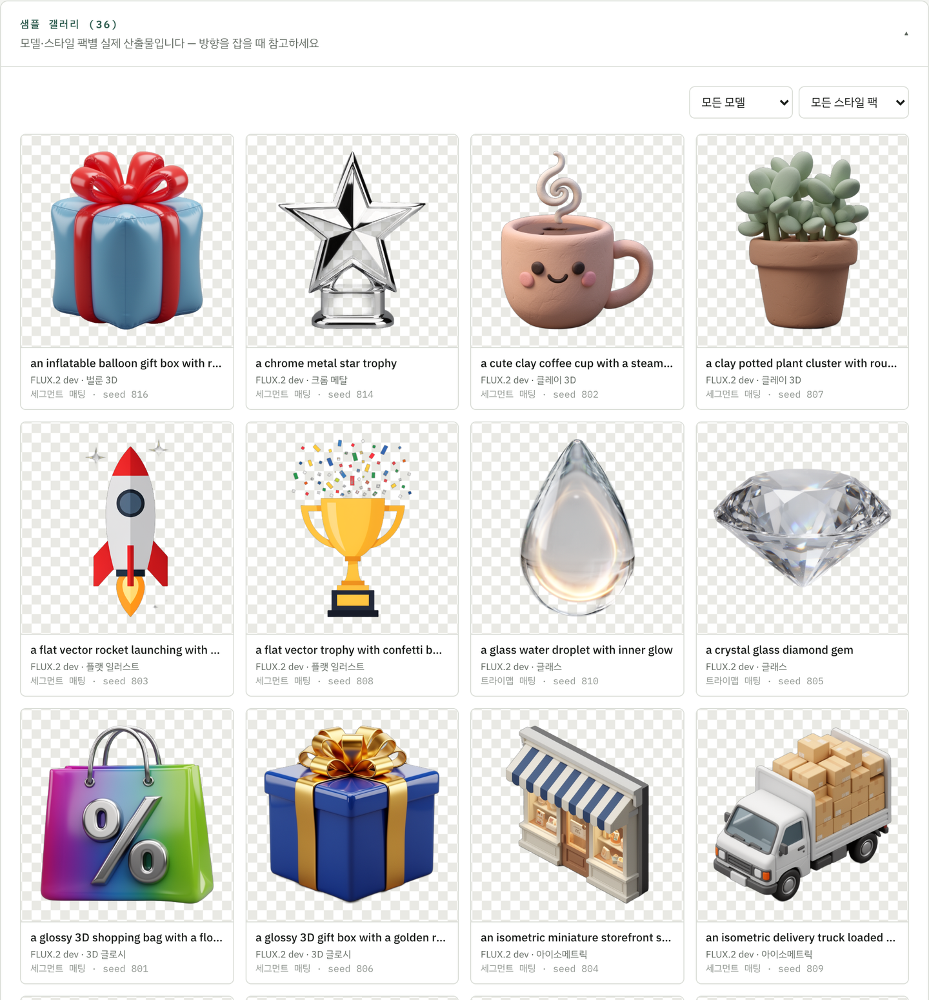
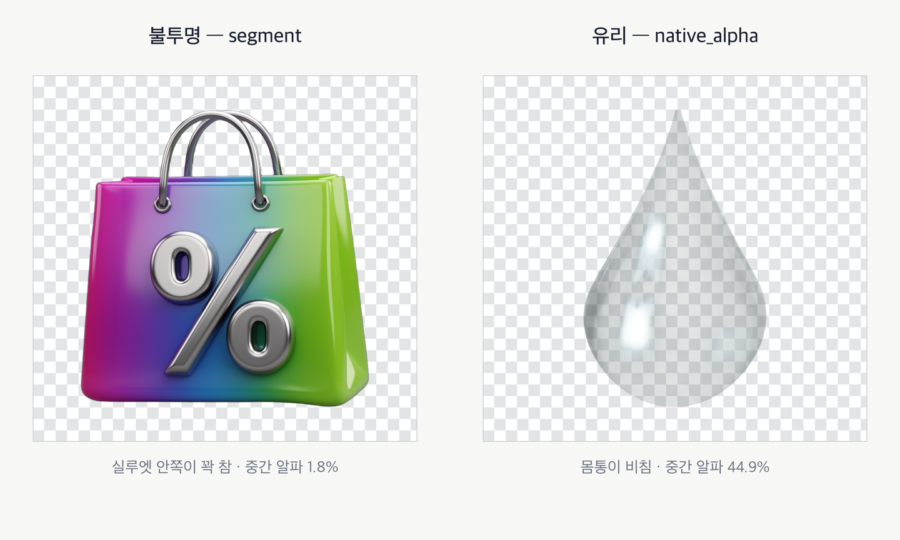
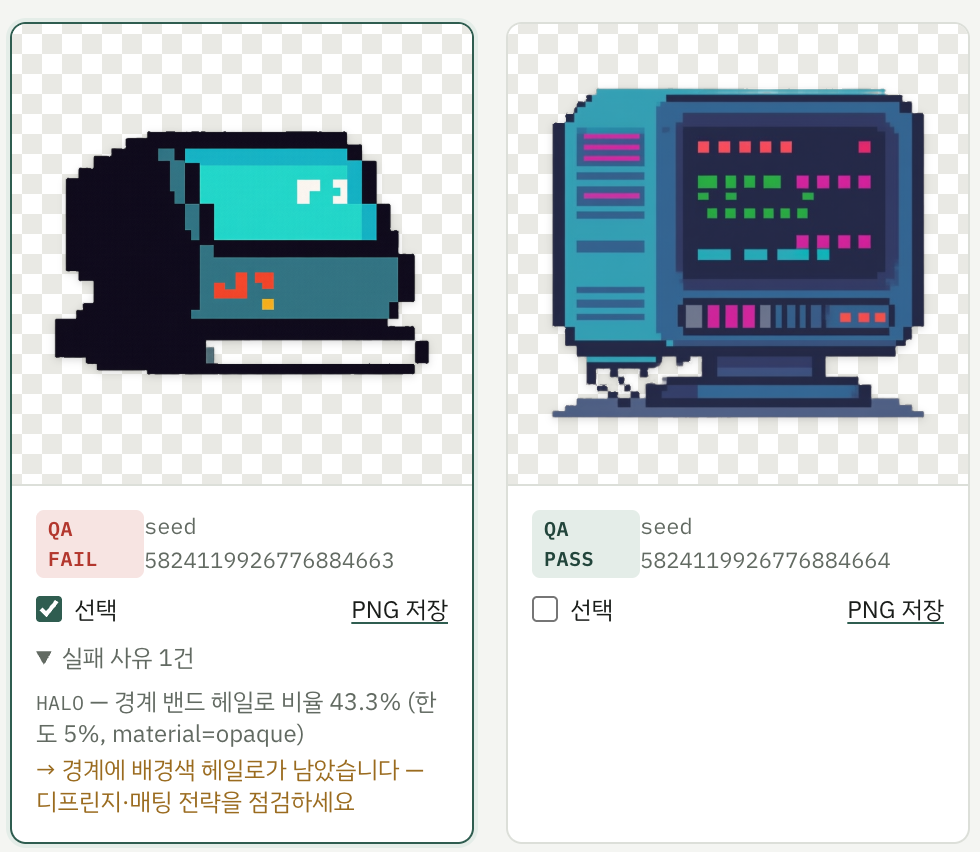
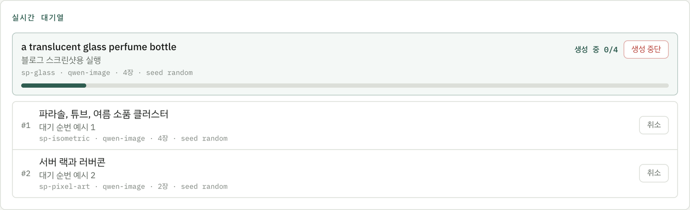
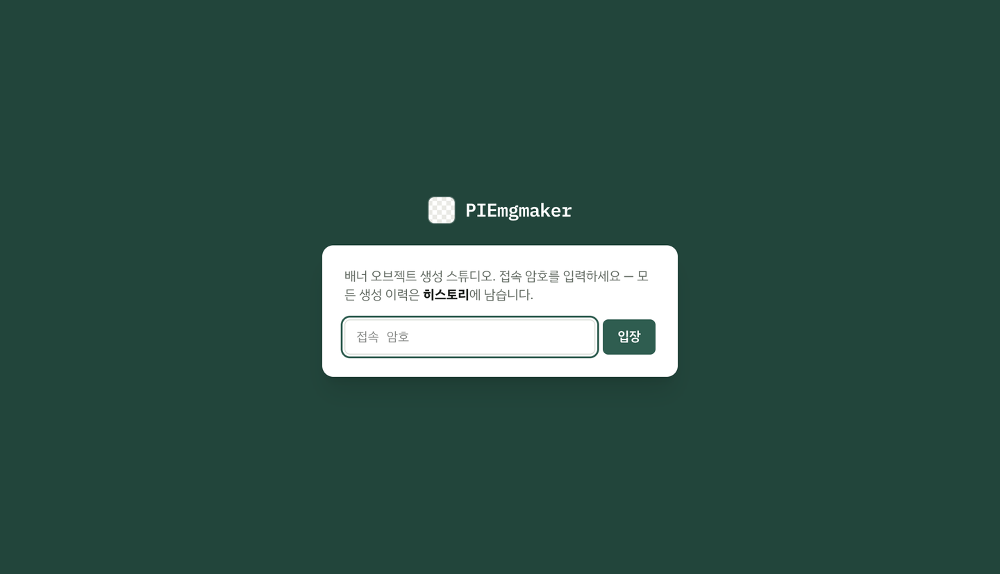
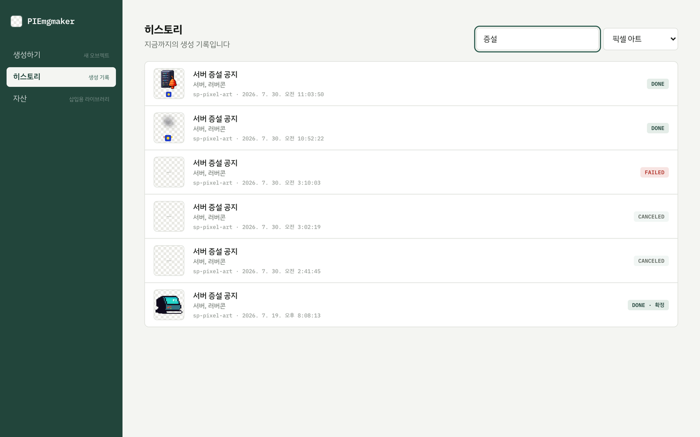

배너에 들어갈 그래픽 오브젝트를 잔뜩 만드는 팀을 보면서, AI의 도움을 받으면 제작 시간을 크게 줄이면 리서치나 아이데이션 같이 더 나은 기획을 할 수 있을 것이라고 생각했습니다. 그래서 AI를 활용해 배너에 들어갈 그래픽 오브젝트를 알파 PNG로 뽑는 도구를 만들었습니다.

로컬 Mac mini M4에서 잡 하나에 96분이 걸려서, 결국 GPU를 빌리기로 했습니다. 그런데 GCP Cloud Run으로 옮긴 첫 잡은 59분 26초가 걸렸고 $1.69가 나갔습니다. 프로파일을 떠보니 CPU는 6%였습니다. 계산은 거의 안 하고 파일 읽기만 기다리고 있었습니다.

이 글은 그 원인을 찾기까지와, 그 앞뒤로 밟은 함정들의 기록입니다. 결과물인 `PIEmgmaker`는 [MANAPIE/piemgmaker](https://github.com/MANAPIE/piemgmaker)에 올려두었습니다.

---

## 배너를 만들지 않는 배너 도구

배너 **안에** 들어갈 그래픽 오브젝트만 **알파 채널(alpha channel)** 이 있는 PNG로 뽑아내고 싶었습니다. 알파 채널은 픽셀마다 붙는 투명도 값입니다. 0이면 완전 투명, 255면 완전 불투명입니다.

캠페인 문구는 받긴 받는데 그려지지 않습니다. 컨셉을 잡는 참고용입니다.

입력은 이렇게 생겼습니다.

```yaml
campaign_text:  "여름 시즌 최대 30% 할인"       # 컨셉 참고용, 그려지지 않음
object_concept: "3D 쇼핑백과 퍼센트 기호, 작은 화분 클러스터"
model:           qwen-image                 # qwen-image | flux2-dev
assets:         [link-logo-3d]              # 원본 그대로 삽입될 자산 (선택)
size_preset:    1:1 1024x1024
style:
  style_packs:  [sp-3d-glossy]              # 12종 중 선택 (선택)
  free_text:     null                       # 팩 위에 얹거나 팩 없이 단독 사용 (선택)
reference_images: []                        # 무드·질감 참조, 최대 2장 (선택)
negative:        null                       # "이건 그리지 마라" (선택)
candidate_count: 4                          # 후보 몇 장
seed:            random
```

그림을 그리는 부분은 직접 만들지는 않았습니다. 공개된 **확산 모델(diffusion model)** 을 **ComfyUI**로 돌립니다. 확산 모델은 노이즈 화면에서 시작해 조금씩 그림으로 되돌려가는 방식입니다. 요즘 이미지 생성이라고 부르는 것 대부분이 이쪽입니다. ComfyUI는 그걸 노드 그래프로 조립해 실행하는 도구이고, 모델 파일을 직접 들고 쓸 때는 사실상 표준입니다.

이 프로젝트는 ComfyUI를 그림 그리는 엔진으로 두고 그 앞뒤를 조립한 것입니다.

원칙 세 개를 먼저 세웠습니다.

1. 브랜드 자산은 생성하지 않고 **합성**합니다. 3D 레터링 형태의 로고 변형도 자산입니다: 디자이너가 만들어 라이브러리에 등록하고, 서비스는 삽입만 합니다.
2. 배경 제거는 파이프라인의 책임입니다. 사용자에게 떠넘기지 않습니다.
3. 알파는 이진 마스크가 아니라 연속값입니다. 유리와 반투명 재질을 지원해야 합니다.

세 번째가 나머지 설계를 거의 다 결정했습니다.


### 시드를 화면에 노출한 이유

확산 모델은 노이즈에서 출발합니다. 그 출발 노이즈를 정하는 번호가 **시드(seed)** 입니다. 같은 설정에 같은 시드면 같은 그림이 나옵니다.

그래서 후보 카드마다 시드를 표시해뒀습니다. "이건 마음에 드는데 살짝만 바꾸고 싶다"면 시드를 고정한 채 다른 값을 건드립니다. "같은 설정으로 다른 그림"을 원하면 시드만 새로 뽑습니다. 이 둘을 화면에서 구분해주지 않으면 사용자가 매번 처음부터 다시 뽑게 됩니다.


시드는 맨 아래 출력 설정에 있습니다. 랜덤과 고정을 드롭다운으로 고릅니다.

### 스타일 팩이 소유하지 않는 것

스타일은 팩으로 관리합니다. 12종을 기본 제공하고, 팩이 프롬프트 틀과 팔레트, 그림자 정책을 갖습니다.

```yaml
id: sp-3d-glossy
version: 1
name: 3D 글로시
prompt_template: "{subject}, 3D rendered, glossy, ... {mood}"
negative: "..."              # "이건 그리지 마라" — 배경 억제 문구가 기본 포함
palette: [...]
material_class: opaque       # ← 배경 제거 전략을 여기가 결정한다
shadow_policy: soft_floor    # none | soft_floor | ambient
matting: { strategy: segment, model: ..., hash: ... }
```

팩은 틀이고, `{subject}` 자리에 사용자가 쓴 소재가 들어갑니다.

설계에서 중요한 건 팩이 **무엇을 소유하지 않는가**입니다. 팩은 스타일만 소유하고 모델 가중치는 소유하지 않습니다. 모델은 별도 파일이 단일 소스입니다. 안 그러면 팩을 바꿨더니 모델이 바뀌는 상황이 생깁니다.

그리고 `material_class` 한 줄이 뒤에 오는 배경 제거 전략을 결정합니다. 사용자가 고르는 게 아니라 팩에 적힌 재질이 고릅니다.

5종으로 시작했다가 12종이 됐습니다. 그런데 팩을 늘리자마자 문제가 하나 생겼습니다. **이름만 봐서는 뭐가 나올지 모릅니다.** "페이퍼 크래프트"가 어떤 질감인지, "벌룬 3D"가 얼마나 부풀어 있는지는 글자로 전달되지 않았습니다.

그래서 팩마다 대표 샘플을 실제로 생성해서 선택 카드에 미리보기로 붙였습니다.


모델이 둘이니 팩마다 두 모델을 다 뽑았고, 마음에 안 드는 팩은 다시 뽑다 보니 지금은 36장입니다. 샘플 갤러리는 아코디언으로 접어뒀습니다.



나중에는 팩을 **선택 사항으로 완화**했습니다. 참조 이미지나 자유 텍스트만으로도 생성할 수 있고, 팩이 없으면 불투명으로 처리합니다.

---

## 알파를 어떻게 얻을 것인가

### 유리는 떼어낼 수 없다

불투명 오브젝트는 단순합니다. 프롬프트에 단색 배경을 강제해서 그리게 하고, 그 배경을 떼어냅니다. 배경이 복잡하면 경계 판별이 흔들리니 애초에 단순한 배경을 만들어놓고 시작하는 겁니다.

유리는 이 방식이 통하지 않습니다. 배경을 지우면 **유리 뒤에 비쳐야 할 것까지 같이 지워집니다.** 유리의 본질이 "뒤가 비친다"인데, 뒤를 지우면 유리가 아니라 유리 모양의 판이 남습니다.

그래서 트랙이 셋으로 갈립니다.

| 트랙 | 쓰는 것 | 방식 | 언제 |
|---|---|---|---|
| segment | BiRefNet-matting + 전경 정제 | 생성된 이미지에서 오브젝트 영역을 판별해 알파를 만듦 | 불투명 기본 |
| native_alpha | Qwen-Image-Layered + 전용 VAE | 떼어내지 않음. 생성 단계에서 알파가 붙은 레이어가 그대로 나옴 | 반투명 1순위 |
| trimap | ViTMatte | 확실한 전경 / 확실한 배경 / 애매한 경계 3구역을 주고 경계만 정밀 추정 | 반투명 폴백 |

**BiRefNet**과 **ViTMatte**는 둘 다 배경 제거 전용으로 공개된 모델입니다. 이미 있는 이미지에서 오브젝트만 골라내는 일만 합니다. BiRefNet은 오브젝트 영역을 통째로 잘 잡는 쪽이고, ViTMatte는 "여기는 확실히 앞, 여기는 확실히 뒤, 이 띠 안은 모르겠다"를 알려주면 그 애매한 띠의 투명도를 정밀하게 추정하는 쪽입니다.

여기서 **VAE**가 걸립니다. 보통 VAE는 만들어진 결과를 RGB 3채널 픽셀로 펴줍니다. 알파가 붙은 그림을 생성 단계에서 바로 뽑으려면 **알파까지 펴줄 줄 아는 전용 VAE**가 따로 필요합니다. native_alpha 트랙이 전용 모델과 전용 VAE를 함께 쓰는 이유입니다.

폴백 체인은 재질이 결정합니다.

```python
# MattingRouter.chain_for(material)
opaque      -> [segment]
translucent -> [native_alpha, trimap]
```

체인이 소진되면 잡을 실패 처리하고 재생성 힌트를 남깁니다. 조용히 나쁜 결과를 내보내지 않습니다. 어느 트랙을 탔든 결과는 `AlphaResult(rgba, strategy_id, confidence)` 한 형태로 통일됩니다. 위쪽 코드는 어느 트랙을 탔는지 몰라도 됩니다.


반투명 트랙이 굳이 둘인 이유는 비용 때문입니다. native_alpha가 soft alpha 충실도가 가장 높지만, 전용 모델과 전용 VAE라 기본 모델과 따로 올려야 합니다. 메모리 부담이 생깁니다. 그래서 실패하면 trimap으로 내려갑니다. 폴백도 색 오염은 거의 없습니다.

세 번째 원칙이 여기서 눈에 보입니다. 알파가 이진 마스크였다면 오른쪽 유리는 불투명한 판이 됐을 겁니다.



### 코어 해시는 지각 해시가 아니다

후가공은 전부 비 GPU 구간이고, 전부 결정론입니다.

| 순서 | 단계 | 하는 일 |
|---|---|---|
| 1 | 디프린지 | 경계에 남은 배경색 오염을 걷어냄 |
| 2 | bbox 크롭 | 알파가 있는 영역의 경계 상자로 잘라냄 |
| 3 | 여백 정규화 | 일정한 여백을 다시 부여 |
| 4 | paste-back | 원본 자산을 알파째로 되붙임 (자산 경로만) |
| 5 | 코어 해시 검증 | 자산의 불투명 코어 픽셀이 원본과 정확히 같은지 (자산 경로만) |
| 6 | 품질 검사 | 하드 룰 3종 |

**프린지(fringe)** 는 배경을 떼어낼 때 오브젝트 가장자리 한두 픽셀에 원래 배경색이 섞여 남는 현상입니다. 경계 픽셀은 원래 두 색이 혼합된 값이라 어쩔 수 없이 생깁니다. 헤일로라고도 부릅니다. 불투명 트랙에서 단색 배경을 강제한 대가가 여기서 돌아옵니다.

**bbox 크롭**을 넣은 이유는 배너 작업의 편의입니다. 잘라내면 "오브젝트 크기 = 이미지 크기"가 되어 얹을 때 크기 감각이 일정해집니다.

5번이 이 프로젝트에서 가장 타협하지 않은 부분입니다.

```python
def verify_core_hash(result: Image, asset: AssetVariant, placement: Placement) -> bool:
    # 코어 영역 픽셀 buffer의 sha256 정확 일치. 지각 해시가 아니다.
    # 불일치 → 재시도 1회 → 실패
```

> 지각 해시가 아니라 바이트 단위 정확 일치입니다. "비슷하다"를 허용하지 않습니다.

그래서 자산을 등록할 때 **완전 불투명한 코어가 있어야** 받아줍니다. 전부 반투명인 PNG는 검증의 기준점이 없어서 등록을 거부합니다. 실제로 이 검증에 막혀 등록이 안 됐던 적이 있는데, 처음엔 버그인 줄 알았습니다. 버그가 아니라 그렇게 설계한 것이었습니다.

```text
완전 불투명(alpha=255) 코어가 없습니다 — 코어 해시 검증이 불가능해 등록할 수 없습니다
```

등록 검증은 이렇습니다. RGBA + 알파 채널 존재, 완전 불투명 코어 존재, id 규칙과 중복 검사, 파일 크기 상한이 있습니다. PNG만 받습니다. 삭제는 숨김 처리이고 실제로 지우지 않습니다.


품질 검사는 하드 룰 3종입니다.

| 룰 | 판정 | 왜 |
|---|---|---|
| 경계 접촉 | 오브젝트가 이미지 가장자리에 닿으면 실패 | 잘린 오브젝트는 배너에 못 씀 |
| 알파 커버리지 | 12\~80% 밖이면 실패 | 너무 작으면 매팅 실패, 너무 크면 배경이 안 지워진 것 |
| 헤일로 | 경계 오염 검사 | **재질을 알고 판정**: 유리의 정상 반투명을 오염으로 오탐하지 않게 |

세 번째가 핵심입니다. 재질을 모르고 판정하면 잘 만들어진 유리를 전부 불합격시킵니다. 형태 연산은 외부 의존성 없이 numpy로 직접 구현했습니다.

판정은 후보별로 리포트에 기록되어 리뷰 화면에 표시되고, **최종 채택은 사람이 합니다.** 룰이 통과했다고 좋은 그림인 건 아니니까요.


룰에 걸리면 이렇게 보입니다. 경계 밴드의 오염 비율이 43.3%라 한도 5%를 넘겼고, 재생성 힌트까지 카드에 붙습니다.



### 결정론 구간과 생성 구간

이 시스템에서 가장 중요한 설계 결정은 시스템을 두 구간으로 쪼갠 것입니다.

| 구간 | 내용 | 검증 방법 |
|---|---|---|
| 결정론 | 입력 검증 · 후처리 · paste-back · 코어 해시 · 품질 검사 | 같은 입력 → 항상 같은 출력 → 일반적인 단위 테스트 |
| 생성 | 그림 그리는 부분 | 같은 입력에도 결과가 흔들림 → 기준 이미지 세트와 비교해 점수화 |

이걸 안 쪼갰으면 **"그림이 마음에 안 드는 것"과 "코드가 틀린 것"을 구분할 방법이 없었습니다.**

결정론 구간은 단위 테스트로 봅니다. ComfyUI HTTP는 전부 모킹합니다. 생성 구간은 **골든 세트(golden set)** 로 봅니다. 그림은 맞았다·틀렸다로 판정할 수 없으니, 기준이 되는 이미지를 정답처럼 저장해두고 새 결과가 거기서 얼마나 벗어났는지를 봅니다.

지표는 셋입니다.

- **SSIM**: 사람 눈이 느끼는 유사도에 가깝게 만든 지표. 색과 구조가 얼마나 닮았는지
- **알파 IoU**: 투명·불투명을 반반으로 딱 자른 뒤 두 실루엣이 얼마나 겹치는지. 모양이 맞는지를 봄
- **soft alpha MAE**: 알파의 사이 값이 평균적으로 얼마나 어긋났는지. 반투명 표현이 유지되는지를 봄

앞의 둘만 보면 유리 재질에서 안 먹혔습니다. 그래서 세 번째가 필요했습니다. 임계값은 설정 파일이 아니라 케이스 파일에 적습니다. 케이스마다 허용 범위가 다르기 때문입니다.

---

## 로컬 Mac mini에서 부딪힌 세 가지

### 메모리가 3GB 모자란다

모델은 한 덩어리가 아니라 세 부품 세트입니다.

| 부품 | 하는 일 | 크기 |
|---|---|---|
| 텍스트 인코더 | "3D 쇼핑백"이라는 문장을 모델이 알아듣는 숫자로 바꿈 | 수십 GB |
| 그림 그리는 부분 | 그 숫자를 보고 실제로 그림을 만듦 | 수십 GB |
| VAE | 만들어진 결과를 볼 수 있는 픽셀로 펴줌 | 상대적으로 작음 |

문제는 앞의 둘이 둘 다 수십 GB이고 **동시에 올라가야 한다**는 것입니다.

| 구성 | 크기 |
|---|---|
| 텍스트 인코더 | 35.6 GB |
| 그림 그리는 부분 | 32 GB |
| **합계** | **67 GB** |
| 장비 메모리 | 64 GB |

문장을 숫자로 바꾸는 부품 하나가 35GB를 먹는다는 게 처음엔 잘 안 믿겼습니다.

증상은 connection reset, 또는 **아무 로그도 없이 프로세스가 사라지는 것**이었습니다. 간헐적이라 커스텀 노드를 먼저 의심하고 한참을 뒤졌습니다. 결국 OOM이 터진 것이었습니다. 3GB 차이입니다.

### 그래서 양자화는 얼마나 손해인가

해결은 **양자화(quantization)** 였습니다. 텍스트 인코더를 8비트로 낮추니 35.6GB가 18GB가 되면서 해소됐습니다. 그런데 낮추면 뭘 잃는지는 알고 낮춰야 합니다.

| 등급 | 크기 | 품질 |
|---|---|---|
| 16비트 (bf16 / fp16) | 기준 | 기준 |
| fp8 (8비트 부동소수) | 절반 | 네이티브 FP8 지원 GPU에서는 손실이 거의 안 보임 |
| Q8 (GGUF 8비트 정수) | 절반 | 출력이 거의 동일: 메모리가 부족할 때 첫 선택지 |
| Q6_K | 그 아래 | 차이가 감지되나 대부분 용도에 수용 가능. 미세 디테일이 부드러워짐 |
| Q4 이하 | 1/4 | 복잡한 프롬프트에서 눈에 띄게 무너짐 |

**이미지는 텍스트보다 양자화에 예민합니다.** 언어 모델은 토큰이 살짝 어긋나도 잘 안 보이지만, 이미지는 픽셀이 어긋나면 바로 보입니다. 그래서 그림 그리는 부분보다 텍스트 인코더 쪽을 먼저 낮췄습니다. 문장을 숫자로 바꾸는 단계는 조금 뭉개져도 최종 픽셀에 미치는 영향이 상대적으로 간접적입니다.

실제 구성은 이렇습니다.

|  | 그림 부분 | 텍스트 인코더 |
|---|---|---|
| 로컬 | Q8 | fp8 |
| 원격 qwen | **Q6_K** (L4 24GB에 맞추려 한 단계 더) | fp8 |

A/B로 재보지는 않았습니다. 예전에 ComfyUI로 이 조합을 여러 번 돌려본 감으로 결정했습니다.

프로파일 id에는 이게 안 드러납니다. 뒤에 나오는 리뷰 화면의 모델명이 `qwen-image-layered-q8-gguf`인데, 원격에서 실제로 올라간 파일은 `qwen-image-layered-Q6_K.gguf`입니다. id는 로컬 빌드 기준으로 지어두고 원격 프로파일이 파일만 갈아끼우는 구조라 그렇습니다. 화면에 뜨는 이름과 실제 가중치가 다를 수 있다는 뜻이니, 정확한 파일은 `payload.json`의 매니페스트를 봐야 합니다.

모델 파일은 프로파일에 sha256으로 고정해뒀습니다. 같은 이름의 다른 빌드가 섞여 들어오면 결과가 조용히 달라지기 때문입니다.

```yaml
# model_profiles.yaml — 워크플로우·샘플링·sha256 핀의 단일 소스
qwen-image:
  workflow_gen: object-gen-qwen-v1
  workflow_inpaint: object-inpaint-qwen-v1
  workflow_styleref: object-gen-styleref-v1
  supports_negative: true
  manifest:
    unet: { name: ..., sha256: ... }
    clip: { name: ..., sha256: ... }
    vae:  { name: ..., sha256: ... }
```

### 두 계열을 같이 못 띄운다, 그리고 96분

같은 이유로 Qwen 스택과 FLUX.2 스택을 한 프로세스에 올릴 수 없었습니다. 그래서 모델 계열을 전환할 때는 엔진을 재기동하는 게 운영 수칙이 됐고, 배치는 모델별로 묶어서 실행하게 됐습니다.

그리고 느립니다. 1024² 후보 4장에 **약 96분**이 걸립니다. 워커 타임아웃 기본값을 4시간으로 잡아야 했습니다.


> 되긴 됩니다. 그런데 96분 동안 제 맥이 통째로 묶입니다.

모델 선정 히스토리도 여기 적어둡니다. FLUX은 1 시절부터 써서 프롬프트가 어떻게 먹히는지 감이 있었고, 그래서 FLUX.2 dev가 첫 후보였습니다.

막힌 건 라이선스였습니다. dev 계열은 비상업 라이선스입니다. 개인 실험은 되지만 결과물을 실무로 끌고 나가는 순간 확인이 필요해집니다. 배너 소재를 뽑는 도구에서는 작은 문제가 아닙니다.

Qwen-Image는 Apache 2.0입니다. 라이선스를 신경 쓰지 않아도 되는 쪽이 기본값이어야 한다고 판단했습니다. 기능적으로도 유리했습니다. 참조 이미지로 무드를 잡는 Qwen-Image-Edit, 생성 단계에서 알파가 바로 나오는 Qwen-Image-Layered가 같은 계열에 있습니다.

FLUX.2를 남긴 이유는 단순합니다. 그림체가 더 마음에 들었습니다. 라이선스 확인은 쓰는 사람 책임으로 두고 선택지로 유지했습니다.

---

## AWS와 GCP 사이

### 서버리스 GPU가 한쪽에만 있었다

요구는 단순했습니다. 성능은 필요한데 돈은 많이 안 썼으면 좋겠습니다. 하루 종일 쓸 것도 아니니 **안 쓸 때 0원이 아니면 의미가 없었습니다.**

|  | GCP | AWS |
|---|---|---|
| 서버리스 GPU | Cloud Run에 GPU 부착 가능. 요청 있을 때만 뜨고 없으면 0대. 초 단위 과금 | 대응물 없음. Lambda·Fargate는 GPU 미지원 |
| 그나마 비슷한 것 | - | SageMaker 비동기 엔드포인트가 0대까지 내려감. 단 S3로 넣고 S3에서 꺼내는 구조 |
| 큰 GPU | RTX PRO 6000 Blackwell 96GB 단일 카드 | 일반 인스턴스 최대가 L40S 48GB. 그 위는 A100/H100 멀티 GPU급 |
| 우리 코드가 할 일 | HTTPS 주소 + 토큰만 알면 끝 | EC2를 API로 켜고 끄는 오케스트레이션 계층을 직접 작성 |

결정적이었던 건 둘입니다.

**SageMaker 비동기는 인터페이스가 다릅니다.** "안 쓸 때 0원"이라는 목적은 같은데 S3 기반입니다. 지금의 "HTTP로 제출 → 상태 문의 → 결과 수신" 엔진을 전부 다시 짜야 했습니다. 처음부터 다시 만들 생각은 없었습니다.

**FLUX.2 스택 50GB가 AWS에서 애매했습니다.** 제일 맞는 카드가 L40S 48GB인데 빠듯합니다. 오프로드가 필요해지고, 그러면 시스템 메모리가 큰 상위 인스턴스로 올라갑니다. 96GB 단일 GPU를 그냥 고를 수 있는 쪽이 훨씬 단순했습니다.

AWS가 나았을 조건도 있습니다. 하루 종일 돌릴 거라 상시 스팟으로 싸게 가는 방향이었거나, 애초에 배치 파이프라인으로 재설계할 생각이었다면 불리하지 않습니다. 지금 구조가 웹에서 잡을 넣고 폴링하는 형태라 그렇습니다.

직접 켜고 끄는 방식도 검토했습니다. VM을 API로 기동·종료하는 자작 온디맨드, 또는 스팟 인스턴스였습니다. 비용은 더 내려가지만 사이드 프로젝트 하나에 시간을 더 태우기는 아까웠고, Cloud Run이 알아서 해주는 걸 굳이 다시 만들 이유가 없었습니다.

### 상시 운영이면 월 $4,036

Cloud Run이 아니었다면 얼마가 들었을지 계산해봤습니다.

|  | 시간당 | 하루 | 월(730시간) |
|---|---|---|---|
| qwen용 (L4 24GB) | $1.71 | $40.92 | **$1,245** |
| flux2용 (RTX PRO 6000 96GB) | $3.82 | $91.78 | **$2,792** |
| 둘 다 | | | **약 $4,036** |

지금 실제 비용은 잡당 $0.24 + 상시 월 $10 안팎입니다. 상시 비용은 버킷과 이미지, 캐시에서 나옵니다.

다만 상시 유지가 항상 손해는 아닙니다. 잡마다 **콜드 스타트(cold start)** 값을 치르니 잡이 촘촘하면 켜두는 게 이득입니다. 콜드 스타트는 서버가 0대인 상태에서 요청이 들어와, 컨테이너를 새로 띄우고 모델을 다 읽어 준비를 마치기까지의 시간입니다.

분기점은 튜닝 전 기준으로 하루 28잡, 튜닝 후에는 단순 환산으로 하루 200잡 안팎입니다. 개인이 쓰는 도구에서 하루 200잡은 나오지 않습니다.

GPU 존 이중화는 껐습니다. 켰다면 시간당 $2.16 / $4.70이 되니, 끄는 것만으로 각각 **21%와 19%** 가 절감됩니다. 개인용이라 가용성을 그만큼 살 이유가 없었습니다.

### 네 가지 결정사항


**서비스를 모델 계열별로 분리했습니다.** FLUX.2 스택은 압축해도 약 50GB라 L4 24GB에 안 들어갑니다. 로컬에서 두 계열을 같이 못 띄웠던 그 제약이 클라우드에서도 그대로 돌아왔습니다. 이번에는 재기동 대신 서비스를 나누는 방식으로 풀었습니다.

**리전은 싱가포르입니다.** GPU를 붙일 수 있는 Cloud Run 리전에 서울이 없습니다. 레이턴시는 수용하기로 했습니다.

**모델은 클라우드 저장소에 두고 서버에 폴더처럼 마운트했습니다.** 컨테이너 이미지에 수십 GB를 굽지 않으려는 선택이었습니다. 그런데 이 방식에는 함정이 있었습니다. **코드가 자기가 네트워크 너머를 읽고 있다는 걸 모릅니다.** 이것 때문에 발생한 이슈는 아래쪽에 나옵니다.

**인증은 컨테이너 안 프록시가 토큰을 검사합니다.** 보안 그 자체보다는, 인터넷에 열린 GPU 주소가 남의 지갑으로 돌아가는 걸 막는 목적입니다.

### 엔진을 인터페이스로 뽑아둔 값

코드 변경은 의외로 작았습니다. 처음부터 엔진을 인터페이스로 뽑아뒀기 때문입니다.

```python
class WorkflowEngine(Protocol):
    def submit(self, payload) -> JobHandle: ...
    def poll(self, handle)    -> JobStatus: ...
    def fetch(self, handle)   -> list[CandidateResult]: ...
    def cancel(self, handle)  -> None: ...
```

제출·상태 문의·결과 수신·취소. 이 넷만 지키면 위쪽 코드는 로컬인지 원격인지 몰라도 됩니다. HTTP 코어는 공통 베이스가 갖고, 로컬 구현은 여기에 온디맨드 기동과 하트비트만 얹습니다. 원격 구현은 모델 계열별 URL로 라우팅하고 콜드 스타트를 기다립니다.

사용자 쪽 스위치는 환경변수 하나입니다.

```bash
PM_ENGINE=remote-comfy          # 기본값은 local-comfy
PM_REMOTE_URL_QWEN=https://...  # https만 허용 — 토큰 평문 전송 차단
PM_REMOTE_URL_FLUX2=https://...
```

안 건드리면 동작이 전과 완전히 같습니다. 그리고 시작할 때 어느 백엔드로 도는지 한 줄 남기게 했습니다. 원격 URL이 설정됐는데 엔진이 로컬이면 경고합니다. 설정 불일치로 생성이 조용히 로컬로 나가는 걸 막기 위해서입니다.

구현은 간단했습니다. 트러블슈팅이 빡셌습니다.

---

## 모델을 옮기는 것 자체가 프로젝트였다

"클라우드로 옮긴다"가 코드만 옮기는 일인 줄 알았습니다. 아니었습니다. 수십 GB짜리 모델도 같이 올라가야 합니다.

모델 6종. 압축 상태로도 qwen 세트가 26GB, flux2 세트가 53GB입니다. 처음엔 로컬에서 버킷으로 올리려 했는데, 집 회선으로 80GB를 미는 그림이 나왔습니다. 예상 소요가 12시간이었습니다.

방향을 틀었습니다. **모델 배포처에서 클라우드 저장소로 직접 받게** 했습니다. 클라우드로 들어오는 트래픽은 무료이니 로컬 회선을 아예 거치지 않으면 됩니다.

여기서도 세 번의 이슈가 있었습니다.

| 증상 | 원인 |
|---|---|
| 처음 몇 GB는 잘 받다가 KB/s로 떨어짐 | 익명으로 받고 있었음 → 토큰 인증하니 속도 유지 |
| 다운로드 작업이 그냥 죽음 | 작업 머신 메모리가 4GB → 8코어짜리로 상향 |
| 8GB로 올려도 여전히 죽음 | 다운로드 도구의 고성능 모드가 메모리를 크게 씀 → 기본 모드로 복귀 |

첫 번째가 특히 얄궂었습니다. 15GB 파일을 받는데 12GB 지점까지는 멀쩡히 오다가 갑자기 떨어집니다.

```text
[#7c6e86 12GiB/15GiB(80%) CN:3 DL:144KiB ETA:6h16m16s]
[#7c6e86 12GiB/15GiB(80%) CN:3 DL:88KiB  ETA:10h15m44s]
[#7c6e86 12GiB/15GiB(80%) CN:3 DL:98KiB  ETA:9h8m13s]
```

처음엔 회선 문제나 대용량 파일의 특성인 줄 알았습니다. 익명 요청에 걸린 속도 제한이었습니다. 토큰을 시크릿에 넣고 인증 요청으로 바꾸니 끝까지 속도가 유지됐습니다.

두 번째와 세 번째는 같은 증상이 다른 원인에서 나온 경우입니다. 작업이 아무 메시지 없이 멈춥니다. 머신을 키웠는데도 계속 죽길래 한참 헤맸는데, 다운로드 도구의 고성능 모드가 메모리를 크게 쓰는 게 원인이었습니다. 기본 모드로 되돌리니 8코어에서 안정적으로 돌았습니다.

배포 순서도 함정이 있었습니다. 이미지를 먼저 빌드해서 올린 다음에 인프라를 적용해야 합니다. 반대로 하면 시작 프로브가 붙을 컨테이너가 없어서 실패합니다. 플레이스홀더 이미지로 때울 수가 없습니다.

### 커스텀 노드는 import 실패를 삼킨다

모델을 다 올리고 이미지를 굽고 배포까지 끝냈습니다. 스모크 점검도 통과했습니다. 무인증 요청은 401, 토큰 요청은 200. 정상입니다.

그리고 첫 생성에서 터졌습니다.

```text
배경 제거 폴백 체인 소진 — 재생성이 필요합니다
  node_id: mat_F1
  node_type: BiRefNetRMBG
  exception_message: Error loading BiRefNet model: No module named 'timm'
```

배경 제거 커스텀 노드가 `timm`을 필요로 하는데, 그 노드의 requirements에는 `timm`이 선언되어 있지 않았습니다. 로컬에서는 다른 무언가가 이미 깔아둬서 안 보였던 것입니다.

문제는 이게 **왜 안 잡혔는가**입니다. ComfyUI의 커스텀 노드 로더는 import 예외를 삼키고 해당 노드 등록만 건너뜁니다. 프로세스는 정상 기동하고, 헬스체크는 계속 초록이고, 스모크 점검도 통과합니다. 그 노드를 실제로 호출하는 워크플로우가 돌기 전까지는 아무도 모릅니다.

빌드도 통과, 기동도 통과, 스모크도 통과. 첫 생성에서 폭발. 그 사이에 콜드 스타트와 모델 적재 시간이 다 들어갑니다.

대응은 빌드 시점 정적 검사였습니다. 이미지에 굽는 모델 코드의 최상위 import를 훑어서, 설치되지 않은 모듈이 있으면 빌드가 실패합니다.

> 헬스체크가 통과한다고 워크로드가 통과하는 게 아닙니다.

---

## 59분 26초를 8분 25초로

### 진범은 절약 기능이었다

첫 원격 잡이 59분 26초, $1.69였습니다. 로컬 맥보다 느립니다. GPU를 빌린 의미가 없습니다.

프로파일을 떴더니 **CPU 6%, 전 구간 I/O 대기**였습니다. 계산은 안 하고 파일 읽기만 기다리고 있었습니다.

범인은 ComfyUI의 절약 기능이었습니다. GPU 메모리를 아끼려고 가중치를 미리 다 올리지 않고, 추론 도중 필요한 조각만 그때그때 가져오는 동작이 기본으로 켜져 있습니다.

로컬 SSD에서는 훌륭한 최적화입니다. 그런데 원격에서 그 파일은 로컬 폴더처럼 보일 뿐, 실제로는 클라우드 저장소를 마운트한 것입니다. **조각마다 네트워크 왕복이 붙습니다.**

```bash
# 전량 적재로 되돌린다. 이게 결정적이었다.
python main.py --disable-dynamic-vram
```

앞에서 "코드가 자기가 네트워크 너머를 읽는 걸 모른다"는 게 이런 이슈로 돌아왔습니다.

### mmap을 껐더니 16배 느려졌다

파일을 읽는 방식은 크게 둘입니다. 통째로 복사해 올리거나, 메모리 주소에 대응시켜 두고 필요한 부분만 가져오거나. 뒤쪽이 **mmap**입니다.

"네트워크 파일시스템이니까 mmap도 끄는 게 맞겠지"라고 생각했습니다. 껐더니 더 느려졌습니다.

| 읽기 방식 | 처리량 |
|---|---|
| mmap 경로 | **89 MB/s** |
| mmap을 끈 경로 | **5.2 MB/s** |

16배 차이입니다. mmap 쪽이 파일을 앞에서 뒤로 순서대로 읽어서, 저장소 마운트의 미리 읽기 최적화가 붙는 것으로 보였습니다. 비-mmap 경로는 그 최적화를 못 받습니다.

직관과 반대라 한참 붙들고 있었습니다. 네트워크 파일시스템에서 랜덤 액세스가 나쁜 건 맞는데, **mmap이 곧 랜덤 액세스는 아니었습니다.** 접근 방식의 이름과 실제 접근 순서는 다른 얘기였습니다.

### 클라우드 내부 경로는 선택이 아니라 요구사항이다

마지막은 네트워크 경로였습니다. 클라우드 내부 전용 경로를 켜지 않으면 인스턴스 대역폭이 600 Mbps로 묶입니다. 구글이 GPU와 저장소를 함께 쓰는 조합에 **요구사항으로 명시**해둔 항목입니다. 권장이 아니라 요구사항입니다.

여기에 마운트 옵션과 저장소 캐시를 얹었습니다.

```text
enable-buffered-read=true       # 순차 읽기 버퍼링
read-global-max-blocks=64       # 읽기 블록 상한
metadata-cache-ttl-secs=-1      # 모델 파일은 안 바뀌므로 무기한
```

버킷 쪽에는 3개 존에 캐시를 붙였습니다. 버킷 송신량이 2.9배로 증폭되는 현상이 남았는데, 같은 리전 안의 전송은 무료라 무해하다고 보고 더 쫓지 않았습니다.

**결과는 8분 25초, $0.24입니다.** 시간도 비용도 7배 줄었습니다.


이 구간은 다시 되돌아갈 수 있습니다. ComfyUI나 커스텀 노드 버전을 올린 뒤에는 잡 1건의 구간별 소요를 다시 재야 합니다. 적재 관련 기본값이 바뀌면 이 튜닝이 조용히 무효가 됩니다.

### 가만히 있는데 돈이 나간다

성능을 잡고 나니 다른 게 보였습니다. Cloud Run GPU는 요청이 끝난 뒤에도 **최대 10분간 인스턴스가 살아 있고, 그 시간이 전액 과금됩니다.**

재실행이 빠르라고 있는 동작입니다. 그런데 실측하니 **잡당 비용의 38\~56%** 가 여기서 나갔습니다. 아무 일도 안 하는 구간이 비용의 절반 가까이입니다.

문제는 그 10분을 조절하는 설정이 없다는 것입니다. 컨테이너가 스스로 죽는 수밖에 없습니다.

임계값을 어디에 둘지 계산해봤습니다. 살려두는 시간과 모델을 읽는 시간이 **같은 인스턴스 요율**로 과금됩니다. 그러면 요율이 약분되고, **손익분기점은 곧 모델 적재 시간(6분 20초)** 이 됩니다. 6분 20초 안에 다음 잡이 오면 살려두는 게 이득입니다.

그런데 조절 가능한 구간이 0\~10분이고, 10분이 되면 어차피 Cloud Run이 GPU를 회수해갑니다. 조절 구간 대부분이 분기점 근처거나 아래입니다. 5분은 너무 짧아서 9분으로 잡았습니다.

```bash
# 큐가 비고 이 시간만큼 요청이 없으면 프로세스를 스스로 종료
IDLE_SHUTDOWN_SEC=540
```

보너스 함정이 하나 더 있었습니다. 웹 화면이 3초·5초마다 서버에 큐 상태를 물어봅니다. 그 요청이 잠든 인스턴스를 깨우면 **아무 일도 안 하는데 돈이 나갑니다.** 진행 중인 잡이 없으면 원격 쪽으로 아예 통신하지 않도록 고쳤습니다. 진행 중일 때도 해당 잡이 쓰는 서비스만 찔러봅니다.

프론트의 폴링 주기가 청구서를 만드는 구조였습니다.

큐는 단순합니다. GPU 1장에 잡 1건이니 서버에 단일 워커 큐를 두고 순서대로 처리합니다. 항목마다 무슨 요청인지 요약을 표시했습니다. 대기 중인 잡은 즉시 취소되고, 실행 중인 잡은 GPU 작업까지 끊습니다.



백엔드 상태 확인이 연속 5회 실패하면 잡을 실패 처리합니다. 이게 없으면 죽은 백엔드를 붙들고 타임아웃 4시간을 다 채웁니다. 서버가 재시작되면 미완 잡을 자동으로 실패 처리합니다.

---

## 처음과 지금

### 원격은 왜 로컬보다 빠른가

튜닝을 끝내고 나니 생성 구간만 놓고는 로컬 96분 대 원격 1분 30초입니다. 이유는 셋입니다.

**연산 회로가 다릅니다.** 확산 모델이 하는 일 대부분이 거대한 행렬 곱셈입니다. NVIDIA 계열 GPU에는 이 연산 전담 회로가 따로 있고 낮은 정밀도에서 특히 빠릅니다. Apple Silicon GPU에는 대응 경로가 없어 범용 경로로 돕니다.

**실제로 실행되는 코드가 다릅니다.** 확산 모델 구현체와 커스텀 노드 대부분이 NVIDIA 기준으로 최적화되어 있습니다. macOS 백엔드는 미지원 연산이 CPU로 떨어지거나 느린 대체 경로를 탑니다.

**메모리 여유가 다릅니다.** 로컬 64GB는 OS와 다른 앱이 함께 쓰고, 모델이 경계에 걸려 있었습니다. 경계에 걸리면 페이지 조각을 밀어냈다 다시 올리는 동작이 계속 붙습니다. 원격은 모델 크기에 맞춰 서비스를 나눠서 이게 없습니다.

다만 원격 qwen은 L4 24GB에 맞추려 Q6_K로 한 단계 더 압축했습니다. 파일이 작으면 계산량도 줄어듭니다. 구조적으로 몇 배 빠른 건 맞지만 정밀한 측정은 아직 안 해봤습니다.

### 숫자로 보는 처음과 지금

|  | 로컬 (Mac mini M4) | 원격 첫 시도 | 지금 |
|---|---|---|---|
| 잡 1건 소요 | 약 96분 | 59분 26초 | **8분 25초** |
| ├ 컨테이너 기동 | - | - | 31초 |
| ├ 모델 적재 | 수십 초 (로컬 SSD) | 50분 이상 | 6분 20초 |
| └ 생성 | 대부분 | 나머지 | 약 1분 30초 |
| 잡당 비용 | 0원 (전기 제외) | $1.69 | **$0.24** |
| 상시 비용 | 0원 | 월 $10 안팎 | 월 $10 안팎 |
| 같은 사양 상시 운영이면 | - | - | 월 약 $4,036 |
| 작업 중 내 맥 | **96분 내내 점유** | 자유 | 자유 |
| 모델 계열 전환 | 엔진 재기동 필요 | 서비스 분리로 불필요 | 불필요 |
| FLUX.2 | 원본 정밀도 불가 (67GB) | 전용 서비스 (96GB GPU) | 전용 서비스 |
| 두 번째 잡 | - | - | 9분 안이면 적재 생략 |

로컬과 원격은 기기와 양자화 조건이 달라 절대 비교는 아닙니다.


구조는 파이썬 패키지 + 잡 큐 서버 + 웹 화면의 3부 구성입니다. **별도 DB가 없습니다.** 잡 하나가 폴더 하나이고, 히스토리는 폴더 목록입니다. 개인 규모라 의존성을 더 붙이지 않았습니다.

웹은 게이트 하나로 통째로 잠급니다. 계정 체계 없이 암호 하나이고, 세션은 12시간입니다.



잡 폴더는 이렇게 생겼습니다.

```text
PM_STORAGE/jobs/<job_id>/
├── payload.json               # 재현용 잡 페이로드 (버전 핀)
├── candidates/<i>_<seed>.png  # 엔진에서 갓 수확한 원본
├── final/<i>_<seed>.png       # 결정론 후처리를 마친 알파 PNG — QA는 이걸 본다
├── qa_report.json             # 후보별 룰 판정 + 재생성 힌트
├── status.json                # 상태 전이 기록
└── brief.yaml                 # 입력 브리프
```

`payload.json`에 워크플로우 해시와 모델 매니페스트, 스타일 팩 버전, 매팅 전략, 시드, 사이즈가 다 들어 있습니다. 히스토리의 "이 설정으로 다시 생성"이 이걸 그대로 재사용합니다.



### 남은 것들

**에셋이 장면에 안 녹습니다.** 자산의 픽셀을 그대로 보존하라고 했더니, 그 말은 다시 말하면 그 로고만 주변과 따로 논다는 뜻입니다. 조명도 원근도 주변과 맞지 않습니다. 코어 해시를 바이트 단위로 잠근 대가입니다. 기술로 풀 문제가 아니라 정책으로 정할 문제에 가깝고, 아직 답을 못 정했습니다.

**골든 세트는 아직 비어 있습니다.** 틀은 만들어뒀는데 케이스를 못 채웠습니다. 생성 구간을 검증할 유일한 수단인데 말이죠.

로컬에서 다 만들어놓고 클라우드로 옮기기로 한 순서는 결과적으로 옳았습니다. 옮기는 과정에서 부딪힌 문제 대부분이 인프라 쪽이었고, 그때 파이프라인이 이미 안정적이었기 때문에 원인을 분리해서 볼 수 있었습니다. 두 가지를 동시에 흔들었다면 59분이 어디서 온 건지 영영 못 찾았을 겁니다.

---

## 참고 자료

- MANAPIE/piemgmaker. (https://github.com/MANAPIE/piemgmaker)
