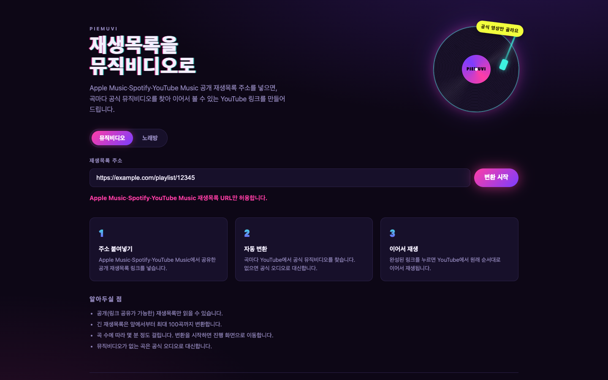
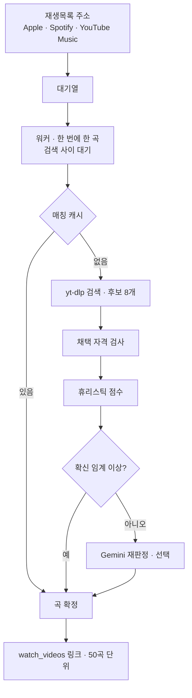
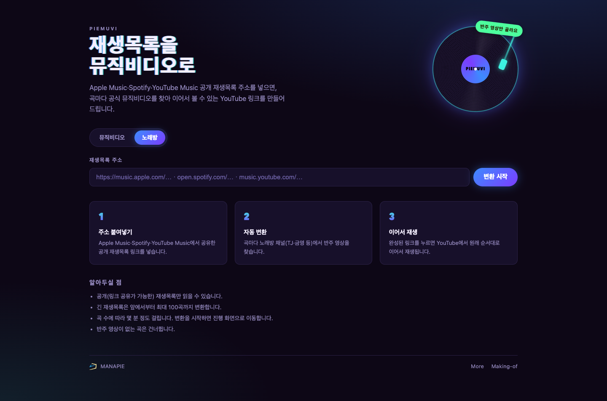

집에서 작업할 때는 뭐라도 틀어둡니다. 그런데 음악만 틀면 금방 심심해집니다. 내용이 있는 영상을 틀면 이번엔 자꾸 시선을 뺏깁니다. 한참을 오가다 뮤직비디오에 정착했습니다. 봐도 되고 안 봐도 되는, 딱 그 사이에 있는 콘텐츠라서요. 그리고 K-pop 트렌드도 따라가야 하지 않겠습니까.

문제는 재생목록이 애플 뮤직과 스포티파이에 있다는 것이었습니다. 목록을 보며 유튜브에서 한 곡씩 찾아 여는 일을 몇 번 하다가 그만뒀습니다.

이 글은 그 일을 대신할 서비스를 만들고, 그 과정에서 밟은 오답과 오진을 정리한 기록입니다. 결과물인 PIEmuvi는 [piemuvi.manapie.me](https://piemuvi.manapie.me)에서 돌고 있고, 코드는 [MANAPIE/piemuvi](https://github.com/MANAPIE/piemuvi)에 있습니다.

---

## 만들기 전에 확인한 세 가지

이 서비스가 사용하는 것 중에 공식 API는 하나도 없습니다. 그래서 코드를 쓰기 전에 세 가지를 테스트 해봐야 했습니다.

첫째, 여러 영상을 이어서 트는 링크가 지금도 동작하는지. 유튜브에는 `youtube.com/watch_videos?video_ids=…` 형태의 주소가 있습니다. 문서에 없는 비공식 기능입니다. 임의의 영상 ID 세 개로 주소를 만들어 접속하니 `watch?v=…&list=TLGG…`로 리다이렉트됐습니다. 임시 재생목록이 만들어진다는 뜻입니다. 여기서 실패했다면 프로젝트가 성립하지 않았습니다.

둘째, 애플 뮤직 공개 재생목록 페이지에서 곡 목록을 읽을 수 있는지. 페이지에 박힌 `serialized-server-data` JSON에 제목·아티스트·재생시간이 전곡 들어 있었습니다. 100곡짜리도 전부 나왔습니다.

셋째, 스포티파이도 같은 방식이 되는지. 여기서 걸렸습니다. 일반 페이지는 봇 챌린지에 막힙니다. 대신 임베드(embed) 페이지 경로로는 읽혔습니다. 다만 100곡에서 잘리고, 응답에 전체 곡 수 필드가 없어서 잘렸는지조차 알 수 없었습니다.

세 번째 결과가 설계 하나를 미리 정했습니다. 잘림을 감지할 수 없으니 **잘렸을 수 있다고 사용자에게 말하는 쪽**을 택했습니다. 조용히 100곡만 내주고 마는 대신에요. 비공식 경로 위에서는 이 태도가 곳곳에 필요했습니다. 입력 주소는 호스트 정확 매칭 화이트리스트로만 받고, 페이지 구조가 바뀌면 잡을 조용히 실패시키지 않고 명시적으로 실패시킵니다.



---

## 하루 만에 도는 물건이 됐다

검증이 끝나고 나니 구현 자체는 빨랐습니다. 파이썬 3.12 + FastAPI + SQLite에 yt-dlp를 서브프로세스로 부르는 구성입니다. 프런트 프레임워크는 없고 폴링 JS만 있습니다. 단일 도커 컨테이너로 돕니다.

핵심 요구는 성능이 아니라 **천천히**였습니다. 상용 서버에 올려서 크게 서비스할 계획도 없었고, 게다가 검색은 비공식 경로를 통하니 몰아치면 막힙니다. 그래서 제약을 기능으로 넣었습니다. 동시성 1짜리 워커 하나가 곡을 순서대로 처리하고, 실제 검색이 발생할 때만 사이에 딜레이를 둡니다. 캐시에 있는 곡은 기다리지 않습니다. 여기에 전역 일일 검색 예산, IP별 일일 예산, 잡당 곡 상한 100곡, 대기열 상한을 겹쳐 뒀습니다. 앞서 전곡을 읽어냈던 애플 뮤직도 100곡을 넘기면 같은 잘림 경고를 달았습니다.



매칭 캐시는 곡 단위입니다. 정규화한 아티스트·제목을 키로 쓰기 때문에 재생목록이 달라도 같은 곡이면 재검색하지 않습니다. 첫 E2E에서 애플 뮤직 50곡을 돌린 뒤 스포티파이의 재생목록을 넣으니 26곡이 곧바로 캐시에서 나왔습니다. 같은 주소를 다시 넣으면 4초 만에 끝납니다.

재시작 복구도 초기에 넣었습니다. 곡 하나를 처리할 때마다 상태를 기록하니, 컨테이너가 죽었다 뜨면 처리하던 잡을 대기열로 되돌린 뒤 남은 곡부터 이어갑니다. 7곡째에 서버를 강제 종료하고 다시 띄워 50곡을 완주하는 것까지 확인했습니다.

여기까지는 순조로웠습니다. 문제는 결과의 품질이었습니다.

---

## 가장 오래 보는 화면은 기다리는 화면입니다

결과를 논하기 전에, 일단 눈에 보이는 UX부터 신경을 쓰고 싶었습니다. 이 서비스는 화면이 둘뿐입니다. 주소를 넣는 화면과, 진행 상황을 보는 화면입니다. 그런데 곡마다 쉬어가며 몇 분씩 도는 구조라, 사용자가 가장 오래 보는 건 두 번째입니다. 그래서 첫인상보다 기다림 쪽에 공을 들였습니다.

진행률은 막대 대신 **턴테이블의 톤암 각도**로 보여줍니다. 레코드 바깥이 0퍼센트, 안쪽이 100퍼센트입니다. LP는 처리 중일 때만 돕니다. 화면 하단에는 지금 찾고 있는 곡이 흐르는 LED 전광판을 고정해 뒀습니다. 곡 목록이 길어져 스크롤해도 진행 상황은 계속 보입니다.

![PIEmuvi 진행 화면. 상단에 "최신곡: K-Pop" 제목과 "Apple Music · 100곡", 그 아래 핑크 테두리의 "변환 중" 배지가 있다. 왼쪽에는 검은 LP 그래픽이 있고 시안색 톤암이 레코드 바깥쪽에 걸쳐 있다. 오른쪽에는 "63 / 100곡"이 크게 적혀 있고 그 아래 "변환한 곡 · 예상 3분"과 "중단하고 결과 보기" 버튼이 있다. 그 밑으로 "재생목록이 길어 앞에서부터 100곡까지만 변환했습니다. 뒷부분은 누락되었을 수 있습니다."라는 경고 카드가 놓여 있다. 곡 목록은 좌우 2단이라 1~9번과 51~59번이 나란히 보이고, 각 행은 순번·썸네일·곡명·아티스트와 상태 배지, 수정 버튼으로 이루어져 있다. 대부분 핑크색 "MV" 배지지만 6번 MOTION (feat. Juicy J)과 54번 4SHO 4SHO는 썸네일이 빈 채로 "못 찾음" 배지가 붙어 있다. 화면 하단에는 "지금 찾는 중 › It's Me: 아일릿"이 흐르는 노란 LED 전광판이 고정돼 있다.](pm-04-job-running.png)

곡 목록의 배지는 결과를 세 가지로 나눕니다. 뮤직비디오를 찾으면 MV, 못 찾으면 공식 오디오로 대신하고, 오디오까지 없으면 못 찾음으로 남깁니다. 맞다고 확신하지 못한 후보를 억지로 채워 넣지는 않습니다.


문구는 컨셉이 아니라 일상어로 맞췄습니다. 사용자가 알 필요 없는 것도 걷어냈습니다. 캐시가 몇 곡 적중했는지, 곡마다 쉬어가며 검색한다는 사정은 서비스의 사연이지 사용자의 관심사가 아닙니다.

노래방 모드는 나중에 붙였습니다. 코인노래방이 닫았거나 먼 날이 있습니다. 그럴 때 화면 보고 흥얼거릴 정도면 충분합니다. 그래서 토글 하나로 반주 영상을 찾는 모드를 만들었습니다. 채택 대상은 TJ노래방·금영·MoPlay·MR 노래방 채널로 한정합니다. 화이트리스트가 곧 판정 기준이라 2차 검색도, 모델 재판정도 필요 없습니다.



---

## 오답 1 - 점수는 높은데 다른 곡

Stray Kids의 `Chronosaurus`를 넣으면 `부작용`이 나옵니다. 둘 다 같은 그룹의 공식 뮤직비디오입니다.

이게 왜 뽑히는지는 점수를 뜯어봤습니다. 공식 아티스트 채널 가점 만점, 제목에 `[MV]` 표기가 있으니 마커 가점도 만점, 감점 단어는 하나도 없습니다. 스코어링 입장에서는 흠잡을 데 없는 후보입니다. 다만 찾던 곡이 아닐 뿐입니다.

여기서 배운 게 이 프로젝트에서 제일 큰 수확이었습니다. **스코어링은 "얼마나 그럴듯한가"를 잽니다. "이 곡이 맞는가"는 재지 않습니다.** 두 질문은 다르고, 다른 질문은 다른 축으로 물어야 합니다. 가중치를 아무리 손봐도 이 오답은 안 걸립니다. 감점 대상이 없으니까요.

그래서 점수와 별개로 **채택 자격**을 만들었습니다. 후보 제목에 곡 제목이 포함되거나 토큰이 60퍼센트 이상 겹치지 않으면, 점수가 몇 점이든 채택 대상에서 빠집니다.

```python
# 점수는 순위를 정할 뿐, 채택 여부는 자격이 정한다
candidates = [c for c in search_results if is_eligible(c, track)]
if not candidates:
    return None                      # 점수 1위가 있어도 채택하지 않는다
best = max(candidates, key=lambda c: score(c, track))
```

세 규칙 중 이걸 가장 나중에 발견했습니다. 그런데 코드에서는 가장 먼저 걸려야 하는 규칙이었습니다.

![Stray Kids Chronosaurus MV 검색 결과 중 4건을 가로축 휴리스틱 점수(0.40 채택 하한 기준 낮음·높음)와 세로축 채택 자격(통과·불가)의 2×2 표로 배치한 다이어그램. 자격 통과·점수 높음 칸은 보라색 테두리로 강조된 카드에 채택 배지가 붙어 있고, 공식 아티스트 채널의 Chronosaurus Video가 0.88점이며 마커는 없지만 구제 조건을 충족했다고 적혀 있다. 자격 통과·점수 낮음 칸은 미채택 배지로, 팬 자막 재업로드본인 Chronosaurus MV Sub español이 0.80에서 0.00으로 떨어져 점수 미달이다. 자격 불가·점수 높음 칸은 점선 테두리 카드에 탈락 배지가 붙어 있고, 공식 채널이고 마커도 있고 점수도 높은 부작용 뮤직비디오가 다른 곡이라 제목 일치 게이트에서 탈락했으며 점수만 보던 규칙이 고르던 자리라고 표기돼 있다. 자격 불가·점수 낮음 칸은 탈락 배지로, 공식 채널의 Chronosaurus Dance Practice Video가 마커가 없고 감점 단어가 있어 구제되지 않았다. 하단 캡션은 자격 검사가 점수와 독립적으로 걸리며 점수만으로 고르면 오른쪽 열 전체가 후보가 된다고 설명하고, 점수 0.72 미만은 Gemini 재판정 대상이지만 재판정도 자격 통과 후보만 받는다고 덧붙인다.](pm-05-adoption-gate.svg)

---

## 오답 2 - 뮤직비디오가 아니라 공연 영상

다른 증상도 있었습니다. 뮤직비디오 자리에 음악방송 무대 영상이나 직캠이 들어옵니다. 공식 채널이 올린 무대 영상이면 점수가 꽤 높게 나옵니다.

해법은 마커를 요구하는 것이었습니다. 제목에 `MV`·`M/V`·`Music Video`·`뮤직비디오`·`Official Video` 중 하나가 있어야 뮤직비디오로 채택합니다. 무대 영상 제목에는 보통 이런 표기가 없습니다.

그런데 이번에는 반대 방향으로 새는 게 생겼습니다. 진짜 공식 뮤직비디오인데 제목이 그냥 `"Chronosaurus" Video`인 경우입니다. 마커가 없으니 탈락합니다.

그래서 구제 조건을 붙였습니다. **공식 아티스트 채널이고, 제목에 곡명이 들어 있고, 감점 단어가 하나도 없으면** 마커 없이도 인정합니다. 세 조건을 모두 요구하는 게 중요합니다. 같은 채널의 `Dance Practice Video`는 감점 단어가 있어서 구제되지 않습니다. 이 경계는 테스트로 고정해 뒀습니다.

감점 규칙에도 예외가 필요했습니다. `sub`는 팬 자막 재업로드를 걸러내는 감점 단어인데, `Subway` 같은 곡에서는 원곡 제목에 이미 들어 있습니다. 원곡 제목에 있는 단어는 감점하지 않도록 했습니다.

---

## 오답 3 - 3분짜리 곡의 5분짜리 정답

이번엔 투모로우바이투게더의 `9와 4분의 3 승강장에서 너를 기다려`가 계속 안 잡혔습니다.

원인은 재생시간이었습니다. 원곡이 212초인데 공식 뮤직비디오는 317초입니다. 허용 범위를 원곡 대비 −15초에서 +90초로 뒀는데 105초 초과라 강한 감점을 맞고 0.24점으로 떨어졌습니다. 그리고 그 자리를 무대 영상이 차지했습니다.

K-pop 뮤직비디오에는 인트로나 중간중간에 서사를 붙이는 경우가 있습니다. 곡 길이만으로 판단하면 이런 영상이 통째로 걸러집니다. 그래서 마커가 있는 후보에 한해서만 초과 허용을 +240초까지 넓혔습니다. 마커가 없는 무대 영상·직캠은 기존 규칙 그대로라 오탐 위험은 늘지 않고, 한 시간짜리 반복 재생본은 여전히 막힙니다.

세 규칙을 나란히 놓으면 이렇습니다.

| 규칙 | 막는 것 | 열어두는 것 |
|---|---|---|
| 제목 일치 게이트 | 같은 가수의 다른 곡 | 부제·표기 차이(토큰 60퍼센트) |
| MV 마커 필수 | 무대 영상·직캠·리액션 | 공식 채널의 깨끗한 제목(구제 조건) |
| 재생시간 허용폭 | 한 시간 반복본·짧은 클립 | 마커 있는 후보의 시네마틱 인트로(+240초) |

각 규칙이 막는 것과 열어두는 것이 짝을 이룹니다. 한쪽만 만들면 반대 방향으로 샙니다. 이 세 쌍을 맞추는 데 대부분의 시간이 들어갔고, 테스트 수가 늘어난 것도 대부분 여기 때문입니다.

---

## 오진 1 - 코드를 고쳤는데 결과가 그대로

매칭 규칙을 고치고 다시 돌렸는데 결과가 똑같았습니다. 캐시를 의심했습니다. 매칭 캐시를 통째로 비웠습니다. 그래도 똑같았습니다.

원인은 캐시가 아니라 프로세스였습니다. 서버는 01시 56분에 떴고 코드 변경은 02시 39분에 들어갔습니다. 파이썬은 실행 중에 코드를 다시 읽지 않습니다. 떠 있던 서버는 계속 옛 규칙으로 검색했고, 제가 비운 캐시를 그 서버가 옛 규칙 결과로 도로 채우고 있었습니다.

같은 뿌리에서 다른 증상도 나왔습니다. 서버가 자꾸 죽는 것처럼 보였습니다. 실제로는 한 DB에 서버 인스턴스가 둘이었고, 나중에 뜨는 쪽이 매번 포트를 못 잡고 죽고 있었습니다. 그런데 uvicorn이 포트를 잡기 **전에** 앱 초기화가 먼저 돕니다. 그래서 죽을 때마다 "미완료 잡 복구" 로직이 실행돼, 살아 있는 쪽이 처리 중이던 잡을 대기 중으로 뒤집어 놓았습니다. 실제 처리는 멈추지 않았는데 화면만 계속 되돌아갔습니다.

고친 게 결과에 안 나타날 때 첫 질문은 캐시가 아닙니다. **고친 코드가 실행 중인가**입니다.

---

## 오진 2 - 로그가 없다는 것도 로그다

로컬에서 잘 도는 코드를 NAS의 컨테이너로 옮기자 재시작 루프에 빠졌습니다. 프록시는 502만 뱉었습니다. 세 번 헛짚었습니다.

| 회차 | 의심 | 근거 | 결과 |
|---|---|---|---|
| 1 | 포트 충돌 | 루프백 바인딩일 땐 뜨다가 전체 인터페이스로 바꾼 뒤부터 루프 | 포트를 바꿔도 동일 |
| 2 | 하드닝 옵션 | `cpus:`가 커널 미지원으로 거부된 전력 | `read_only`·`tmpfs`·`cap_drop` 등을 다 걷어내도 동일 |
| 3 | compose 스펙 밖 옵션 | `mem_limit`·`cpu_shares`는 v2 전용 | 제거해도 동일 |

세 번 다 그럴듯했습니다. 그리고 세 번 다 틀렸습니다.

돌아보면 단서는 처음부터 있었습니다. **애플리케이션 로그가 한 줄도 없었습니다.** 파이썬 오류라면 스택 트레이스라도 남습니다. 한 줄도 없다는 건 앱이 실행조차 못 했다는 뜻입니다. 저는 그걸 "정보가 없다"로 읽었는데, 실은 "앱 코드가 아니라 실행 환경을 보라"는 정보였습니다.

Docker가 돌아가는 쪽의 로그를 확보하자 한 줄이 나왔습니다.

```text
PermissionError: [Errno 13] Permission denied: '/app/app/__init__.py'
```

원인은 파일 권한이었습니다. 프로젝트를 SMB 공유 폴더로 복사하면서 소스 파일이 `-rwx------`(소유자 전용)로 올라갔습니다. 도커의 `COPY`는 그 권한을 그대로 이미지에 보존합니다. 그런데 컨테이너는 비루트(uid 10001)로 실행됩니다. 자기 코드를 못 읽는 상태였던 겁니다.

수정은 한 줄이었습니다. 빌드 시점에 읽기 권한을 정규화하면 빌드 컨텍스트의 권한이 어떻든 동작합니다.

```dockerfile
COPY app ./app
# 빌드 컨텍스트가 소유자 전용(700) 권한이어도 비루트 실행이 깨지지 않게
RUN chmod -R a+rX /app/app
```

원인이 아니었던 것으로 밝혀진 하드닝 옵션은 되돌렸습니다.

---

## 오진 3 - 화면이 안 바뀌는데 브라우저를 의심했다

넓은 화면용 레이아웃을 넣고 다시 빌드했는데 화면이 그대로였습니다. 브라우저 캐시를 지웠습니다. 그대로였습니다.

서버가 실제로 내보내는 CSS 파일을 받아 크기를 비교하니 17,814바이트, 프로젝트 폴더의 파일은 18,615바이트였습니다. `Last-Modified`는 하루 전으로 찍혀 있었습니다. 서빙본에 새로 넣은 규칙이 아예 없었습니다.

Docker 빌드 캐시였습니다. `COPY app ./app` 레이어가 캐시된 채로 재사용되면 파일이 바뀌어도 옛 레이어가 그대로 들어갑니다. `--no-cache`로 다시 빌드하니 해결됐습니다.

**오진 1과 같은 질문을 층만 바꿔 두 번 한 셈입니다.** 한 번은 프로세스에서, 한 번은 이미지 레이어에서요. "고친 게 지금 실행 중인가"는 배포 층이 하나 늘 때마다 다시 물어야 하는 질문이었습니다.

---

## 결과

지금은 Apple Music·Spotify·Youtube Music 세 소스를 받습니다. Youtube Music은 나중에 붙였는데, 셋 중 가장 견고한 소스가 됐습니다. 재생목록 주소에서 ID만 정규식으로 뽑아 yt-dlp에 넘기면 되니 페이지 구조에 의존하지 않고, 서버가 임의 주소를 fetch할 일도 없습니다. 게다가 재생목록 항목 자체가 이미 공식 뮤직비디오면 검색 없이 그대로 담습니다.


만들면서 걸린 시간을 되짚어 보면 배분이 예상과 달랐습니다. 첫 구현은 하루 만에 끝났습니다. 나머지 닷새는 두 가지에 들어갔습니다. **맞는 영상인지 판정하는 일**과, **내가 고친 게 실제로 돌고 있는지 확인하는 일.** 테스트가 119개에서 407개로 는 것도 대부분 앞의 것 때문입니다.

돌아보면 어려웠던 쪽은 둘 다 코드가 아니었습니다. 앞의 것은 도메인 지식이었고, 뒤의 것은 실행 환경이었습니다. 정작 코드는 제일 쉬운 부분이었습니다.

지금은 작업할 때 이걸로 만든 링크를 보조 모니터에 띄워두고 있습니다.

---

## 참고 자료

- PIEmuvi. https://piemuvi.manapie.me
- MANAPIE/piemuvi. https://github.com/MANAPIE/piemuvi
- yt-dlp. Extractor 및 flat playlist 옵션 문서. https://github.com/yt-dlp/yt-dlp
- Docker Docs. Dockerfile reference (COPY 및 레이어 캐시). https://docs.docker.com/reference/dockerfile/
- Compose Specification. https://github.com/compose-spec/compose-spec
