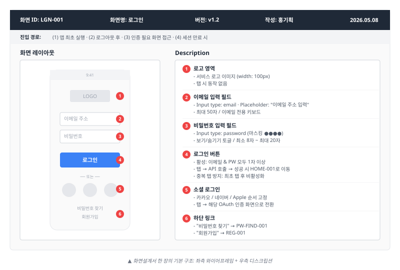
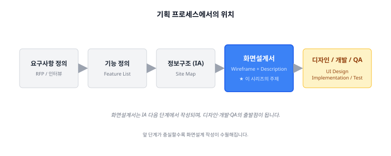
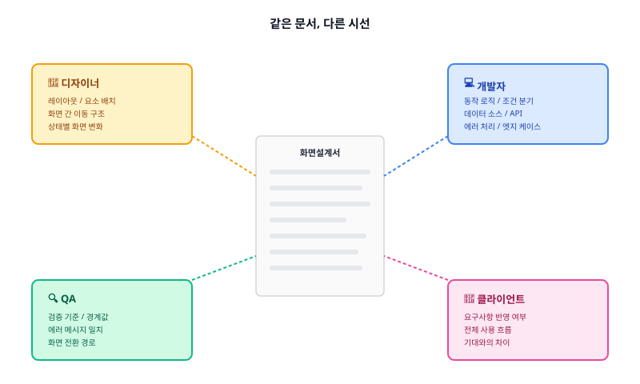
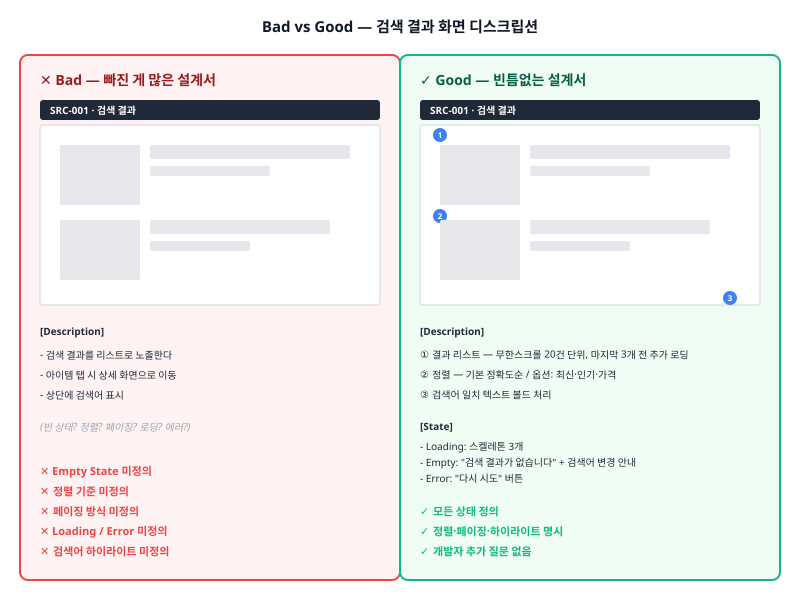
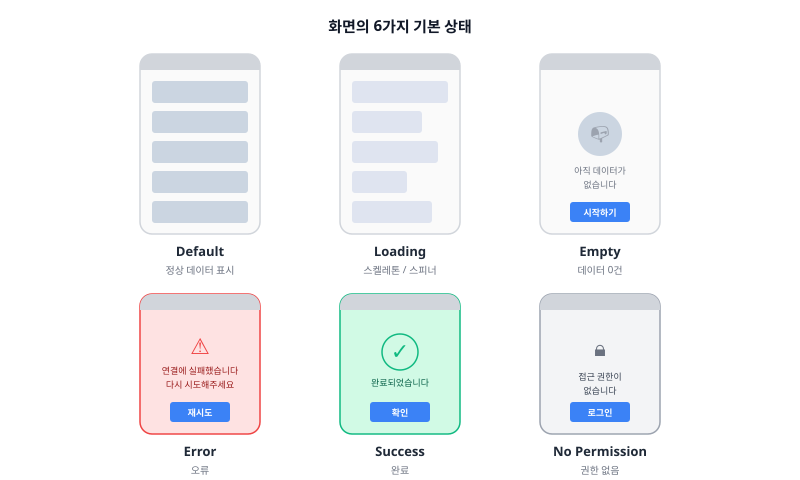

화면설계서를 처음 손에 잡았을 때 가장 헷갈리는 것은 "이게 디자인 시안이랑 뭐가 다르지"입니다. 6편짜리 시리즈로 화면설계서의 정의부터 실습까지 정리해보려고 합니다. 첫 편에서는 문서의 정체와 좋은 설계서의 조건만 다룹니다.

---

## 화면설계서는 시안이 아니라 도면입니다

화면설계서는 **서비스의 각 화면이 어떤 구조로 구성되고, 어떻게 동작하는지를 정의한 문서**입니다.

화면을 "그리는" 문서가 아닙니다. 화면 위에 어떤 요소가 배치되는지, 각 요소를 누르면 무엇이 일어나는지, 특정 조건에서 화면이 어떻게 바뀌는지를 모두 담는 **서비스의 청사진**입니다.

건축에 비유하면 디자인 시안이 인테리어 렌더링이라면, 화면설계서는 **설계도면**입니다. 벽 위치, 배관 경로, 전기 배선까지 포함된 도면 없이는 아무리 멋진 렌더링이 있어도 집을 지을 수 없습니다.

---

## 세 가지 목적

화면설계서는 세 가지를 위해 존재합니다.

### 구체화

기획자의 머릿속에는 이미 서비스가 돌아가고 있습니다. 문제는 그 상상이 다른 사람에게는 보이지 않는다는 것입니다. 텍스트로만 적힌 요구사항이 "실제 화면" 형태를 갖추는 순간, 빠진 것들이 눈에 들어옵니다.

### 합의

"목록에서 선택하면 상세로 이동합니다"라는 한 줄을 읽고 기획자·디자이너·개발자가 떠올리는 화면은 전부 다릅니다. 화면설계서는 이 해석의 차이를 좁힙니다. 모두가 동일한 화면을 보고 논의하기 때문에, 개발이 끝난 뒤 "이게 아니었는데"라고 말하는 상황을 줄일 수 있습니다.

### 기준

디자이너는 레이아웃을 보고 GUI를 입힙니다. 개발자는 동작 정의를 보고 로직을 구현합니다. QA는 정의된 내용과 실제 결과물을 대조하며 테스트합니다. 화면설계서는 프로젝트 전체에 걸쳐 "이렇게 만들기로 했다"는 기준선 역할을 합니다.

---

## 다양한 이름들

실무에서 화면설계서는 여러 이름으로 불립니다. 회사마다, 프로젝트마다 용어가 다르므로 처음에는 혼란스러울 수 있습니다.

| 용어 | 주로 쓰이는 맥락 |
|------|------------------|
| **화면설계서** | 국내 실무 전반 |
| **스토리보드 (SB)** | SI/에이전시 프로젝트 |
| **화면정의서** | 공공/대기업 프로젝트 |
| **와이어프레임 (Wireframe)** | UX/해외 기업 |
| **MMI (Man Machine Interface)** | 제조/산업 분야 |

엄밀히 따지면 와이어프레임은 화면의 뼈대만, 스토리보드는 화면 간 흐름과 인터랙션까지 포함합니다. 하지만 한국 실무에서는 구분 없이 화면설계서 안에 와이어프레임 + 기능 정의 + 인터랙션 정의를 모두 담는 것이 일반적입니다.

이 시리즈에서는 화면설계서 = 와이어프레임 + 기능/상태 정의가 결합된 문서로 통일합니다.

---

## 기능명세서와 무엇이 다른가

자주 혼동되는 문서가 **기능명세서(Functional Specification)** 입니다. 둘은 다루는 범위가 다릅니다.

| 구분 | 화면설계서 | 기능명세서 |
|------|-----------|-----------|
| 관점 | 사용자에게 무엇이 보이는가 | 시스템이 어떻게 작동하는가 |
| 표현 방식 | 화면 + 주석 | 텍스트/표 위주 명세 |
| 포함 내용 | 레이아웃, UI, 상태 분기, 화면 전환 | API, 데이터 처리 로직, 검증 규칙 |
| 주 독자 | 디자이너 + 개발자 + QA + 클라이언트 | 개발자 + QA |

대략의 기준은 이렇습니다.

- 화면에 보이는 것 → 화면설계서
- 화면 뒤에서 일어나는 것 → 기능명세서
- 양쪽 모두에 해당하는 것(예: 입력값 검증) → 화면설계서엔 사용자가 보는 에러 메시지를, 기능명세서엔 검증 로직을

비밀번호 입력 필드 하나로 비교해보면 명확합니다. 화면설계서엔 "최소 8자, 마스킹 처리, 조건 미충족 시 붉은색 안내 문구"까지 적습니다. 기능명세서엔 "허용 문자, 해싱 알고리즘, 이전 3회 비밀번호 재사용 불가" 같은 규칙이 들어갑니다.

---

## 기획 산출물 흐름에서의 위치

화면설계서는 기획 프로세스의 어느 시점에 만들어질까요.

화면설계서 이전 단계의 산출물이 충실하게 준비되어 있을수록 화면설계 작성이 수월해집니다. 반대로 앞 단계가 불명확한 채로 화면설계를 시작하면, 설계 도중에 요구사항이 계속 바뀌면서 문서가 끝없이 수정되는 악순환에 빠집니다.

> ⚠️ 흔한 실수는 IA 정리나 기능 정의 없이 곧장 화면을 그리기 시작하는 것입니다. 그리다 보면 "이 화면 다음에 어디로 가지?", "이 기능은 어느 메뉴에 넣지?"라는 질문이 계속 생기고, 결국 화면을 그리면서 IA를 만드는 비효율적인 상황이 됩니다. 순서를 지키세요. IA가 먼저, 화면설계는 그다음입니다.

---

## 시리즈 구성

이 시리즈는 ep.00을 포함해 총 6편으로 구성했습니다. 화면설계서의 정의부터 시작해, 준비 → 문서 골격 → 한 장의 완성 → 실무 운영 → 실습의 흐름으로 이어집니다.

### [ep.01](/screen-spec-ep-01) - 설계 전 준비

본격적인 화면 작성에 들어가기 전에 갖춰야 할 다섯 가지를 다룹니다. 정보구조(IA) 정리, 화면 ID 체계, 파일명/버전 규칙, 프로젝트 용어집, 공통 가이드. **미리 30분을 투자하면 나중에 3시간을 아끼는** 작업들입니다.

### [ep.02](/screen-spec-ep-02) - 문서 구조 만들기

개별 화면을 채우기 전에 문서 자체의 뼈대를 잡습니다. 표지의 필수 항목, 개정이력 작성 요령, 목차 관리 전략, 그리고 두 종류의 플로우차트(메뉴 구조용·동작 흐름용). 수백 페이지 분량의 설계서도 관리 가능하게 만드는 골격 작업입니다.

### [ep.03](/screen-spec-ep-03) - 한 장의 화면을 완성하는 법

화면설계서 한 장에 들어가야 할 아홉 가지 항목을 모두 채웁니다. 화면 헤더, 와이어프레임, 주석, UI 요소 상세, 인터랙션과 상태, 데이터 정의, 권한·정책, 예외 처리, 비기능 요구사항. **시리즈에서 가장 실전 비중이 높은 편**입니다.

### [ep.04](/screen-spec-ep-04) - 실무 레벨업

"무엇을 쓰는가"에서 "어떻게 잘 쓰는가"로 넘어갑니다. 빠지기 쉬운 관리자(Admin) 화면, 개발자가 읽기 좋은 설계서의 조건, 변경 관리 전략, 리뷰와 핸드오프 프로세스. 주니어에게는 미리보기, 경력자에게는 자기 점검표가 됩니다.

### [ep.05](/screen-spec-ep-05) - 실습과 부록

지금까지 배운 내용을 직접 적용합니다. 빈 화면에서 로그인 화면을 처음부터 설계하는 실습, 의도적으로 누락된 상품 상세 설계서에서 빠진 항목을 찾는 역방향 실습, 그리고 옆에 두고 쓰는 UI 요소·상태 체크리스트와 자주 쓰는 문구 모음. 시리즈의 마지막 편입니다.

---

## 같은 문서, 다른 시선

화면설계서를 작성할 때 가장 먼저 떠올려야 할 질문은 "무엇을 쓸까"가 아니라 **누가 이걸 읽을까**입니다.

같은 문서를 펼쳐놓고도 디자이너는 레이아웃을 보고, 개발자는 동작 로직을 보고, QA는 빠진 케이스를 찾습니다.

### 디자이너

GUI 디자인의 출발점으로 봅니다. 화면 요소의 종류, 배치 순서와 우선순위, 화면 간 이동 구조, 상태별 화면 변화를 확인합니다. 단, 색상·폰트 크기·세밀한 간격 같은 비주얼은 디자이너 영역입니다. 화면설계서는 "여기에 버튼이 있다"까지만 정의하고, "이 버튼이 어떻게 생겼는가"는 디자이너에게 맡기세요.

### 개발자

구현 명세서로 봅니다. 화면이 예쁜지에는 관심이 없습니다. 버튼 탭 시 동작, 입력값 제약, 조건 분기, 에러 처리, 데이터 출처를 찾습니다. 개발자가 멈추는 순간은 "이 경우엔 어떻게 해요?"라는 질문이 떠오를 때입니다. 빈 상태, 오프라인, 중복 클릭, 뒤로가기 — 이런 질문이 나오지 않을수록 좋은 화면설계서입니다.

### QA

테스트 기준서로 봅니다. 정의된 에러 메시지가 실제로 노출되는지, 활성/비활성 조건이 설계대로 동작하는지, 화면 전환 경로가 일치하는지를 대조합니다. **QA가 테스트할 수 없는 항목은 정의되지 않은 항목**입니다. "당연히 그렇게 되겠지"라고 안 쓴 것이 곧 버그가 됩니다.

### 클라이언트/의사결정자

합의 문서로 봅니다. 기술 디테일보다 전체 흐름과 자신이 요청한 기능의 반영 여부를 확인합니다. IT에 익숙하지 않다면 와이어프레임만으로 최종 화면을 상상하기 어렵습니다. 핵심 화면에는 간단한 설명이나 유사 서비스 레퍼런스를 덧붙이면 소통이 수월합니다.

---

## 좋은 화면설계서의 조건

화면설계서의 품질은 "얼마나 예쁘게 그렸느냐"가 아니라 **읽는 사람이 추가 질문 없이 작업할 수 있느냐**로 결정됩니다.

같은 검색 결과 리스트 화면을 두 가지 수준으로 작성한 예시를 보면, 디스크립션의 깊이에 따라 후속 작업자의 이해도가 완전히 달라진다는 것을 확인할 수 있습니다.

Bad 쪽에서 빠진 것들을 짚으면 이렇습니다.

| 누락 항목 | 누락 시 벌어지는 일 |
|-----------|-------------------|
| 빈 상태 | 개발자가 임의 처리 → QA에서 이슈 |
| 정렬 기준 | 기획 의도와 다른 정렬로 출시 |
| 페이징 | 전체 데이터 한 번에 로딩 → 성능 이슈 |
| 로딩 상태 | 빈 화면 깜빡임 |
| 에러 상태 | 흰 화면으로 멈춤 |
| 검색어 하이라이트 | 어디에 매칭되는지 알 수 없음 |

이런 누락은 "디스크립션이 짧기 때문"이 아닙니다. **체크할 항목을 모르기 때문**에 일어납니다.

### 다섯 가지 조건

**① 모든 상태를 정의한다.** 화면은 항상 정상 상태만 있는 게 아닙니다. 최소한 아래 여섯 가지 상태는 반드시 고려합니다.

Default, Loading, Empty, Error, Success, No Permission. "이 화면의 최악의 상황은?"을 떠올려보세요. 데이터가 0건, 네트워크 끊김, 권한 없음 — 이 세 가지만 추가로 정의해도 설계서 품질이 크게 올라갑니다.

**② 동작을 모호하지 않게 서술한다.**

> ❌ "버튼 클릭 시 다음 화면으로 이동"
>
> ✅ "[저장] 버튼 탭 → 입력값 유효성 검증 → 성공 시 `PRD-002` 화면으로 이동(Push) / 실패 시 해당 필드 하단에 에러 메시지 노출, 화면 이동 없음"

**③ 경계값과 엣지 케이스를 명시한다.** 입력 필드에 최대 글자수를 꽉 채우면 어떻게 되는지, 리스트 아이템이 999,999건이면 성능 고려가 필요한지, 닉네임에 이모지가 들어오면 허용인지 필터링인지 — 이런 "딱 그 지점"의 동작을 적습니다.

**④ 화면 간 연결이 추적 가능하다.** 모든 화면 전환에는 출발지, 트리거, 목적지, 전환 방식이 있어야 합니다. "상세 화면으로 이동"이 아니라 "`LST-001`의 리스트 아이템 탭 → `DTL-001`로 이동(Push) / `item_id`를 전달"이라고 적습니다.

**⑤ 일관된 서술 형식을 유지한다.** 같은 프로젝트 안에서 어떤 화면은 "~합니다"로, 다른 화면은 "~함"으로 끝나면 읽는 사람이 피로해집니다. 문체, 넘버링, 화면 ID 형식, 조건 표현 — 하나의 패턴으로 통일합니다.

---

## 자기 점검 체크리스트

화면 하나를 완성했을 때 아래 질문에 모두 "예"라고 답할 수 있다면 좋은 설계입니다.

- 이 화면의 모든 진입 경로를 정의했는가
- 데이터가 0건일 때 화면을 정의했는가
- 로딩 중 화면을 정의했는가
- 에러 발생 시 화면과 메시지를 정의했는가
- 모든 버튼/링크의 탭 시 동작을 명시했는가
- 화면 전환의 목적지 화면 ID가 기재되어 있는가
- 입력 필드의 제약 조건을 명시했는가
- 뒤로가기 시 동작을 정의했는가
- 긴 텍스트의 말줄임 처리를 정의했는가
- 이 화면에 대해 개발자가 추가 질문 없이 구현할 수 있는가

좋은 화면설계서는 "빈틈이 없는" 문서입니다. 빈틈이 없다는 것은 모든 것을 적었다는 뜻이 아니라 **적어야 할 것이 빠지지 않았다**는 뜻입니다. 처음에는 많이 적는 쪽이 낫습니다. 필요 없는 정보를 지우는 비용보다, 빠진 정보를 나중에 채우는 비용이 훨씬 큽니다.

---

## 전체 목차

- [ep.01 - 설계 전 준비](/screen-spec-ep-01)
- [ep.02 - 문서 구조 만들기](/screen-spec-ep-02)
- [ep.03 - 한 장의 화면을 완성하는 법](/screen-spec-ep-03)
- [ep.04 - 실무 레벨업](/screen-spec-ep-04)
- [ep.05 - 실습과 부록](/screen-spec-ep-05)

---

## 다음 편 예고

> [ep.01 - 설계 전 준비](/screen-spec-ep-01)

설계서를 쓰기 전에 갖춰야 할 다섯 가지를 다룹니다. IA, 화면 ID 체계, 파일명/버전 규칙, 용어집, 공통 가이드. 미리 30분을 투자하면 나중에 3시간을 아끼는 작업들입니다.
