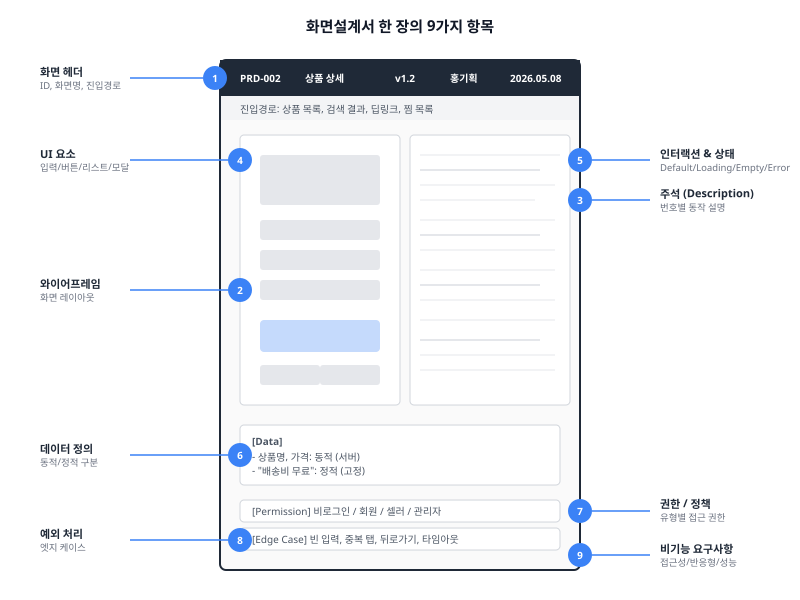
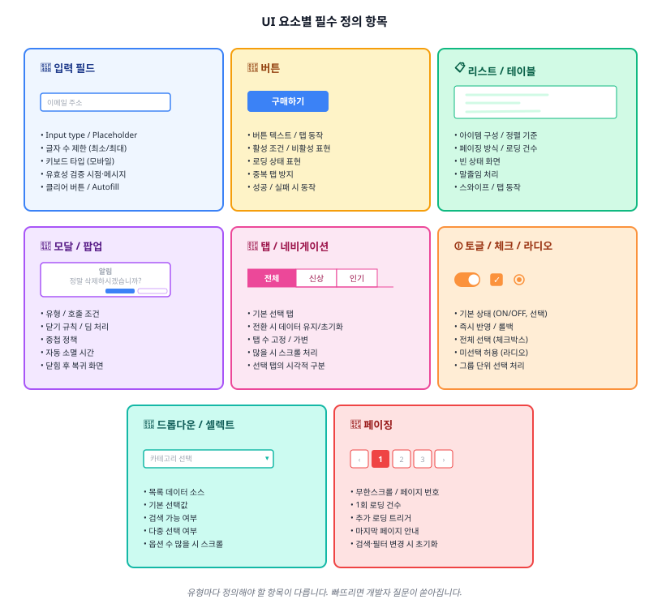
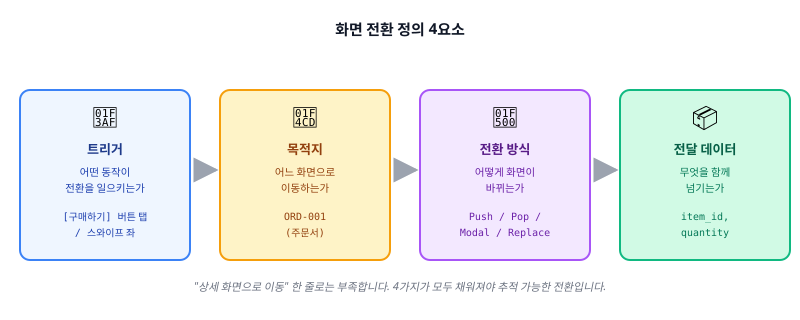

이제 진짜 화면을 설계합니다. 이번 편은 화면설계서 한 장(한 화면)에 들어가야 할 모든 항목을 다룹니다.



---

## 화면 헤더 정보

모든 화면 설계의 첫 줄에는 **이 화면이 무엇인지 식별할 수 있는 정보**가 들어갑니다. 본문의 "표지"에 해당하는 것이 각 화면의 "헤더"입니다.

| 항목 | 설명 | 예시 |
|------|------|------|
| 화면 ID | 고유 식별자 | `PRD-002` |
| 화면명 | 이 화면의 이름 | 상품 상세 |
| 화면 설명 | 이 화면의 목적 한 문장 | "사용자가 선택한 상품의 상세 정보를 확인하고 구매를 결정하는 화면" |
| 진입 경로 | 이 화면에 도달하는 모든 경로 | ① 상품 목록 > 아이템 탭 ② 검색 결과 > 아이템 탭 ③ 딥링크 ④ 찜 목록 > 아이템 탭 |

### 진입 경로를 "모두" 적어야 하는 이유

진입 경로를 하나만 적으면, 나머지 경로에서 진입했을 때의 동작이 정의되지 않습니다.

예를 들어 상품 상세에서 뒤로가기를 눌렀을 때 동작이 갈립니다.

- 상품 목록에서 왔으면 → 상품 목록으로 복귀
- 검색 결과에서 왔으면 → 검색 결과로 복귀
- 딥링크로 직접 들어왔으면 → 홈 메인으로 이동(이전 화면이 없음)
- 푸시 알림에서 왔으면 → 홈 메인으로 이동

진입 경로가 다르면 뒤로가기 동작이 달라집니다. 이를 정의하려면 먼저 모든 진입 경로를 파악해야 합니다. 가장 좋은 방법은 ep.02의 플로우차트를 보면서 해당 화면으로 들어오는 화살표를 모두 찾는 것입니다.

---

## 와이어프레임 (화면 레이아웃)

와이어프레임은 화면의 구조와 요소 배치를 시각적으로 표현한 것입니다. 색상, 폰트, 이미지 같은 비주얼 요소는 최소화하고 어떤 요소가 어디에 위치하는지에 집중합니다.

### 충실도 단계

| 단계 | 특징 | 용도 |
|------|------|------|
| **Lo-fi** (저충실도) | 손그림 수준, 박스+텍스트 | 초기 아이디어 논의 |
| **Mid-fi** (중충실도) | 실제 비율, 정확한 요소 배치 | 설계서 본문 ← 이 수준 |
| **Hi-fi** (고충실도) | 실제 디자인에 가까운 수준 | 프로토타입, 사용자 테스트 |

화면설계서에는 Mid-fi 수준을 사용합니다. 너무 대충 그리면 구조가 전달되지 않고, 너무 정교하면 디자이너 영역을 침범합니다.

### 작성 원칙

**실제 화면 비율을 지킵니다.** 일반적으로 모바일은 375×812(iPhone) 또는 360×800(Android), 태블릿은 768×1024, PC 웹은 1440×900 또는 1920×1080을 기준으로 잡습니다. 비율이 어긋나면 요소 간 간격과 크기를 크게 잘못 판단하게 됩니다.

**디자인 결정은 하지 않습니다.**

> ❌ 버튼 색상을 파란색(#3498db)으로 지정, 폰트 14px Bold
>
> ✅ [구매하기] 버튼 — CTA(주요 액션) 버튼, 활성/비활성 상태 있음

색상은 활성/비활성 상태 구분을 위한 그레이 정도로만 씁니다. 최종 색상은 디자이너가 결정합니다.

**모든 요소에 번호를 매깁니다.** 와이어프레임 위의 각 요소에 번호(① ② ③…)를 부여하고, 이 번호를 디스크립션에서 참조합니다. 와이어프레임과 디스크립션을 연결하는 핵심 장치입니다.

**스크롤이 필요한 화면은 전체 길이를 그립니다.** 화면에 보이는 영역(Viewport)만 그리면 스크롤 아래 요소가 누락됩니다. 긴 화면은 세로로 길게 그리거나 "Below the fold" 영역을 별도 페이지로 나눕니다.

---

## 주석(Annotation) 작성법

주석은 와이어프레임에 그려진 각 요소의 **동작, 조건, 규칙을 텍스트로 설명하는 영역**입니다. 와이어프레임이 "무엇이 있는지"를 보여준다면, 주석은 "그것이 어떻게 작동하는지"를 설명합니다.

### 넘버링 체계

와이어프레임 위의 번호와 주석의 번호가 1:1로 대응되어야 합니다.

```text
와이어프레임                 주석(Description)
┌─────────────┐
│  [로고] ①    │             ① 로고 영역
│             │                - 서비스 로고 이미지 (width: 100px)
│  [입력] ②    │             ② 이메일 입력 필드
│             │                - Input type: email
│  [버튼] ③    │                - Placeholder: "이메일 주소 입력"
│             │             ③ 로그인 버튼
└─────────────┘                - 활성 조건: 이메일 & PW 1자 이상
```

### 문장 스타일

**한 가지 서술 형식으로 통일합니다.** 프로젝트 시작 시 다음 중 하나를 선택해 전체 문서에 일관되게 적용합니다.

| 스타일 | 예시 | 특징 |
|--------|------|------|
| "~한다" 체 | "버튼 탭 시 홈 화면으로 이동한다" | 격식, SI 프로젝트 |
| "~함" 체 | "버튼 탭 시 홈 화면으로 이동함" | 간결, 스타트업/인하우스 |
| "~합니다" 체 | "버튼 탭 시 홈 화면으로 이동합니다" | 클라이언트 전달용 |

**주어를 명확히 합니다.**

> ❌ "탭하면 이동한다"
>
> ✅ "[구매하기] 버튼 탭 → `ORD-001` 화면으로 이동한다"

누가(어떤 요소를), 어떻게 하면(트리거), 무엇이 일어나는지(결과)가 모두 담겨야 합니다.

**조건문은 패턴화합니다.**

```text
- [조건] 시, [결과]를 [방식]으로 노출한다
- [요소]는 [조건]인 경우에만 노출된다
- [트리거] 시, [조건 A]이면 [결과 A], [조건 B]이면 [결과 B]
```

---

## UI 요소별 상세 정의

화면 위의 각 UI 요소는 유형에 따라 정의해야 할 항목이 다릅니다.



### 입력 필드 (Text Input)

| 정의 항목 | 예시 |
|-----------|------|
| Input type | text, email, password, number, tel |
| Placeholder | "이메일 주소를 입력하세요" |
| 글자 수 제한 | 최소 2자, 최대 50자 |
| 기본값 | 이전 입력값 유지 또는 빈 값 |
| 키보드 타입 (모바일) | 이메일 키보드, 숫자 키보드 |
| 유효성 검증 | 포커스 아웃 시 검증, 실패 시 하단 에러 문구 |
| 포커스 상태 | 테두리 색상 변경, 라벨 위치 이동 |
| 클리어 버튼 | 1자 이상 입력 시 우측에 X 버튼 노출 |

### 버튼 (Button)

| 정의 항목 | 예시 |
|-----------|------|
| 버튼 텍스트 | "구매하기", "저장", "다음" |
| 탭 동작 | API 호출 → 성공 시 `ORD-002`로 이동 |
| 활성 조건 | 필수 입력 필드 모두 입력 완료 시 |
| 비활성 상태 | 배경 회색, 탭 불가 |
| 로딩 상태 | 버튼 내 스피너 표시, 재탭 방지 |
| 중복 탭 방지 | 최초 탭 후 버튼 비활성화 |

### 리스트 / 테이블

| 정의 항목 | 예시 |
|-----------|------|
| 아이템 구성 | 썸네일 + 제목 + 가격 + 평점 |
| 정렬 기준 | 기본: 최신순 / 옵션: 인기순, 가격순 |
| 페이징 방식 | 무한스크롤 20건 단위 / 페이지 번호 |
| 아이템 탭 동작 | `PRD-002`로 이동, `item_id` 전달 |
| 빈 상태 (Empty) | 일러스트 + "등록된 상품이 없습니다" |
| 말줄임 처리 | 제목: 2줄 초과 시 "..." |
| 스와이프 동작 | 좌 스와이프 → 삭제 버튼 노출 |

### 모달 / 팝업 / 바텀시트 / 토스트

| 정의 항목 | 예시 |
|-----------|------|
| 유형 | 모달, 바텀시트, 알럿, 토스트 |
| 호출 조건 | [삭제] 버튼 탭 시, 확인 모달 노출 |
| 내용 | 제목 + 설명 문구 + 확인/취소 버튼 |
| 닫기 규칙 | X 버튼, 확인/취소 버튼, 딤 영역 탭 |
| 딤(Dim) 처리 | 딤 처리, 딤 탭 시 닫힘 / 닫히지 않음 |
| 중첩 정책 | 중첩 금지 — 기존 모달 닫힌 후 새 모달 |

### 탭 / 아코디언 / 네비게이션

| 정의 항목 | 예시 |
|-----------|------|
| 기본 선택값 | 첫 번째 탭 |
| 전환 시 데이터 | 유지함 / 초기화 |
| 탭 수 가변 여부 | 고정 3개 / 카테고리에 따라 가변 |
| 스크롤 탭 | 5개 초과 시 좌우 스크롤 |

### 기타

드롭다운/셀렉트는 목록 데이터 소스, 기본 선택값, 검색 가능 여부, 다중 선택 여부를. 토글은 기본 상태(ON/OFF), 토글 시 즉시 반영 여부, 반영 실패 시 롤백을. 체크박스는 기본 상태, 전체 선택 동작, 선택 시 연동 동작을. 라디오는 기본 선택값, 선택 변경 시 동작, 미선택 상태 허용 여부를 각각 정의합니다.

---

## 인터랙션 & 상태 정의

ep.00에서 화면에는 최소 6가지 상태가 있다고 했습니다. 이 절에서는 그 상태들을 실제로 어떻게 정의하고 표현하는지를 다룹니다.

### 상태 분기

하나의 화면에 대해, 각 상태별로 무엇이 보이는지를 정의합니다.

```text
화면: 상품 목록 (PRD-001)

[Default]
- 상품 리스트 노출 (20건 단위)
- 상단: 카테고리명 + 정렬 옵션 + 총 N건

[Loading]
- 스켈레톤 UI 3개 노출 (썸네일+텍스트 자리 표시)
- 상단 정보 영역은 정상 노출

[Empty]
- 일러스트 + "등록된 상품이 없습니다"
- [홈으로 가기] 버튼 노출

[Error - 네트워크]
- 일러스트 + "네트워크 연결을 확인해주세요"
- [다시 시도] 버튼

[Error - 서버]
- 일러스트 + "일시적 오류가 발생했습니다"
- [다시 시도] 버튼

[No Permission]
- (이 화면에서는 해당 없음 — 비로그인도 조회 가능)
```

매번 텍스트로 나열하기 번거롭다면 **상태별 와이어프레임을 별도 페이지**로 추가하는 방법도 좋습니다. Default는 메인 페이지에, Loading/Empty/Error는 바로 뒷 페이지에 배치합니다.

### 조건부 노출

특정 조건에 따라 화면 일부 요소가 보이거나 숨겨지는 경우를 정의합니다.

```text
예시: 상품 상세 화면 (PRD-002)

- [찜하기] 버튼: 로그인 상태에서만 노출. 비로그인 시 비노출.
- [리뷰 작성] 버튼: 해당 상품을 구매한 사용자에게만 노출.
- [품절] 배지: 재고 0일 때 상품 이미지 위에 오버레이 노출.
- [할인율] 표시: 할인 적용 상품에만 노출. 원가 취소선 + 할인가 병기.
- [판매 종료] 안내: 판매 기간이 지난 상품 접근 시 안내 + [다른 상품 보기] 버튼.
```

### 화면 전환

화면 간 이동을 정의할 때는 **네 가지 정보**가 필요합니다.



```text
[트리거] → [목적지] | [전환 방식] | [전달 데이터]

[구매하기] 버튼 탭 → ORD-001 (주문서) | Push | item_id, quantity
[닫기] 버튼 탭 → 이전 화면 | Pop | 없음
[공유하기] 버튼 탭 → OS 공유시트 | Modal(반모달) | 제목, URL, 썸네일
[홈으로] 버튼 탭 → HOME-001 (홈 메인) | PopToRoot | 없음
```

전환 방식은 다음과 같이 구분됩니다.

| 전환 방식 | 설명 | 사용 예 |
|-----------|------|--------|
| **Push** | 새 화면을 위에 쌓음 | 목록 → 상세 |
| **Pop** | 현재 화면 제거, 이전 화면 복귀 | 뒤로가기, 닫기 |
| **PopToRoot** | 스택 초기화, 루트로 이동 | 결제 완료 → 홈 |
| **Modal** | 현재 화면 위에 오버레이 | 필터, 옵션 선택 |
| **Replace** | 현재 화면 교체 | 온보딩 완료 → 홈 |
| **External** | 앱 외부로 이동 | 외부 링크, 전화 |

---

## 데이터 정의

### 동적 데이터 vs 정적 텍스트

화면에 표시되는 텍스트는 두 종류입니다. 이 구분이 명확해야 개발자가 어떤 데이터를 서버에서 받아와야 하는지 알 수 있습니다.

| 구분 | 의미 | 예시 |
|------|------|------|
| 정적 텍스트 | 항상 동일한 고정 문구 | "이메일", "비밀번호를 입력해주세요", "로그인" |
| 동적 데이터 | 서버에서 받아오거나 사용자마다 다른 값 | 사용자 닉네임, 상품명, 가격, 리뷰 수 |

주석에서 동적 데이터는 **중괄호나 대괄호로 감싸** 정적 텍스트와 구분합니다.

```text
"안녕하세요, {user_name}님"           ← user_name은 동적
"총 {total_count}건"                ← total_count는 동적
"배송비 무료"                         ← 정적
"리뷰 {review_count}개"              ← review_count는 동적
```

### 화면-API 매핑

화면설계서에서 API 명세까지 쓸 필요는 없습니다. 하지만 **이 화면에서 어떤 데이터를 불러오는지**는 기획자가 정의해야 합니다.

```text
상품 상세(PRD-002)에서 필요한 데이터:
- 상품명, 가격, 할인율, 상품 설명
- 상품 이미지 (최대 10장)
- 리뷰 평균 별점, 리뷰 수
- 재고 상태 (재고 있음 / 품절)
- 찜 여부 (로그인 시)
- 관련 상품 목록 (최대 10개)
```

API 엔드포인트나 응답 형식은 기능명세서의 영역입니다.

### 데이터 없을 때의 대체 표시

동적 데이터가 비어 있거나 null일 때 어떻게 표시할지를 정의해야 합니다. 정의하지 않으면 개발자가 임의로 처리합니다.

```text
- 닉네임 없음 → "회원" 으로 대체 표시
- 상품 이미지 없음 → 기본 placeholder 이미지 노출
- 리뷰 0건 → "아직 리뷰가 없습니다" + [첫 리뷰 작성하기] 버튼
- 가격 정보 없음 → "가격 정보 없음" 텍스트 (구매 버튼 비활성)
- 프로필 사진 없음 → 기본 아바타 아이콘
```

---

## 권한 및 정책

### 사용자 유형별 접근 권한

서비스에 여러 사용자 유형이 있다면, 각 화면이나 기능에 대한 접근 권한을 정의해야 합니다.

| 화면/기능 | 비로그인 | 일반 회원 | 셀러 | 관리자 |
|---|---|---|---|---|
| 상품 목록 조회 | ✅ | ✅ | ✅ | ✅ |
| 상품 상세 조회 | ✅ | ✅ | ✅ | ✅ |
| 찜하기 | ❌ | ✅ | ✅ | ✅ |
| 리뷰 작성 | ❌ | ✅(구매자) | ❌ | ❌ |
| 상품 등록/수정 | ❌ | ❌ | ✅ | ✅ |
| 상품 삭제 | ❌ | ❌ | ✅(본인) | ✅ |
| 리뷰 삭제 | ❌ | ✅(본인) | ❌ | ✅ |

권한이 없는 사용자가 해당 기능에 접근했을 때의 동작도 함께 정의합니다.

```text
- 비로그인 사용자가 [찜하기] 탭 → 로그인 유도 바텀시트 노출
  "로그인 후 이용 가능합니다" + [로그인] 버튼 + [닫기]
- 비로그인 사용자가 [리뷰 작성] 탭 → 로그인 화면(LGN-001)으로 이동
- 일반 회원이 상품 등록 페이지 URL 직접 접근 → "접근 권한이 없습니다" 화면
```

### 서비스 정책이 화면에 미치는 영향

정책이 화면에 영향을 미치는 경우, 그 연결 관계를 명시합니다.

```text
- 주문 취소 정책: "배송 시작 전까지만 취소 가능"
  → 주문 상세(MY-003)에서 [주문 취소] 버튼:
    - 배송 전: 활성 (탭 → 취소 확인 모달)
    - 배송 중/완료: 비노출 (대신 "반품 신청" 버튼)

- 미성년자 구매 제한 상품 정책
  → 상품 상세(PRD-002)에서:
    - 본인 인증 완료 + 성인: 정상 노출
    - 본인 인증 미완료 또는 미성년자: 상품 정보 블러 + 인증 유도 문구
```

---

## 예외 처리 & 엣지 케이스

경험적으로 아래 항목들은 **주니어 기획자가 가장 많이 빠뜨리는 예외 케이스**입니다. 화면 설계를 마칠 때마다 이 체크리스트를 확인하세요.

### 입력 관련

- 아무것도 입력하지 않고 제출 버튼을 누르면?
- 허용되지 않은 문자(이모지, 특수문자)를 입력하면?
- 최대 글자 수를 초과하면? (입력 차단? 경고?)
- 복사-붙여넣기로 제한을 우회하면?
- 자동완성(Autofill)으로 입력된 값도 유효성 검증이 되는가?

### 네트워크 관련

- 데이터 로딩 중 네트워크가 끊기면?
- 폼 제출 중 네트워크가 끊기면?(데이터 전송 여부가 불확실한 상태)
- 매우 느린 네트워크(3G)에서 타임아웃이 발생하면?

### 화면 전환 관련

- 브라우저/OS의 뒤로가기 버튼을 누르면?
- 입력 중인 내용이 있는 상태에서 뒤로가기를 누르면?(이탈 방지 확인 필요?)
- 앱이 백그라운드에 갔다가 돌아오면?(세션 유지? 새로고침?)
- 딥링크로 중간 화면에 직접 진입하면?(이전 화면 스택이 없는 상태)

### 데이터 관련

- 다른 기기에서 같은 계정으로 데이터를 변경한 경우?
- 표시할 데이터가 예상보다 매우 많으면?(10,000건 이상)
- 표시할 데이터가 예상보다 매우 길면?(제목 100자 이상)
- 이미지가 로딩에 실패하면?
- 숫자가 매우 큰 경우의 표시 방법(999,999 → "999K"?)

### 동시성 관련

- 같은 버튼을 빠르게 두 번 누르면?(이중 결제, 이중 등록)
- 다른 사용자가 같은 상품의 마지막 재고를 동시에 구매하면?

### 에러 메시지

에러 메시지는 사용자가 **무엇이 잘못되었고, 어떻게 해야 하는지**를 알 수 있어야 합니다.

> ❌ "오류가 발생했습니다"
>
> ✅ "네트워크 연결이 불안정합니다. Wi-Fi 또는 모바일 데이터를 확인해주세요."

> ❌ "입력값이 올바르지 않습니다"
>
> ✅ "비밀번호는 영문, 숫자, 특수문자를 포함한 8자 이상이어야 합니다."

> ❌ "실패"
>
> ✅ "결제에 실패했습니다. 카드 정보를 확인하거나 다른 결제 수단을 이용해주세요."

---

## 비기능 요구사항

대부분의 화면설계서는 "기능"에 집중하지만, 일부 화면에서는 **비기능 요구사항**을 함께 명시해야 할 때가 있습니다.

### 접근성 (Accessibility)

웹 접근성이 요구되는 프로젝트에서는 관련 사항을 설계서에 명시합니다.

```text
- 모든 이미지에 대체 텍스트(alt text) 포함
- 키보드만으로 전체 기능 사용 가능 (Tab 순서 정의)
- 색상만으로 정보를 전달하지 않음 (색맹 고려)
- 최소 터치 영역: 44×44px (iOS HIG) / 48×48dp (Material Design)
```

### 반응형 / 적응형 분기점

하나의 설계서로 여러 디바이스를 다루는 경우, 화면이 어느 해상도에서 어떻게 변하는지를 정의합니다.

```text
반응형 분기점:
- Mobile: ~767px → 1열 레이아웃, 하단 탭바
- Tablet: 768px~1023px → 2열 레이아웃, 사이드 네비게이션
- Desktop: 1024px~ → 3열 레이아웃, 상단 GNB + 사이드바

레이아웃 변경:
- 상품 목록: 모바일 1열 / 태블릿 2열 / 데스크톱 4열
- 상품 상세: 모바일 세로 배치 / 데스크톱 좌(이미지) + 우(정보)
- 네비게이션: 모바일 하단 탭바 / 데스크톱 좌측 사이드바
```

### 성능 관련

특정 화면에서 성능이 중요한 경우, 기대 수준을 명시합니다.

```text
- 홈 메인 초기 로딩: 3초 이내 (LTE 기준)
- 검색 결과 응답: 1초 이내
- 이미지 로딩: Progressive JPEG → 저해상도 먼저 표시 후 점진적 선명화
- 무한스크롤 추가 로딩: 0.5초 이내
```

비기능 요구사항은 모든 화면에 일일이 쓸 필요 없습니다. **프로젝트 공통 사항**은 ep.01의 공통 가이드에 한 번 정의하고, 특정 화면에만 해당하는 것만 해당 화면의 디스크립션에 추가합니다.

---

## 정리

한 장의 화면을 완성하기 위해 정의해야 할 항목입니다.

| 항목 | 핵심 질문 | 누락 시 위험도 |
|------|----------|--------------|
| 화면 헤더 | 이 화면은 무엇이고, 어디서 오는가? | ⚠️ 중 |
| 와이어프레임 | 화면에 무엇이 있는가? | 🔴 높음 |
| 주석 | 각 요소가 어떻게 동작하는가? | 🔴 높음 |
| UI 요소 상세 | 입력, 버튼, 리스트의 세부 규칙은? | 🔴 높음 |
| 인터랙션/상태 | 로딩, 에러, 빈 상태는 어떻게 보이는가? | 🔴 높음 |
| 데이터 정의 | 어떤 데이터가 어디서 오는가? | ⚠️ 중 |
| 권한/정책 | 누가 무엇을 할 수 있는가? | ⚠️ 중 |
| 예외 처리 | 최악의 상황에서 어떻게 되는가? | 🔴 높음 |
| 비기능 요구사항 | 접근성, 반응형, 성능 기준은? | 🟡 낮~중 |

이 9가지 항목이 모두 채워진 화면은, 디자이너와 개발자가 **추가 질문 없이** 작업을 시작할 수 있는 화면입니다.

---

## 다음 편 예고

> [ep.04 - 실무 레벨업](/screen-spec-ep-04)

쓰는 항목은 알았으니, 이제 "어떻게 써야 잘 쓰는 것인가"를 다룹니다. 빠지기 쉬운 관리자 화면, 개발자가 읽기 좋은 설계서의 조건, 변경 관리 전략, 리뷰와 핸드오프 프로세스까지.
