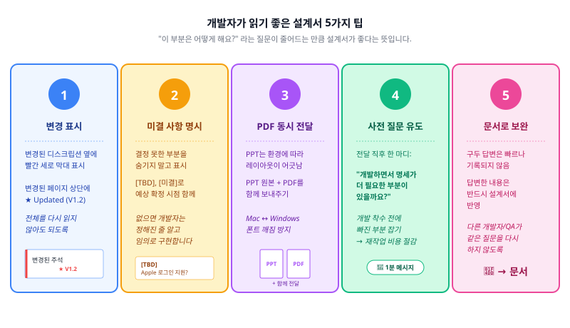

ep.03까지는 "화면설계서에 무엇을 써야 하는가"를 다뤘습니다. 이번 편에서는 **실무에서 어떻게 써야 잘 쓰는 것인가**를 다룹니다. 주니어에게는 앞으로의 실무를 미리 엿보는 기회가 되고, 경력자에게는 자신의 작업 방식을 점검하는 계기가 될 것입니다.

---

## 관리자(Admin) 화면도 기획해야 합니다

### 빠지기 쉬운 함정

기획을 시작할 때 대부분의 기획자는 사용자(고객)가 보는 화면부터 그립니다. 당연합니다. 서비스의 목적이 사용자에게 가치를 전달하는 것이니까요.

하지만 서비스가 운영되려면 사용자 뒤에서 돌아가는 **관리자 화면**이 반드시 필요합니다. 이 사실을 설계 막바지에 깨닫고 급하게 관리자 화면을 추가하는 일이 실무에서 자주 발생합니다.

### 관리자 화면이 필요한 영역

사용자 화면을 설계하면서 아래 질문을 던져보세요. "예"가 나오면 관리자 화면이 필요합니다.

- 사용자에게 보이는 콘텐츠를 누군가 등록/수정/삭제해야 하는가? → 콘텐츠 관리 (배너, 공지, 이벤트, FAQ 등)
- 사용자의 신고/문의를 누군가 처리해야 하는가? → CS 관리
- 주문/결제/배송 상태를 누군가 관리해야 하는가? → 주문 관리
- 회원을 관리하거나 권한을 부여해야 하는가? → 회원 관리
- 서비스 운영 데이터를 확인해야 하는가? → 대시보드/통계
- 푸시 알림이나 이메일을 발송해야 하는가? → 발송 관리

### 설계 시 주의사항

**사용자 화면과 연결해서 설계합니다.** 사용자 화면의 상품 목록에 표시되는 데이터는, 관리자 화면의 상품 등록/수정에서 입력한 데이터입니다. 따로 생각하면 필드가 안 맞거나 입력값이 사용자 화면에서 예상과 다르게 표시되는 문제가 생깁니다.

```text
[관리자] 상품 등록 화면          [사용자] 상품 상세 화면
─────────────────────          ──────────────────────
상품명 (최대 50자)          →     상품명 (2줄 초과 시 말줄임)
상품 설명 (최대 2000자)     →     상품 설명 (접기/펼치기)
대표 이미지 (1장, 필수)      →     상단 이미지 영역
추가 이미지 (최대 10장)      →     이미지 슬라이더
판매가                    →     가격 표시
할인율 (선택)              →     할인가 표시 (원가 취소선)
재고 수량                  →     품절 표시 여부
```

**관리자의 역할을 구분합니다.** "관리자"가 한 종류가 아닌 경우가 많습니다.

| 역할 | 권한 예시 |
|------|----------|
| 시스템 관리자 | 전체 설정, 회원 권한 관리, 시스템 로그 |
| 서비스 운영자 | 콘텐츠 관리, CS 처리, 발송 관리 |
| 셀러/입점사 | 자기 상품만 등록/수정, 자기 주문만 조회 |
| 매장 관리자 | 자기 매장 관련 데이터만 접근 |

각 역할별로 접근 가능한 화면과 기능이 다르므로, 권한 체계를 먼저 정의한 뒤에 관리자 화면을 설계합니다.

**설계서를 분리합니다.** 관리자 화면과 사용자 화면은 별도의 설계서 파일로 분리하는 것이 일반적입니다. 하나의 파일에 담으면 문서가 지나치게 길어지고, 두 화면의 수정 주기도 다르기 때문입니다.

```text
PROJ_SB01_화면설계서_APP_사용자_V1.2.pptx
PROJ_SB02_화면설계서_WEB_관리자_V0.8.pptx   ← 별도 파일
```

---

## 개발자가 읽기 좋은 설계서

화면설계서의 가장 중요한 독자는 **개발자**입니다. 디자이너는 와이어프레임의 구조만 봐도 작업을 시작할 수 있지만, 개발자는 주석의 모든 세부 사항을 읽고 이해해야 구현할 수 있습니다.

### 개발자가 싫어하는 설계서

실제로 개발자들이 가장 불편해하는 설계서의 특징은 이렇습니다.

> 😤 "어떤 경우에 이렇게 되는 건지 모르겠어요" — 조건 분기가 불명확.
>
> 😤 "이전 버전에서 뭐가 바뀌었는지 모르겠어요" — 개정이력 미작성, 변경 부분 표시 없음.
>
> 😤 "이 화면에서 저 화면으로 가는 건 알겠는데, 어떤 데이터를 넘기는 거예요?" — 화면 전환은 정의했지만 전달 데이터 미기재.
>
> 😤 "에러 나면 어떻게 해요?" — 정상 케이스만 정의, 예외 상황 미정의.
>
> 😤 "이 데이터는 서버에서 오는 건가요, 하드코딩인가요?" — 동적/정적 데이터 구분 없음.

### 실전 팁



**변경된 부분을 표시합니다.** 설계서가 업데이트되었을 때, 변경된 화면이나 주석에 시각적 표시를 합니다. PPT에서는 변경된 디스크립션 옆에 빨간 세로 막대(|) 표시나 변경된 페이지 상단에 "★ Updated (V1.2)" 표기를 활용합니다. Figma에서는 변경된 프레임에 라벨 스티커를 붙이거나 변경 영역 주변에 빨간 점선 박스를 그립니다.

**판단이 필요한 부분을 미리 정리합니다.** 설계하다 보면 기획자도 결정하지 못한 부분이 있습니다. 이를 숨기지 말고 명시적으로 표시합니다.

```text
[미결 사항] 리뷰 정렬 기준 — 최신순 vs 평점순 중 기본값 미정.
→ 클라이언트 확인 후 V1.3에서 확정 예정.

[TBD] 소셜 로그인 중 Apple 로그인 지원 여부 — 사업팀 확인 중.
```

개발자는 "아직 정해지지 않았다"는 정보를 받으면 해당 부분을 나중에 구현하도록 설계할 수 있습니다. 반면 아무 언급이 없으면 정해진 줄 알고 임의로 구현합니다.

**설계서 전달 시 PDF를 함께 보냅니다.** PPT 파일은 환경에 따라 폰트가 깨지거나 레이아웃이 어긋날 수 있습니다. 특히 Mac과 Windows 간에 자주 발생합니다. PPT 원본과 PDF 파일을 동시에 전달하면 누구든 의도된 레이아웃 그대로 확인할 수 있습니다.

**"개발하면서 명세가 더 필요한 부분이 있을까요?"라고 물어봅니다.** 설계서를 전달한 뒤 이 한마디를 던지는 것만으로 개발 착수 전에 빠진 부분을 잡을 수 있습니다.

**구두 보충이 아닌 문서 보완으로 대응합니다.** 채팅이나 구두 답변은 빠르지만 위험합니다. 그 답변은 기록되지 않으므로, 나중에 다른 개발자나 QA가 같은 질문을 또 하게 됩니다.

> 원칙: 구두로 답한 내용은 반드시 설계서에도 반영합니다.

---

## 설계서는 변합니다 — 변경 관리 전략

### 변경은 피할 수 없습니다

화면설계서가 한 번에 완성되는 프로젝트는 없습니다. 변경의 원인은 다양합니다.

- 클라이언트 요구사항 변경
- 내부 리뷰 결과 반영
- 디자인 검토 후 구조 변경
- 기술적 제약에 따른 플로우 수정
- QA 과정에서 발견된 미정의 항목 추가

변경 자체는 문제가 아닙니다. **변경이 추적되지 않는 것**이 문제입니다.

### 변경 발생 시 워크플로우

```text
변경 요청 발생
    │
    ▼
변경 영향 범위 확인
    │ (어떤 화면이 영향 받는가? 관련 화면은?)
    ▼
설계서 수정
    │ (변경 부분에 시각적 표시 추가)
    ▼
개정이력 업데이트
    │ (버전, 변경 내용, 해당 페이지, 작성자)
    ▼
변경 공유
    │ (관련자에게 변경 내용 요약 + 설계서 전달)
    ▼
이전 버전 보존
    (수정 전 파일을 별도 보관)
```

### 변경 이력이 신뢰를 만듭니다

개정이력이 잘 관리된 설계서는 프로젝트 후반에 빛을 발합니다.

- **분쟁 발생 시**: "이건 V1.1에서 합의된 내용이고, V1.3에서 클라이언트 요청으로 변경되었습니다." → 명확한 근거
- **인수인계 시**: 새로 합류한 팀원이 변경 이력만 보고도 프로젝트 히스토리를 파악할 수 있습니다.
- **유지보수 시**: 서비스 오픈 후 "이 화면이 왜 이렇게 되어 있지?"라는 질문에, 변경 이력이 답을 줍니다.

---

## 리뷰 & 핸드오프 프로세스

### 설계서 리뷰

화면설계서는 작성자 혼자 완성하는 것이 아닙니다. **리뷰를 거쳐야 완성**됩니다.

| 리뷰어 | 확인 사항 | 주요 피드백 |
|--------|----------|-----------------|
| 기획 리드/PM | 요구사항 반영, 전체 흐름 | "이 플로우에 빠진 분기가 있다" |
| 디자이너 | 구조의 현실성, 상태 정의 충분성 | "이 상태의 디자인을 그릴 만큼 정의되어 있는가" |
| 개발자 | 기술적 구현 가능성, 명세 충분성 | "이 조건은 서버에서 판단 가능한가" |
| QA | 테스트 가능성, 경계값 정의 | "이 필드의 최대 글자수는 정의되어 있는가" |

리뷰는 완성 후 한 번이 아니라 **중간중간** 진행하는 것이 효과적입니다. 전체를 다 쓴 뒤 구조적 피드백을 받으면 수정 범위가 커집니다. 핵심 플로우 3~5개를 먼저 설계하고 리뷰받은 뒤 나머지를 확장하는 방식이 효율적입니다.

### 핸드오프

핸드오프(Handoff)는 완성된 설계서를 디자이너와 개발자에게 **공식적으로 전달하는 과정**입니다. 파일을 보내는 것으로 끝이 아닙니다.

핸드오프 미팅에서는 다음을 다룹니다.

```text
1. 전체 구조 설명 (5분)
   - 이 설계서의 범위, 화면 수, 주요 플로우

2. 핵심 플로우 워크스루 (15~20분)
   - 가장 복잡하거나 중요한 플로우를 설계서를 보며 함께 따라감
   - "이 화면에서 이 버튼을 누르면 여기로 가고, 이 조건이면 여기로 갑니다"

3. 변경 사항 브리핑 (이전 버전 대비, 해당 시)
   - 이전 전달 대비 변경된 부분 설명

4. 미결 사항 공유 (5분)
   - 아직 확정되지 않은 항목 목록
   - 예상 확정 시점

5. Q&A (10분)
   - 디자이너/개발자의 질문 → 즉시 답변 또는 확인 후 설계서 보완
```

### 핸드오프 후 관리

핸드오프가 끝난 뒤에도 기획자의 역할은 계속됩니다.

- **질문 대응**: 디자인/개발 과정에서 발생하는 질문에 답변하고 답변 내용을 설계서에 반영
- **변경 관리**: 설계 변경이 발생하면 위의 워크플로우에 따라 처리
- **디자인 검수**: 완성된 디자인이 설계 의도와 맞는지 확인
- **개발 검수**: 구현된 화면이 설계서대로 동작하는지 확인 (QA 전 1차 점검)

---

## 정리

| 주제 | 핵심 메시지 |
|------|-----------|
| Admin 화면 | 사용자 화면을 설계할 때 "이 데이터는 누가 넣지?"를 함께 생각하라 |
| 개발자 친화 | 변경 표시, 미결 사항 명시, PDF 동시 전달, 구두가 아닌 문서로 보완 |
| 변경 관리 | 변경은 피할 수 없다 — 추적할 수 있게 만들어라 |
| 리뷰 & 핸드오프 | 완성 후 던지지 말고, 함께 읽으며 전달하라 |

---

## 다음 편 예고

> [ep.05 - 실습](/screen-spec-ep-05)

마지막 편입니다. 빈 화면에서 시작해 로그인 화면을 직접 설계해보고, 의도적으로 누락된 설계서에서 빠진 항목을 찾아내는 두 개의 실습. 그리고 옆에 두고 쓰는 부록 체크리스트.
