작은 함수 하나가 어제와 똑같이 동작한다. 그 보장 위에서만 다음 줄을 안심하고 쓸 수 있다.

## 사용자가 마주하는 문제

작은 변경이 다른 곳을 깨뜨리는 경험은 누구나 한 번쯤 겪습니다. 할인율 계산 함수를 살짝 손봤더니, 결제 화면의 총액이 음수로 표시되거나, 무료 배송 안내가 사라지는 식입니다.

문제는 변경한 코드 자체가 아닙니다. 그 코드를 쓰던 다른 곳들이 어떻게 의존하고 있었는지 보이지 않았다는 데 있습니다. 단위 테스트가 있었다면, 함수의 출력이 달라지는 순간 빨간 불이 들어와 문제를 코드 리뷰 전에 알려줬을 겁니다.

---

## 무엇을 검증하나

단위 테스트는 가장 작은 검증 가능한 단위를 다룹니다. 보통은 다음 셋 중 하나입니다.

- **순수 함수**: 같은 입력에 같은 출력. 외부 상태를 건드리지 않음
- **클래스나 모듈의 공개 메서드**: 내부 구현이 아니라 외부에 약속한 인터페이스
- **작은 컴포넌트의 순수한 로직**: 렌더링이 아닌 입력 처리, 상태 전이

핵심은 **외부 의존을 끊는다**는 점입니다. 데이터베이스, 네트워크, 파일 시스템, 시간(현재 시각)처럼 외부에서 결정되는 값은 단위 테스트의 영역이 아닙니다. 그 영역은 다음 편들(통합·E2E)에서 다룹니다.


---

## 언제, 어디서 실행하나

단위 테스트는 빠른 게 생명입니다. 빠르면 자주 돌릴 수 있고, 자주 돌리면 깨진 걸 빨리 발견합니다.

- **개발 중 (로컬)**: 코드 저장 시 watch 모드로 자동 실행
- **PR 단계 (CI)**: 푸시할 때마다 전체 단위 테스트 실행
- **릴리스 전**: 통합·E2E와 함께 다시 한 번

전체 단위 테스트가 1분 이상 걸리면 곧 외면받습니다. 30초 이내, 가능하면 10초 이내로 유지하는 게 목표입니다.

---

## 도구와 예시

자바스크립트·타입스크립트 환경 기준으로 도구 선택은 사실상 두 가지입니다.

- **Vitest**: Vite 기반 프로젝트에 자연스럽고, Jest API와 거의 호환. 속도가 빠릅니다.
- **Jest**: 가장 널리 쓰이는 표준. 생태계가 두텁습니다.

Node 백엔드는 같은 도구를 그대로 쓸 수 있고, Python은 PyTest, JVM은 JUnit이 표준입니다.

가장 단순한 예시 하나 보겠습니다. 할인율을 적용해 최종 가격을 반환하는 함수입니다.

```ts
// src/pricing.ts
export function applyDiscount(price: number, rate: number): number {
  if (price < 0) throw new Error("price must be non-negative");
  if (rate < 0 || rate > 1) throw new Error("rate must be between 0 and 1");
  return Math.round(price * (1 - rate));
}
```

테스트는 함수의 출력과 경계 조건을 검증합니다.

```ts
// src/pricing.test.ts
import { describe, it, expect } from "vitest";
import { applyDiscount } from "./pricing";

describe("applyDiscount", () => {
  it("기본 케이스: 할인을 적용한 가격을 반환한다", () => {
    expect(applyDiscount(10000, 0.1)).toBe(9000);
  });

  it("할인율 0이면 원가 그대로", () => {
    expect(applyDiscount(10000, 0)).toBe(10000);
  });

  it("할인율 1이면 0원", () => {
    expect(applyDiscount(10000, 1)).toBe(0);
  });

  it("소수점은 반올림한다", () => {
    expect(applyDiscount(9999, 0.1)).toBe(8999);
  });

  it("음수 가격은 거부한다", () => {
    expect(() => applyDiscount(-100, 0.1)).toThrow();
  });

  it("범위를 벗어난 할인율은 거부한다", () => {
    expect(() => applyDiscount(10000, 1.5)).toThrow();
    expect(() => applyDiscount(10000, -0.1)).toThrow();
  });
});
```

여섯 줄짜리 함수에 테스트가 여섯 케이스입니다. 많아 보이지만 각 케이스가 30초 안에 작성되고, 한 번 만들어두면 다시 만질 일이 거의 없습니다. 그리고 이 테스트가 있는 한, 누군가 `applyDiscount`를 손댈 때마다 의도치 않은 회귀가 잡힙니다.

---

## 도입 체크리스트

처음 도입할 때는 욕심내지 않는 것이 중요합니다. "이 정도면 시작했다"의 기준을 낮게 잡으세요.

- [ ] 테스트 러너(Vitest/Jest) 설치와 기본 설정
- [ ] `npm test` 또는 `pnpm test` 한 줄로 전체 실행되는 환경
- [ ] CI에서 PR마다 테스트가 돌고, 실패하면 머지가 막히는 워크플로우
- [ ] 핵심 비즈니스 로직 함수 5~10개에 테스트 작성
- [ ] 테스트 파일 위치 규칙 합의 (예: `*.test.ts`를 소스 옆에 둘지, `__tests__` 폴더에 둘지)

처음부터 커버리지 80%를 노리지 마세요. 손에 익은 다음에 자연스럽게 늘어납니다.

---

## 흔한 함정

- **커버리지 숫자 강박**: 100%가 좋은 게 아닙니다. 의미 없는 getter/setter까지 테스트하느라 진짜 중요한 로직이 가려집니다. 60~70% 정도가 보통 건강한 신호입니다.
- **구현 세부에 묶인 테스트**: `function.toHaveBeenCalledWith(...)`로 내부 호출 순서까지 검증하면 리팩토링이 곧 테스트 깨뜨리기가 됩니다. **결과**를 검증하지 **과정**을 검증하지 않습니다.
- **테스트가 너무 느림**: 단위 테스트가 10초 넘게 걸리면 어딘가에서 진짜 DB나 네트워크를 부르고 있을 가능성이 높습니다. 그건 단위 테스트가 아닙니다.
- **한 테스트에 여러 가지 검증**: 한 `it` 블록에 expect가 10개씩 들어가면 실패했을 때 무엇이 깨졌는지 알기 어렵습니다. 한 케이스에 하나의 동작만 검증합니다.
- **테스트 자체의 품질을 보지 않음**: 늘 통과만 하는 테스트는 진짜 버그를 잡고 있는 게 아닐 수 있습니다. 가끔은 일부러 코드를 깨뜨려서 테스트가 빨간불을 켜는지 확인해보세요.


---

## 다음 단계

단위 테스트가 손에 익으면, 자연스럽게 다음 질문이 떠오릅니다. "테스트를 코드보다 먼저 쓰면 어떨까?" 다음 편에서 다룹니다.

---

## 참고 자료

- Kent Beck. (2002). *Test Driven Development: By Example*. Addison-Wesley.
- Vitest. 공식 문서. https://vitest.dev
- Jest. 공식 문서. https://jestjs.io
- Martin Fowler, "UnitTest", https://martinfowler.com/bliki/UnitTest.html

---

## 다음 편 예고

> [ep.02 - TDD: 테스트를 먼저 쓰는 개발 방식](/software-testing-guide-ep-02/)

테스트는 검증의 도구이기도 하지만, 설계의 도구이기도 합니다. 다음 편에서는 테스트를 먼저 쓰는 사이클이 코드의 모양을 어떻게 바꾸는지, 그리고 그것이 모든 상황에 맞는 방식인지를 살펴봅니다.
