마지막 사용자가 되어본다. 진짜 브라우저에서, 진짜 클릭으로.

## 사용자가 마주하는 문제

단위 테스트는 다 통과합니다. 통합 테스트도 초록불입니다. 그런데 사용자가 회원가입을 하다가 이메일 인증 단계에서 막혔다고 합니다. 따라가보니, 인증 메일의 링크가 클라이언트 라우터를 만나는 지점에서 query parameter 인코딩이 어긋나 있었습니다.

이런 문제는 각 모듈의 단위 검증으로는 잡히지 않습니다. 가입 시작에서 인증 완료까지, 사용자의 전체 흐름을 따라가 봐야만 보입니다. E2E 테스트는 그 흐름을 자동화합니다.

---

## 무엇을 검증하나

E2E 테스트는 진짜 브라우저에서 실제 사용자처럼 동작합니다.

- **핵심 시나리오의 완주**: 회원가입, 로그인, 결제, 주문, 검색 같은 비즈니스 흐름이 끝까지 동작하는지
- **여러 시스템의 통합**: 프론트엔드, 백엔드, DB, 외부 서비스가 다 같이 살아 있을 때의 동작
- **호환성**: 여러 브라우저(Chromium, Firefox, WebKit)와 뷰포트에서 동일하게 동작하는지

E2E 테스트는 가장 사용자에 가까운 테스트입니다. 동시에 가장 느리고, 가장 깨지기 쉽고, 가장 비싼 테스트이기도 합니다. 그래서 **무엇을 시나리오로 잡느냐**가 운영의 절반을 차지합니다.


---

## 핵심 시나리오를 고른다

E2E를 운영하면서 가장 흔한 실수는 모든 화면을 다 자동화하려는 것입니다. 100개의 깨지기 쉬운 E2E보다 10개의 안정적인 E2E가 훨씬 가치 있습니다.

핵심 시나리오의 기준은 단순합니다.

- **돈이 흐르는 흐름**: 결제, 주문, 구독 가입/해지
- **사용자의 첫 인상**: 회원가입, 로그인, 온보딩
- **데이터의 무결성**: 글쓰기, 저장, 공유 같은 영구 변경
- **법적·보안적 책임**: 약관 동의, 개인정보 처리 흐름

이 외의 화면들은 컴포넌트 테스트와 시각 회귀로 충분합니다. E2E는 "이게 깨지면 사용자가 즉시 떠난다"는 흐름에 집중하는 게 좋습니다.

---

## 도구와 예시

이 영역의 표준은 사실상 두 가지입니다.

- **Playwright**: 마이크로소프트. 멀티 브라우저, 멀티 언어, 자동 대기, 디버깅 도구가 강력합니다. 최근 대세
- **Cypress**: 가장 익숙한 인터페이스, 풍부한 플러그인. 단일 브라우저 시절 표준이었습니다

새로 시작한다면 Playwright를 권합니다. 호환성 테스트가 곧 따라오기 때문입니다.

회원가입에서 대시보드까지의 흐름을 Playwright로 작성한 예시입니다.

```ts
// signup.spec.ts
import { test, expect } from "@playwright/test";

test("회원가입 후 대시보드까지 진입한다", async ({ page }) => {
  await page.goto("/signup");

  await page.getByLabel("이메일").fill("test@example.com");
  await page.getByLabel("비밀번호").fill("strong-password-123");
  await page.getByLabel("비밀번호 확인").fill("strong-password-123");
  await page.getByLabel("약관에 동의합니다").check();

  await page.getByRole("button", { name: "가입하기" }).click();

  // 가입 완료 안내 페이지
  await expect(page.getByText("인증 메일을 보냈습니다")).toBeVisible();

  // 테스트 환경: 인증 토큰을 직접 받아 진입
  const token = await getLatestVerificationToken("test@example.com");
  await page.goto(`/verify?token=${token}`);

  // 대시보드 진입 확인
  await expect(page).toHaveURL("/dashboard");
  await expect(page.getByRole("heading", { name: "안녕하세요" })).toBeVisible();
});
```

핵심은 두 가지입니다.

- **사용자가 인식하는 방식으로 요소를 찾는다** (`getByLabel`, `getByRole`). CSS 셀렉터로 찾으면 마크업이 바뀌는 순간 깨집니다.
- **외부 시스템과의 핸드오프를 명확히 다룬다** (인증 토큰 받기). 실제 이메일이 도착할 때까지 기다리지 않고, 테스트 환경의 헬퍼로 가져옵니다.

---

## 깨지기 쉬운 테스트를 다루는 법

E2E 테스트의 진짜 어려움은 **간헐적 실패(flakiness)** 입니다. 어떨 때는 통과하고 어떨 때는 실패하는 테스트는 신뢰를 잃고, 신뢰를 잃은 테스트는 금세 무시당합니다.

flakiness의 주요 원인과 대처법입니다.

- **타이밍 의존**: `wait(1000)` 같은 고정 대기는 금물. Playwright의 자동 대기 또는 `expect(...).toBeVisible()` 같은 조건 대기를 씁니다
- **외부 의존**: 진짜 외부 서비스에 의존하면 그 서비스의 일시 장애가 빨간불이 됩니다. 가능하면 테스트 환경에서는 fake로
- **테스트 간 상태 공유**: 각 테스트는 자기 데이터를 만들고, 자기 데이터만 보고 검증해야 합니다
- **랜덤·시간·날짜**: 결정적으로 만듭니다. 시간은 고정, 랜덤은 시드 고정

flaky가 발견되면 그 자리에서 고치거나 비활성화하는 규칙을 강하게 둬야 합니다. "지금 안 보고 넘어간" 하나가 전체 신뢰를 깎습니다.

---

## 호환성도 함께 본다

사용자 대상 소프트웨어는 다양한 환경에서 돌아갑니다. Playwright는 한 테스트를 여러 브라우저·뷰포트에서 자동으로 돌려주는 기능을 제공합니다.

```ts
// playwright.config.ts
import { defineConfig, devices } from "@playwright/test";

export default defineConfig({
  projects: [
    { name: "chromium", use: devices["Desktop Chrome"] },
    { name: "firefox",  use: devices["Desktop Firefox"] },
    { name: "webkit",   use: devices["Desktop Safari"] },
    { name: "mobile-chrome", use: devices["Pixel 5"] },
    { name: "mobile-safari", use: devices["iPhone 13"] },
  ],
});
```

전체 시나리오를 모든 브라우저에서 돌리면 비용이 큽니다. 핵심 시나리오만 풀 매트릭스로 돌리고, 나머지는 Chromium 하나로 도는 식으로 분리하는 것이 보통입니다.



---

## 언제, 어디서 실행하나

- **PR 단계 (CI)**: 핵심 시나리오 (5~10개) Chromium에서
- **머지 후 또는 야간 배치**: 전체 시나리오 멀티 브라우저
- **릴리스 전**: 스테이징에서 전체 매트릭스
- **운영 중 합성 모니터링**: 운영 환경에 주기적으로 핵심 시나리오만 실행해 실사용 상태 확인

전체가 30분을 넘기면 곧 외면받습니다. 병렬 실행, 시나리오 분할, 핵심/전체 분리가 운영의 핵심입니다.

---

## 도입 체크리스트

- [ ] Playwright 설치 및 기본 설정
- [ ] 가장 중요한 시나리오 1~3개 식별 (로그인이 보통 1번)
- [ ] 시나리오 실행을 위한 테스트 데이터 준비 전략
- [ ] CI 워크플로우에 E2E 단계 추가, PR 머지 조건 포함
- [ ] flaky 테스트 발견 시 즉시 비활성화/수정하는 규칙 합의
- [ ] 멀티 브라우저는 야간 배치로 분리 (PR마다는 Chromium만)

---

## 흔한 함정

- **너무 많은 E2E**: 단위·컴포넌트로 충분한 검증을 굳이 E2E로 합니다. 결과는 느린 CI와 깨지기 쉬운 테스트.
- **CSS 셀렉터 의존**: `div.button--primary.large` 같은 셀렉터로 요소를 찾으면 마크업 한 줄 바꿔도 다 깨집니다. 사용자가 보는 방식(label, role)으로 찾습니다.
- **flaky를 방치한다**: "가끔 깨지지만 다시 돌리면 통과"하는 테스트는 가장 위험합니다. 그 안에 진짜 버그가 숨어 있을 수 있습니다.
- **외부 서비스를 진짜로 부른다**: 결제 게이트웨이를 진짜로 부르면 cost와 flakiness가 동시에 옵니다. 테스트용 sandbox 모드를 활용합니다.
- **실패한 테스트를 디버깅하기 어렵게 둔다**: Playwright는 trace, video, screenshot을 자동 저장할 수 있습니다. CI 실패 시 이런 아티팩트가 남아야 원인을 찾을 수 있습니다.

---

## 참고 자료

- Playwright. 공식 문서. https://playwright.dev
- Cypress. 공식 문서. https://docs.cypress.io
- Google Testing Blog. "Just Say No to More End-to-End Tests", https://testing.googleblog.com/2015/04/just-say-no-to-more-end-to-end-tests.html

---

## 다음 편 예고

> [ep.06 - 접근성 자동 검사와 수동 확인](/software-testing-guide-ep-06/)

기능이 끝까지 동작한다는 보장을 만들었다면, 다음 질문은 "누구에게 동작하는가"입니다. 키보드만 쓰는 사용자, 스크린리더로 화면을 읽는 사용자, 색을 구별하지 못하는 사용자에게도 같은 경험이 제공되는지를 어떻게 검증할지 다룹니다.
