테스트는 모으는 일이 아니라 고르는 일이다. 우리 팀에 무엇이 필요한지가 먼저다.

## 시리즈를 닫으며

여기까지 사용자 대상 소프트웨어 테스트의 거의 모든 영역을 한 바퀴 돌았습니다. 단위 테스트의 가장 작은 안전망에서 시작해, TDD라는 사고법, 컴포넌트와 시각 회귀, 통합과 E2E, 접근성과 성능, 마지막으로 운영 모니터링까지. 영역이 넓어 보였지만, 결국 모두 한 가지 질문을 다른 각도에서 묻고 있었습니다.

> "우리가 만든 소프트웨어가, 진짜 사용자에게, 진짜로 작동하는가?"

이 편에서는 그 질문에 답하기 위해 **우리 팀이 무엇을 어떤 순서로 도입할 것인가**를 정리합니다.

---

## 테스트 피라미드와 그 변형

전통적인 테스트 피라미드는 단순합니다. 단위 테스트를 가장 많이, E2E를 가장 적게 둡니다. 이유는 속도, 비용, 안정성입니다.

최근에는 이 모양을 다시 그리는 흐름이 있습니다. Kent C. Dodds의 Testing Trophy는 정적 분석(타입 검사, 린트)을 바닥에 깔고, 단위·통합·E2E를 위로 쌓습니다. 통합 테스트가 가장 두꺼운 영역이 되는 것이 특징입니다. 도구가 좋아지면서 통합 테스트의 비용 대비 효과가 크게 좋아진 점을 반영한 모양입니다.

어느 모양을 따를지보다 중요한 것은, **위로 갈수록 적게 둔다는 원칙**입니다. 깨지기 쉬운 비싼 테스트가 많으면 빌드가 느려지고, 빌드가 느려지면 결국 모두 무시당합니다.

---

## 시리즈 전체를 한 표로

지금까지 다룬 테스트들을 세 가지 축으로 한 자리에 모았습니다.

| 종류 | 범위 | 품질 속성 | 시점 | 자동화 | 대표 도구 | 진입 비용 |
|---|---|---|---|---|---|---|
| 단위 테스트 | Unit | 기능 | 개발·CI | ✅ | Vitest, Jest | 낮음 |
| TDD (방식) | Unit | 기능·설계 | 개발 | - | Vitest + 습관 | 중간 (습관) |
| 컴포넌트 테스트 | Component | 기능 | CI | ✅ | Testing Library | 낮음 |
| 시각 회귀 | Component | UI 회귀 | PR | ✅ | Chromatic | 중간 |
| 통합 테스트 | Integration | 기능·결합 | CI | ✅ | MSW, Testcontainers | 중간 |
| E2E 테스트 | E2E | 기능 회귀 | CI·릴리스 전 | ✅ | Playwright | 중간~높음 |
| 접근성 자동 | Unit~E2E | 접근성 | CI | ✅ | axe-core | 낮음 |
| 접근성 수동 | E2E | 접근성 | 릴리스 전 | ❌ | 사람 + NVDA/VO | 낮음 (시간) |
| 성능 합성 | E2E | 성능 | PR | ✅ | Lighthouse CI | 낮음 |
| 성능 RUM | 실사용 | 성능 | 운영 | ✅ | Sentry, Datadog | 낮음 |
| 부하 테스트 | E2E | 성능·확장성 | 릴리스 전 | ✅ | k6, JMeter | 중간 |
| 에러 추적 | 실사용 | 신뢰성 | 운영 | ✅ | Sentry | 낮음 |
| 합성 모니터링 | 실사용 | 가용성 | 운영 | ✅ | Checkly | 낮음 |

이 표를 자기 팀 양식으로 옮기고, 각 행 옆에 **"우리는 한다 / 안 한다 / 부분적으로 한다"** 를 채우는 것만으로도 빈자리가 한눈에 보입니다.

---

## 팀 규모별 도입 순서

모든 팀이 모든 종류의 테스트를 다 할 필요는 없습니다. 다음은 일반적인 가이드라인입니다.

**1인 개발 또는 사이드 프로젝트**

- 단위 테스트 (핵심 비즈니스 로직만)
- E2E 핵심 시나리오 1~3개 (Playwright)
- Sentry 무료 플랜으로 에러 추적

이 셋만 갖춰져도 안전망의 80%는 만들어집니다.

**5~10명 팀, 제품을 운영 중**

- 위의 셋
- 컴포넌트 테스트와 시각 회귀 (디자인 시스템 운영 시 필수)
- 접근성 자동 검사 (axe in CI)
- 성능 합성 측정 (Lighthouse CI)
- RUM과 합성 모니터링

**그 이상의 팀**

- 위의 전부
- 계약 테스트 (마이크로서비스 분리되어 있을 때)
- 부하 테스트 정기화
- 접근성 수동 점검의 정례화
- 카오스 엔지니어링 (성숙도 매우 높을 때)

---

## 자동화와 수동의 경계

모든 것을 자동화하려는 욕심은 항상 비용으로 돌아옵니다.

**자동화해야 하는 것**

- 반복적 검증 (회귀 방지)
- 객관적으로 측정 가능한 항목 (수치, 픽셀 비교, 명도비)
- 매번 같은 결과가 나와야 하는 검증

**자동화하면 안 되는 것**

- 탐색적 테스트 (사용자가 어떻게 쓸지를 발견하는 일)
- 진짜 사용성 평가 (UX 인터뷰, 관찰)
- 디자인 의도 일치 검증 (이 톤이 우리 브랜드에 맞나)
- 새로 만든 기능의 첫 사용감 점검

자동화 도구가 못 잡는 영역이 항상 남습니다. 그 영역에 사람의 시간을 할당해야 합니다.

---

## 테스트 전략 문서 만들기

지금까지 정리한 것을 팀의 약속으로 만드는 게 다음 단계입니다. 거창할 필요 없습니다. 한 페이지 문서면 충분합니다.

문서에 들어가야 할 항목입니다.

- **무엇을**: 어떤 종류의 테스트를 한다 (위 매트릭스에서 선택)
- **언제**: 로컬, PR, 머지 후, 릴리스 전, 운영 중 어느 시점인가
- **누가**: 작성·실행·결과 확인의 책임자
- **어떤 기준으로**: 합격선과 차단 조건 (예: Lighthouse 90 이상)
- **결과를 누가 본다**: 만든 것을 안 보면 무의미합니다. 약속이 필요합니다

이 문서는 신규 입사자에게 가장 먼저 보여줄 자료가 됩니다. 동시에, 분기마다 한 번씩 들춰보고 갱신해야 할 살아 있는 문서이기도 합니다.

---

## 흔히 빠지는 함정 - 시리즈 종합

각 편에서 본 함정 중에 자주 반복되는 것들입니다.

- **커버리지 숫자 강박**: 100%가 좋은 게 아닙니다. 의미 없는 테스트가 90%를 채우고 정작 중요한 로직이 비어 있는 일이 흔합니다.
- **깨지기 쉬운 E2E를 잔뜩 만들고 무시**: 가짜 빨간불이 진짜 빨간불을 죽입니다. 한 번 무시되기 시작한 테스트는 결국 폐기됩니다.
- **구현 세부에 묶인 테스트**: 리팩토링 한 번에 테스트가 우수수 깨지면, 리팩토링 자체를 안 하게 됩니다. 결과를 검증하지 과정을 검증하지 않습니다.
- **만들어두고 안 본다**: Sentry, RUM, 합성 모니터링의 가장 흔한 실패. 매주 한 번이라도 보는 약속이 있어야 합니다.
- **테스트는 QA의 일이라는 오해**: 테스트는 만드는 사람의 일입니다. QA가 있다면 그 위에 다른 종류의 검증(탐색, 사용성)을 더하는 역할입니다.
- **자동만 믿고 수동을 안 한다**: 접근성, 사용성, 디자인 의도는 사람이 보아야만 합니다. 자동 통과 = 전부 안전이 아닙니다.

---

## 내일부터 할 수 있는 세 가지

시리즈를 끝까지 읽은 후에 남는 가장 큰 부담은 "그래서 무엇부터 하지?"입니다. 가장 작고 가장 효과적인 세 가지를 추려봅니다.

1. **지금 가장 자주 깨지는 흐름 하나에 E2E 테스트를 작성한다** 가장 부담스러운 회귀를 가장 먼저 막습니다. Playwright 설치, 시나리오 1개, CI 단계 추가. 한나절이면 됩니다.
2. **Sentry 같은 것을 운영에 붙인다** 테스트가 못 잡은 것은 사용자가 마주합니다. 그 순간을 우리가 사용자보다 먼저 알아야 합니다. 무료 플랜으로 충분히 시작할 수 있습니다.
3. **위 매트릭스를 우리 팀 양식으로 옮기고 빈자리를 표시한다** 이 한 장이 있으면 다음 분기의 우선순위가 자동으로 보입니다. 빈자리 중 영향이 큰 하나를 다음 도입 대상으로 정합니다.

---

## 다루지 못한 영역

시리즈에서 깊이 다루지 않은 영역이 몇 가지 있습니다.

- **보안 테스트**: XSS, CSRF, 인증·인가 점검. SAST/DAST 도구. 별도의 깊이가 필요한 영역입니다.
- **모바일 네이티브 테스트**: iOS XCUITest, Android Espresso. 웹과 결이 다릅니다.
- **속성 기반 테스트**: fast-check, Hypothesis. 강력하지만 학습 곡선이 있어 단편적으로 다루기 어렵습니다.
- **뮤테이션 테스트**: Stryker. "내 테스트의 품질을 검증"하는 메타 영역입니다.
- **카오스 엔지니어링**: Netflix Chaos Monkey. 회복력 검증. 성숙도가 매우 높은 조직의 영역입니다.

필요한 시점에 별도로 깊이 파보시면 좋겠습니다.

---

## 시리즈 전체 목차

- [ep.00 - 사용자가 느끼는 품질을 어떻게 검증하나](/software-testing-guide-ep-00/)
- [ep.01 - 단위 테스트: 가장 작은 안전망](/software-testing-guide-ep-01/)
- [ep.02 - TDD: 테스트를 먼저 쓰는 개발 방식](/software-testing-guide-ep-02/)
- [ep.03 - 컴포넌트와 시각 회귀](/software-testing-guide-ep-03/)
- [ep.04 - 통합 테스트: 모듈이 만날 때](/software-testing-guide-ep-04/)
- [ep.05 - E2E 테스트: 사용자 흐름 따라가기](/software-testing-guide-ep-05/)
- [ep.06 - 접근성 자동 검사와 수동 확인](/software-testing-guide-ep-06/)
- [ep.07 - 성능: 사용자가 느끼는 속도](/software-testing-guide-ep-07/)
- [ep.08 - 운영 중 모니터링: 진짜 사용자가 마주하는 것](/software-testing-guide-ep-08/)
- [ep.09 - 전략 종합: 무엇부터 어디까지](/software-testing-guide-ep-09/)

---

## 참고 자료

- Kent Beck. (2002). *Test Driven Development: By Example*. Addison-Wesley.
- Martin Fowler. "Testing Strategies in a Microservice Architecture", https://martinfowler.com/articles/microservice-testing/
- Kent C. Dodds. "The Testing Trophy and Testing Classifications", https://kentcdodds.com/blog/the-testing-trophy-and-testing-classifications
- Google SRE Books. https://sre.google/books/
- Lisa Crispin & Janet Gregory. (2014). *More Agile Testing*. Addison-Wesley.
