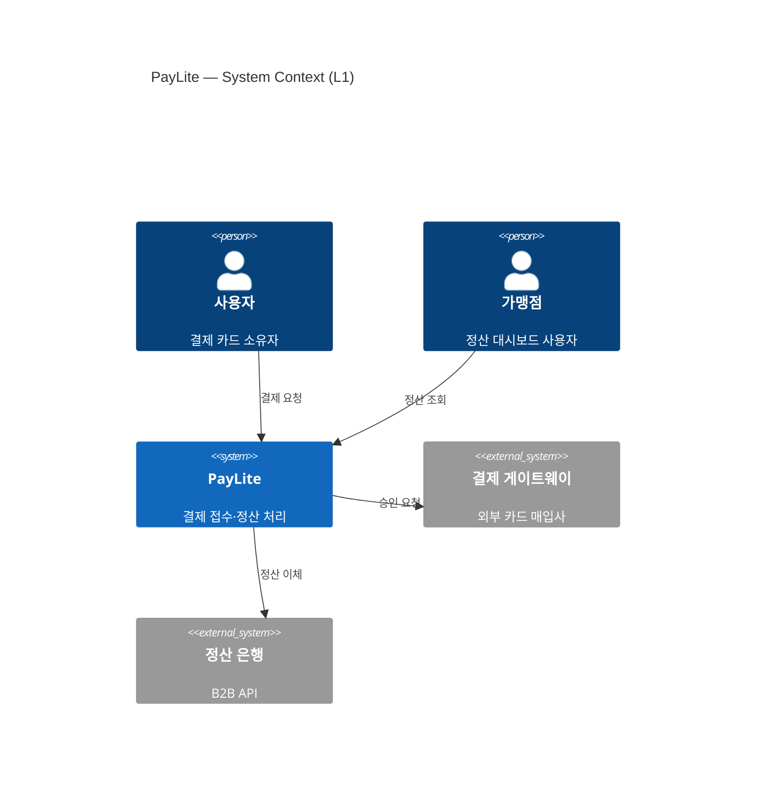
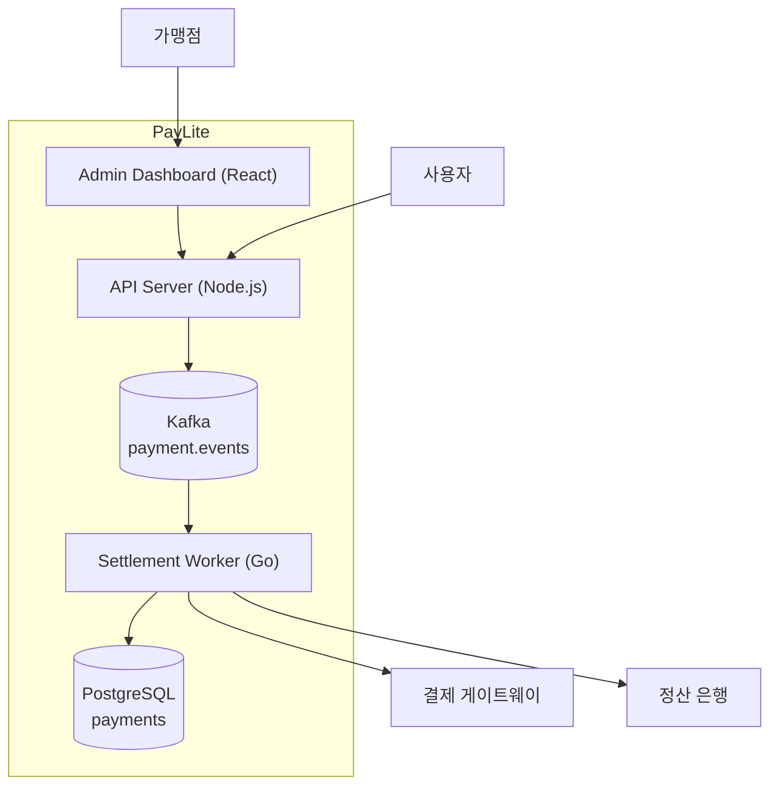
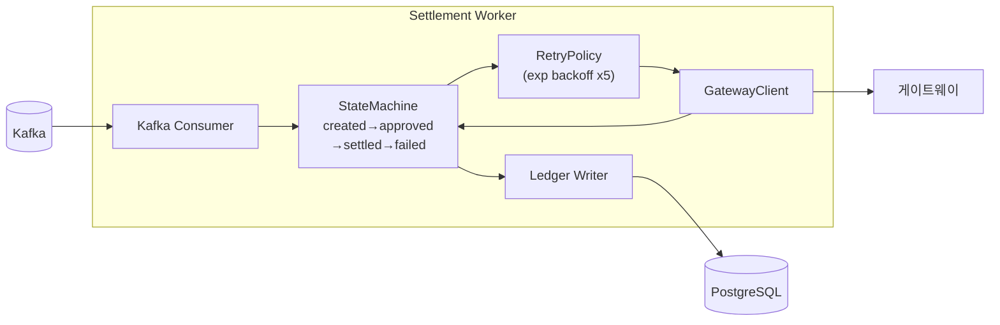
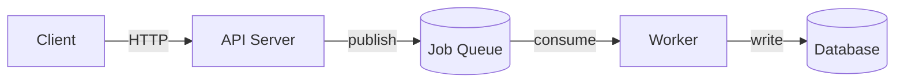
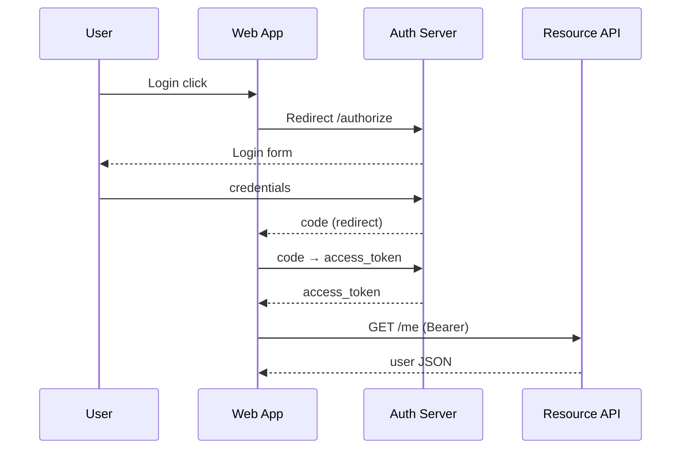
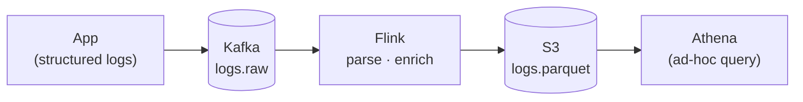
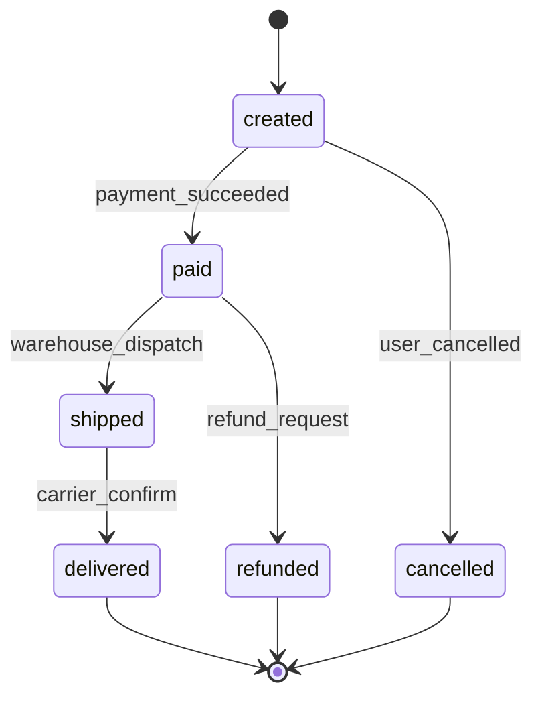
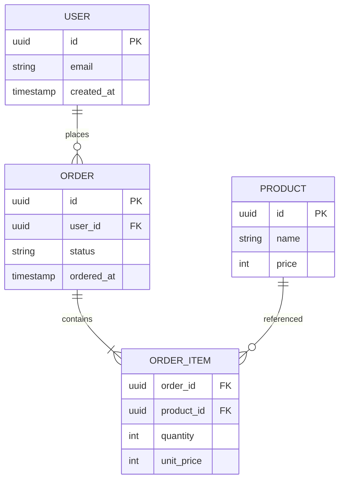
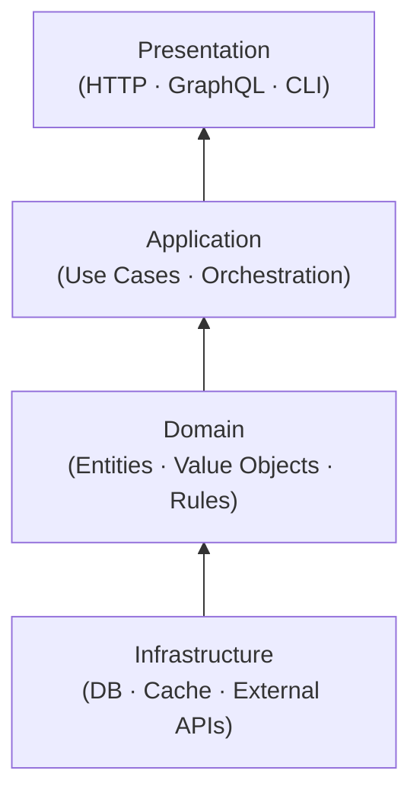

익스플레네이션은 **왜의 글**입니다. 시스템이 *어떻게* 동작하는지는 코드와 레퍼런스가 답합니다. *왜 이렇게 만들어졌는지*는 거기 안 적혀 있습니다. 그게 익스플레네이션의 자리입니다.

이런 글은 보통 *아키텍처 문서*, *디자인 노트*, *기술 블로그*의 형태를 띱니다. 도메인 모델 설명, 분산 시스템의 일관성 모델, 캐싱 전략의 트레이드오프. 다 익스플레네이션입니다.

이 글이 어렵게 느껴지는 이유는 단순합니다. *왜*를 쓰려면 *비교 대상*이 있어야 하는데, 우리는 자주 *선택한 길*만 적기 때문입니다. 좋은 익스플레네이션은 *선택하지 않은 길*과 함께 와야합니다.

---

## 익스플레네이션이 답하려는 질문

설명문에서 자주 다루는 질문들을 모아봅니다. 글을 시작하기 전 *이 글이 어떤 질문에 답하는지*를 한 문장으로 정해두면 글이 명료해집니다.

- "왜 [A]가 아니라 [B]를 택했는가"
- "[X]는 어떻게 [상황]에 대처하는가"
- "[개념]은 무엇이며 우리 시스템 안에서 어떤 자리를 차지하는가"
- "[제약]은 어디서 오는가"
- "[패턴]이 우리에게 맞는 이유"

질문이 명확하면 *답해야 할 범위*가 명확해집니다. 범위가 흐릿한 설명문은 끝없이 길어집니다.

---

## 익스플레네이션의 구조

질문이 정해졌다면 다음은 *글의 골격*입니다. 길든 짧든 좋은 익스플레네이션은 대체로 이 일곱 단락을 따라갑니다.

1. **질문** — 이 글이 답하려는 것 (앞 절에서 이미 한 일)
2. **맥락** — 어떤 상황·제약에서 이 결정이 필요했나
3. **대안** — 어떤 길들이 검토됐나
4. **선택** — 무엇을 택했나, 왜
5. **결과** — 그 선택이 가져온 것 (정량·정성)
6. **비용** — 그 선택이 포기한 것
7. **재검토** — 어떤 조건이면 다시 볼 것인가

1\~4는 *왜*에 답합니다. 5\~7은 종종 빠지지만, 좋은 설명문일수록 들어 있습니다. 그게 적혀 있어야 1년 뒤에도 *이 결정이 여전히 유효한가*를 판단할 수 있습니다.

이 글의 다음 절들은 이 골격을 *순서대로 채우는 법*을 알려주는 대신, 일곱 단락에 *공통으로 들어가는 도구*들을 먼저 풀어둡니다. 두 절에 걸쳐 **다이어그램**(2·4·5번에서 자주 등장)을 보고, 그 뒤에 **글 자체의 함정**(*묘사*와 *변호*)과 **PayLite 시나리오**로 넘어갑니다. 어떤 자리에 어떤 다이어그램·어떤 톤이 들어가는지가 잡히면, 일곱 단락 전체가 쉬워집니다.

---

## C4 모델: 줌 레벨로 정리하기

아키텍처를 설명하는 글에서 가장 자주 부딪치는 문제는 *디테일의 층이 섞이는 것*입니다. 한 다이어그램에 외부 시스템과 내부 클래스가 같이 들어옵니다. 한 문단에 사용자 시나리오와 코드 모듈이 같이 등장합니다. 독자는 어느 줌 레벨에 있는지 잃습니다.

**C4 모델**은 이 문제를 *카메라의 줌*으로 푼 단순한 프레임입니다. 같은 시스템을 네 줌 레벨에서 그립니다.


C4 모델의 미덕은 **다이어그램 하나당 줌 레벨 하나**라는 규칙입니다. L1 다이어그램 안에 L3 내용을 그리지 않습니다. 줌이 섞이는 순간 다이어그램은 *모두에게 너무 많고 모두에게 너무 적은* 상태가 됩니다.

실무에서는 L1과 L2만 잘 그려도 90%는 됩니다. L3은 필요한 컨테이너만 골라 그립니다. L4는 거의 그리지 않습니다 — 그 레벨은 *코드가 곧 진실*이기 때문입니다.

### 한 시스템으로 보는 줌 — PayLite의 L1·L2·L3

추상이 아니라 *한 시스템*을 직접 봅니다. 가상의 결제 처리 회사 *PayLite*를 세 줌으로 그려봅니다. 이 회사는 글 후반부에 다시 등장합니다.

**L1 Context — PayLite는 누구와 통신하는가**



<details>
<summary>Mermaid 소스 코드</summary>

```text
C4Context
    title PayLite — System Context (L1)
    Person(user, "사용자", "결제 카드 소유자")
    Person(merchant, "가맹점", "정산 대시보드 사용자")
    System(paylite, "PayLite", "결제 접수·정산 처리")
    System_Ext(gateway, "결제 게이트웨이", "외부 카드 매입사")
    System_Ext(bank, "정산 은행", "B2B API")
    Rel(user, paylite, "결제 요청")
    Rel(merchant, paylite, "정산 조회")
    Rel(paylite, gateway, "승인 요청")
    Rel(paylite, bank, "정산 이체")
```

</details>

L1에는 Kafka도 PostgreSQL도 없습니다. *PayLite라는 한 박스*와 *그 박스가 누구와 말하는가*가 전부입니다. 새로 합류한 사람이 *시스템의 경계*를 한 그림에서 잡습니다.

Mermaid `C4Context` 문법:

```text
C4Context
    title 다이어그램 제목
    Person(id, "이름", "설명")              # 외부 사용자(사람)
    Person_Ext(id, "이름", "설명")          # 외부 조직의 사용자
    System(id, "이름", "설명")              # 우리 시스템
    System_Ext(id, "이름", "설명")          # 외부 시스템(테두리 옅어짐)
    SystemDb(id, "이름", "설명")            # 데이터베이스 시스템
    Boundary(id, "이름") {                  # 경계 박스(조직·네트워크)
        System(...)
    }
    Rel(from, to, "라벨")                   # 단방향 화살표
    Rel(from, to, "라벨", "기술")           # 기술 스택까지 표기
    BiRel(a, b, "라벨")                     # 양방향
```

C4 시리즈에는 `C4Container`·`C4Component`도 있지만 experimental이라 깨질 위험이 있어, L2 이하는 일반 `flowchart`로 가는 게 안전합니다.

**L2 Container — PayLite 내부의 배포 단위**



<details>
<summary>Mermaid 소스 코드</summary>

```text
flowchart TB
    user["사용자"]
    merchant["가맹점"]
    gateway["결제 게이트웨이"]
    bank["정산 은행"]
    subgraph paylite["PayLite"]
        api["API Server (Node.js)"]
        worker["Settlement Worker (Go)"]
        kafka[("Kafka<br/>payment.events")]
        db[("PostgreSQL<br/>payments")]
        admin["Admin Dashboard (React)"]
        api --> kafka
        kafka --> worker
        worker --> db
        admin --> api
    end
    user --> api
    merchant --> admin
    worker --> gateway
    worker --> bank
```

</details>

L2에선 *어떤 컨테이너가 있고, 어떤 방향으로 통신하는가*가 보입니다. 비동기 경로(API → Kafka → Worker)와 동기 경로(Admin → API)가 갈리는 게 한눈에 잡힙니다.

L2는 Mermaid `flowchart` 문법으로 그려져 있고, `subgraph`로 *시스템 경계*를 표현했습니다. `flowchart` 문법 전반은 아래 [시스템 다이어그램](#시스템-다이어그램) 섹션을 참고하세요.

**L3 Component — Settlement Worker 내부**



<details>
<summary>Mermaid 소스 코드</summary>

```text
flowchart LR
    kafka[("Kafka")]
    gateway["게이트웨이"]
    db[("PostgreSQL")]
    subgraph worker["Settlement Worker"]
        consumer["Kafka Consumer"]
        machine["StateMachine<br/>created→approved<br/>→settled→failed"]
        retry["RetryPolicy<br/>(exp backoff x5)"]
        client["GatewayClient"]
        ledger["Ledger Writer"]
        consumer --> machine
        machine --> retry
        retry --> client
        client --> machine
        machine --> ledger
    end
    kafka --> consumer
    client --> gateway
    ledger --> db
```

</details>

L3은 *Worker 하나의 책임이 어떻게 나뉘는가*에 답합니다. 다른 컨테이너는 박스 한 개로 추상화되고, 줌이 들어간 컨테이너만 펼쳐집니다. L1에 있던 가맹점·은행은 여기 등장하지 않습니다 — *그 질문은 이 줌의 질문이 아니기 때문입니다.*

L2와 같은 `flowchart` 문법 — 방향만 `LR`로 바꿔 *흐름이 옆으로 진행되는* 형태가 됐습니다. 외부 노드(`kafka`, `gateway`, `db`)를 `subgraph` 바깥에 두면 자동으로 *경계 바깥*에 그려집니다.

세 그림 모두 *텍스트로 정의*됐기 때문에 git diff에 *어느 박스 어느 화살표가 바뀌었는지*가 남습니다. 6개월 뒤 누가 수정했는지 잊히지 않습니다.

### C4를 그리는 도구

C4 모델을 *그리는 방법*도 한 가지가 아닙니다. 도구별 성격이 다르고, 그에 따라 다이어그램이 *코드와 같이 사는지*가 갈립니다.

- **Structurizr**: C4 모델을 *코드로* 정의합니다. 자바·DSL 파일로 시스템·컨테이너·컴포넌트를 선언하면 L1~L3 다이어그램을 자동으로 뽑아줍니다. 같은 모델에서 여러 뷰를 일관되게 유지하기 좋습니다.
- **draw.io / diagrams.net**: 공식 *C4 모델 셰이프 라이브러리*가 들어 있습니다. GUI 도구이므로 빠르게 첫 그림을 그리기 좋지만, 모델이 *그림 안에만* 있기 때문에 일관성 유지는 사람 책임이 됩니다.
- **Mermaid**: ```` ```mermaid ```` 코드 블록 안에서 `C4Context`·`C4Container` 다이어그램을 지원합니다. GitHub README·MDX 문서에 *인라인으로* 박을 수 있어, *문서와 다이어그램이 같은 PR에 들어오는* 구조를 만들기 좋습니다.
- **Excalidraw**: C4를 직접 지원하진 않지만, *손그림* 느낌이 필요한 초안·화이트보드 세션에서 압도적입니다. 정식 아키텍처 문서가 되기 전 단계의 그림.

선택 기준 한 줄: *모델이 코드와 같이 살아야 한다면 Structurizr 또는 Mermaid, 손이 빠르게 가야 한다면 draw.io 또는 Excalidraw*.

---

## 다이어그램은 한 다이어그램에 한 질문만

C4가 *줌 레벨*을 정해준다면, 다이어그램의 *종류*는 *답하려는 질문*에 따라 달라집니다.

![다이어그램 종류별 쓰임 정리. 여섯 개 카드가 두 줄로 배치. 첫째 시스템 다이어그램은 "무엇이 무엇과 통신하나"를 답함. 박스와 화살표 미니 프리뷰. C4 L1·L2. 둘째 시퀀스 다이어그램은 "시간 순으로 무엇이 일어나나"를 답함. 액터 박스와 라이프라인, 메시지 화살표 미니 프리뷰. 인증·결제·호출 흐름에 사용. 셋째 데이터 흐름은 "데이터가 어디로 흐르나"를 답함. source → transform → sink 형태의 미니 프리뷰. ETL·이벤트·로그 파이프라인에 사용. 넷째 상태 머신은 "어떤 상태가 어떤 상태로 가나"를 답함. 원형 노드와 화살표 미니 프리뷰. 주문·결제·잡 라이프사이클에 사용. 다섯째 ER 다이어그램은 "데이터는 어떻게 관계 맺나"를 답함. 엔티티 박스와 관계 미니 프리뷰. DB 스키마와 도메인 모델에 사용. 여섯째 계층 다이어그램은 "무엇이 무엇 위에 쌓이나"를 답함. Presentation, Application, Domain, Infrastructure 네 층 미니 프리뷰. 레이어드·헥사고날·클린 아키텍처에 사용. 하단에 선택 가이드가 정리되어 있고, 핵심 원칙: 한 다이어그램에 한 질문. 두 질문에 답하려 하면 둘 다 약해진다.](./tw-05-02-diagram-types.svg)

각 다이어그램의 강점과 *피해야 할 사용법*을 짧게 짚습니다.

### 시스템 다이어그램

*경계와 통신*에 강합니다. *내부 동작의 시간 순서*에는 약합니다. 시간 순서를 보여주려고 박스 사이에 번호 매긴 화살표를 가득 채우면 시퀀스로 가야 한다는 뜻입니다.



<details>
<summary>Mermaid 소스 코드</summary>

```text
flowchart LR
    client["Client"] -->|HTTP| api["API Server"]
    api -->|publish| queue[("Job Queue")]
    queue -->|consume| worker["Worker"]
    worker -->|write| db[("Database")]
```

</details>

*답하는 질문: 어떤 컴포넌트가 어떤 컴포넌트와 통신하는가.*

Mermaid `flowchart` 문법:

```text
flowchart <방향>           # LR | RL | TB | TD | BT

# 노드 모양
A["직사각형"]
B(("원"))
C[("실린더")]
D{"마름모 — 분기"}
E[/"평행사변형"/]
F([둥근사각형])

# 화살표 종류
A --> B                    # 실선
A -.-> B                   # 점선
A ==> B                    # 굵은선
A --x B                    # 실패(X)
A --o B                    # 끝에 원
A -->|HTTP| B              # 라벨

# 묶기
subgraph id["그룹"]
    A --> B
end
```

### 시퀀스 다이어그램

*시간 순서*에 강합니다. *전체 구조 파악*에는 약합니다. 호출이 30개를 넘는 시퀀스는 다이어그램이 아니라 *코드를 읽으라는 뜻*입니다.



<details>
<summary>Mermaid 소스 코드</summary>

```text
sequenceDiagram
    participant U as User
    participant A as Web App
    participant Auth as Auth Server
    participant R as Resource API
    U->>A: Login click
    A->>Auth: Redirect /authorize
    Auth-->>U: Login form
    U->>Auth: credentials
    Auth-->>A: code (redirect)
    A->>Auth: code → access_token
    Auth-->>A: access_token
    A->>R: GET /me (Bearer)
    R-->>A: user JSON
```

</details>

*답하는 질문: 시간 순으로 어느 액터가 어느 메시지를 보내는가. — 위는 OAuth 2.0 Authorization Code 흐름.*

Mermaid `sequenceDiagram` 문법:

```text
sequenceDiagram
participant A as 표시명              # 액터(선언 순서 = 좌→우)
actor U as 사용자                    # 사람 아이콘으로

# 메시지 종류
A->>B: 요청                          # 실선 + 닫힌 화살표
A-->>B: 응답                         # 점선 + 닫힌 화살표
A-)B: 비동기                         # 실선 + 열린 화살표
A--)B: 비동기 응답
A-xB: 실패                           # 끝에 X

Note over A,B: 메모                  # 메모(over A 도 가능)

# 블록
loop 반복 조건
    A->>B: ...
end
alt 조건
    A->>B: ...
else
    A->>B: ...
end
opt 선택
    A->>B: ...
end
par 병렬
    A->>B: ...
and
    A->>C: ...
end

activate A                           # 라이프라인 활성 박스
deactivate A
```

### 데이터 흐름

*변환 단계*가 명확한 시스템에 강합니다. ETL, 이벤트 파이프라인, 로그 처리. 양방향 통신이 많아지면 시스템 다이어그램으로 가야 합니다.



<details>
<summary>Mermaid 소스 코드</summary>

```text
flowchart LR
    app["App<br/>(structured logs)"] --> kafka[("Kafka<br/>logs.raw")]
    kafka --> flink["Flink<br/>parse · enrich"]
    flink --> s3[("S3<br/>logs.parquet")]
    s3 --> athena["Athena<br/>(ad-hoc query)"]
```

</details>

*답하는 질문: 데이터가 어디서 시작해 어떤 변환을 거쳐 어디에 도착하는가.*

데이터 흐름 *전용 문법은 없습니다*. 시스템 다이어그램과 같은 `flowchart`를 *한 방향*으로 정렬해 *흐름*을 만드는 패턴입니다. 추가로 자주 쓰는 표현만:

```text
flowchart LR

# 라벨 내부 줄바꿈
A["저장소 이름<br/>(부연 설명)"]

# 시각 구분 — 저장소 vs 변환 단계
source[("Kafka<br/>logs.raw")]       # 실린더 = 저장소
transform["Flink<br/>parse · enrich"]  # 직사각형 = 변환

source --> transform

# 분기/합류
A --> B
A --> C
B --> D
C --> D
```

### 상태 머신

*상태가 5~20개 정도*인 영역에 강합니다. 상태가 너무 많으면 *계층화*하거나 *표*로 보조합니다.



<details>
<summary>Mermaid 소스 코드</summary>

```text
stateDiagram-v2
    [*] --> created
    created --> paid: payment_succeeded
    created --> cancelled: user_cancelled
    paid --> shipped: warehouse_dispatch
    shipped --> delivered: carrier_confirm
    paid --> refunded: refund_request
    delivered --> [*]
    cancelled --> [*]
    refunded --> [*]
```

</details>

*답하는 질문: 한 엔터티가 어떤 상태에 있고, 어떤 사건이 다음 상태로 옮기는가. — 위는 주문 라이프사이클.*

Mermaid `stateDiagram-v2` 문법(v2가 현재 표준):

```text
stateDiagram-v2

# 의사 상태
[*] --> Idle                        # 시작점
Final --> [*]                       # 종료점

# 전이 + 트리거 이벤트
Idle --> Running: start
Running --> Idle: stop
Running --> Failed: error

# 같은 출발에서 여러 분기 — 그대로 여러 줄
created --> paid: payment_succeeded
created --> cancelled: user_cancelled

# 중첩 상태 (계층 머신)
state Running {
    [*] --> Loading
    Loading --> Ready
    Ready --> [*]
}

# 별칭 — 긴 라벨용
state "긴 상태 이름" as X

# 분기 노드
state if_state <<choice>>
state fork_state <<fork>>
state join_state <<join>>
```

### ER 다이어그램

*스키마 설계*에 강합니다. *비즈니스 로직*에는 약합니다. ER에 동사·플로우를 욱여넣으면 보통 *도메인 다이어그램*이라는 별도 그림이 필요하다는 뜻입니다.



<details>
<summary>Mermaid 소스 코드</summary>

```text
erDiagram
    USER ||--o{ ORDER : places
    ORDER ||--|{ ORDER_ITEM : contains
    PRODUCT ||--o{ ORDER_ITEM : referenced
    USER {
        uuid id PK
        string email
        timestamp created_at
    }
    ORDER {
        uuid id PK
        uuid user_id FK
        string status
        timestamp ordered_at
    }
    ORDER_ITEM {
        uuid order_id FK
        uuid product_id FK
        int quantity
        int unit_price
    }
    PRODUCT {
        uuid id PK
        string name
        int price
    }
```

</details>

*답하는 질문: 어떤 엔터티가 어떻게 관계 맺고, 각 엔터티는 어떤 속성을 갖는가.*

Mermaid `erDiagram` 문법:

```text
erDiagram

# 카디널리티 마커 (좌우 양 끝에 짝지어 씀)
#   ||   정확히 하나
#   |o   0 또는 1
#   }o   0 이상
#   }|   1 이상

A ||--o{ B : 동사               # 1 : N
A ||--|| B : 동사               # 1 : 1
A }o--o{ B : 동사               # N : M
A ||--|{ B : 동사               # 1 : 1 이상

# 점선 화살표 = 식별 관계 vs 비식별 관계
A ||..o{ B : "weak"

# 속성 정의
ENTITY {
    uuid id PK                  # 기본키
    uuid other_id FK            # 외래키
    string name "주석"
    int count
    timestamp created_at
}
```

### 계층 다이어그램

*책임의 위계*에 강합니다. *런타임 동작*에는 약합니다. 계층 다이어그램만으로는 "이 시스템이 어떻게 돌아가는지"를 알 수 없습니다. 다른 다이어그램과 짝지어 씁니다.



<details>
<summary>Mermaid 소스 코드</summary>

```text
flowchart BT
    infra["Infrastructure<br/>(DB · Cache · External APIs)"]
    domain["Domain<br/>(Entities · Value Objects · Rules)"]
    app["Application<br/>(Use Cases · Orchestration)"]
    pres["Presentation<br/>(HTTP · GraphQL · CLI)"]
    infra --> domain
    domain --> app
    app --> pres
```

</details>

*답하는 질문: 책임이 어떻게 위계로 쌓이고, 의존은 어느 방향으로만 흐르는가. — 위는 헥사고날·클린 아키텍처의 의존 방향.*

계층 *전용 문법은 없습니다*. `flowchart`의 방향 선언으로 위계를 만듭니다:

```text
flowchart BT                  # bottom-to-top — 밑이 추상, 위가 구체
# flowchart TB              # top-to-bottom — 위가 추상이면 이쪽

# 노드 정의를 먼저 (층 구조가 코드만 봐도 읽힘)
infra["Infrastructure"]
domain["Domain"]
app["Application"]
pres["Presentation"]

# 관계는 뒤에 묶어서
infra --> domain
domain --> app
app --> pres
```

의존이 *위→아래*로 흘러야 하는 클린 아키텍처에선 `TB`/`TD`로, *안쪽이 가장 추상*인 헥사고날에선 `BT`로 두는 게 직관적입니다.

규칙은 단순합니다. **한 다이어그램에 한 질문.** 두 질문에 답하려 하면 둘 다 약해집니다.

### 다이어그램 종류별로 어울리는 도구

위 여섯 종류는 어울리는 도구도 조금씩 다릅니다. 정답은 없지만, *팀이 자주 그리는 다이어그램이 한 도구로 수렴*되는 게 일관성에 가장 좋습니다.

- **시스템 / 컨테이너**: Mermaid `C4Container`, Structurizr, draw.io. *코드와 함께 사는* 형태가 되려면 Mermaid·Structurizr.
- **시퀀스**: Mermaid `sequenceDiagram`이 사실상 표준입니다. PlantUML도 강합니다. 둘 다 텍스트로 정의하므로 git diff로 *시퀀스의 변경*까지 추적됩니다.
- **데이터 흐름**: 자유도가 높아야 하므로 Excalidraw·draw.io가 자주 어울립니다. ETL 파이프라인이 *고정된 형태*라면 Mermaid `flowchart`도 됩니다.
- **상태 머신**: Mermaid `stateDiagram-v2`, PlantUML state. 노드 수가 5~20개 범위에선 텍스트 정의가 그림보다 빠릅니다.
- **ER**: PlantUML, Mermaid `erDiagram`, dbdiagram.io. 진짜 스키마에선 *DB introspection 도구*가 다이어그램을 자동으로 뽑아주는 경우가 더 정확합니다.
- **계층**: 거의 모든 도구가 됩니다. 단순한 직사각형이 위로 쌓이는 그림은 *너무 단순해서* 도구 선택이 결과에 영향을 거의 안 줍니다.

한 가지만 기억하면 됩니다. **텍스트로 정의되는 다이어그램이 *오래갑니다*.** GUI에서만 그린 다이어그램은 6개월 뒤 누가 어디서 수정했는지 잊힙니다. 코드와 같은 저장소·같은 PR에 들어오는 다이어그램은 *코드와 함께 늙습니다*.

---

## 설명문이 빠지는 두 함정

좋은 다이어그램을 그렸다고 좋은 설명문이 되는 건 아닙니다. 글 자체가 자주 두 가지 함정에 빠집니다.

### 함정 1: 묘사로 끝난다

다이어그램을 글로 *다시 읽어주는* 글이 가장 흔합니다.

```markdown
약한 설명:
> 사용자는 웹 앱을 통해 API 서버에 요청을 보냅니다. 
> API 서버는 데이터베이스에 쿼리를 날립니다. 결과는 캐시에 저장되고 사용자에게 응답합니다.
```

이건 *묘사*입니다. 다이어그램을 본 사람이라면 이미 아는 내용입니다. *왜*가 없습니다. 좋은 설명문은 *결정*을 풉니다.

```markdown
강한 설명:
> 사용자 → 웹앱 → API → DB의 흐름에 캐시 층을 둔 것은 두 가지 결정이었습니다.
>
> 1. 읽기 트래픽의 70%가 동일한 인기 콘텐츠에 몰린다는 데이터가 있었습니다.
> 캐시 없이는 DB가 병목이 됩니다. Redis를 택한 이유는 …
>
> 2. 캐시 만료 전략을 TTL 기반으로 정한 것은 …
```

설명문은 *왜 이런 결정을 했는가*, *어떤 대안을 검토했는가*, *어떤 트레이드오프를 받아들였는가*를 다룹니다. *묘사*가 아니라 *논증*입니다.

한 가지 더, 다른 도메인의 예입니다. *이미지 업로드 파이프라인*을 설명한다고 합시다.

```markdown
약한 설명:
> 모바일 앱에서 이미지를 업로드하면 S3로 직접 multipart 업로드되고,
> 업로드 완료 후 Lambda가 트리거되어 썸네일 3종을 생성합니다.
```

깔끔합니다. 다이어그램을 그대로 받아 적었습니다. 하지만 *왜 직접 S3인가, 왜 Lambda인가, 왜 3종인가*에는 답하지 않습니다.

```markdown
강한 설명:
> 모바일 직접 업로드를 택한 이유는 서버 경유 방식에서 우리 트래픽의 18%가
> 회선 단절로 업로드 재시도를 일으키고 있었기 때문입니다. 클라이언트가 S3 presigned URL을
> 받아 직접 multipart로 올리면 부분 실패에서 *해당 청크만* 재전송됩니다.
> 평균 업로드 성공률이 81% → 96%로 회복됐습니다.
>
> 썸네일 3종(64·256·1024px)은 디바이스별 DPR 분포에서 1x·2x·3x 화면이 거의 균등하게
> 분포한다는 측정 결과에서 나왔습니다. 더 늘리면 캐시 적중률이 떨어집니다.
>
> Lambda는 *비용이 트래픽에 비례*하는 구조 때문에 골랐습니다. 업로드 트래픽은 하루 안에서
> 7배 편차가 있어, 상시 인스턴스로 가면 낮 동안의 1/7만 일하는 형태가 됐을 겁니다.
```

세 가지 결정 — *직접 S3*, *3종 사이즈*, *Lambda* — 각각의 *이유*와 *측정 데이터*가 짧게라도 적혀 있습니다. 6개월 뒤 누군가 "왜 직접 업로드인가"를 다시 물으면, 이 글이 *대답*이 됩니다.

### 함정 2: 변호로 끝난다

반대로 *왜*에만 집중하면 글은 변호처럼 들립니다.

```markdown
약한 설명:
> 우리는 마이크로서비스를 선택했습니다. 이는 확장성, 유지보수성,
> 팀 자율성, 기술 다양성 등 여러 측면에서 우수한 결정입니다.
```

이런 글은 *선전*입니다. 독자는 *그래서 어디가 약한가*를 알 수 없습니다. 좋은 설명문은 *자기 결정의 약점*까지 말합니다.

```markdown
강한 설명:
> 우리는 마이크로서비스를 선택했습니다. 
> 핵심 이유는 두 팀이 독립적으로 배포 사이클을 가져야 했기 때문입니다.
>
> 다만 이 결정의 비용은 이렇습니다:
> - 분산 트랜잭션의 어려움 — Saga 패턴으로 대처합니다.
> - 운영 복잡도 증가 — Kubernetes와 관측성에 추가 투자가 필요했습니다.
> - 디버깅의 어려움 — 분산 추적이 필수가 됩니다.
```

자기 결정의 비용까지 적으면 글이 *신뢰*를 얻습니다. 그리고 미래에 그 결정을 재검토할 때 *무엇이 비용이었는지*가 명확합니다.

또 다른 예 — *GraphQL 채택*에 대한 글입니다.

```markdown
약한 설명:
> 우리는 GraphQL을 도입했습니다. 오버페치를 해결하고, 타입이 강하며,
> 클라이언트 자율성이 높아 모던한 API 설계에 적합합니다.
```

블로그 첫 줄에 흔히 보는 문장입니다. 어디가 약한지 적혀 있지 않고, *우리 팀의 어떤 문제를 해결하려고*가 빠져 있습니다.

```markdown
강한 설명:
> GraphQL을 도입한 이유는 단 하나입니다. 모바일 첫 화면이 7-12개의 REST 호출에 의존하고 있었고,
> 그중 가장 느린 두 호출이 직렬 의존성을 가져 첫 의미 있는 페인트(FMP)를 1.4초 늦추고 있었습니다.
> 한 번의 쿼리로 묶는 것 외에 검토할 수 있는 길은 *BFF 게이트웨이*였지만, 새 서버를 운영하는
> 비용이 우리 팀 규모(백엔드 4명)에 비해 컸습니다.
>
> 이 결정의 비용은 다음과 같습니다.
>
> - **N+1 문제** — 리졸버 단위로 호출이 늘어나면 DB 호출이 폭증합니다. DataLoader 패턴을 표준으로
>   강제했고, PR 리뷰에 *resolver는 DataLoader를 거치게 한다* 룰이 추가됐습니다.
> - **캐싱 복잡도** — REST의 URL 기반 캐싱이 사라집니다. Apollo persisted queries로 *쿼리 해시 단위*
>   캐싱을 만들었지만, 캐시 키 설계에 1주가 들었습니다.
> - **스키마와 리졸버의 양방향 수정** — 백엔드 변경 한 번이 `*.graphql`과 리졸버 파일 두 곳을 동시
>   수정하게 합니다. 마찰을 줄이기 위해 codegen 파이프라인을 깔았습니다.
>
> *언제 이 결정을 다시 보는가*: 모바일 첫 화면의 호출 구조가 단순해지거나, BFF 운영 비용을 감당할 수 있는
> 팀 규모가 되면 — REST + BFF로 *돌아오는* 길도 열어둡니다.
```

*이유 한 줄·비용 세 줄·재검토 조건 한 줄*. 변호처럼 들리지 않고, 의사 결정의 *균형 잡힌 기록*으로 읽힙니다.

### 짧은 시나리오 — PayLite 팀의 결제 큐 설명문

가상의 결제 처리 팀 *PayLite*가 *결제 이벤트 큐*에 대한 아키텍처 글을 쓴다고 가정합니다. 첫 초안은 묘사 함정에 빠집니다.

> # 결제 이벤트 큐
>
> 결제 요청은 API 서버를 거쳐 Kafka 토픽 `payment.events`로 발행됩니다. 컨슈머 그룹 `settlement-workers`가 이 토픽을 구독하며, 처리 결과는 PostgreSQL `payments` 테이블에 기록됩니다. 실패한 메시지는 `payment.events.dlq` 토픽으로 이동합니다.

리뷰에서 한 시니어가 한 줄 코멘트를 남깁니다. *"왜 큐를 둔 거지? 동기 호출로 충분하지 않나?"* 글을 다시 봅니다. 어디에도 그 답이 없습니다. 묘사뿐이고, *결정의 이유*가 빠져 있습니다.

두 번째 초안은 *왜*를 회복합니다. 위에서 본 [익스플레네이션의 구조](#익스플레네이션의-구조) 일곱 단락을 그대로 따라갑니다.

> # 결제 이벤트 큐
>
> **이 글이 답하는 것**
>
> 결제 처리에 *왜 동기 호출이 아니라 큐를 두었는가*.
>
> **맥락**
>
> 결제 게이트웨이의 응답 시간은 평소 200ms 안쪽이지만, p99 기준 2.5초까지 늘어나는 시간대가 있습니다. 이걸 동기로 처리하면 API 응답 시간이 그대로 따라 올라가 *클라이언트 타임아웃*이 발생합니다. 또한 게이트웨이 일시 장애에 대해 *지수 백오프로 5회까지 재시도*하는 정책이 정해져 있어, 호출 측 코드에 이 재시도를 안전하게 끼워 넣을 자리가 필요합니다.
>
> **대안**
>
> | 대안 | 왜 안 골랐나 |
> | --- | --- |
> | 동기 호출 + 짧은 타임아웃 | 게이트웨이 p99에서 클라이언트가 먼저 끊김 |
> | DB 큐 (`SELECT ... FOR UPDATE SKIP LOCKED`) | 트래픽이 5배로 늘면 DB가 병목이 됨 |
> | SQS · RabbitMQ | 사내에 Kafka 운영 경험이 이미 있어 학습 비용이 낮음 |
>
> **선택**
>
> Kafka 토픽 `payment.events` + 컨슈머 그룹 `settlement-workers`. API 서버는 *접수 확인*까지만 책임지고 100ms 이내에 응답합니다. 워커가 게이트웨이 호출과 재시도를 담당합니다.
>
> **결과** (도입 1개월 후 측정)
>
> - API p99 응답: 2.6s → 95ms
> - 게이트웨이 일시 장애 시 사용자 영향: 즉각 에러 → 큐에서 자동 재시도로 거의 무사
> - 정산 누락 건수: 월 12건 → 0건
>
> **비용**
>
> - 메시지 *순서 보장*은 파티션 키 설계에 강하게 의존 — *가맹점 ID*를 키로 고정해야 합니다.
> - 운영 복잡도 증가 — consumer lag·DLQ 모니터링이 추가되고, 분산 추적이 사실상 필수가 됩니다.
> - 단일 메시지의 디버깅이 동기 호출보다 어려워집니다.
>
> **재검토 조건**
>
> 다음 중 하나가 발생하면 이 결정을 다시 본다:
>
> - 결제 트래픽이 현재 대비 5배 도달
> - 게이트웨이 p99가 안정적으로 500ms 미만으로 떨어짐
> - 사내 Kafka 운영팀이 사라짐
>
> 트레이드오프의 자세한 정량 분석은 ADR-019 참조.

같은 시스템이지만, *그림과 묘사*에서 *결정과 비용*으로 무게중심이 옮겨졌습니다. 일곱 단락 중 *결과*와 *재검토 조건*이 들어가 있는 것이 특히 큰 차이입니다 — 6개월 뒤 새로 합류한 사람이 이 글을 읽으면 *왜 동기로 안 했는지*를 묻지 않습니다. 글에 이미 답이 있기 때문입니다.

#### 18개월 뒤 — 글이 박제가 아니라 살아 있는 기록이 될 때

시간이 더 지난 뒤도 봅니다. **트래픽이 6배로 늘었습니다.** 글 끝 *재검토 조건*에 적혀 있던 "5배 도달 시" 라인이 트리거됐습니다.

팀은 글을 다시 폅니다. 재평가 결과 *큐를 둔 결정 자체는 여전히 유효*했습니다. 다만 두 가지가 바뀝니다 — Kafka 파티션 수 16 → 64, 워커는 고정 4대 → 오토스케일링.

이때 글은 *지워지지 않습니다*. 마지막에 새 단락이 한 개 붙습니다.

> ##### Outcome (2027-08)
>
> 트래픽 6배 도달. *재검토 조건* 1번 발동.
>
> - **유효**: 큐 도입 결정 자체. 동기 호출은 여전히 게이트웨이 p99에 묶입니다.
> - **변경**: Kafka 파티션 16 → 64, 워커 고정 4대 → 오토스케일링.
> - **새 비용**: 파티션 리밸런싱 중 일시 지연(p99 +300ms, ~10분). ADR-031 참조.

이 *Outcome 단락*은 [ep.04](/tech-writing-guide-ep-04)에서 봤던 docstring의 `.. versionchanged::` 라벨과 같은 역할을 합니다. 설명문에 *시간 축*을 박는 장치. 6개월 뒤 새 합류자는 *결정의 이유*와 *그 결정이 시간 속에서 어떻게 검증됐는지*를 한 글에서 읽습니다. 설명문은 *박제*가 아니라 *살아 있는 기록*이 됩니다.

---

## 실제로 볼 수 있는 익스플레네이션

PayLite는 가상 사례입니다. 같은 골격을 *실제로 적용한* 공개 글 세 곳을 골랐습니다. 위에서 본 일곱 단락(질문·맥락·대안·선택·결과·비용·재검토) 중 대부분 또는 전부가 들어 있는 글들이라, PayLite를 쓸 때 옆에 켜두면 좋은 참고가 됩니다.

- **[Discord — How Discord Stores Trillions of Messages](https://discord.com/blog/how-discord-stores-trillions-of-messages)** (Bo Ingram, 2023-03-06).
  Cassandra → ScyllaDB 이행기. *맥락*(Cassandra의 GC pause·tail latency 문제, "high-toil" 운영 부담) → *대안*(직접 fork, 다른 NoSQL 검토) → *선택*(ScyllaDB + Rust로 데이터 서비스 재작성) → *결과*(p99 메시지 읽기 40ms → 5ms 수준, hot partition 문제 해소) → *비용*(Rust 학습, 운영 도구 재작성)이 한 글에 모두 들어 있습니다. Discord가 같은 주제로 2017·2023 두 번에 걸쳐 글을 썼다는 점은 그 자체로 *재검토*의 좋은 예입니다.

- **[Notion — Building and scaling Notion's data lake](https://www.notion.com/blog/building-and-scaling-notions-data-lake)** (XZ Tie 외, 2024-07-01).
  Snowflake에서 자체 data lake(S3 + Hudi + Spark)로 옮긴 이유. 블록 데이터가 6\~12개월마다 두 배로 늘어 *맥락*(비용·지연 폭증)이 명확하고, *대안*·*선택*·*결과*(비용·지연 개선의 정량적 그래프)·*비용*(운영 부담)을 다이어그램과 표로 풀어둡니다. *익스플레네이션이 측정치까지 같이 갈 수 있다*는 본보기.

- **[Stripe — Online migrations at scale](https://stripe.com/blog/online-migrations)** (Jacqueline Xu, 2017-02-02).
  Subscriptions 객체 수억 건을 *어떻게 무중단으로 옮기는가*에 대한 4단계 패턴(dual-write → 새 테이블로 읽기 전환 → 새 테이블로 쓰기 전환 → 옛 데이터 삭제)의 *왜*를 풀어 쓴 글. 짧지만 *대안·비용·언제 적용 안 되는가*까지 압축적으로 다룹니다. 7년이 지났지만 패턴 자체가 표준화되어 *수명이 긴 익스플레네이션*의 예이기도 합니다.

세 글의 공통점이 있습니다 — *묘사*에서 끝나지 않고, 다이어그램은 있지만 *글의 중심*은 아니며, 자기 결정의 비용까지 솔직하게 적혀 있다는 것. 그리고 모두 *결과의 측정치*가 본문 안에 있습니다. 이 셋만 갖춰도 익스플레네이션은 단순한 후기에서 *살아 있는 기록*으로 옮겨갑니다.

---

## 익스플레네이션과 다른 분면의 관계

같은 주제로 네 분면을 쓸 수 있다는 게 익스플레네이션을 헷갈리게 만듭니다.

| 분면 | "캐싱"이라는 주제 |
| --- | --- |
| Tutorial | Redis로 첫 캐시 만들어보기 |
| How-to | 프로덕션에서 캐시 무효화하기 |
| Reference | `set()`, `get()`, `expire()`의 시그니처 |
| **Explanation** | **왜 이 시스템에 캐싱을 도입했나** |

익스플레네이션은 *유일하게 행동을 시키지 않는* 글입니다. 코드를 따라 치라고 하지 않습니다. 어떤 옵션을 쓰라고도 하지 않습니다. *이해하라*고만 합니다.

그래서 익스플레네이션은 *길어질 수 있습니다*. 다른 분면들이 *짧음을 미덕*으로 한다면, 익스플레네이션은 *충분한 깊이*를 미덕으로 합니다. 다만 깊이는 *주제에 비례*해야지 *작성자의 욕심에 비례*하면 안 됩니다.

---

## 익스플레네이션이 자주 무너지는 지점

1. **다이어그램만 있고 글이 없다.**<br />다이어그램은 *답*이지 *질문*이 아닙니다. 다이어그램 위에 *이 그림이 답하려는 질문*이 한 문단 있어야 합니다.
2. **글만 있고 다이어그램이 없다.**<br />5개 이상의 서비스가 등장하는 설명문에 다이어그램이 없으면 독자는 자기 머릿속에 직접 그림을 그려야 합니다. 그건 작성자의 책임입니다.
3. **다이어그램이 코드보다 자세하다.**<br />L3·L4 줌에서 모든 모듈을 다 그리려는 욕심이 자주 나옵니다. 다이어그램은 *추상*이어야 합니다. 코드만큼 자세하다면 코드를 보면 됩니다.
4. **시점이 분리되지 않는다.**<br />"옛날엔 이랬는데, 지금은 이러고, 앞으로는…"이 한 문단에 다 들어옵니다. 시점을 *명시적으로* 가릅니다.
5. **비교 대안이 없다.**<br />무엇을 *선택하지 않았는지*가 없으면 그 결정은 변호로만 보입니다.

---

## 템플릿

```markdown
# [개념 또는 결정 이름]

## 이 글이 답하는 것

[한 문장 또는 두세 개의 질문]

## 맥락

[어떤 상황에서 이 결정/개념이 필요했는가]

## 대안

검토한 길들:

| 대안 | 장점 | 단점 |
| --- | --- | --- |
| A | ... | ... |
| B | ... | ... |
| C | ... | ... |

## 우리의 선택

[무엇을 택했는가, 그리고 왜]

[다이어그램 1개 이상]

## 결과

[그 선택이 가져온 것 — 정량/정성]

## 비용

[그 선택이 포기한 것 — 솔직하게]

## 재검토 조건

다음 조건이 만족되면 이 결정을 다시 본다:

- [조건 1]
- [조건 2]

## 더 읽을거리

- [관련 ADR](./adr/...)
- [외부 자료]
```

---

## 체크리스트

- [ ] 글 첫머리에 *이 글이 답하는 질문*이 한 문장으로 있는가
- [ ] 줌 레벨이 일관되는가 (한 다이어그램에 한 줌)
- [ ] 각 다이어그램이 *답하는 질문* 하나가 분명한가
- [ ] *대안*과 *선택하지 않은 이유*가 포함되어 있는가
- [ ] 선택의 *비용*까지 솔직하게 적혀 있는가
- [ ] 시점(과거·현재·미래)이 명시적으로 가려져 있는가
- [ ] 묘사(어떻게)에서 끝나지 않고 논증(왜)으로 가는가
- [ ] *재검토 조건*이 있는가
- [ ] 행동을 시키는 문장이 없는가 (있다면 How-to로 분리)
- [ ] 6개월 뒤에도 *유효성을 판단할 수 있는* 글인가

---

## 참고 자료

- Procida, D. *Diátaxis: Explanation.* https://diataxis.fr/explanation/
- Brown, S. *The C4 model for visualising software architecture.* https://c4model.com
- Fowler, M. (2003). *Patterns of Enterprise Application Architecture.* Addison-Wesley.
- Newman, S. (2021). *Building Microservices, 2nd ed.* O'Reilly.

---

## 다음 편 예고

> [ep.06 - 의사결정의 기록, ADR과 RFC](/tech-writing-guide-ep-06)

다음 편은 ADR과 RFC입니다. 같은 *의사결정*이지만 위치가 다른 두 문서. ADR은 *이미 한 결정*을 박제하고, RFC는 *아직 안 한 결정*을 제안합니다. 그 차이가 글의 톤·구조·수명을 모두 다르게 만듭니다.
