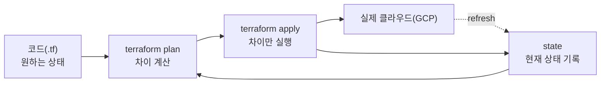
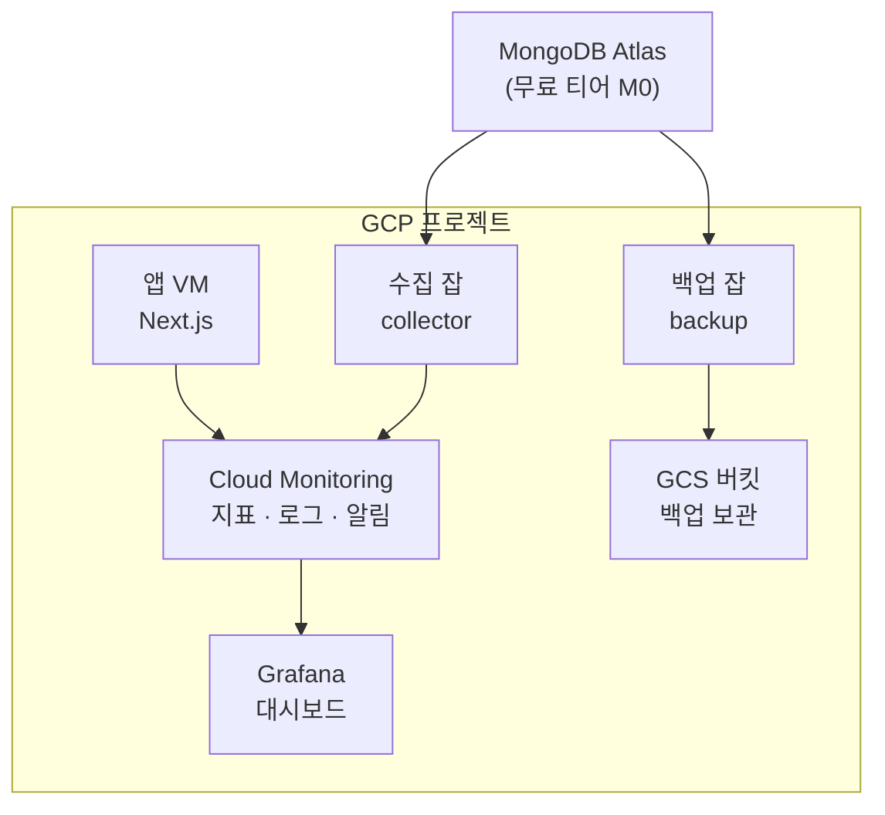

인프라를 손으로 만들면, 무엇을 만들었는지는 기억에 남습니다. 기억은 흐려집니다.

운영 중인 웹 서비스에 관측성과 백업을 새로 얹으면서, 이번엔 인프라를 코드로 적기로 했습니다. 도구는 Terraform입니다. Terraform이 무엇인지부터 짚고, 실제로 무엇을 코드로 옮겼는지, 그 과정에서 구조를 왜 세 번이나 갈아엎었고 어디서 막혔는지를 순서대로 적었습니다.

---

## Terraform이란 무엇인가

Terraform은 **코드형 인프라(Infrastructure as Code, IaC)** 도구입니다. 서버, 네트워크, 권한 같은 클라우드 리소스를 텍스트 파일로 정의하고, 그 파일을 적용해 실제 인프라를 만듭니다.

핵심은 **선언형(declarative)** 이라는 점입니다. "이걸 만들어라, 저걸 지워라"라고 절차를 적는 게 아닙니다. "최종 상태는 이러해야 한다"를 적으면, 도구가 현재 상태와 원하는 상태의 차이를 계산해 그 차이만 실행합니다.

코드는 **HCL(HashiCorp Configuration Language)** 이라는 전용 언어로 씁니다. 예를 들어 버킷 하나는 이렇게 적습니다. 아래는 실제 정의를 단순화한 것입니다.

```hcl
# 백업 버킷 — 생성 시점에 스토리지 클래스를 직접 지정
resource "google_storage_bucket" "backup" {
  name          = var.backup_bucket
  location      = var.region
  storage_class = "NEARLINE"

  lifecycle_rule {
    condition { age = 30 }   # 30일 지난 객체 삭제
    action { type = "Delete" }
  }
}
```

작동 방식은 네 가지 개념으로 요약됩니다.

- **프로바이더(provider)**: 어떤 클라우드를 다룰지 정합니다. 여기선 `google`입니다.
- **리소스(resource)**: 만들 대상 하나하나입니다. 버킷, 잡, 권한 같은 것들입니다.
- **상태(state)**: Terraform이 "지금 무엇을 관리하고 있는지"를 기록한 파일입니다. 진실의 원천입니다.
- **plan / apply**: `plan`은 적용 전에 차이를 미리 보여주고, `apply`는 그 차이를 실제로 실행합니다.

이 중 가장 중요한 건 상태입니다. Terraform은 코드와 클라우드를 직접 비교하지 않습니다. 코드(원하는 상태)와 state(자기가 기억하는 현재 상태)를 비교해 차이를 만듭니다. 그래서 state가 어긋나면 도구의 판단도 어긋납니다.



여러 리소스를 묶어 재사용 단위로 만든 게 **모듈(module)** 입니다. 루트와 모듈의 구분이 뒤에서 중요해집니다.

라이선스도 이슈가 조금 있었는데요, Terraform은 2023년 8월에 라이선스가 MPL에서 BSL로 바뀌었고, 이에 반발한 진영이 OpenTofu라는 포크를 만들었습니다. 2025년 IBM이 HashiCorp를 인수하면서 Terraform은 IBM 제품이 되었습니다. OpenTofu는 MPL을 유지한 채 리눅스 재단에서 관리됩니다. 다만 사내에서 쓰는 입장에선 둘의 차이가 거의 보이지 않습니다. HCL도, state도, plan/apply 명령도 사실상 같습니다. 이 글에서 다루는 개념은 어느 쪽을 쓰든 그대로 적용됩니다. 저는 Terraform을 썼습니다. (이 글 기준 Terraform 1.15.5, Google provider 6.x를 사용했습니다.)

---

## 무엇을 코드로 옮겼나

먼저 환경입니다. 앱은 서버리스가 아니라 **GCE(Compute Engine)** VM에서 도는 Next.js 앱입니다. DB는 **MongoDB Atlas**의 무료 티어(M0)입니다. 예산 제약도 있었습니다. GCP 과금은 괜찮지만 GCP 밖 유료 SaaS는 쓸 수 없어서, **GCP 네이티브 + 무료 한도** 안에서만 짭니다.

이 제약들 때문에 이 저장소에는 여러 기능이 포함되게 되었습니다. (일종의 모노레포가 된 셈입니다.)

- **infra**: 베이스 인프라입니다. 네트워크와 VM 같은 공통 기반이 여기 있습니다.
- **collector**: MongoDB Atlas에서 지표를 수집해 Cloud Monitoring으로 보내는 잡입니다. 무료 티어라 외부에서 직접 스크래핑이 안 돼, 직접 수집해 보냅니다.
- **backup**: Atlas를 `mongodump`로 덤프해 로컬 디스크를 거치지 않고 GCS로 스트리밍하는 잡입니다. 보관 등급(Nearline·Coldline·Archive)을 나눠 저장합니다. 연결 문자열은 코드가 아니라 Secret Manager에 둡니다.
- **alerts**: 알림 정책입니다. 자원 임계, 백업 잡 실패, 일정 시간 내 신규 백업 없음 같은 것들입니다.
- **dashboard**: Grafana 대시보드입니다. 데이터소스는 Cloud Monitoring, 대시보드 정의는 코드로 관리합니다.

실행은 Cloud Run Job과 Cloud Scheduler(OIDC 인증)가 맡습니다. 전체를 그림으로 보면 이렇습니다.



Cloud Monitoring이 허브이고, GCS가 백업 저장소입니다. 이 구성을 전부 Terraform으로 옮기는 게 목표였습니다.

---

## apply 전에는 공짜다 — 구조를 세 번 갈아엎다

이 도입에서 가장 크게 배운 건 구조를 잡는 타이밍이었습니다.

Terraform에는 단순하지만 강한 전제가 하나 있습니다. **디렉터리 하나가 곧 하나의 루트(root)** 입니다. 한 폴더 안의 모든 `.tf` 파일은 합쳐져 하나로 취급되고, 하나의 state를 공유합니다. 그래서 "컴포넌트마다 자기 코드 옆에 자기 인프라 코드를 두고 싶다"고 생각했고, 곧 폴더와 루트를 어떻게 나눌지의 문제가 됩니다.

저는 첫 apply를 돌리기 전까지 구조를 세 번 바꿨습니다.

| 단계 | 구조 | 바꾼 이유 |
|---|---|---|
| v1 | 단일 루트(`infra/`)에 전부, 리소스 종류별 파일(`run_jobs.tf`·`scheduler.tf`·`iam.tf`) | 처음엔 일단 한곳에 |
| v2 | 베이스 인프라를 별도 폴더 + 별도 state로 분리 | VM 같은 기반은 앱과 생명주기가 다름 |
| v3 | 종류별 파일을 기능별 파일로(`backup.tf`·`collector.tf`·`alerts.tf`) | 종류별로 섞이니 어디에 뭐가 있는지 헷갈림 |
| v4 | 컴포넌트마다 독립 루트(각자 코드 + 자기 Terraform + 자기 state) | 컴포넌트를 따로 배포하고 따로 지울 수 있도록 |

이걸 부담 없이 할 수 있었던 이유는 단 하나입니다. **아직 apply를 안 했으니까요.**

apply를 한 번이라도 돌리면 state가 생깁니다. 그 뒤에 리소스를 다른 루트로 옮기면 state도 같이 손봐야 합니다(`terraform state mv`, import 같은 작업). 손이 가고, 실수하면 돌던 리소스가 지워질 수도 있습니다. 그런데 state가 아예 없는 시점에는, 파일을 어떻게 옮기든 그저 텍스트 정리만 하는 셈입니다. 마이그레이션 비용이 안 들어갑니다.

그래서 구조를 진지하게 고민할 가장 싼 시점은 첫 apply 직전입니다.

얇은 루트 하나가 컴포넌트들을 **모듈**로 호출해 한 state를 공유하거나, 컴포넌트마다 **독립 루트**를 둬서 state까지 따로 가져가거나 고르기로 했고, 저는 후자를 골랐습니다. 컴포넌트 하나를 따로 배포하고 따로 지울 수 있는 게 더 중요했습니다.

최종 구조는 이렇습니다.

```text
<repo>/
  infra/        # 공유 루트: 네트워크·API·시크릿 컨테이너   [state: infra]
  collector/    # 코드 + deploy/ 안의 Terraform       [state: collector]
  backup/       # 코드 + deploy/ 안의 Terraform       [state: backup]
  alerts/       # deploy/ 안의 Terraform             [state: alerts]
  dashboard/    # 설정 + deploy/ 안의 Terraform       [state: dashboard]
```

코드를 두는 컴포넌트는 런타임 코드와, 1회성 프로비저닝용 Terraform(`deploy/`)을 나눠 둡니다. 인프라를 만드는 일과 서비스를 실행하는 일은 다른 일이니까요.

여기서 짚을 게 두 가지입니다.

첫째, 클라우드 **프로젝트는 하나**지만 **Terraform state는 컴포넌트마다 따로** 둡니다. 각 컴포넌트의 state는 한 GCS 버킷 아래, prefix만 다르게 들어갑니다.

```hcl
# 각 컴포넌트의 backend — 같은 버킷, prefix만 다르게
terraform {
  backend "gcs" {
    bucket = "my-tfstate"
    prefix = "backup"   # infra·collector·alerts… 컴포넌트마다 다름
  }
}
```

| 컴포넌트 | state prefix | 거기서만 관리 |
|---|---|---|
| infra | `infra` | 공유 API·시크릿, 네트워크 |
| backup | `backup` | 버킷·SA·IAM |
| collector | `collector` | 수집 잡 SA·IAM |
| alerts | `alerts` | 알림 정책 |
| dashboard | `dashboard` | 대시보드 뷰어 SA |

GCS를 state 백엔드로 쓰면 state가 원격에 공유되고, 잠금도 자동으로 걸립니다. 누가 apply하는 동안엔 같은 state를 동시에 건드리지 못하게 막아 줍니다. state를 이렇게 쪼개면 한 컴포넌트를 apply할 때 다른 컴포넌트는 건드리지 않습니다. 영향도, 폭발 반경(blast radius)이 작아집니다. 컴포넌트 하나를 통째로 지워도 다른 state는 멀쩡합니다.

둘째, 그래도 처음 한 번은 순서가 있습니다. 다른 컴포넌트가 기대는 공유 자원(API 활성화, 시크릿 컨테이너)을 infra 루트에서 먼저 올려야 합니다. 전체를 한꺼번에 올리는 대신 `-target`으로 콕 집습니다.

```bash
# infra 루트에서 공유 자원부터 먼저 생성
terraform apply -target=google_project_service.required \
                -target=google_secret_manager_secret.mongodb_uri
```

이 명령은 다음 장에서 `make` 타깃 하나로 묶입니다.

---

## Makefile로 Terraform을 감싸다

0단계에서 도구를 고를 때 후보는 둘이었습니다. Terraform이냐, gcloud 명령과 Makefile이냐. 재현성을 보고 Terraform을 골랐습니다. 그런데 막상 해보니 Makefile도 같이 쓰게 됐습니다. 대체재가 아니라, Terraform을 감싸는 실행기로요.

이유는 세 가지였습니다.

첫째, 명령이 길어집니다. 앞 장의 그 `-target` 한 줄을 매번 손으로 치는 대신 `make apply-shared`로 묶었습니다. 오타도 줄고, 무엇을 켜는지가 타깃 이름에 남습니다.

둘째, 한 컴포넌트를 올리는 일이 terraform만으로 끝나지 않습니다. 잡 하나를 배포하려면 (1) terraform으로 신원·권한·스케줄을 만들고, (2) 필요하면 이미지를 빌드해 올리고, (3) 잡을 배포하고, (4) 호출 권한을 붙입니다. 선언형인 terraform과 명령형인 gcloud가 섞이는 구간입니다. 그래서 컴포넌트마다 `make all`이 `tf-apply → deploy → invoker → schedule`을 순서대로 돌리게 했습니다.

셋째, terraform을 전역으로 깔고 싶지 않았습니다. 전역에 깔지 않고 프로젝트 로컬(`.bin/terraform`, gitignore 처리)에 특정 버전을 두고, Makefile이 그걸 우선 쓰게 했습니다. 누군가의 로컬에 다른 버전이 깔려있어도, 특정 버전으로 고정할 수 있도록 했습니다.

정리하면, terraform이 "무엇을 만들지"를 맡고 Makefile이 "그걸 어떤 순서로 실행할지"를 맡습니다. 둘은 경쟁하지 않습니다. 그리고 바로 이 Makefile에서 첫 사고가 났습니다.

---

## validate는 통과했는데 apply가 안 됩니다

구조를 다 잡고 `terraform validate`도 통과했습니다. 문법과 스키마는 멀쩡했습니다. 그런데 실제 apply 단계에서 연달아 막혔습니다. 그리고 막힌 곳은 **전부 HCL 바깥**이었습니다.

### 경로에 공백이 있으면 Makefile이 깨집니다

처음 만난 건 황당한 에러였습니다. `make: terraform: No such file or directory`. terraform을 프로젝트 로컬 `.bin/terraform`으로 돌리게 해뒀는데, 그게 안 잡혔습니다. 원인은 저장소 경로에 든 **공백**이었습니다. Makefile의 `$(wildcard)`·`$(abspath)`가 공백에서 경로를 쪼개버려 탐지에 실패했고, 설치도 안 된 전역 `terraform`으로 폴백한 겁니다. Makefile을 공백에 안전한 상대 경로 방식으로 바꿔 해결했습니다. Terraform 자체와는 무관한, 순수 셸과 Make의 함정이었습니다.

### API는 정확히 한 state만 소유해야 합니다

처음엔 모든 GCP API 활성화(`google_project_service`)를 infra 루트에 몰아넣었습니다. 근거는 "API는 프로젝트 단위라 한 곳에서만 소유해야 충돌이 안 난다"였습니다. 절반만 맞는 말이었습니다. 그 논리는 **여러 컴포넌트가 같이 쓰는 API**에만 해당합니다. 반대로 **한 컴포넌트만 쓰는 API**까지 공유에 둘 이유는 없었습니다. 충돌은 같은 API를 두 state가 소유할 때만 나니까요. 그래서 규칙을 다시 세웠습니다. 공유 API는 infra가, 전용 API는 그 컴포넌트가 소유합니다. 결과적으로 infra의 `apply-shared` 대상이 11개에서 6개로 줄었고, 컴포넌트를 지우면 그 전용 API 관리도 같이 빠지게 됐습니다. 이때도 아직 apply 전이라 state 이전 없이 정리할 수 있었습니다.

### 자격증명이 만료되면 plan은 되는데 apply가 막힙니다

plan까지는 잘 가다가 GCP API를 실제로 호출하는 단계에서 `invalid_grant / invalid_rapt` 에러가 났습니다. 코드 문제가 아니었습니다. Terraform은 gcloud의 **ADC(application-default credentials)** 로 GCP에 붙는데, 그 토큰이 만료됐거나 재인증이 필요했던 겁니다.

```bash
gcloud auth application-default login
```

이 한 줄로 새 토큰을 받고 나니 다시 진행됐습니다.

### 컨테이너가 8080에서 뜨지 않습니다

apply가 리소스를 다 만든 뒤에도 끝이 아니었습니다. 수집 잡의 컨테이너가 8080 포트에서 안 떴습니다. 원인은 라이브러리였습니다. 코드가 import 시점에 `monitoring_v3.MetricDescriptor`를 참조했는데, 설치된 google-cloud-monitoring 최신 버전이 그걸 최상위로 노출하지 않아 `AttributeError`가 났습니다. enum을 하위 proto에서 가져오게 고쳐 해결했습니다. 라이브러리 버전이 바뀌면서 심볼 위치가 옮겨간 경우였습니다.

### DB 권한이 모자라 500이 납니다

컨테이너가 뜬 뒤엔 잡이 500을 냈습니다. 이번엔 DB 연결이 안 되고 있었습니다. 잡이 쓰는 Atlas 유저에게 모니터링 명령(`serverStatus`)을 호출할 **clusterMonitor** 권한이 없었던 겁니다. Atlas 콘솔에서 역할을 추가해 풀었습니다.

이 일들의 공통점은 분명합니다. `terraform validate` 통과는 "문법이 맞다"는 뜻이지 "apply가 된다"는 뜻이 아닙니다. 실제 적용을 막는 건 대개 코드가 아니라 인증, 실행 환경, 외부 시스템의 권한입니다. 그래서 IaC를 도입할 때는 코드만큼이나 그 주변, 그러니까 자격증명 회전과 셸 환경과 의존 서비스 권한을 함께 설계해야합니다.

---

## 돌아보며

이제 인프라가 글로 남습니다. 무엇이 왜 있는지를 코드와 커밋 메시지로 추적할 수 있고, 변경은 diff로 리뷰됩니다. 그리고 무엇보다, apply 전에 구조를 마음껏 실험할 수 있었습니다. 손으로 만들었다면 세 번이나 갈아엎지 못했을 겁니다.

아쉬웠던 것도 있습니다. 막힌 지점의 대부분은 사전에 알 수 있던 것들이었습니다. 경로의 공백, API 소유권의 경계, 자격증명 만료. 다음부턴 이 셋을 체크리스트로 먼저 깔고 시작하려 합니다.

그 다음 숙제는 apply를 사람 손에서 떼어 CI/CD로 넘기는 것입니다. 지금은 제 로컬에서 apply하지만, state가 공유되니 거기서부터 자동화로 잇기 좋습니다.

그리고 백업이 있으면, 복구도 되는지 검증을 해야합니다.

이 작업을 정리하면서 사내 아키텍처 문서의 빌딩블록 몇 개와 배포 문서, 관련 결정 기록도 함께 가볍게 손봤습니다.

인프라 또한 코드와 마찬가지로 사람 손과 기억이 아니라 코드로서 정형화를 해야 비로소 안정적인 운영이 가능해집니다.

---

## 참고 자료

- HashiCorp. Terraform Documentation. https://developer.hashicorp.com/terraform
- HashiCorp. Terraform Google Provider. https://registry.terraform.io/providers/hashicorp/google/latest/docs
- HashiCorp. Terraform GCS Backend. https://developer.hashicorp.com/terraform/language/backend/gcs
- OpenTofu. https://opentofu.org
- Google Cloud. Cloud Run Jobs · Cloud Scheduler. https://cloud.google.com/run/docs/create-jobs
- MongoDB. Atlas Database Access roles. https://www.mongodb.com/docs/atlas/security-add-mongodb-roles/
