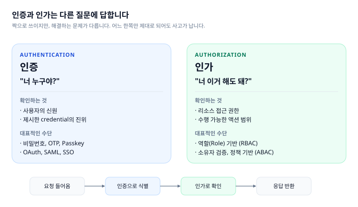
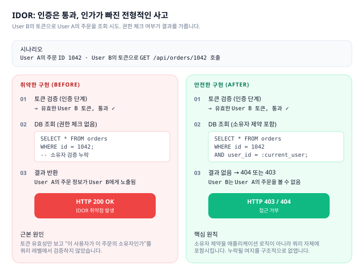
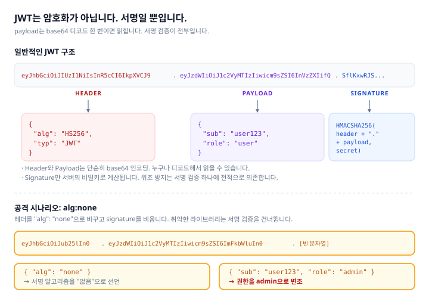
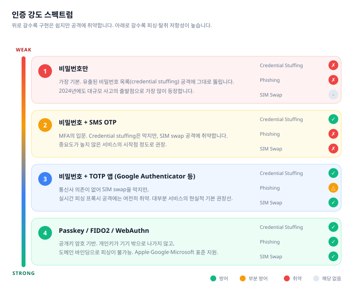

한 문장으로 시작합니다. 인증은 통과했는데 인가가 빠진다. 이 한 줄짜리 실수가 지난 5년 동안 가장 많은 데이터 유출을 만들었습니다.

---

## 왜 이 두 가지를 같이 다루는가

OWASP Top 10 2025년판에서 **Broken Access Control(A01)이 1위**, **Authentication Failures(A07)가 7위**입니다. 순위는 다르지만 두 카테고리는 사실상 한 묶음으로 움직입니다. 서비스에서 실제로 사고가 터질 때, 대부분 이 두 레이어가 동시에 혹은 순차적으로 무너집니다.

공격자의 관점에서 생각해보면 명확해집니다. **인증이 뚫리면(A07) 그 순간부터 그 사용자로 모든 걸 할 수 있습니다.** 어떤 권한이든 그 사용자가 가진 것을 상속받기 때문에, 이후의 모든 인가 체크는 무용지물이 됩니다. 반대로 **인증은 멀쩡해도 인가가 느슨하면(A01)**, 일반 사용자가 관리자 데이터를 꺼내가거나 남의 주문을 조회할 수 있습니다.

그래서 이 시리즈의 첫 본편을 두 카테고리로 시작합니다. 인증을 먼저 제대로 이해하고, 인가로 넘어가는 흐름이 더 자연스럽지만, 구성상 **OWASP 번호 순서를 따라 A01 → A07** 순으로 다루겠습니다. 단, 개념 정리는 인증부터 시작하는 것이 편합니다.

---

## 인증과 인가는 다른 질문에 답합니다

한국어 표현만 들으면 거의 같은 말처럼 들리지만, 두 개념은 완전히 다른 문제를 해결합니다.

**인증(Authentication)**은 "이 요청을 보낸 사람이 누구인지"를 확인합니다. 로그인 과정이 대표적입니다. 제시된 자격증명(비밀번호, OTP, 인증서 등)이 시스템에 등록된 사용자와 일치하는지를 검증합니다. 결과는 "이 요청은 user_id 123번 사용자의 것"이라는 식별입니다.

**인가(Authorization)**는 "식별된 사용자가 이 요청을 수행할 권한이 있는지"를 확인합니다. 일반 사용자가 관리자 페이지에 들어갈 수 없어야 하고, 내가 남의 주문을 조회할 수 없어야 하며, 읽기 권한만 있는 사람이 삭제를 할 수 없어야 합니다.



두 단계는 **순서가 중요**합니다. 인증 없이 인가는 무의미하고, 인증만 하고 인가를 빼먹으면 "유효한 사용자는 뭐든 할 수 있는" 시스템이 됩니다. 후자의 실수가 바로 A01의 본질입니다.

---

## A01. Broken Access Control

### 깨진 접근 제어의 정체

OWASP Top 10에서 **2021년부터 5년 내내 1위**를 지키고 있는 카테고리입니다. 2025년판에서는 2021년의 A10 SSRF(Server-Side Request Forgery)까지 흡수해서 더 넓어졌습니다. 테스트된 애플리케이션의 **평균 3.73%가 이 카테고리의 취약점을 가지고 있다**는 것이 OWASP의 집계입니다.

통계보다 중요한 건 **왜 자동화 도구로 잘 잡히지 않는가**입니다. SQL Injection은 따옴표 하나만 넣어도 에러가 터져서 스캐너가 쉽게 탐지합니다. 그런데 접근 제어 결함은 **정상적인 200 OK 응답으로 위장**됩니다. 스캐너가 "이 응답은 에러인가?" 라는 기준으로만 판단하면 이 카테고리 전체를 놓칩니다.

결국 이 영역은 **수동 테스트와 설계 리뷰**에 크게 의존합니다. 그래서 더 자주, 더 치명적으로 등장합니다.

### 실제 사례

**First American Financial (2019)**: 미국 최대 부동산 금융 서비스 중 하나. 문서 조회 URL의 숫자 ID를 하나씩 바꾸면 남의 계약서, 은행 계좌 정보, 사회보장번호가 그대로 노출됐습니다. **누적 8억 8천만 건의 금융 문서**가 인증된 사용자 누구에게나 열려 있었습니다. 코드 버그 하나 없었고, 단지 "소유자 확인"이라는 한 줄이 빠졌을 뿐이었습니다.

**USPS (2018)**: 미국 우편 서비스 웹사이트. 패키지 추적 API가 요청자가 실제 수신자인지 확인하지 않아, 로그인한 누구든 **약 6천만 건의 다른 사용자 계정 정보**를 열람할 수 있었습니다.

이 두 사건의 공통점은 **똑똑한 공격이 아니라 단순한 ID 변조**였다는 점입니다. URL의 숫자를 바꾸거나 API 파라미터를 건드리는 수준이었습니다.

### 주요 유형

**IDOR (Insecure Direct Object Reference)**

가장 흔한 유형입니다. URL·파라미터·요청 body에 노출된 리소스 식별자를 바꿔서 남의 리소스에 접근합니다.

```
GET /api/orders/1042  → 내 주문
GET /api/orders/1043  → 옆 사람 주문? (취약하다면 Yes)
```

권한 체크 없이 **"토큰이 유효하면 DB에서 바로 꺼내 주는"** 패턴에서 발생합니다.



**수평 권한 상승 (Horizontal Privilege Escalation)**

같은 등급의 다른 사용자 리소스에 접근하는 경우. IDOR과 대부분 겹치지만, 개념상 "같은 권한 수준에서 옆집 리소스"라는 점이 특징입니다.

**수직 권한 상승 (Vertical Privilege Escalation)**

낮은 권한이 높은 권한의 기능을 수행하는 경우. 일반 사용자가 관리자 API를 호출하거나, 읽기 권한만 있는 사용자가 삭제 API를 호출하는 식입니다. 요청 body에 `role: "admin"` 같은 필드를 끼워 넣어 변조하는 **mass assignment** 공격과도 연결됩니다.

**SSRF (Server-Side Request Forgery)**

2025년판에서 A01로 편입된 새 식구입니다. 서버가 사용자 입력으로 지정된 URL에 요청을 보내게 만드는 공격입니다. 클라우드 환경에서 특히 위험한데, **내부 메타데이터 엔드포인트**에 접근할 수 있기 때문입니다.

```bash
# AWS EC2 인스턴스 메타데이터 - IAM 자격증명 반환
http://169.254.169.254/latest/meta-data/iam/security-credentials/

# GCP
http://metadata.google.internal/computeMetadata/v1/

# Azure
http://169.254.169.254/metadata/instance?api-version=2021-02-01
```

URL을 받아서 서버가 내부적으로 fetch하는 기능(이미지 프록시, 웹훅, URL preview, PDF 생성 등)이 있다면 반드시 점검 대상입니다. 성공하면 공격자가 **서버의 클라우드 자격증명**을 훔쳐 전체 인프라에 접근할 수 있습니다.

### 어떻게 확인하는가

**IDOR 수동 테스트가 가장 중요합니다.** 자동 스캐너가 못 잡는 영역이라 개발자가 직접 확인해야 합니다.

두 사용자 계정(User A, User B)을 준비합니다. 동일 등급이면 충분합니다.

```bash
# 1. User A로 로그인하여 토큰 획득, 주문 생성 후 ID 확인 (예: 1042)
# 2. User B로 로그인하여 토큰 획득
# 3. User B의 토큰으로 User A의 주문을 조회 시도

curl -i https://api.example.com/orders/1042 \
  -H "Authorization: Bearer <USER_B_TOKEN>"

# 기대 응답: 403 Forbidden 또는 404 Not Found
# 200 OK가 떨어지고 User A의 데이터가 보이면 IDOR 취약점
```

인접 ID도 같이 테스트합니다. `1041`, `1043` 등. UUID라도 **권한 체크가 없으면 여전히 취약**합니다. UUID는 추측 난이도만 올릴 뿐이지, 유출되면 바로 뚫립니다.

**권한 상승 테스트**는 일반 사용자 토큰으로 관리자 전용 API를 호출해봅니다.

```bash
# 관리자 전용이어야 할 API를 일반 사용자 토큰으로 호출
curl -i https://api.example.com/admin/users \
  -H "Authorization: Bearer <REGULAR_USER_TOKEN>"

# 기대: 403 Forbidden. 200이면 수직 권한 상승 취약점.
```

**Mass assignment 테스트**는 요청 body에 허용되지 않은 필드를 끼워 넣습니다.

```bash
# 사용자가 자기 프로필을 업데이트하는 API에 role 필드 슬쩍
curl -i -X PATCH https://api.example.com/users/me \
  -H "Authorization: Bearer <USER_TOKEN>" \
  -H "Content-Type: application/json" \
  -d '{"name": "Test", "role": "admin", "is_verified": true}'

# 응답 후 role이 실제로 admin으로 바뀌었는지 확인
```

**SSRF 테스트**는 URL을 받는 기능에 내부 주소를 넣어봅니다.

```bash
# 예: 이미지 URL을 받아 썸네일을 생성하는 기능
curl -X POST https://api.example.com/thumbnail \
  -d '{"url": "http://169.254.169.254/latest/meta-data/"}'

# 응답에 AWS 메타데이터가 포함되면 치명적 SSRF
# 차단되는 정도를 측정: http://127.0.0.1, http://localhost, DNS rebinding 등
```

### 조치와 그 이유

**기본값을 "거부"로 설정합니다.**

권한이 필요한 엔드포인트마다 개별적으로 체크를 추가하는 방식은 **누락이 반드시 생깁니다.** 대신 프레임워크 레벨의 전역 미들웨어로 "모든 엔드포인트는 기본적으로 인증과 인가 검증을 거친다"로 두고, 공개 API만 명시적으로 화이트리스트합니다. 실수해도 "공개가 기본"이 아니라 "차단이 기본"이 되는 구조입니다.

**소유자 제약을 쿼리에 포함시킵니다.**

```sql
-- 취약: 권한 체크가 애플리케이션 로직에 의존
SELECT * FROM orders WHERE id = ?

-- 안전: 소유자 제약이 쿼리에 포함되어 구조적으로 누락 불가
SELECT * FROM orders WHERE id = ? AND user_id = ?
```

왜 쿼리 레벨이 중요할까요? **애플리케이션 로직은 언젠가 누락**됩니다. 비슷한 API가 10개 있으면 그중 한 곳에서는 체크를 빼먹습니다. 하지만 DB 쿼리에 소유자 조건을 넣어두면, 설사 애플리케이션 로직에서 권한 체크를 빼먹어도 **DB가 빈 결과를 돌려주기 때문에** 사고가 나지 않습니다. Defense in Depth의 실전 적용입니다.

**식별자를 불투명하게 합니다.**

순차 증가 ID(`1, 2, 3...`)는 존재 자체가 공격 표면입니다. UUID나 짧은 해시 ID를 쓰면 추측 기반 IDOR의 난이도가 올라갑니다. 다만 이건 **보조 방어선일 뿐** 주 방어선이 아닙니다. UUID라도 유출되면 그만이므로, 권한 체크는 반드시 별도로 수행합니다.

**SSRF는 출력지 화이트리스트가 기본입니다.**

사용자가 입력한 URL로 서버가 요청을 보낼 때, "어디에 보낼 수 있는지"를 화이트리스트로 제한합니다.

- 내부 IP 대역 차단: `127.0.0.0/8`, `10.0.0.0/8`, `172.16.0.0/12`, `192.168.0.0/16`, `169.254.0.0/16`
- 허용 도메인 명시적 목록
- DNS resolve 결과까지 검증 (DNS rebinding 방어)
- 가능하면 SSRF 방어 전용 라이브러리 사용 (Python의 `requests` + 검증 래퍼 등)

### 체크리스트

- [ ] 기본값이 "거부"인 권한 체크 구조 (미들웨어 또는 프레임워크 레벨)
- [ ] DB 쿼리에 소유자 제약이 포함됨
- [ ] 동일 등급 사용자 간 IDOR 테스트 통과 (수동 확인)
- [ ] 일반 사용자 토큰으로 관리자 API 호출 시 403
- [ ] Mass assignment 방지: 허용 필드 명시적 화이트리스트
- [ ] URL을 받는 기능에 SSRF 방어 적용
- [ ] 내부 IP 대역과 메타데이터 엔드포인트 차단
- [ ] CORS 설정에서 Origin을 echo하지 않음

### 더 파고들 포인트

**Race Condition 기반 권한 우회.** 단일 쿠폰을 동시에 여러 번 사용하거나, 잔액 초과 출금을 동시 요청으로 뚫는 시나리오. 동일 요청 50~100개를 동시에 발사해서 테스트합니다. Burp Suite의 Turbo Intruder가 대표 도구이고, `xargs -P` + `curl`로도 간단히 재현 가능합니다.

**JWT 알고리즘 혼동 공격.** JWT에서 RS256(비대칭)을 쓰는 서비스에서, 공격자가 공개키를 HS256(대칭)의 시크릿으로 재서명하는 공격. 라이브러리가 알고리즘을 헤더에서만 읽고 검증하지 않으면 뚫립니다.

**GraphQL의 필드 단위 권한.** REST와 달리 GraphQL은 한 쿼리에 수십 개 필드를 묶을 수 있어 필드 단위 인가가 필요합니다. "이 사용자는 `User.email`은 볼 수 있지만 `User.salary`는 볼 수 없다"는 식의 세밀한 제어가 빠지기 쉽습니다.

---

## A07. Authentication Failures

### 인증 실패의 정체

OWASP에서 2021년판 **"Identification and Authentication Failures"**로 있다가 2025년판에서 **"Authentication Failures"**로 이름이 축약됐습니다. 범주에는 큰 변화가 없고, 여전히 "너 누구야"를 제대로 확인하지 못하는 실수들을 포괄합니다.

표준 프레임워크와 라이브러리가 성숙해지면서 **처음부터 직접 구현하는 경우는 줄었지만**, 여전히 통합 지점과 커스텀 로직에서 사고가 발생합니다. 특히 JWT, 세션 관리, 비밀번호 리셋 플로우, MFA 우회 같은 영역이 대표적입니다.

### 실제 사례

**T-Mobile (2021)**: 약한 API 인증과 MFA 미적용이 결합되어 **5,400만 건의 고객 개인정보**가 유출. 공격자는 노출된 테스트 API를 통해 인증을 우회했습니다.

**Credential Stuffing의 일상화**: 다른 사이트에서 유출된 ID/비밀번호 조합을 자동화된 봇이 수많은 서비스에 대입하는 공격. 하루에도 수십억 건이 발생하며, MFA가 없는 계정은 사실상 시간 문제입니다. HaveIBeenPwned 같은 서비스가 수집한 유출 계정은 누적 100억 건이 넘습니다.

**JWT 공격 사례**: alg:none 공격으로 유명 라이브러리들이 한때 취약했고, RS256/HS256 알고리즘 혼동 공격도 다수의 CVE로 등록돼 있습니다. 라이브러리만 믿고 쓰기에는 너무 자주 등장합니다.

### 세션 vs 토큰 기반 인증

인증 상태를 어떻게 유지할 것인가. 이 선택이 이후의 모든 보안 결정을 좌우합니다.



**세션 기반**은 서버가 세션 데이터를 저장하고, 클라이언트에는 세션 ID만 쿠키로 전달합니다. 서버가 **Stateful**하기 때문에 즉시 무효화가 가능하고, 세션 정보 변경도 자유롭습니다. 대신 서버 상태 관리가 필요해서 수평 확장 시 Redis 같은 공유 세션 저장소가 필요합니다.

**토큰 기반(JWT)**은 토큰 자체에 사용자 정보와 서명을 담습니다. 서버는 매 요청마다 서명만 검증하기 때문에 **Stateless**하고, 수평 확장이 자유롭습니다. 대신 **즉시 무효화가 어렵습니다** — 토큰이 만료될 때까지는 서명이 유효하기 때문입니다.

어느 쪽이 더 안전한가의 문제가 아니라 **어느 쪽이 내 상황에 맞는가**의 문제입니다. 관리자 페이지나 민감한 작업이 많으면 즉시 무효화가 쉬운 세션이, 모바일 앱·SPA·마이크로서비스는 JWT가 자연스럽습니다.

### JWT의 함정

JWT는 많은 개발자가 "JWT = 안전하다"고 오해하는 영역입니다. 가장 먼저 바로잡아야 할 것은 **JWT는 암호화가 아니라 서명이라는 사실**입니다.



JWT는 `header.payload.signature` 세 부분으로 구성됩니다. 이 중 **header와 payload는 단순 base64 인코딩**입니다. 암호화가 아닙니다. jwt.io에 토큰을 붙여 넣으면 누구나 내용을 읽을 수 있습니다. **JWT payload에 비밀번호, API 키, 개인정보를 넣지 마세요.** 토큰이 새면 그대로 노출됩니다.

위조 방지는 전적으로 **signature 검증** 하나에 달려 있습니다. 그래서 다음 세 가지가 특히 중요합니다.

**alg:none 공격 방어**: 일부 라이브러리는 헤더에 `"alg": "none"`이라고 써져 있으면 서명 검증을 건너뜁니다. 공격자가 payload를 `{"role": "admin"}`으로 바꾸고 서명 부분을 비워서 보내면 관리자 권한을 획득합니다. 2015년에 대대적으로 공개된 이래 많은 라이브러리가 패치됐지만, 직접 구현하거나 오래된 버전을 쓰면 여전히 위험합니다. **사용 중인 JWT 라이브러리가 alg:none을 거부하는지** 반드시 테스트하세요.

**알고리즘 혼동 공격 방어**: RS256(비대칭)을 쓰는 서비스의 공개키를 HS256(대칭)의 시크릿으로 사용해 재서명하는 공격. 검증 시 알고리즘을 **토큰 헤더에서 읽지 말고 서버가 지정**해야 합니다.

```javascript
// 취약: 토큰 헤더의 알고리즘을 그대로 신뢰
jwt.verify(token, secretOrKey);

// 안전: 서버가 알고리즘을 명시적으로 지정
jwt.verify(token, publicKey, { algorithms: ['RS256'] });
```

**만료 시간 검증**: 토큰에 `exp` 클레임이 반드시 있어야 하고, 서버가 이를 검증해야 합니다. 유효 기간은 짧게(15분~1시간), 대신 **refresh token**으로 갱신하는 구조가 일반적입니다.

### 비밀번호 정책 - NIST 최신 가이드

오래된 지식을 업데이트할 때입니다. **NIST SP 800-63B**가 최근 개정되면서 한국 개발자들이 여전히 따르는 많은 규칙이 "하지 말라"로 바뀌었습니다.

**여전히 유효한 것**
- 최소 8자 이상, **15자 이상을 권장**
- 유출된 비밀번호 목록 대조 (HIBP API 등)
- 해시 저장: **bcrypt, argon2, scrypt** 중 하나

**이제 권장하지 않는 것**
- 복잡도 강제 (대문자 + 특수문자 + 숫자 + ...). 길이가 훨씬 중요하다는 증거가 쌓였습니다.
- **주기적 비밀번호 변경 강제.** 오히려 사용자가 `Password1!` → `Password2!` 같은 약한 변형을 만들게 만듭니다. 유출 징후가 있을 때만 강제 변경합니다.
- 보안 질문 기반 복구. 대부분의 답이 SNS에서 찾을 수 있습니다.

왜 bcrypt/argon2인가? **일부러 느린 해시**이기 때문입니다. SHA-256은 GPU로 초당 수십억 개를 계산할 수 있어 DB가 유출되면 brute force로 뚫립니다. bcrypt는 해시 하나에 0.1초 걸리도록 설계되어, 같은 공격이 **수백만 배 어려워집니다**. argon2는 여기에 메모리 사용량까지 조정 가능해 GPU 병렬 공격에 더 강합니다.

### MFA와 인증 강도 스펙트럼

MFA(Multi-Factor Authentication)는 여러 요소를 결합해 한쪽이 뚫려도 나머지가 막도록 설계하는 것입니다. 세 범주가 있습니다.

- **알고 있는 것(Knowledge)**: 비밀번호, PIN
- **가지고 있는 것(Possession)**: OTP 생성기, 인증 앱, 보안키
- **자신인 것(Inherence)**: 지문, 얼굴, 홍채

둘 이상의 **서로 다른 범주**를 결합해야 진짜 MFA입니다. 비밀번호 + 보안질문은 둘 다 "알고 있는 것"이므로 MFA가 아닙니다.



스펙트럼으로 보면 각 단계의 트레이드오프가 명확해집니다.

**비밀번호만** 쓰는 서비스는 credential stuffing에 그대로 뚫립니다. 유출된 계정 목록이 수백억 건 존재하므로, 사용자가 비밀번호를 재사용하는 순간 시간 문제입니다.

**SMS OTP**는 입문용입니다. Credential stuffing은 막지만, **SIM swap 공격**에 취약합니다. 공격자가 통신사 고객센터를 속여 피해자의 전화번호를 자기 SIM으로 옮기는 공격입니다. 중요 서비스에는 권장하지 않습니다.

**TOTP 앱**(Google Authenticator, Authy 등)은 통신사 의존이 없어 SIM swap을 막습니다. 대부분 서비스의 현실적 기본선입니다. 다만 **실시간 피싱 프록시**에는 여전히 취약합니다. 공격자가 가짜 로그인 페이지를 띄우고, 사용자가 입력한 비밀번호와 OTP를 실시간으로 진짜 사이트에 전달하는 방식입니다.

**Passkey / WebAuthn / FIDO2**가 현재 도달 가능한 최상위입니다. 공개키 암호 기반이고, 개인키가 기기를 벗어나지 않습니다. 결정적으로 **도메인에 바인딩**되어 있어 피싱 자체가 불가능합니다. 가짜 사이트에서는 Passkey가 작동하지 않습니다. Apple·Google·Microsoft가 모두 표준 지원하며, 중요 서비스일수록 빠르게 도입해야 합니다.

**MFA를 어디에 강제할 것인가**는 UX와의 트레이드오프입니다. 모든 로그인에 강제하면 이탈이 늘어납니다. 최소한 다음은 필수입니다.

- 관리자 계정 (예외 없이)
- 민감 설정 변경 (비밀번호, 이메일, MFA 설정 자체, 결제수단)
- 고위험 액션 (대금 출금, 데이터 export, 권한 부여)
- 새 기기·새 국가에서의 로그인

### 어떻게 확인하는가

**JWT 라이브러리 alg:none 취약점 테스트**

```bash
# 헤더를 alg:none으로 바꾸고 서명 부분을 빈 문자열로 만든 토큰을 생성
# 이를 Authorization 헤더로 보내서 200이 떨어지면 취약
# Python 예시:
python3 -c "
import base64, json
header = base64.urlsafe_b64encode(json.dumps({'alg':'none','typ':'JWT'}).encode()).rstrip(b'=').decode()
payload = base64.urlsafe_b64encode(json.dumps({'sub':'user123','role':'admin','exp':9999999999}).encode()).rstrip(b'=').decode()
print(f'{header}.{payload}.')
"

# 출력된 토큰을 curl -H 'Authorization: Bearer <토큰>'로 보내서 확인
```

**세션 쿠키 속성 확인**

```bash
# 로그인 후 Set-Cookie 헤더 확인
curl -c cookies.txt -i https://example.com/login \
  -d 'email=test@test.com&password=test'

grep -i "set-cookie" cookies.txt
# 또는 응답 헤더에서 직접
# 필수: HttpOnly, Secure, SameSite=Lax 또는 Strict
```

각 속성의 의미:
- **HttpOnly**: JavaScript로 쿠키 접근 불가. XSS가 터져도 세션 ID 탈취 어려움
- **Secure**: HTTPS에서만 전송. HTTP 가로채기 방지
- **SameSite=Lax/Strict**: 크로스사이트 요청 시 쿠키 전송 제한. CSRF 방어의 1차 방어선

**로그인 Rate Limit 테스트**

```bash
# hey 또는 ab로 동일 계정에 잘못된 비밀번호로 반복 시도
hey -n 100 -c 10 -m POST \
  -H "Content-Type: application/json" \
  -d '{"email":"test@example.com","password":"wrong"}' \
  https://api.example.com/login

# 일정 횟수 이후 429 Too Many Requests가 나오는지 확인
# 429가 끝까지 안 나오면 credential stuffing에 무방비
```

**X-Forwarded-For 우회 시도**

일부 구현은 IP 기반 rate limit을 하는데 `X-Forwarded-For` 헤더만 믿습니다.

```bash
# 요청마다 IP를 바꿔서 rate limit이 우회되는지 확인
for i in $(seq 1 50); do
  curl -s -H "X-Forwarded-For: 1.2.3.$i" \
    https://api.example.com/login \
    -d '{"email":"test@example.com","password":"wrong"}' \
    -o /dev/null -w "%{http_code}\n"
done
# 전부 401이면 우회됨 (rate limit 로직 결함)
# 일정 시점부터 429면 정상
```

### 조치와 그 이유

**프레임워크 기본 제공 인증 사용**

직접 구현하지 마세요. Passport.js, Spring Security, Django auth, Rails Devise, Next-Auth 등 잘 검증된 라이브러리가 있습니다. 직접 짠 JWT 검증 코드는 거의 항상 취약점을 가집니다.

**세션 ID는 로그인 직후 재발급**

Session Fixation 공격(공격자가 자기 세션 ID를 피해자에게 심고 나서 로그인시키는 공격)을 방어합니다. 대부분의 프레임워크는 기본으로 해주지만, 커스텀 구현에서 놓치는 경우가 있습니다.

**비밀번호 재설정 링크는 일회성·시간 제한**

토큰은 한 번 쓰면 무효화, 생성 후 **15~30분** 내에만 유효. 비밀번호 재설정 완료 후에는 모든 기존 세션을 무효화해서 탈취된 세션을 끊어냅니다.

**민감 작업 직전 재인증**

비밀번호 변경, 이메일 변경, MFA 설정 변경, 결제수단 추가 시점에 **현재 비밀번호를 다시 요구**합니다. 세션 탈취 상황에서 공격자가 계정 자체를 장악하는 것을 막는 마지막 방어선입니다.

### 체크리스트

- [ ] 인증은 검증된 프레임워크 기본 제공 기능 사용
- [ ] 비밀번호 해시: bcrypt, argon2, scrypt 중 하나
- [ ] JWT 사용 시: 서버가 알고리즘 명시적 지정 (`{algorithms: ['RS256']}`)
- [ ] JWT에 `exp` 만료시간 존재 및 검증
- [ ] JWT payload에 민감 정보 없음 (비밀번호·키·개인정보)
- [ ] 세션 쿠키: `HttpOnly` + `Secure` + `SameSite`
- [ ] 로그인 직후 세션 ID 재발급
- [ ] 로그아웃 시 서버 측 세션/토큰 무효화
- [ ] 로그인 실패 5~10회 초과 시 Rate Limit 적용
- [ ] `X-Forwarded-For`는 신뢰된 프록시 뒤에서만 사용
- [ ] 관리자·민감 작업에 MFA 강제
- [ ] 비밀번호 재설정 토큰: 일회성 + 만료 30분 이내
- [ ] 민감 작업 직전 재인증 요구
- [ ] HIBP 같은 유출 비밀번호 체크 도입

### 더 파고들 포인트

**Passkey 도입 준비.** 당장 전환은 어려워도 회원가입 시 "Passkey 추가" 옵션을 제공하는 수준부터 시작할 수 있습니다. WebAuthn 라이브러리(SimpleWebAuthn 등)가 성숙해서 구현 난이도가 예전보다 많이 낮아졌습니다.

**Refresh Token Rotation.** Refresh Token을 한 번 쓸 때마다 새 것으로 교체하고 이전 것은 무효화하는 패턴. Refresh Token이 탈취되어도 공격자가 먼저 사용하면 정상 사용자의 다음 요청이 실패하면서 이상을 감지할 수 있습니다.

**Device Binding.** 토큰을 발급한 기기의 지문(User-Agent, IP 대역, TLS fingerprint 등)을 기록해두고, 다른 기기에서 같은 토큰이 쓰이면 추가 인증을 요구. 토큰 탈취 방어의 마지막 레이어.

**OAuth 2.1 · PKCE 필수화.** SPA와 모바일 앱에서 OAuth를 쓴다면 PKCE(Proof Key for Code Exchange)가 기본이어야 합니다. Authorization Code 가로채기 공격 방어.

---

## 자주 묶여서 나타나는 사고 패턴

실제 사고에서는 A01과 A07이 연쇄로 터지는 경우가 많습니다. 몇 가지 전형 패턴을 정리합니다.

**패턴 1: 약한 JWT + IDOR**

JWT 서명 검증이 약한 상태(alg:none 허용 등)에서, 공격자가 `user_id`를 임의로 변조한 토큰을 만듭니다. 그 토큰으로 남의 리소스를 조회합니다. 인증이 뚫린 상태에서는 인가의 IDOR 방어가 의미 없습니다.

**패턴 2: MFA 없는 관리자 + API 키 유출**

GitHub에 실수로 올라간 관리자 API 키가 스캐너에 발견됩니다. MFA가 없으니 키 하나로 모든 걸 할 수 있습니다. 관리자 계정에 MFA가 있었다면 API 키 유출이 치명적이지 않았을 것입니다.

**패턴 3: Session Fixation + 권한 체크 누락**

공격자가 피해자에게 세션 ID를 심어놓고, 피해자가 로그인한 뒤 같은 세션으로 접근합니다. 관리자로 로그인한 피해자의 세션을 그대로 쓰게 되고, 관리 기능에서 권한 체크가 느슨하면 피해자의 권한으로 남의 데이터를 조작합니다.

**패턴 4: SSRF → 클라우드 자격증명 탈취 → 데이터 전체 탈취**

URL 처리 기능에 SSRF 취약점. 메타데이터 엔드포인트 접근. IAM 자격증명 획득. S3 버킷, DB 스냅샷, 모든 것에 접근. **한 번의 SSRF가 전체 인프라를 뚫습니다.** 2019년 Capital One 1억 건 유출의 패턴입니다.

이런 연쇄를 끊는 핵심은 **Defense in Depth** — 한 레이어가 뚫려도 다음 레이어가 막도록 설계하는 것입니다. 인증이 뚫려도 인가가 버티고, 인가가 뚫려도 쿼리 제약이 버티고, 거기도 뚫려도 WAF가 버티는 식입니다.

---

## 이번 편 체크리스트 총정리

배포 직전이나 정기 점검 시 이 리스트를 복사해서 사용하시면 됩니다.

**접근 제어 (A01)**
- [ ] 권한 체크 기본값이 "거부"
- [ ] DB 쿼리에 소유자 제약 포함
- [ ] IDOR 수동 테스트 통과
- [ ] 수직 권한 상승 테스트 통과
- [ ] Mass assignment 방지 (허용 필드 화이트리스트)
- [ ] URL 처리 기능에 SSRF 방어 적용
- [ ] 내부 IP 대역·메타데이터 엔드포인트 차단

**인증 (A07)**
- [ ] 검증된 인증 프레임워크 사용
- [ ] bcrypt/argon2/scrypt로 비밀번호 해시
- [ ] JWT: 알고리즘 서버가 명시, `exp` 검증, payload에 민감 정보 없음
- [ ] 세션 쿠키 `HttpOnly` + `Secure` + `SameSite`
- [ ] 로그인 직후 세션 재발급
- [ ] 로그인 실패 Rate Limit
- [ ] 관리자·민감 작업에 MFA 강제
- [ ] 비밀번호 재설정 토큰 일회성·시간 제한
- [ ] 민감 작업 직전 재인증

---

## 참고 자료

- OWASP. (2025). *A01:2025 – Broken Access Control*. https://owasp.org/Top10/2025/A01_2025-Broken_Access_Control/
- OWASP. (2025). *A07:2025 – Authentication Failures*. https://owasp.org/Top10/2025/A07_2025-Authentication_Failures/
- NIST. (2024). *SP 800-63B Digital Identity Guidelines*. https://pages.nist.gov/800-63-4/
- PortSwigger. *Web Security Academy — Access Control*. https://portswigger.net/web-security/access-control
- OWASP Cheat Sheet Series. *Authorization Cheat Sheet*. https://cheatsheetseries.owasp.org/cheatsheets/Authorization_Cheat_Sheet.html
- OWASP Cheat Sheet Series. *JSON Web Token for Java Cheat Sheet*. https://cheatsheetseries.owasp.org/cheatsheets/JSON_Web_Token_for_Java_Cheat_Sheet.html
- FIDO Alliance. *Passkeys Developer Resources*. https://fidoalliance.org/passkeys/

---

## 다음 편 예고

> [ep.02 - 데이터 보호의 기본기](/web-security-owasp-2025-ep-02)

인증과 인가를 제대로 세웠어도, 전송 중이거나 저장된 데이터가 그대로 노출되면 의미가 없습니다. 다음 편에서는 보안 설정 오류(A02)와 암호화 실패(A04)를 다룹니다. HTTPS와 TLS 설정, 보안 헤더, 비밀번호 저장, 키 관리, 클라우드 설정까지. "설정 한 줄의 실수가 어떻게 전체를 뒤집는지" 가 주제입니다.
