코드와 데이터를 구분하는 일. 보안 사고의 절반은 이 한 줄 문장에서 시작합니다. 사용자가 보낸 글자가 그냥 글자가 아니라 명령으로 해석되는 순간, 우리는 우리 시스템의 키를 공격자에게 넘긴 셈입니다.

---

## 왜 이 두 가지를 같이 다루는가

이번 편의 두 카테고리는 표면적으로는 다른 문제를 다루는 것처럼 보입니다. **Injection(A05)**은 사용자 입력의 처리를 다루고, **Software or Data Integrity Failures(A08)**는 코드와 데이터의 무결성 검증을 다룹니다. 그런데 한 발짝 물러나서 보면 둘 다 같은 질문에 답합니다.

**"이 데이터는 어디서 왔고, 믿어도 되는가?"**

A05는 외부에서 들어온 입력이 신뢰 영역 안에서 코드처럼 해석되는 것을 막습니다. A08은 외부에서 가져온 코드·아티팩트·데이터가 변조되지 않았는지 검증합니다. 한쪽은 들어오는 것, 다른 쪽은 끌어오는 것에 대한 이야기입니다. 핵심 개념은 같습니다. **신뢰 경계(trust boundary)**.

---

## 신뢰 경계라는 개념

코드를 짤 때 "이 변수는 안전하다"라고 가정하는 순간이 있습니다. 그 가정이 어디서부터 시작되는지 의식적으로 그어보는 것이 신뢰 경계입니다.


**신뢰할 수 없는 영역(Untrusted)**에서 들어오는 모든 것은 일단 의심합니다. 사용자가 입력한 폼 값, HTTP body·header·cookie, 업로드된 파일, URL 파라미터, 외부 API의 응답, CDN에서 불러온 스크립트, 메시지 큐 페이로드가 있습니다. 전부 "악의적이거나 변조됐을 수 있다"고 가정합니다.

**신뢰 경계(Trust Boundary)**에서 그 입력은 검증·sanitize·escape를 거칩니다. 형식이 맞는지(validate), 위험한 요소를 제거하거나 변환했는지(sanitize), 출력 컨텍스트에 맞게 이스케이프했는지(escape), 서명이 있다면 검증했는지(verify). 통과한 것만 안쪽으로 들여보냅니다.

**신뢰 영역(Trusted)** 안에서는 데이터가 검증을 통과했다고 가정하고 동작합니다. DB 쿼리 실행기, 템플릿 렌더링 엔진, 파일 시스템, 시스템 명령 실행, 객체 역직렬화, 클라우드 자격증명이 있습니다. 이 영역에서 신뢰 가정이 깨지면 사고가 터집니다.

이 구분이 명확하지 않으면 "여기서 검증했나? 아래에서 했나?" 같은 혼란이 생기고, 결국 어디선가 빠뜨립니다. 경계를 명시적으로 그어두면 책임 소재가 분명해집니다.

---

## A05. Injection

### 인젝션의 정체

**사용자 입력이 코드·쿼리·명령으로 해석되는 모든 취약점**을 묶은 카테고리입니다. SQL Injection, XSS, Command Injection, LDAP Injection, Template Injection, XXE 모두 여기에 속합니다.

20년 넘게 알려진 문제인데도 여전히 Top 10에 있는 이유가 있습니다. 새 프레임워크·새 언어·새 패러다임이 나올 때마다 같은 실수가 다른 형태로 재등장하기 때문입니다. ORM이 등장하면 raw query에서 문제가 줄지만 NoSQL에서 새로운 형태가 생기고, React·Vue가 나오면 XSS가 줄지만 `dangerouslySetInnerHTML`로 다시 등장합니다.

### 실제 사례

**Heartland Payment Systems (2008)**: SQL Injection 한 줄로 **1억 3천만 건의 신용카드 정보**가 유출. 당시 미국 최대 결제 처리 업체였습니다. 단순한 문자열 concat 쿼리 하나가 회사를 흔들었습니다.

**Polyfill.io 사태 (2024)**: 이건 인젝션이라기보다 공급망 사고지만, 결과는 XSS 형태로 나타났습니다. 수십만 사이트가 쓰던 polyfill.io 도메인이 인수되면서 **모든 폴리필 응답에 악성 스크립트가 주입**되기 시작했습니다. 그 도메인을 신뢰했던 모든 사이트가 한순간에 XSS 사이트가 됐습니다. (이 부분은 A08에서도 다시 등장합니다.)

### SQL Injection - 가장 기본이자 가장 이해해야 할 유형

SQL Injection은 인젝션의 원형입니다. 여기를 제대로 이해하면 다른 인젝션도 같은 패턴으로 풀립니다.

![SQL Injection 좌우 비교. 상단 공통 입력은 악의적 페이로드 `email = "' OR '1'='1' --"`. 왼쪽 빨강(STRING CONCAT·취약) 패널에서는 코드가 `db.query("SELECT * FROM users WHERE email = '" + email + "'")`로 문자열 연결하므로, DB가 받는 최종 쿼리는 `WHERE email = '' OR '1'='1' --`가 되어 모든 사용자가 반환되고 데이터와 코드의 경계가 무너짐. 오른쪽 초록(PREPARED STATEMENT·안전) 패널에서는 코드가 `db.query("SELECT * FROM users WHERE email = ?", [email])`로 작성되어, DB가 쿼리 구조(`WHERE = ?`)와 데이터(`'' OR '1'='1' --`)를 분리해서 받기 때문에 일치하는 사용자가 없음](sec-03-02-sql-injection.svg)

문자열 연결로 쿼리를 만들면 무엇이 문제인가? **데이터와 코드의 경계가 무너지기 때문**입니다.

```javascript
// 취약: 사용자 입력이 SQL 구조의 일부가 됨
db.query("SELECT * FROM users WHERE email = '" + email + "'");
```

`email`에 `' OR '1'='1' --`가 들어오면, DB가 받는 최종 쿼리는 다음과 같습니다.

```sql
SELECT * FROM users WHERE email = '' OR '1'='1' --'
```

`'1'='1'`은 항상 true이고, `--`는 SQL 주석이므로 뒤의 따옴표는 무시됩니다. 결과는 모든 사용자가 반환됩니다. 더 심각한 페이로드면 `'; DROP TABLE users; --`로 테이블을 통째로 날릴 수도 있습니다.

**Prepared Statement가 왜 안전한가**

```javascript
// 안전: 쿼리 구조와 데이터를 분리해서 DB에 보냄
db.query("SELECT * FROM users WHERE email = ?", [email]);
```

이 방식은 DB에 두 가지를 따로 보냅니다. 쿼리 구조(`SELECT ... WHERE = ?`)를 먼저 보내서 파싱·계획을 끝내고, 그 다음 데이터(`['' OR '1'='1' --']`)를 단순 값으로 끼워 넣습니다. **DB는 데이터 안의 SQL을 절대 쿼리로 재해석하지 않습니다.** 구조와 데이터가 구조적으로 분리되기 때문입니다.

이게 핵심입니다. "이스케이프 잘 하면 되지 않냐"는 발상의 한계가 여기서 드러납니다. 이스케이프는 **혹시 모를 누락**이 가능합니다. Prepared statement는 누락이 불가능합니다.

### XSS - 세 가지 유형, 각자 다른 방어

XSS(Cross-Site Scripting)는 브라우저에서 악성 스크립트가 실행되는 문제입니다. 서버 사이드 인젝션이 DB·OS를 노린다면, XSS는 사용자의 브라우저를 노립니다.


**Stored XSS**가 가장 위험합니다. 악성 스크립트가 DB에 저장되어, 그 페이지를 보는 **모든 방문자가 영향**을 받습니다. 댓글, 게시판, 프로필 등 사용자 입력이 저장되어 다시 출력되는 곳이 표적입니다.

**Reflected XSS**는 URL 파라미터가 응답에 그대로 반영되는 페이지에서 발생합니다. 검색 결과 페이지나 에러 메시지가 흔한 표적입니다. 피싱 링크와 결합해 특정 사용자 한 명을 노립니다.

**DOM XSS**는 서버를 거치지 않습니다. 클라이언트 JS가 URL fragment(`#`)나 `location` 데이터를 `innerHTML`에 그대로 넣을 때 발생합니다. **서버 로그에 흔적이 남지 않아 탐지가 어렵습니다.**

#### XSS로 무엇이 가능한가

XSS를 "alert 창 띄우는 것"으로만 이해하는 경우가 많은데, 실제로는 훨씬 무겁습니다.

- 세션 쿠키 탈취 (HttpOnly가 없으면)
- 사용자 권한으로 API 호출 (비밀번호 변경, 송금, 데이터 export)
- 키로깅, 가짜 로그인 폼 표시 (피싱)
- 카메라·마이크 접근 (Permissions-Policy 없으면)

**브라우저가 그 사용자로서 할 수 있는 모든 것**을 공격자가 할 수 있습니다.

#### XSS 방어

**현대 프레임워크의 자동 이스케이프를 신뢰합니다.** React, Vue, Angular는 기본값으로 사용자 입력을 안전하게 출력합니다. 문제는 우회 API들입니다.

```jsx
// 위험한 API들
<div dangerouslySetInnerHTML={{ __html: userInput }} />  // React
<div v-html="userInput"></div>                            // Vue
<div [innerHTML]="userInput"></div>                       // Angular
```

이 API들을 **반드시 써야 한다면 DOMPurify 같은 sanitizer**를 거칩니다.

```javascript
import DOMPurify from 'dompurify';
const clean = DOMPurify.sanitize(userInput);
```

**CSP가 2차 방어선입니다.** ep.02에서 다룬 Content-Security-Policy는 XSS가 발생해도 외부 서버로의 데이터 전송이나 인라인 스크립트 실행을 막습니다.

**Trusted Types**는 한 단계 더 나아갑니다. CSP에 `require-trusted-types-for 'script'`를 추가하면 DOM-XSS 대부분이 차단됩니다 (Chromium 기반 브라우저).

### Command Injection

```python
# 취약
os.system(f"convert {user_input} output.png")
# user_input = "image.png; rm -rf /" 면 서버 파괴
```

해결: 시스템 명령을 직접 실행하는 대신 언어 기본 라이브러리를 씁니다. 불가피하면 shell을 거치지 않는 방식으로:

```python
# 안전
subprocess.run(
    ["convert", user_input, "output.png"],
    shell=False,  # shell 해석 우회
    check=True
)
```

`shell=False`가 핵심입니다. 인자를 배열로 전달하면 shell이 `;`나 `|` 같은 메타 문자를 해석하지 않습니다.

### NoSQL Injection

MongoDB 같은 NoSQL DB에서도 인젝션이 있습니다. 형태가 다릅니다.

```javascript
// 취약: 사용자 입력을 그대로 query 객체로
db.users.findOne({ email: req.body.email, password: req.body.password });

// 공격자가 보내는 body:
// { "email": "alice@example.com", "password": { "$ne": null } }
// → password가 null이 아닌 모든 사용자에 매치 → 로그인 우회
```

해결: 입력 타입 검증. 문자열을 기대하는 자리에 객체가 오면 거부.

```javascript
if (typeof req.body.password !== 'string') {
  return res.status(400).send('Invalid input');
}
```

### SSTI (Server-Side Template Injection)

템플릿 엔진이 사용자 입력을 **템플릿 코드로 해석**하는 문제입니다. 이메일 템플릿 커스터마이징, 랜딩페이지 빌더 같은 기능에서 자주 발생합니다.

```
{{7*7}}      ← Jinja2, Twig 등
${7*7}       ← FreeMarker, Velocity
<%= 7*7 %>   ← ERB, EJS
```

응답에 `49`가 찍히면 서버가 사용자 입력을 평가하고 있다는 뜻입니다. 심하면 RCE까지 갈 수 있습니다.

해결: 사용자 입력을 템플릿 문법으로 받지 말 것. 데이터로만 받고 템플릿 로직은 개발자가 작성한 것만 실행.

### XXE (XML External Entity)

XML 파서가 외부 엔티티 참조를 해석해서 서버 로컬 파일을 읽거나 SSRF를 일으키는 공격입니다. 요새는 XML API가 줄어서 덜 보이지만 레거시·SOAP·SAML에서 자주 등장합니다.

해결: 파서 설정에서 외부 엔티티 비활성화 명시.

```python
from defusedxml import ElementTree as ET
# defusedxml은 XXE 방어가 기본 활성화된 래퍼
```

### 어떻게 확인하는가

**SQL Injection 기본 테스트**

```bash
# 단일 따옴표 삽입 — 에러가 나면 의심
curl "https://example.com/search?q=test'"

# sqlmap (자신의 서비스에만 사용)
sqlmap -u "https://example.com/search?q=test" --batch --level=2 --risk=2
```

**XSS 반사 테스트**

검색, 에러 메시지, 404 페이지 등 사용자 입력이 그대로 렌더되는 곳 위주로 페이로드를 넣어봅니다.

```
<script>alert(1)</script>
"><svg onload=alert(1)>
javascript:alert(1)
'>
```

**파일 업로드 위장 테스트**

```bash
# 1. 확장자만 바꾼 위장 파일
cp shell.php shell.jpg
# 업로드 후 실제로 실행되는지 확인

# 2. 매직바이트 위장
printf '\xFF\xD8\xFF\xE0<?php system($_GET["c"]);?>' > fake.jpg

# 3. 이중 확장자
cp shell.php shell.php.jpg

# 4. SVG에 스크립트 삽입
cat > evil.svg <<EOF
<svg xmlns="http://www.w3.org/2000/svg">
  <script>alert(1)</script>
</svg>
EOF
```

**SSTI 테스트**

```
{{7*7}} 또는 ${7*7}을 사용자 입력 자리에 넣어 49가 출력되는지 확인
```

### 조치 정리

**SQL**: ORM 또는 prepared statement 사용. 문자열 concat 쿼리 절대 금지. raw query를 써야 한다면 ORM이 제공하는 안전한 raw API 사용 (Sequelize의 `sequelize.query` with `replacements`, Prisma의 `$queryRaw` with `Prisma.sql` 템플릿 등)

**XSS**: 프레임워크 자동 이스케이프 기본 활용 + 우회 API 전수 검토 + DOMPurify + CSP

**Command**: shell 사용 금지, args 배열 형태로 전달

**NoSQL**: 입력 타입 화이트리스트 검증

**Template**: 사용자 입력을 데이터로만 처리, 템플릿 문법으로 처리하지 않기

**파일 업로드**: 확장자 + MIME + 매직바이트 삼중 검증, 업로드 경로와 실행 경로 분리, 파일명 서버에서 재생성, 업로드 영역은 별도 도메인 또는 S3

### 입력 검증은 화이트리스트가 기본

"이런 문자는 금지"는 항상 우회됩니다. "이런 형식만 허용"이 정답입니다. 이메일은 이메일 형식, 전화번호는 숫자와 기호 패턴, ID는 영숫자만, 허용 집합을 좁히는 것이 블랙리스트보다 훨씬 강합니다.

### A05 체크리스트

- [ ] 모든 SQL 쿼리에 prepared statement 또는 ORM 사용
- [ ] 템플릿 자동 이스케이프 활성화
- [ ] `dangerouslySetInnerHTML`/`v-html` 사용처 전수 검토 + DOMPurify
- [ ] CSP 적용 (Report-Only부터)
- [ ] 파일 업로드: 확장자·MIME·매직바이트 삼중 검증
- [ ] 업로드 파일은 실행 불가 경로 또는 별도 도메인
- [ ] 시스템 명령 실행: shell 우회, args 배열 전달
- [ ] NoSQL 쿼리: 입력 타입 검증
- [ ] 템플릿 엔진: 사용자 입력을 데이터로만 처리
- [ ] XML 파서: 외부 엔티티 비활성화
- [ ] 입력 검증은 화이트리스트 방식
- [ ] Open Redirect 방지: 리다이렉트 URL 화이트리스트

### 더 파고들 포인트

**Prototype Pollution (Node.js)**. `Object.assign`이나 `_.merge` 등에 `__proto__`, `constructor.prototype` 키가 포함된 페이로드를 전달해 전역 객체 프로토타입을 오염시키는 공격. `Object.freeze(Object.prototype)` 또는 `--disable-proto=delete` 옵션으로 방어.

**WAF는 보조 수단**. WAF(Web Application Firewall)가 인젝션 패턴을 막아주지만 이건 마지막 방어선이지 첫 번째가 아닙니다. 애플리케이션 코드에서 근본적으로 막지 않으면 WAF 우회 기법에 당합니다. WAF가 있다고 prepared statement를 안 써도 된다는 뜻이 아닙니다.

---

## A08. Software or Data Integrity Failures

### 무결성 실패의 정체

A03(Software Supply Chain Failures)이 "공급망 전체"를 본다면, A08은 **"내 시스템에서 실행·저장되는 것의 무결성 검증"**에 초점을 맞춥니다. A03이 외부에서 들어올 때 문제이고, A08은 내부에서 처리할 때 문제입니다. 이렇게 구분하면 이해가 쉽습니다.

요약하면: **"이 코드·데이터가 변조되지 않았음을 증명할 수 있는가?"**

### 실제 사례

**SolarWinds (2020)**. 빌드 시스템 자체가 침투되어 공식 업데이트에 백도어가 삽입됐습니다. 정식 서명까지 붙어 배포되어 **전 세계 18,000개 조직**이 자동 업데이트를 통해 백도어를 받았습니다. "공식 채널"의 신뢰가 무너진 사건.

**Polyfill.io (2024)**. CDN으로 제공되던 폴리필 라이브러리의 도메인이 인수되었고, 그 후 응답에 악성 코드가 추가됐습니다. 수십만 사이트가 영향받았습니다. 핵심 교훈은 **"오늘 신뢰한 외부 스크립트가 내일 적이 될 수 있다"**.

**event-stream npm 패키지 (2018)**. 인기 npm 패키지의 유지보수자가 권한을 신원 불명의 사람에게 넘겼고, 다음 릴리스에 암호화폐 지갑 탈취 코드가 포함됐습니다.

### 역직렬화 - 가장 기술적인 위험

A08의 대표적이고 기술적인 케이스가 **insecure deserialization**입니다.


핵심은 **JSON은 데이터만, Pickle/Java 직렬화는 코드까지 복원한다**는 점입니다.

```python
# 안전: JSON은 데이터 구조만 복원
import json
user = json.loads(input_string)  # 메모리에 단순 dict 생성

# 위험: pickle은 객체 복원 중 코드 실행 가능
import pickle
user = pickle.loads(input_bytes)  # 조작된 입력이면 RCE
```

Python pickle, Java ObjectInputStream, PHP unserialize, Ruby Marshal, 이들은 객체 복원 과정에서 임의 클래스의 `__reduce__`, `readObject` 같은 메소드를 실행할 수 있습니다. 공격자가 조작된 페이로드를 만들면 **`os.system("rm -rf /")`** 같은 명령이 그대로 실행됩니다.

**원칙**: 외부에서 받는 데이터(쿠키, 헤더, URL 파라미터, 파일)는 **절대 역직렬화 형식으로 받지 마세요**. JSON처럼 데이터만 다루는 포맷을 씁니다.

내부 메시지 큐 같은 통제된 경로라면 사용 가능하지만, 그 경로도 **HMAC 서명으로 무결성을 검증**해야 합니다.

```python
import hmac, hashlib, pickle

# 보낼 때
data = pickle.dumps(payload)
signature = hmac.new(secret_key, data, hashlib.sha256).hexdigest()

# 받을 때 — 서명 검증 후에만 역직렬화
expected = hmac.new(secret_key, data, hashlib.sha256).hexdigest()
if hmac.compare_digest(signature, expected):  # timing attack 방지 비교
    payload = pickle.loads(data)
```

`hmac.compare_digest`를 쓰는 이유: 일반 `==` 비교는 문자별로 짧게 끝나서 **timing attack**으로 서명 추측이 가능합니다. compare_digest는 항상 일정 시간 비교를 합니다.

### 외부 스크립트 무결성 - SRI

CDN에서 불러오는 외부 스크립트는 **SRI(Subresource Integrity)** 로 보호합니다.


원리는 단순합니다. 스크립트의 해시를 HTML에 적어두면, 브라우저가 다운로드 후 해시를 검증합니다. 안 맞으면 실행을 거부합니다.

```html
<!-- 취약: CDN이 변조되면 그대로 실행 -->
<script src="https://cdn.example.com/lib.js"></script>

<!-- 안전: 해시 불일치 시 실행 거부 -->
<script
  src="https://cdn.example.com/lib.js"
  integrity="sha384-oqVuAfXRKap7fdgcCY5uykM6+R9GqQ8K/uxy9rx7HNQlGYl1kPzQho1wx4JwY8wC"
  crossorigin="anonymous"></script>
```

해시 생성:
```bash
# 로컬 파일에서
openssl dgst -sha384 -binary lib.js | openssl base64 -A

# 또는 srihash.org에서 자동 생성
```

**근본적인 질문도 있습니다**: 정말 그 외부 스크립트가 필요한가? GA, 태그매니저, 챗봇 위젯, 광고 SDK. 각각이 우리 사이트 전체 권한을 가집니다. **필요한 것만 남기고, 가능하면 self-hosting**을 검토하는 게 더 좋습니다.

### CI/CD 파이프라인 무결성

빌드 결과물은 어떻게 신뢰할 수 있는가? 한 번 CI/CD를 장악하면 코드 PR 리뷰를 우회해서 프로덕션에 임의 코드를 배포할 수 있습니다.

**위험 요소들**

- 워크플로우 파일(`.github/workflows/*.yml`) 변경에 추가 승인 없음
- 외부 GitHub Action을 버전 태그로만 참조 (태그는 변경 가능)
- 빌드 환경에 long-lived 자격증명 (`AWS_ACCESS_KEY` 등)
- 프로덕션 배포 권한이 다수에게

**대응**

```yaml
# 외부 액션을 commit SHA로 고정 (태그가 아닌)
- uses: actions/checkout@b4ffde65f46336ab88eb53be808477a3936bae11  # v4.1.1
  # @v4 같은 태그는 silent하게 변경될 수 있음

# 권한을 최소화 (default-write 대신 필요한 것만)
permissions:
  contents: read
  pull-requests: write
```

**OIDC 기반 임시 자격증명**으로 long-lived 키 제거:

```yaml
permissions:
  id-token: write  # OIDC 토큰 발급 권한

steps:
  - uses: aws-actions/configure-aws-credentials@v4
    with:
      role-to-assume: arn:aws:iam::123456789:role/GitHubActions
      aws-region: ap-northeast-2
      # 이 role은 GitHub Actions OIDC만 신뢰. 키 노출 위험 없음.
```

### 코드 서명 (Code Signing)

배포 아티팩트에 개발자 개인키로 서명하고, 사용자(또는 다음 단계)가 공개키로 검증합니다. 중간에 변조되면 서명 불일치로 실행 거부됩니다.

- **컨테이너**: Sigstore / Cosign으로 이미지 서명
- **OS 패키지**: GPG 서명
- **데스크톱 앱**: Apple Developer ID, Windows Authenticode

```bash
# Cosign으로 컨테이너 이미지 서명
cosign sign --key cosign.key your-registry/your-app:v1.0.0

# 검증
cosign verify --key cosign.pub your-registry/your-app:v1.0.0
```

### 자동 업데이트의 함정

자동 업데이트 기능이 HTTPS로만 다운로드하고 **서명 검증을 하지 않으면**, 같은 네트워크의 공격자(또는 DNS 조작)로 가짜 업데이트 배포가 가능합니다. 업데이트 메커니즘은 반드시 서명 검증을 포함해야 합니다.

### A08 체크리스트

- [ ] 외부 입력에 역직렬화(pickle, ObjectInputStream 등) 사용 금지
- [ ] 내부 메시지 큐도 HMAC 서명 검증 후 역직렬화
- [ ] HMAC 비교는 timing-safe 함수 사용 (`hmac.compare_digest` 등)
- [ ] 외부 스크립트에 SRI 적용
- [ ] 외부 스크립트 최소화 또는 self-hosting 검토
- [ ] CI/CD 외부 액션은 commit SHA로 고정
- [ ] CI/CD에 OIDC 기반 임시 자격증명
- [ ] 워크플로우 파일 변경 별도 승인 정책
- [ ] 컨테이너 이미지·아티팩트 서명 (Sigstore/Cosign)
- [ ] 자동 업데이트는 서명 검증 포함

### 더 파고들 포인트

**SLSA (Supply-chain Levels for Software Artifacts)**. Google이 주도하는 공급망 보안 프레임워크. Level 1~4로 단계적 적용 가능. 빌드 출처(provenance) 증명, 빌드 환경 격리, 양방향 검증 등을 표준화. https://slsa.dev

**npm provenance**. npm 9+ 에서 `--provenance` 플래그로 패키지 빌드 출처를 서명. `npm publish --provenance`로 배포한 패키지는 npmjs.com에 "Built and signed on a public CI/CD" 배지가 표시됩니다.

**in-toto**. 빌드 파이프라인의 모든 단계를 검증 가능하게 기록하는 프레임워크. SLSA보다 한 단계 더 세밀.

**Dependency confusion 재방문**. ep.04에서 다룰 공급망 카테고리와 일부 겹칩니다. 내부 패키지 이름이 public registry에 없으면 공격자가 같은 이름으로 등록해 빌드를 오염시킬 수 있다는 패턴. scoped name(`@yourorg/xxx`)이 기본 방어.

---

## 자주 묶여서 나타나는 사고 패턴

A05와 A08도 연쇄로 터지는 경우가 많습니다.

**패턴 1: XSS → CDN 스크립트 변조**

자체 코드에는 XSS가 없는데, CDN에서 불러온 외부 스크립트가 변조되어 우리 사이트에서 실행됩니다. SRI가 없으면 우리는 변조 사실조차 알 수 없습니다. polyfill.io 사태가 이 패턴.

**패턴 2: 역직렬화 → RCE → 자격증명 탈취**

쿠키나 세션 데이터에 pickle을 사용하는 레거시 시스템. 공격자가 조작된 쿠키를 보내 RCE 획득. 그 후 환경변수에서 AWS 자격증명을 읽어 클라우드 인프라 전체로 확산.

**패턴 3: SQL Injection → DB 유출 → 다른 서비스 침투**

DB에 저장된 비밀번호 해시(약한 알고리즘이면 더욱), 토큰, 내부 API 키가 모두 유출됩니다. 한 시스템의 인젝션 한 곳이 다른 시스템의 인증 우회로 이어집니다.

**패턴 4: CI/CD 침투 → 정식 서명된 악성 배포**

빌드 시스템 권한 획득. 코드 자체는 깨끗하지만 빌드 과정에서 악성 코드 주입. 정상 서명까지 붙어서 배포. SolarWinds 패턴. 사용자는 "공식 업데이트"로 받기 때문에 의심하지 않습니다.

이런 연쇄가 가능한 이유는 **신뢰의 전이성** 때문입니다. A를 신뢰하면 A가 신뢰하는 B도 신뢰하게 됩니다. 신뢰 경계를 명시적으로 그어두지 않으면 연쇄가 멀리 갑니다.

---

## 이번 편 체크리스트 총정리

**인젝션 (A05)**
- [ ] SQL: prepared statement / ORM
- [ ] XSS: 자동 이스케이프 + 우회 API 검토 + CSP
- [ ] Command: shell 우회, args 배열 전달
- [ ] NoSQL: 입력 타입 화이트리스트
- [ ] Template: 사용자 입력을 데이터로만 처리
- [ ] XML: 외부 엔티티 비활성화
- [ ] 파일 업로드 삼중 검증
- [ ] Open Redirect 화이트리스트

**무결성 (A08)**
- [ ] 외부 입력 역직렬화 금지
- [ ] 내부 역직렬화도 HMAC 서명 검증
- [ ] timing-safe 비교 사용
- [ ] 외부 스크립트에 SRI
- [ ] 외부 스크립트 최소화 / self-hosting
- [ ] CI/CD 액션 commit SHA 고정
- [ ] OIDC 기반 임시 자격증명
- [ ] 컨테이너·아티팩트 서명 (Sigstore)
- [ ] 자동 업데이트 서명 검증

---

## 참고 자료

- OWASP. (2025). *A05:2025 – Injection*. https://owasp.org/Top10/2025/A05_2025-Injection/
- OWASP. (2025). *A08:2025 – Software or Data Integrity Failures*. https://owasp.org/Top10/2025/A08_2025-Software_or_Data_Integrity_Failures/
- OWASP Cheat Sheet Series. *Injection Prevention Cheat Sheet*. https://cheatsheetseries.owasp.org/cheatsheets/Injection_Prevention_Cheat_Sheet.html
- OWASP Cheat Sheet Series. *Cross Site Scripting Prevention Cheat Sheet*. https://cheatsheetseries.owasp.org/cheatsheets/Cross_Site_Scripting_Prevention_Cheat_Sheet.html
- OWASP Cheat Sheet Series. *Deserialization Cheat Sheet*. https://cheatsheetseries.owasp.org/cheatsheets/Deserialization_Cheat_Sheet.html
- W3C. *Subresource Integrity*. https://www.w3.org/TR/SRI/
- SLSA. *Supply-chain Levels for Software Artifacts*. https://slsa.dev
- Sigstore. *Cosign — Container Signing*. https://docs.sigstore.dev/cosign/

---

## 다음 편 예고

> [ep.04 - 코드 밖의 리스크](/web-security-owasp-2025-ep-04/)

지금까지의 모든 방어는 "내가 짠 코드"에 대한 것이었습니다. 하지만 현대 애플리케이션의 대부분은 **남이 짠 코드의 조합**입니다. 다음 편에서는 공급망(A03)과 설계 결함(A06)을 다룹니다. 의존성 관리, SBOM, Threat Modeling, 비즈니스 로직 악용이 있습니다. **스캐너로 잡히지 않고, 배포 직전이 아니라 설계 단계에서 봐야 하는** 영역입니다.
